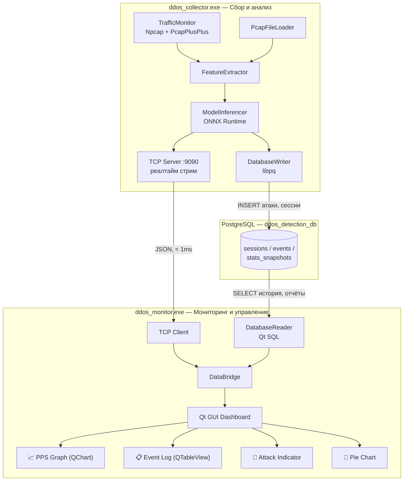
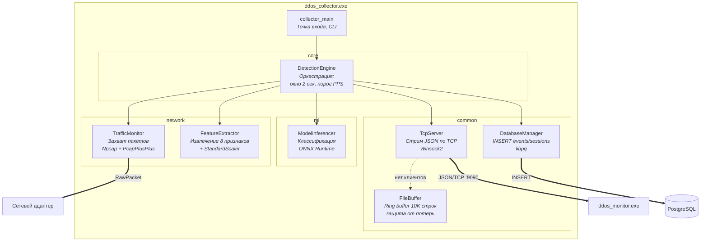
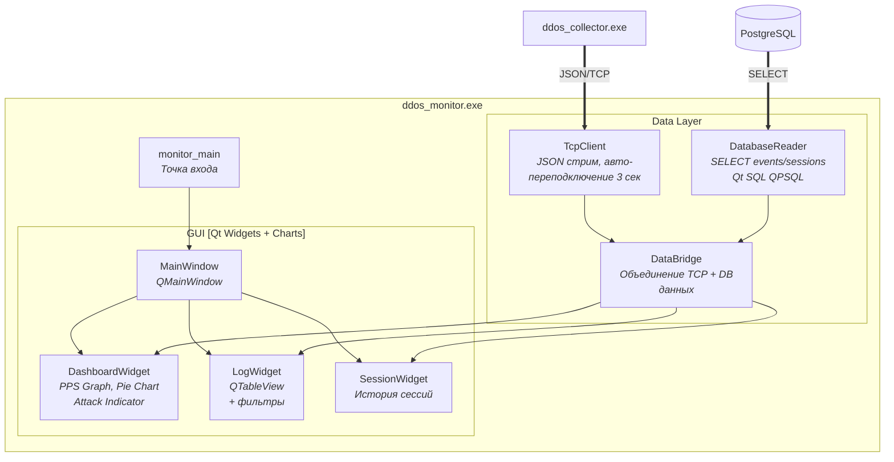
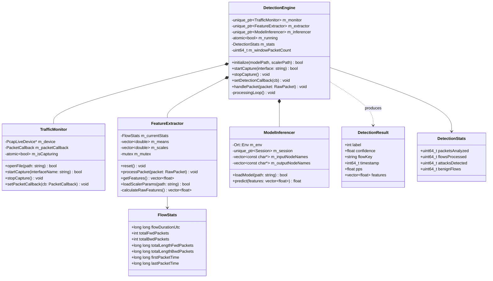
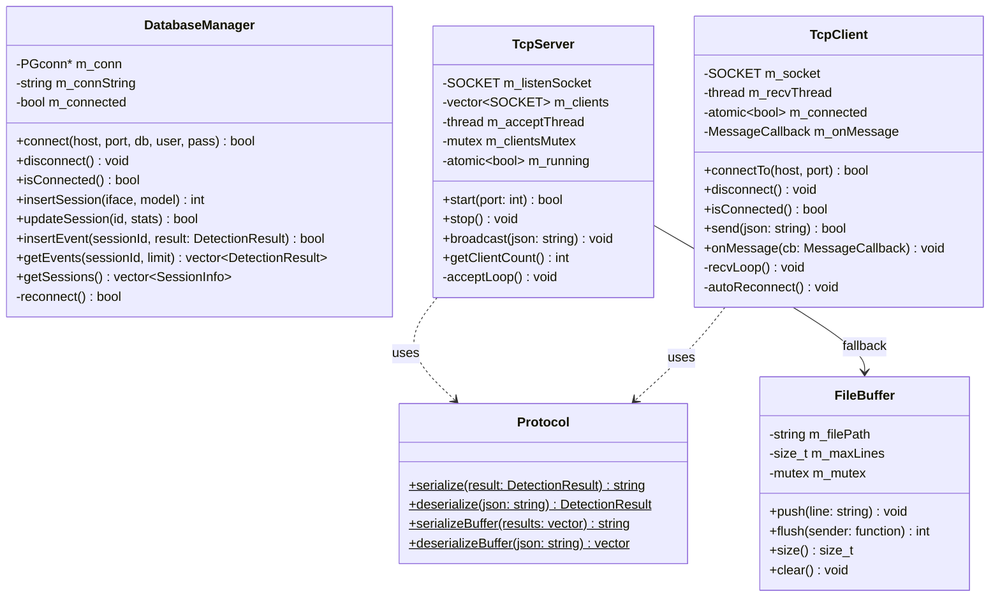
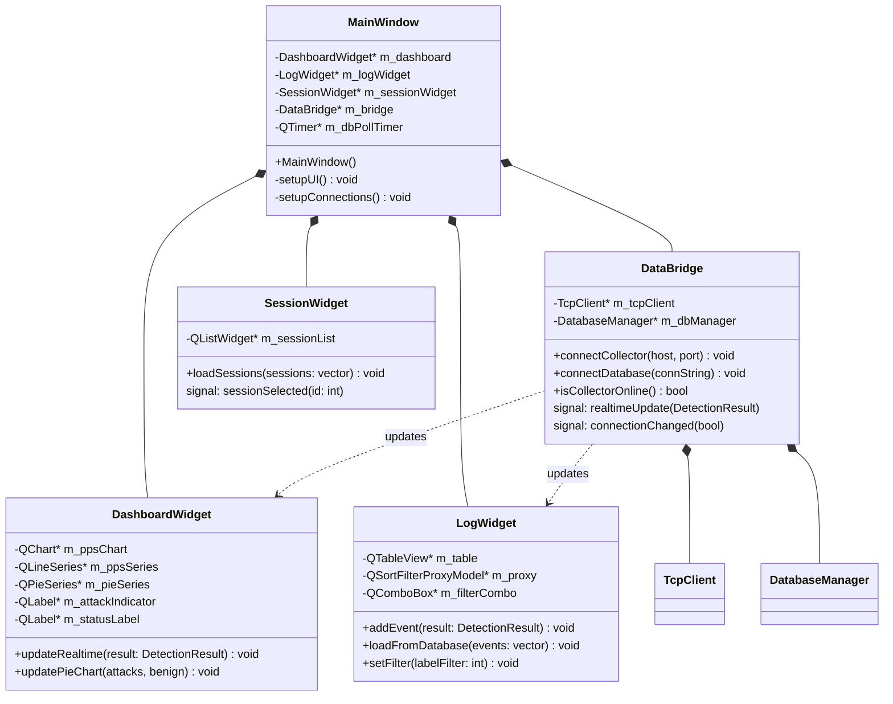
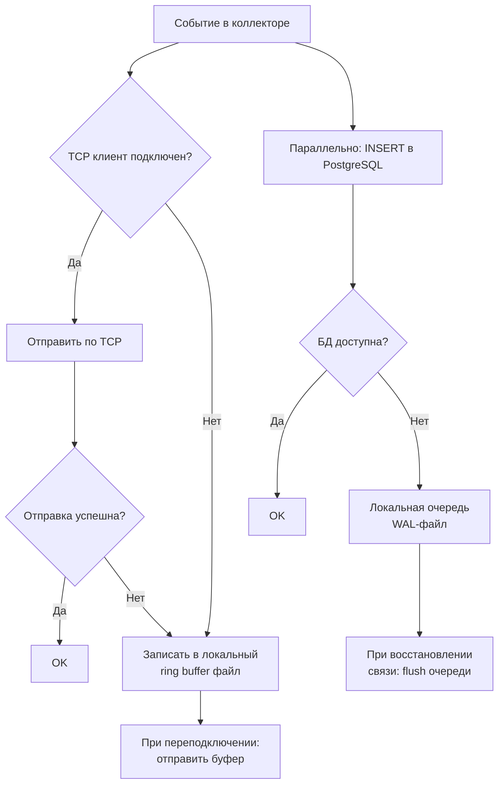

# Архитектура программного комплекса DDoS-детектор

## Обзор

Программный комплекс состоит из **3 компонентов**: консольный сборщик/анализатор, GUI-монитор, база данных PostgreSQL. Реалтайм-связь — через **TCP-сокет**, персистентное хранение — через **PostgreSQL**.



---

## Каналы связи

| Канал | Данные | Задержка | Назначение |
|---|---|---|---|
| **TCP сокет** (localhost:9090) | PPS, фичи, label, confidence | < 1 мс | Реалтайм-дашборд |
| **PostgreSQL** | Атаки, сессии, статистика | N/A | Персистентное хранение, отчёты |

---

## C3 — Диаграмма компонентов

### ddos_collector.exe



### ddos_monitor.exe



---

## C4 — Диаграмма классов

### ddos_core (общая библиотека)



### common (IPC + Storage)



### ddos_monitor GUI



---

## Защита от потери данных



### Механизмы

| Сценарий | Решение |
|---|---|
| Монитор не запущен / отключился | Коллектор пишет в **ring buffer** (файл `buffer.jsonl`, макс 10000 строк). При переподключении монитора — отправляет накопленное |
| PostgreSQL недоступен | Коллектор складывает события в **локальную очередь** (`pending_events.jsonl`). При восстановлении соединения — flush в БД |
| Коллектор аварийно завершился | PostgreSQL хранит все зафиксированные события. Монитор показывает последние данные из БД |
| Сетевой сбой TCP | Монитор автоматически **переподключается** каждые 3 секунды. Индикатор статуса в GUI |

---

## Структура файлов

```
diploma_test/
├── CMakeLists.txt                       # 3 target-а: ddos_core, ddos_collector, ddos_monitor
├── models/                              # ONNX модели + скейлеры
├── scripts/                             # Python: обучение, тестирование
├── sql/
│   └── init.sql                         # [NEW] Инициализация БД
└── src/
    ├── common/                          # [NEW] Общие компоненты
    │   ├── DatabaseManager.hpp/cpp      # [NEW] libpq обёртка (connect, insert, select)
    │   ├── TcpServer.hpp/cpp            # [NEW] TCP-сервер (для коллектора)
    │   ├── TcpClient.hpp/cpp            # [NEW] TCP-клиент (для монитора)
    │   ├── Protocol.hpp                 # [NEW] Формат JSON-сообщений
    │   └── FileBuffer.hpp/cpp           # [NEW] Ring buffer на диске (защита от потерь)
    ├── core/
    │   ├── DetectionEngine.hpp/cpp      # [MODIFY] Убрать Qt, добавить колбэки для TCP+DB
    ├── ml/
    │   ├── ModelInferencer.hpp/cpp      # Без изменений
    ├── network/
    │   ├── FeatureExtractor.hpp/cpp     # Без изменений
    │   ├── TrafficMonitor.hpp/cpp       # Без изменений
    ├── collector_main.cpp               # [NEW] CLI: захват → анализ → TCP+DB
    └── monitor_main.cpp                 # [MODIFY из main.cpp] Qt GUI: TCP+DB → визуализация
```

---

## Компонент 1: ddos_collector.exe

Консольное приложение. **Не зависит от Qt.**

```
ddos_collector.exe --interface "\\Device\\NPF_{...}" --model models/rf_model.onnx
ddos_collector.exe --pcap dump.pcap --model models/mlp_model.onnx
ddos_collector.exe --list-interfaces

  --tcp-port 9090            # порт TCP-сервера (default: 9090)
  --db-host localhost        # PostgreSQL connection
  --db-port 5432
  --db-name ddos_detection
  --db-user postgres
  --db-password pass
  --window 2000              # окно анализа (мс)
```

### Новые файлы

#### [NEW] collector_main.cpp
- Парсинг CLI аргументов
- Инициализация: `DatabaseManager`, `DetectionEngine`, `TcpServer`
- Основной цикл: захват → фичи → предсказание → одновременная отправка по TCP и запись в БД
- `signal(SIGINT)` для graceful shutdown
- При отключении монитора — буферизация в `FileBuffer`

#### [NEW] TcpServer.hpp/cpp
- `start(port) → bool` — слушает на порту
- `broadcast(json) → void` — отправляет всем подключённым клиентам
- `getClientCount() → int`
- Неблокирующий, отдельный поток для accept

#### [NEW] FileBuffer.hpp/cpp
- `push(json_line) → void` — записать строку в файл-буфер
- `flush(callback) → int` — отправить все накопленные строки, очистить
- Ring buffer: максимум 10000 строк, старые перезаписываются
- Файл: `buffer.jsonl` рядом с exe

---

## Компонент 2: ddos_monitor.exe

Qt GUI приложение. **Не захватывает трафик.**

#### [MODIFY] monitor_main.cpp (из текущего main.cpp)

| Элемент UI | Источник данных | Описание |
|---|---|---|
| PPS Graph | TCP (реалтайм) | `QLineSeries` + `QChart`, скользящее окно 60 сек |
| Attack Indicator | TCP (реалтайм) | 🟢/🔴 + confidence |
| Current Stats | TCP (реалтайм) | Packets, PPS, Flows |
| Event Log | PostgreSQL | `QTableView`, фильтр Attack/Benign |
| Session History | PostgreSQL | Список прошлых сессий |
| Pie Chart | PostgreSQL | Attack vs Benign за сессию |
| Connection Status | TCP | "Collector: Connected/Disconnected" |

#### [NEW] TcpClient.hpp/cpp
- `connectTo(host, port) → bool`
- `onMessage(callback)` — вызывается при получении JSON
- Автопереподключение каждые 3 секунды
- При подключении: запрос буферизированных данных

---

## Компонент 3: PostgreSQL

#### [NEW] sql/init.sql

```sql
CREATE TABLE sessions (
    id            SERIAL PRIMARY KEY,
    interface     VARCHAR(256),
    model_name    VARCHAR(128),
    start_time    TIMESTAMP NOT NULL DEFAULT NOW(),
    end_time      TIMESTAMP,
    total_packets BIGINT DEFAULT 0,
    total_attacks BIGINT DEFAULT 0,
    total_benign  BIGINT DEFAULT 0
);

CREATE TABLE events (
    id            SERIAL PRIMARY KEY,
    session_id    INT REFERENCES sessions(id),
    timestamp     TIMESTAMP NOT NULL DEFAULT NOW(),
    flow_key      VARCHAR(256),
    label         INT NOT NULL,             -- 0=Benign, 1=Attack
    confidence    REAL,
    model_name    VARCHAR(128),
    packets_per_s REAL,
    -- Фичи
    flow_duration       REAL,
    total_fwd_packets   REAL,
    total_bwd_packets   REAL,
    total_len_fwd       REAL,
    total_len_bwd       REAL,
    fwd_pkt_len_mean    REAL,
    bwd_pkt_len_mean    REAL,
    flow_packets_per_s  REAL
);

CREATE TABLE stats_snapshots (
    id            SERIAL PRIMARY KEY,
    session_id    INT REFERENCES sessions(id),
    timestamp     TIMESTAMP DEFAULT NOW(),
    packets_per_s REAL,
    total_packets BIGINT,
    current_label INT
);

CREATE INDEX idx_events_session ON events(session_id);
CREATE INDEX idx_events_label ON events(label);
CREATE INDEX idx_events_timestamp ON events(timestamp);
CREATE INDEX idx_stats_session ON stats_snapshots(session_id);
```

---

## Протокол TCP-сообщений

#### [NEW] Protocol.hpp

Каждое сообщение — JSON-строка + `\n` (newline-delimited JSON):

```json
// Коллектор → Монитор: статистика (каждые 2 сек)
{"type":"stats","ts":1708790400,"pps":45230.5,"pkts":90460,"label":1,"conf":0.95,"model":"rf_model","features":[2000000,90460,0,92631040,0,1024,0,45230.5]}

// Коллектор → Монитор: буферизированные данные при переподключении
{"type":"buffer","count":15,"data":[...]}

// Монитор → Коллектор: команды (опционально)
{"type":"cmd","action":"stop"}
```

---

## CMakeLists.txt

#### [MODIFY] [CMakeLists.txt](file:///c:/Dev/CXX/diploma_test/CMakeLists.txt)

```cmake
# === Ядро (статическая библиотека, без Qt) ===
add_library(ddos_core STATIC
    src/network/FeatureExtractor.cpp
    src/network/TrafficMonitor.cpp
    src/ml/ModelInferencer.cpp
    src/core/DetectionEngine.cpp
    src/common/DatabaseManager.cpp
    src/common/FileBuffer.cpp
)
target_link_libraries(ddos_core PUBLIC
    PcapPlusPlus::Pcap++ PcapPlusPlus::Common++
    PCAP::PCAP Packet::Packet
    onnxruntime libpq ws2_32
)

# === Коллектор (консольный, без Qt) ===
add_executable(ddos_collector
    src/collector_main.cpp
    src/common/TcpServer.cpp
)
target_link_libraries(ddos_collector PRIVATE ddos_core)

# === Монитор (Qt GUI) ===
add_executable(ddos_monitor
    src/monitor_main.cpp
    src/common/TcpClient.cpp
)
target_link_libraries(ddos_monitor PRIVATE
    ddos_core Qt6::Core Qt6::Widgets Qt6::Charts Qt6::Sql
)
```

---

## Порядок реализации

1. Установить PostgreSQL, `init.sql`
2. `DatabaseManager` (libpq обёртка)
3. `Protocol.hpp` (формат сообщений)
4. `TcpServer` + `FileBuffer` → `collector_main.cpp`
5. `TcpClient` → `monitor_main.cpp` (переработка GUI)
6. Тестирование: коллектор + ddos_test.py + монитор

---

## Verification Plan

1. Запустить `ddos_collector.exe --list-interfaces` → список интерфейсов
2. Запустить коллектор → запустить монитор → убедиться PPS-график обновляется
3. Запустить `ddos_test.py` → убедиться алерт в мониторе + запись в PostgreSQL
4. Остановить монитор → продолжить атаку → перезапустить монитор → убедиться буферизированные данные пришли
5. Остановить PostgreSQL → проверить что коллектор не падает, копит очередь → запустить PostgreSQL → данные записались
