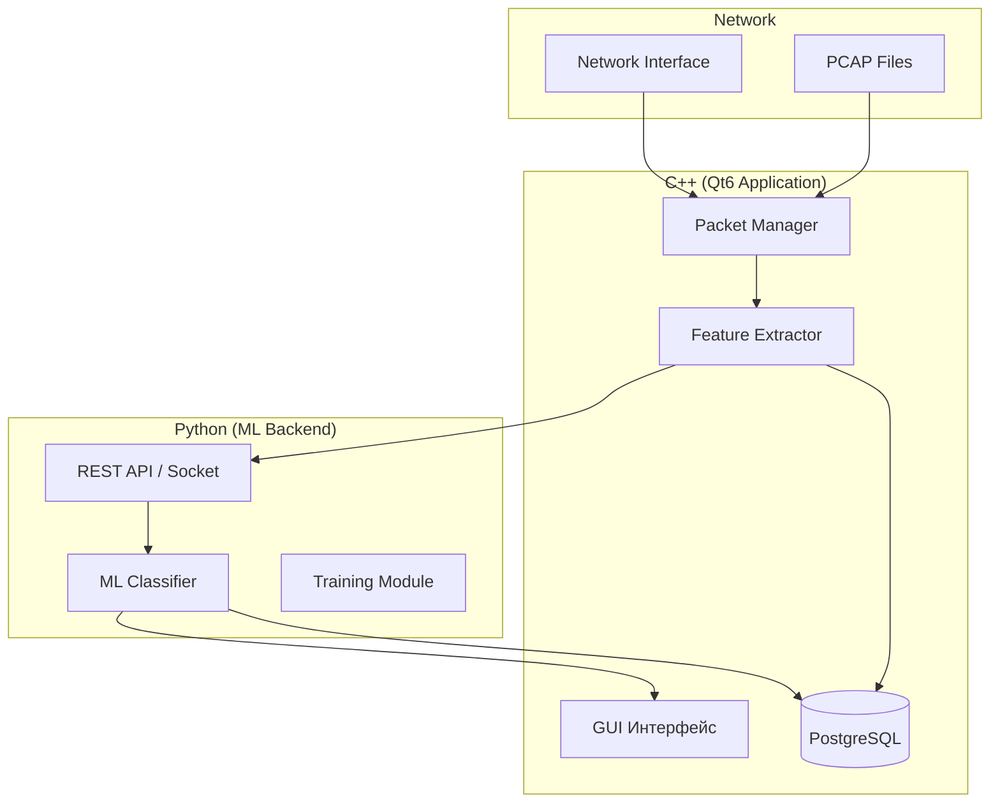

# План реализации программного комплекса обнаружения DoS-атак

## Цель проекта

Разработка программного комплекса для мониторинга сетевой активности и обнаружения аномалий, характерных для DoS-атак. Система должна обеспечивать:
- Захват сетевых пакетов
- Статистический анализ трафика  
- Автоматическую классификацию трафика с использованием алгоритмов машинного обучения
- Обработку как реального трафика, так и подготовленных датасетов

---

## Текущее состояние проекта

| Компонент | Статус |
|-----------|--------|
| Базовая структура CMake | ✅ Готово |
| Qt6 интеграция | ✅ Настроено |
| UI компоненты | ⏳ Только заглушка |
| Захват пакетов | ❌ Не реализовано |
| ML модели | ❌ Не реализовано |
| База данных | ❌ Не реализовано |

---

## Готовые библиотеки и решения

### Захват сетевых пакетов (C++)

| Библиотека | Платформа | Преимущества | Сложность интеграции |
|------------|-----------|--------------|---------------------|
| **PcapPlusPlus** | Windows/Linux/Mac | Высокоуровневый C++ API, парсинг пакетов, кросс-платформенность | ⭐⭐ Низкая |
| **Npcap + libpcap** | Windows | Стандарт для Windows, хорошая документация | ⭐⭐⭐ Средняя |
| **QPcap** | Все | Qt-обёртка для libpcap, сигналы/слоты | ⭐⭐ Низкая |

> [!TIP]
> **Рекомендация**: Использовать **PcapPlusPlus** — это C++ библиотека с готовыми парсерами протоколов и поддержкой PCAP файлов.

### Машинное обучение (Python)

| Модель | Точность на DoS | Готовые реализации |
|--------|-----------------|-------------------|
| **Random Forest** | 95-99% | [ddos-detection](https://github.com/MidanAhmed/ddos-detection) |
| **Decision Tree** | 90-95% | [DDoS-Detection-with-ML](https://github.com/promitbasak/DDOS-Detection-with-Machine-Learning) |
| **kNN** | 88-94% | Включен в scikit-learn |
| **SVM** | 92-96% | Включен в scikit-learn |

### Датасеты для обучения

- **CIC-DDoS2019** — современный датасет с различными типами DDoS атак
- **NSL-KDD** — классический датасет для обнаружения вторжений
- **BOT-IOT** — IoT ботнет трафик

---

## Архитектура системы



---

## Компоненты и их реализация

### Компонент 1: Захват и анализ пакетов (C++)

#### [NEW] [PacketCapture.hpp](file:///c:/Dev/CXX/diploma/include/PacketCapture.hpp)

Класс для захвата пакетов с использованием PcapPlusPlus:
- Захват в реальном времени с сетевого интерфейса
- Чтение PCAP файлов
- Фильтрация по протоколам

#### [NEW] [FeatureExtractor.hpp](file:///c:/Dev/CXX/diploma/include/FeatureExtractor.hpp)

Извлечение признаков из потоков трафика:
- Source/Destination IP & Port
- Protocol type
- Packet length statistics (mean, std, min, max)
- Flow duration
- Packet rate
- Flag combinations

---

### Компонент 2: ML модуль (Python)

#### [NEW] [ml_service/classifier.py](file:///c:/Dev/CXX/diploma/ml_service/classifier.py)

```python
# Готовый шаблон классификатора
from sklearn.ensemble import RandomForestClassifier
from sklearn.preprocessing import StandardScaler
import joblib

class DoSClassifier:
    def __init__(self, model_path=None):
        if model_path:
            self.model = joblib.load(model_path)
        else:
            self.model = RandomForestClassifier(n_estimators=100)
        self.scaler = StandardScaler()
    
    def predict(self, features):
        scaled = self.scaler.transform(features)
        return self.model.predict_proba(scaled)
```

---

### Компонент 3: База данных (PostgreSQL)

```sql
-- Таблица логов анализа
CREATE TABLE traffic_logs (
    id SERIAL PRIMARY KEY,
    timestamp TIMESTAMP DEFAULT CURRENT_TIMESTAMP,
    src_ip INET,
    dst_ip INET,
    protocol VARCHAR(10),
    is_attack BOOLEAN,
    attack_probability FLOAT,
    attack_type VARCHAR(50)
);

-- Таблица потоков для детального анализа
CREATE TABLE flows (
    id SERIAL PRIMARY KEY,
    flow_hash VARCHAR(64) UNIQUE,
    packet_count INT,
    byte_count BIGINT,
    duration_ms INT,
    features JSONB
);
```

---

### Компонент 4: GUI (Qt6)

#### [MODIFY] [main.cpp](file:///c:/Dev/CXX/diploma/src/main.cpp)

Главное окно с вкладками:
- **Dashboard** — статистика в реальном времени
- **Capture** — управление захватом пакетов
- **Analysis** — результаты классификации
- **Logs** — история обнаруженных атак

---

## Способы упрощения разработки

### 1. Использование готовых библиотек

| Задача | Готовое решение | Экономия времени |
|--------|-----------------|------------------|
| Захват пакетов | PcapPlusPlus | ~2 недели |
| Парсинг протоколов | PcapPlusPlus | ~1 неделя |
| ML классификация | scikit-learn + готовые модели | ~1 неделя |
| Графики | Qt Charts | ~3 дня |
| БД подключение | Qt SQL | ~2 дня |

### 2. Готовые ML модели

> [!IMPORTANT]
> Можно использовать готовые обученные модели из репозиториев:
> - [MidanAhmed/ddos-detection](https://github.com/MidanAhmed/ddos-detection) — включает GUI
> - [promitbasak/DDOS-Detection-with-ML](https://github.com/promitbasak/DDOS-Detection-with-Machine-Learning) — готовый пайплайн

### 3. Упрощение архитектуры интеграции

**Вместо REST API использовать:**

```cpp
// Прямой вызов Python через embedded interpreter
#include <Python.h>

// Или через subprocess
QProcess pythonProcess;
pythonProcess.start("python", {"classifier.py", "--features", jsonFeatures});
```

### 4. Использование готового датасета в формате CSV

Вместо сложной обработки реального трафика на начальном этапе — загрузка CSV для демонстрации работоспособности модели.

---

## План разработки по этапам

### Этап 1: Настройка среды (1-2 дня)
- [ ] Установка PcapPlusPlus
- [ ] Установка Npcap (для Windows)
- [ ] Настройка Python virtualenv с scikit-learn
- [ ] Установка PostgreSQL

### Этап 2: Захват пакетов (3-5 дней)
- [ ] Интеграция PcapPlusPlus в проект
- [ ] Реализация `PacketCapture` класса
- [ ] Чтение PCAP файлов
- [ ] Базовая фильтрация пакетов

### Этап 3: Извлечение признаков (3-4 дня)
- [ ] Реализация `FeatureExtractor`
- [ ] Агрегация данных по потокам (flows)
- [ ] Экспорт в JSON/CSV для ML

### Этап 4: ML модуль (4-5 дней)
- [ ] Загрузка и подготовка датасета (CIC-DDoS2019)
- [ ] Обучение Random Forest модели
- [ ] Сохранение модели (joblib)
- [ ] REST API или socket сервер для предсказаний

### Этап 5: GUI интерфейс (5-7 дней)
- [ ] Главное окно с вкладками
- [ ] Dashboard с графиками Qt Charts
- [ ] Таблица логов
- [ ] Управление захватом

### Этап 6: База данных (2-3 дня)
- [ ] Схема БД
- [ ] Интеграция Qt SQL
- [ ] Сохранение логов

### Этап 7: Интеграция и тестирование (3-5 дней)
- [ ] Связь C++ и Python компонентов
- [ ] Тестирование на реальном трафике
- [ ] Оптимизация производительности

---

## Зависимости проекта

### C++ библиотеки

```cmake
# CMakeLists.txt дополнения
find_package(PcapPlusPlus REQUIRED)
find_package(Qt6 REQUIRED COMPONENTS Widgets Charts Sql)
find_package(PostgreSQL REQUIRED)

target_link_libraries(diploma PRIVATE
    Qt6::Widgets
    Qt6::Charts
    Qt6::Sql
    PcapPlusPlus::Pcap++
    PcapPlusPlus::Packet++
    PcapPlusPlus::Common++
)
```

### Python зависимости

```txt
# requirements.txt
scikit-learn>=1.3.0
pandas>=2.0.0
numpy>=1.24.0
joblib>=1.3.0
flask>=2.3.0  # для REST API
psycopg2-binary>=2.9.0  # PostgreSQL
```

---

## Оценка сложности и сроков

| Этап | Сложность | Срок | Комментарий |
|------|-----------|------|-------------|
| Настройка среды | ⭐ | 2 дня | Стандартная установка |
| Захват пакетов | ⭐⭐⭐ | 5 дней | Требует работы с raw sockets |
| Извлечение признаков | ⭐⭐⭐ | 4 дня | Логика агрегации потоков |
| ML модуль | ⭐⭐ | 5 дней | Есть готовые решения |
| GUI | ⭐⭐ | 7 дней | Qt6 хорошо документирован |
| БД | ⭐ | 3 дня | Стандартная интеграция |
| Интеграция | ⭐⭐⭐ | 5 дней | Связь C++ и Python |

**Общий срок: ~4-5 недель**

---

## Риски и их митигация

> [!WARNING]
> **Риск 1**: Проблемы с правами доступа для захвата пакетов на Windows
> 
> **Решение**: Npcap требует прав администратора. Добавить проверку и уведомление в GUI.

> [!WARNING]
> **Риск 2**: Низкая производительность при высоком трафике
> 
> **Решение**: Использовать очереди (Qt Concurrent) и batch-обработку пакетов.

> [!CAUTION]
> **Риск 3**: Несовместимость версий Python/scikit-learn
> 
> **Решение**: Зафиксировать версии в requirements.txt и использовать virtualenv.

---

## Следующие шаги

1. **Подтвердите выбор библиотек** — PcapPlusPlus для захвата пакетов?
2. **Подтвердите ML модель** — Random Forest как основной классификатор?
3. **Определите приоритеты** — начать с GUI или с backend логики?

---

## Ссылки на ресурсы

- [PcapPlusPlus Documentation](https://pcapplusplus.github.io/)
- [CIC-DDoS2019 Dataset](https://www.unb.ca/cic/datasets/ddos-2019.html)
- [Qt6 Charts Documentation](https://doc.qt.io/qt-6/qtcharts-index.html)
- [scikit-learn Classification](https://scikit-learn.org/stable/supervised_learning.html)
