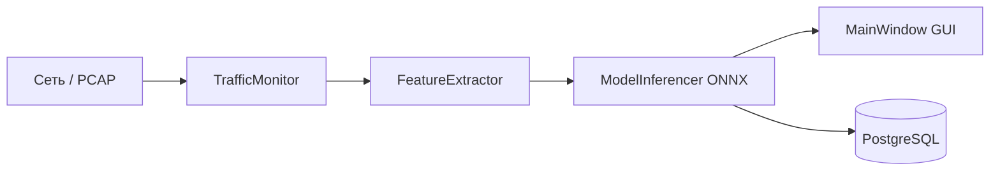

# План разработки дипломной работы: Обнаружение DoS-атак

**Студент:** Дерюга А.А. (Группа А-08-22)  
**Тема:** Разработка программного комплекса обнаружения атак типа «отказ в обслуживании»  
**Стек:** C++17, Qt 6, ONNX Runtime, PcapPlusPlus, PostgreSQL

---

## Краткая архитектура



---

## Этап 0: Настройка окружения
**Срок:** 1-2 дня | **Сложность:** ⭐

### Задачи:
- [ ] Установить Qt 6.x (MinGW или MSVC)
- [ ] Установить CMake ≥ 3.16
- [ ] Установить vcpkg и зависимости:
  ```powershell
  vcpkg install onnxruntime:x64-windows
  vcpkg install pcapplusplus:x64-windows
  vcpkg install libpq:x64-windows
  ```
- [ ] Установить Npcap (требуется для PcapPlusPlus на Windows)
- [ ] Установить PostgreSQL и создать БД `ddos_defense`
- [ ] Настроить Python virtualenv (Python 3.10+)

### Результат:
Рабочее окружение для сборки C++ проекта и обучения моделей

---

## Этап 1: Обучение ML-моделей (Python)
**Срок:** 3-4 дня | **Сложность:** ⭐⭐

### Задачи:
- [ ] Загрузить датасет CIC-DDoS2019
- [ ] Выбрать и вычислить 8 ключевых признаков:
  | # | Признак | Описание |
  |---|---------|----------|
  | 1 | `packet_count` | Кол-во пакетов за окно |
  | 2 | `byte_count` | Сумма байт |
  | 3 | `avg_packet_size` | Средний размер пакета |
  | 4 | `syn_count` | TCP SYN флаги |
  | 5 | `ack_count` | TCP ACK флаги |
  | 6 | `unique_src_ips` | Уникальные IP источники |
  | 7 | `unique_dst_ports` | Уникальные порты назначения |
  | 8 | `duration_ms` | Длительность окна |

- [ ] Обучить StandardScaler, сохранить `mean_` и `scale_` в `scaler_params.json`
- [ ] Обучить RandomForestClassifier
- [ ] Обучить MLPClassifier
- [ ] Экспортировать обе модели в ONNX
- [ ] Валидация: сравнить predict в sklearn и ONNX Runtime

### Артефакты:
- `models/rf_model.onnx`
- `models/mlp_model.onnx`
- `models/scaler_params.json`

---

## Этап 2: Захват и анализ пакетов (C++)
**Срок:** 5 дней | **Сложность:** ⭐⭐⭐

### Задачи:
- [ ] Создать класс `TrafficMonitor`:
  - `openFile(QString path)` — чтение PCAP файлов
  - `startCapture(QString interface)` — живой захват
  - `stopCapture()`
  - Сигналы: `packetReceived()`, `windowReady()`

- [ ] Создать класс `FeatureExtractor`:
  - `loadScalerParams(QString jsonPath)`
  - `addPacket(Packet& packet)`
  - `extractFeatures() → vector<float>`
  - Агрегация пакетов в окно 1 секунда
  - Нормализация по формуле: `(x - mean) / scale`

- [ ] Интеграция с Qt через signals/slots

### Файлы:
- `src/network/TrafficMonitor.hpp/cpp`
- `src/network/FeatureExtractor.hpp/cpp`

---

## Этап 3: Менеджер моделей ONNX (C++)
**Срок:** 4 дня | **Сложность:** ⭐⭐

### Задачи:
- [ ] Создать класс `ModelInferencer`:
  - `enum ModelType { RandomForest, MLP }`
  - `loadModel(ModelType type)`
  - `predict(vector<float>& features) → float`
  - `getCurrentModelName() → QString`

- [ ] Реализовать переключение моделей без утечек памяти
- [ ] Возвращать вероятность атаки [0.0, 1.0]

### Файлы:
- `src/ml/ModelInferencer.hpp/cpp`

---

## Этап 4: GUI интерфейс (Qt Widgets)
**Срок:** 5-6 дней | **Сложность:** ⭐⭐

### Задачи:
- [ ] Главное окно `MainWindow`:
  - **Toolbar**: Файл/Интерфейс, Старт/Стоп
  - **QComboBox**: выбор модели (Random Forest / MLP)
  - **QChartView**: график трафика в реальном времени
  - **Индикатор**: статус АТАКА/НОРМА с цветовой индикацией
  - **QTableView**: лог инцидентов

- [ ] Логика:
  - При `confidence > 0.5` → показать АТАКА (красный)
  - При `confidence ≤ 0.5` → показать НОРМА (зелёный)

- [ ] Статус бар с информацией о загруженной модели

### Файлы:
- `src/ui/MainWindow.hpp/cpp/ui`

---

## Этап 5: База данных (PostgreSQL)
**Срок:** 2 дня | **Сложность:** ⭐

### Задачи:
- [ ] Создать схему БД:
  ```sql
  CREATE TABLE incidents (
      id SERIAL PRIMARY KEY,
      timestamp TIMESTAMP DEFAULT NOW(),
      model_used VARCHAR(50),
      confidence FLOAT,
      src_ip INET,
      features JSONB
  );
  ```

- [ ] Создать класс `DatabaseManager`:
  - `connect(QString host, QString db)`
  - `logIncident(Incident& incident)`
  - `getRecentIncidents(int limit) → QVector<Incident>`

- [ ] Автоматическое сохранение при обнаружении атаки

### Файлы:
- `src/db/DatabaseManager.hpp/cpp`

---

## Этап 6: Интеграция и тестирование
**Срок:** 3-5 дней | **Сложность:** ⭐⭐⭐

### Задачи:
- [ ] Связать все компоненты в `MainWindow`
- [ ] Тестирование на PCAP файлах с атаками
- [ ] Сравнительный анализ моделей для диплома:

  | Метрика | Random Forest | MLP |
  |---------|---------------|-----|
  | Accuracy | ? | ? |
  | Precision | ? | ? |
  | Recall | ? | ? |
  | F1-score | ? | ? |
  | CPU (avg) | ? | ? |
  | Inference time | ? | ? |

- [ ] Документирование результатов

---

## Структура проекта

```
DoS-Detector/
├── CMakeLists.txt
├── vcpkg.json
├── models/
│   ├── rf_model.onnx
│   ├── mlp_model.onnx
│   └── scaler_params.json
├── scripts/
│   ├── train.py
│   ├── export_onnx.py
│   └── requirements.txt
├── src/
│   ├── main.cpp
│   ├── db/
│   │   └── DatabaseManager.hpp/cpp
│   ├── ml/
│   │   └── ModelInferencer.hpp/cpp
│   ├── network/
│   │   ├── TrafficMonitor.hpp/cpp
│   │   └── FeatureExtractor.hpp/cpp
│   └── ui/
│       └── MainWindow.hpp/cpp/ui
└── tests/
```

---

## Общая оценка сроков

| Этап | Срок | Сложность |
|------|------|-----------|
| 0. Настройка окружения | 2 дня | ⭐ |
| 1. Обучение моделей | 4 дня | ⭐⭐ |
| 2. Захват пакетов | 5 дней | ⭐⭐⭐ |
| 3. ONNX менеджер | 4 дня | ⭐⭐ |
| 4. GUI | 6 дней | ⭐⭐ |
| 5. База данных | 2 дня | ⭐ |
| 6. Интеграция | 5 дней | ⭐⭐⭐ |
| **Итого** | **~4 недели** | |

---

## Следующий шаг

После утверждения плана начинаем с **Этапа 0: Настройка окружения**.
