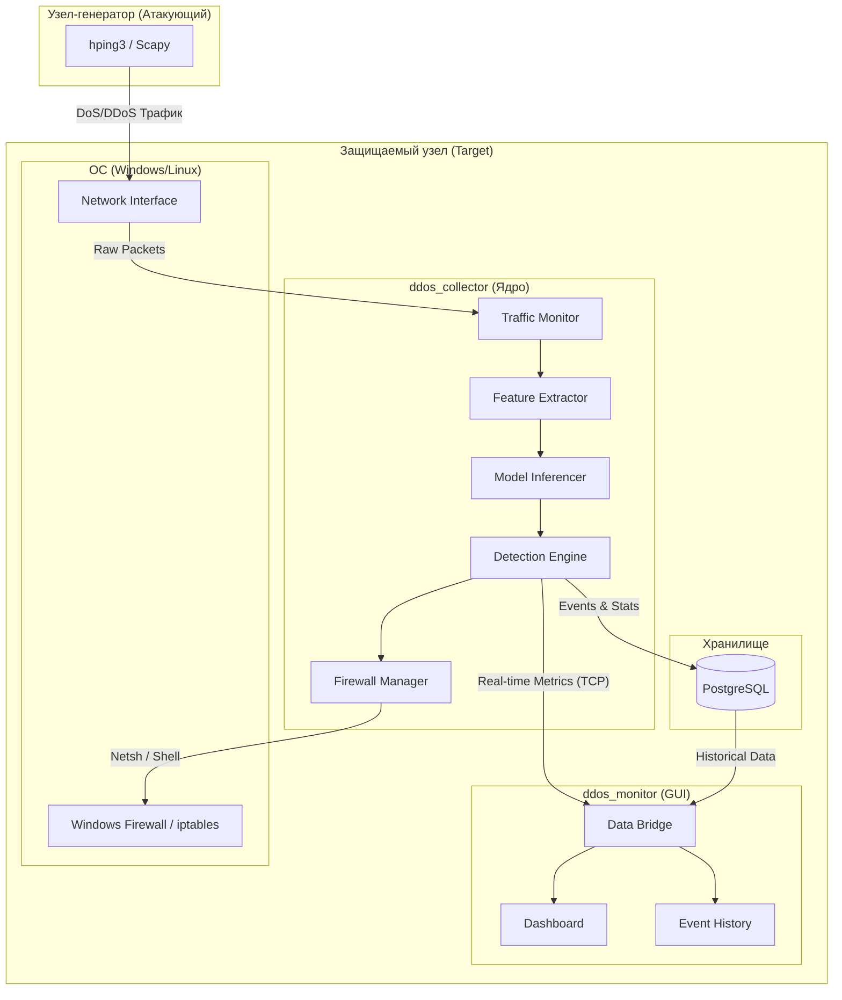
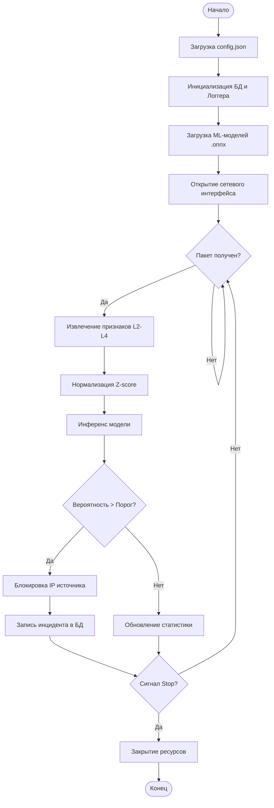
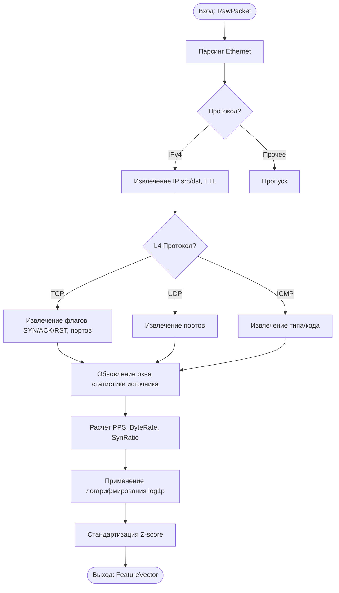
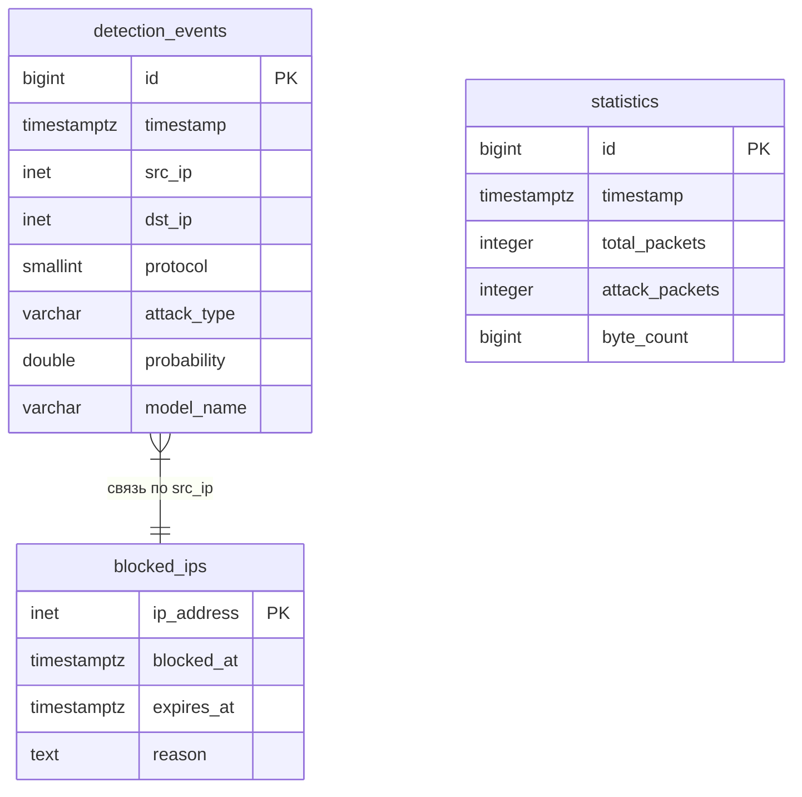

# Графические материалы к ВКР
## «Разработка программного комплекса обнаружения атак типа «отказ в обслуживании»»

В данном файле приведены описания и исходный код (Mermaid) для 5 обязательных листов графического материала.

---

### Лист 1. Структурная схема программного комплекса

Отражает архитектуру системы, разделение на Collector и Monitor, а также связи с БД и ОС.

---

### Лист 2. Схема алгоритма главного цикла обработки (ddos_collector)

Выполнена в соответствии с ГОСТ 19.701-90.

---

### Лист 3. Схема алгоритма извлечения признаков

Отражает логику работы модуля `FeatureExtractor`.

---

### Лист 4. Схема структуры базы данных (ER-диаграмма)

Описывает таблицы PostgreSQL и их связи.

---

### Лист 5. Скриншоты графического интерфейса

Рекомендуемая компоновка для плаката/слайда:
1.  **Центральная часть**: Главное окно `ddos_monitor` с графиком PPS в момент атаки (красная зона).
2.  **Левая часть**: Таблица `Event History` с заполненными данными об атаках (SYN Flood, UDP Flood).
3.  **Правая часть**: Панель настроек с выбором модели (XGBoost / MLP / RF) и статус подключения к коллектору.
4.  **Нижняя часть**: Виджет системного лога с предупреждениями о блокировке IP.

*Примечание: Скриншоты следует делать в темной теме оформления для лучшей визуальной эффектности.*
