# ВЫПУСКНАЯ КВАЛИФИКАЦИОННАЯ РАБОТА

## «Разработка программного комплекса обнаружения атак типа «отказ в обслуживании»»

**Студент:** Дерюга А.А., группа А-08-22  
**Руководитель:** к.т.н. доцент Раскатова М.В.  
**Кафедра:** ВМСС, Институт ИВТИ, НИУ «МЭИ», Москва, 2026  

> **Статус документа:** объединённый черновик (merged claude + gemini), основа — claude

---

## АННОТАЦИЯ

В данной выпускной квалификационной работе разработан программный комплекс обнаружения атак типа «отказ в обслуживании» (DoS/DDoS). Комплекс реализован на языке C++17 и состоит из двух независимых программ: подсистемы сбора и анализа сетевого трафика (`ddos_collector`) и подсистемы мониторинга и управления (`ddos_monitor`) на базе фреймворка Qt6. Для классификации сетевых потоков используется вектор из 16 признаков, извлекаемых за 1-секундное окно инференса. Классификация выполняется с использованием различных архитектур классификаторов: ансамблевых методов (XGBoost, Random Forest) и многослойного перцептрона (нейронной сети MLP), относящихся к методам машинного или глубокого обучения, интегрированных через кроссплатформенный движок ONNX Runtime с поддержкой механизма горячей замены (hot swap) моделей. Результаты классификации хранятся в реляционной базе данных PostgreSQL с применением асинхронного режима потоковой вставки данных (COPY). При обнаружении атаки производится автоматическая блокировка IP-адреса источника через Windows Firewall (netsh advfirewall). Точность классификации на датасете CIC-DDoS2019 (F1-score) составила 0,9997. Работа состоит из 4 разделов, [N] страниц, 12 рисунков, 30 таблиц и 5 приложений.

**Abstract.** This graduation thesis presents a software complex for detecting denial-of-service (DoS/DDoS) attacks. The complex is implemented in C++17 and consists of two independent programs: a traffic collection and analysis subsystem (`ddos_collector`) and a Qt6-based monitoring and management subsystem (`ddos_monitor`). Network flows are classified using a 16-feature vector computed over a 1-second inference window. Classification is performed using various classifier architectures, including ensemble methods (XGBoost, Random Forest) and a Multi-Layer Perceptron (MLP) neural network, integrated via the cross-platform ONNX Runtime engine with hot-swap model support. Classification results are stored in a PostgreSQL relational database using asynchronous streaming data insertion (COPY). Upon attack detection, the source IP address is automatically blocked via Windows Firewall (netsh advfirewall). The classification F1-score on the CIC-DDoS2019 dataset reached 0.9997. The work consists of 4 sections, [N] pages, 12 figures, 30 tables and 5 appendices.

---

## СОДЕРЖАНИЕ

ВВЕДЕНИЕ ................................................................................................................................ [N]
1. АНАЛИЗ ПРЕДМЕТНОЙ ОБЛАСТИ И ТЕОРЕТИЧЕСКИЕ ОСНОВЫ ................. [N]
   1.1. Основные термины и классификация DoS/DDoS-атак ........................................... [N]
   1.2. Описание предметной области и ландшафт сетевых киберугроз .......................... [N]
   1.3. Обзор существующих решений: преимущества и недостатки ............................... [N]
   1.4. Теоретические основы машинного и глубокого обучения ........................................ [N]
   1.5. Стек используемых технологий и инструментов ..................................................... [N]
   1.6. Требования к программному комплексу ................................................................... [N]
2. ПРОЕКТИРОВАНИЕ ПРОГРАММНОГО КОМПЛЕКСА .......................................... [N]
   2.1. Структурная схема комплекса ..................................................................................... [N]
   2.2. Структура программы ddos_collector .......................................................................... [N]
   2.3. Проектирование структуры базы данных .................................................................. [N]
   2.4. Разработка схемы алгоритмов ..................................................................................... [N]
   2.5. Проектирование структуры программы ddos_monitor ............................................. [N]
3. РЕАЛИЗАЦИЯ ПРОГРАММНОГО КОМПЛЕКСА ..................................................... [N]
   3.1. Захват пакетов и инициализация PcapPlusPlus ......................................................... [N]
   3.2. Извлечение признаков и агрегация по потокам ......................................................... [N]
   3.3. ML/DL-инференс через ONNX Runtime ..................................................................... [N]
   3.4. Управление правилами межсетевого экрана ............................................................. [N]
   3.5. Оркестрация: цикл инференса DetectionEngine ....................................................... [N]
   3.6. Асинхронная запись в базу данных ............................................................................ [N]
   3.7. Обучение модели классификатора ............................................................................... [N]
4. ТЕСТИРОВАНИЕ И ОЦЕНКА ЭФФЕКТИВНОСТИ ................................................... [N]
   4.1. Матрица трассировки требований ................................................................................ [N]
   4.2. Программа и методика испытаний ............................................................................... [N]
   4.3. Функциональное тестирование ..................................................................................... [N]
   4.4. Оценка качества классификатора ................................................................................. [N]
   4.5. Нагрузочное тестирование ............................................................................................. [N]
ЗАКЛЮЧЕНИЕ ......................................................................................................................... [N]
СПИСОК ИСПОЛЬЗОВАННОЙ ЛИТЕРАТУРЫ .............................................................. [N]
ПРИЛОЖЕНИЯ ........................................................................................................................ [N]


---

## ОПРЕДЕЛЕНИЯ

В настоящем проекте применяются следующие термины:

1) **DoS-атака** (Denial of Service) — атака, целью которой является нарушение нормального функционирования сетевого сервиса путём исчерпания его ресурсов [ 21 ].
2) **DDoS-атака** (Distributed Denial of Service) — распределённая DoS-атака, осуществляемая одновременно с множества источников, как правило объединённых в ботнет [ 21 ].
3) **Пакет** — единица данных сетевого протокола, содержащая заголовок (служебную информацию) и полезную нагрузку [ 21 ].
4) **Поток (flow)** — совокупность пакетов, имеющих одинаковые значения 5-tuple: (src\_ip, dst\_ip, src\_port, dst\_port, protocol — IP-адрес источника, IP-адрес назначения, порт источника, порт назначения, протокол) [ 21 ].
5) **Признак трафика (feature)** — числовая характеристика пакета или потока, используемая моделью машинного или глубокого обучения для классификации [ 21 ].
6) **Классификатор** — алгоритм машинного и глубокого обучения, относящий объект к одному из заданных классов («атака» или «норма») [ 21 ].
7) **Межсетевой экран (firewall)** — программное или аппаратное средство фильтрации сетевого трафика по заданным правилам [ 21 ].
8) **Правило блокировки** — набор условий (IP-адрес, порт, протокол), при выполнении которых трафик отбрасывается [ 21 ].
9) **SRS (Software Requirements Specification)** — спецификация требований к программному обеспечению; документ, фиксирующий функциональные и нефункциональные требования к системе (стандарт IEEE 830) [ 21 ].
10) **Функциональное требование (FR)** — требование, описывающее конкретное действие или поведение системы [ 21 ].
11) **Нефункциональное требование (NFR)** — требование, описывающее характеристику работы системы: производительность, надёжность, безопасность, совместимость [ 21 ].
12) **Критерий приёмки (acceptance criterion)** — измеримое условие, при выполнении которого требование считается реализованным корректно [ 21 ].
13) **ONNX Runtime** — кроссплатформенная среда выполнения моделей машинного и глубокого обучения в формате ONNX (Open Neural Network Exchange) [ 15 ].
14) **Окно агрегации (inference window)** — временной интервал (1 секунда в данном комплексе), за который собираются пакеты и вычисляются признаки перед вызовом классификатора [ 21 ].
15) **РСУБД** (RDBMS) — реляционная система управления базами данных; программное обеспечение для управления данными в виде связанных таблиц [ 21 ].
16) **libpqxx** — официальный клиентский API для языка C++, предоставляющий доступ к возможностям СУБД PostgreSQL [ 21 ].
17) **Точность** (Precision) — доля истинно положительных срабатываний классификатора относительно всех объектов, отнесённых к положительному классу [ 21 ].
18) **Полнота** (Recall) — доля истинно положительных срабатываний классификатора относительно всех объектов, фактически принадлежащих к положительному классу [ 21 ].
19) **F1-мера** (F1-score) — гармоническое среднее точности и полноты, используемое для комплексной оценки качества классификации [ 21 ].
20) **ROC AUC** (Area Under the Receiver Operating Characteristic Curve) — площадь под кривой рабочих характеристик приёмника, количественный показатель качества классификатора [ 21 ].
21) **Многослойный перцептрон** (MLP) — архитектура нейронной сети прямого распространения, состоящая из входного, скрытых и выходного слоёв [ 18 ].
22) **XGBoost** (Extreme Gradient Boosting) — масштабируемая реализация алгоритма градиентного бустинга над решающими деревьями [ 4 ].
23) **Случайный лес** (Random Forest) — ансамблевый метод машинного обучения, основанный на построении множества независимых решающих деревьев [ 10 ].
24) **IoT** (Internet of Things) — сеть физических объектов («вещей»), оснащенных встроенными технологиями для взаимодействия друг с другом и с внешней средой [ 6 ].
25) **Смешанный режим** (promiscuous mode) — режим работы сетевого адаптера, позволяющий перехватывать все пакеты в сегменте сети, независимо от адреса назначения [ 19 ].
26) **Z-score нормализация** (стандартизация) — метод преобразования данных, при котором признаки центрируются относительно среднего значения и масштабируются по стандартному отклонению [ 21 ].
27) **Инференс** (inference) — этап эксплуатации модели машинного обучения, на котором она выполняет предсказания для входных данных [ 15 ].
28) **Матрица ошибок** (confusion matrix) — инструмент оценки качества классификации, представляющий собой таблицу распределения предсказаний модели по классам [ 21 ].
29) **Lock-free очередь** — потокобезопасная структура данных, реализующая алгоритм без блокировок, что исключает взаимные блокировки потоков и повышает производительность [ 14 ].

---

## ОБОЗНАЧЕНИЯ И СОКРАЩЕНИЯ

БД — База данных  
ГОСТ — Государственный стандарт  
ОС — Операционная система  
СУБД — Система управления базами данных  
API — Application Programming Interface  
ACID — Atomicity, Consistency, Isolation, Durability (свойства транзакций в СУБД)  
ACK — Acknowledgment (флаг подтверждения в TCP)  
AUC — Area Under the Curve (площадь под кривой)  
BPF — Berkeley Packet Filter (механизм фильтрации пакетов в ядре ОС)  
Bpps — Billion packets per second (миллиардов пакетов в секунду)  
CNN — Convolutional Neural Network (свёрточная нейронная сеть)  
COM — Component Object Model (технология компонентных объектов Microsoft)  
CPU — Central Processing Unit (центральный процессор)  
CSV — Comma-Separated Values (формат текстовых данных с разделителями)  
DDL — Data Definition Language (язык описания данных)  
DDoS — Distributed Denial of Service (распределённый отказ в обслуживании)  
DNS — Domain Name System (система доменных имён)  
DoS — Denial of Service (отказ в обслуживании)  
DL — Deep Learning (глубокое обучение)  
ERD — Entity-Relationship Diagram (диаграмма «сущность-связь»)  
F1 — F1-мера (F1-score)  
FIN — Finish (флаг завершения соединения в TCP)  
FN — False Negative (ложноотрицательное срабатывание)  
FP — False Positive (ложноположительное срабатывание)  
FR — Functional Requirement (функциональное требование)  
GUI — Graphical User Interface (графический пользовательский интерфейс)  
HTTP — HyperText Transfer Protocol  
ICMP — Internet Control Message Protocol  
IDS — Intrusion Detection System (система обнаружения вторжений)  
IEEE 830 — Стандарт IEEE на спецификацию требований к ПО  
IP — Internet Protocol  
IPS — Intrusion Prevention System (система предотвращения вторжений)  
IoT — Internet of Things (интернет вещей)  
JSON — JavaScript Object Notation (формат обмена данными)  
LSTM — Long Short-Term Memory (нейронная сеть долгой краткосрочной памяти)  
ML — Machine Learning (машинное обучение)  
MLP — Multi-Layer Perceptron (многослойный перцептрон)  
MSVC — Microsoft Visual C++ (компилятор Microsoft)  
NFR — Non-Functional Requirement (нефункциональное требование)  
NTP — Network Time Protocol  
ONNX — Open Neural Network Exchange  
ORT — ONNX Runtime  
OSI — Open Systems Interconnection (эталонная модель взаимодействия открытых систем)  
pcap — Packet Capture (формат файла захвата пакетов)  
PDF — Portable Document Format  
PostgreSQL — Объектно-реляционная СУБД с клиент-серверной архитектурой  
PPS — Packets Per Second (пакетов в секунду)  
PSH — Push (флаг немедленной передачи данных в TCP)  
ReLU — Rectified Linear Unit (линейный выпрямитель, функция активации)  
RF — Random Forest (случайный лес)  
ROC — Receiver Operating Characteristic (рабочая характеристика приёмника)  
RST — Reset (флаг разрыва соединения в TCP)  
SIEM — Security Information and Event Management  
SQL — Structured Query Language (язык структурированных запросов)  
SRS — Software Requirements Specification (спецификация требований к ПО)  
SSDP — Simple Service Discovery Protocol  
SYN — Synchronize (флаг установки соединения в TCP)  
TCP — Transmission Control Protocol  
Tbps — Terabits per second (терабит в секунду)  
TN — True Negative (истинно отрицательное срабатывание)  
TP — True Positive (истинно положительное срабатывание)  
UDP — User Datagram Protocol  
URG — Urgent (флаг срочности в TCP)  
XGBoost — Extreme Gradient Boosting  
БД — База данных  
ГОСТ — Государственный стандарт  
ОЗУ — Оперативное запоминающее устройство  
ОС — Операционная система  
СУБД — Система управления базами данных  
ЦП — Центральный процессор  

---

## ВВЕДЕНИЕ

**Актуальность.** В условиях глобальной цифровизации и стремительного расширения сетевой связности кибератаки типа «отказ в обслуживании» (DoS/DDoS) являются одной из наиболее распространённых и опасных угроз информационной безопасности. Ландшафт киберугроз в период 2024–2025 гг. демонстрирует беспрецедентный рост как мощности, так и интенсивности атак. Согласно аналитическим данным Cloudflare, в третьем квартале 2025 года число атак возросло на 40%, а в четвёртом квартале был зафиксирован рекордный пик мощности атаки в 31,4 Тбит/с при интенсивности 9,0 млрд пакетов в секунду [ 6, 7 ]. Особую роль в формировании векторов атак играет интернет вещей (IoT): ботнеты нового поколения, такие как Aisuru-Kimwolf, состоящие из инфицированных потребительских устройств, способны генерировать более 200 млн запросов в секунду [ 6 ]. Статистические данные, отражающие рост масштабов угроз, представлены в табл. 1.


<p align="right">Таблица 1</p>
<p align="center"><b>Динамика характеристик DDoS-атак (2024–2025 гг.)</b></p>


| Период | Пиковая мощность (Тбит/с) | Пиковая интенсивность (Bpps) | Прирост (YoY) |
|---|---|---|---|
| 2024 год (пик) | 5,6 | 3,8 | — |
| 2025 год Q1 | 6,5 | 4.8 | +358% |
| 2025 год Q2 | 7,3 | 4,8 | +44% |
| 2025 год Q3 | 29,7 | 14,1 | +40% |
| 2025 год Q4 | 31,4 | 9,0 | +58% |

Примечание — Составлено на основе данных [ 5, 6, 7 ].

Традиционные средства защиты — сигнатурные системы обнаружения вторжений (Snort, Suricata) и инструменты фильтрации по журналам (Fail2Ban) — не успевают адаптироваться к новым видам атак, поскольку требуют постоянного обновления сигнатур вручную и испытывают деградацию производительности при разрастании баз правил [ 12, 27 ]. Эксплуатация уязвимостей устройств IoT приводит к появлению трафика прикладного уровня, практически неотличимого от легитимного, что делает необходимым применение интеллектуальных методов обнаружения на основе алгоритмов машинного и глубокого обучения [ 10, 18 ].

Задание на выполнение выпускной квалификационной работы приведено в приложении А.

**Цель работы:** проектирование и разработка программного комплекса, обеспечивающего автоматизированное обнаружение DoS/DDoS-атак в сетевом трафике в режиме реального времени и оперативную блокировку источников вредоносного трафика средствами межсетевого экрана.

**Задачи:**

1) Выполнить комплексный анализ современных угроз типа DoS/DDoS и провести сравнительный обзор существующих программных решений для их обнаружения.
2) Определить и обосновать набор информативных признаков сетевого трафика, позволяющих эффективно разделять легитимный и вредоносный трафик.
3) Спроектировать архитектуру программного комплекса, обеспечивающую масштабируемость и разделение функций сбора данных и мониторинга.
4) Разработать алгоритм захвата и нормализации признаков сетевого трафика на основе окна агрегации.
5) Реализовать и настроить классификатор трафика (XGBoost, RF, MLP) на основе ONNX Runtime с поддержкой горячей замены модели.
6) Реализовать подсистему управления правилами межсетевого экрана Windows (netsh advfirewall) для автоматического реагирования.
7) Создать графический интерфейс пользователя на базе Qt6 для визуализации состояния сетевой инфраструктуры и управления инцидентами.
8) Провести экспериментальные исследования комплекса на реальных наборах данных и оценить показатели эффективности.


**Структура работы.** Работа состоит из аннотации, введения, четырёх разделов, заключения, списка использованной литературы и приложений.
- В **первом разделе** проводится анализ предметной области, классификация атак, обзор существующих средств защиты и обосновывается выбор технологического стека.
- **Второй раздел** посвящён архитектурному проектированию комплекса, описанию структур программ, проектированию базы данных и детальной разработке алгоритмов.
- В **третьем разделе** рассматриваются вопросы практической реализации на языке C++ и процесс обучения ML/DL-модели.
- В **четвёртом разделе** приводятся результаты тестирования, оценка точности классификации и анализ производительности системы.

---

## 1. АНАЛИЗ ПРЕДМЕТНОЙ ОБЛАСТИ И ТЕОРЕТИЧЕСКИЕ ОСНОВЫ

### 1.1. Основные термины и классификация DoS/DDoS-атак

DoS-атаки (Denial of Service — отказ в обслуживании) представляют собой класс кибератак, целью которых является нарушение доступности сетевого сервиса для легитимных пользователей путём преднамеренного исчерпания двух видов ресурсов: пропускной способности каналов и вычислительных мощностей [ 10 ]. В отличие от DoS, атаки типа DDoS (Distributed Denial of Service) осуществляются одновременно с большого числа источников — как правило, с заражённых машин, входящих в состав ботнета [ 1 ].

Классификация DoS/DDoS-атак по уровням модели OSI приведена в табл. 2 [ 21 ].


<p align="right">Таблица 2</p>
<p align="center"><b>Классификация DoS/DDoS-атак по уровням OSI</b></p>


| Уровень OSI | Название | Пример атаки | Метод воздействия |
|---|---|---|---|
| Сетевой (L3) | Volumetric | ICMP Flood, Smurf | Исчерпание пропускной способности каналов. Амплификация (DNS, NTP, SSDP) даёт коэффициент усиления до 4096 раз [ 3 ] |
| Транспортный (L4) | Protocol | SYN Flood, UDP Flood | Исчерпание таблиц состояний соединений (state tables) сетевого оборудования [ 21 ] |
| Прикладной (L7) | Application | HTTP Flood, Slowloris | Имитация легитимных запросов; перегрузка прикладного ПО без генерации большого объёма трафика [ 9 ] |

Примечание — Составлено на основе данных [ 3, 9, 28 ]. Визуальное представление уровней модели OSI и соответствующих им типов атак показано на рис. 1.

Рис. 1. Схема уровней OSI с указанием типов атак

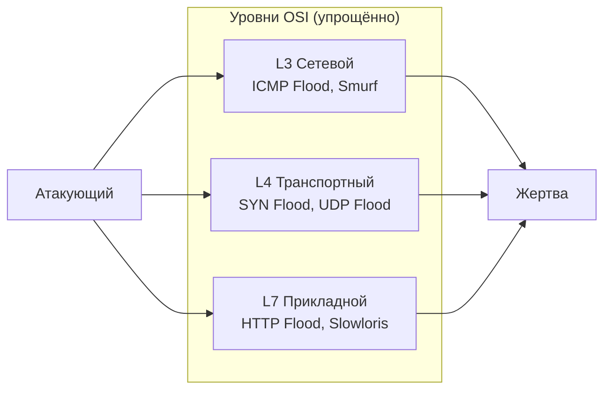

### 1.2. Описание предметной области и ландшафт сетевых киберугроз

**Анатомия SYN Flood.** Протокол TCP предусматривает трёхстороннее рукопожатие для установки соединения: клиент отправляет SYN, сервер отвечает SYN-ACK, клиент завершает подтверждением ACK. При SYN Flood атакующий посылает огромное количество SYN-пакетов с подделанными (spoofed) IP-адресами источника. Сервер выделяет ресурсы (запись в таблице соединений) и отправляет SYN-ACK, но никогда не получает ACK. Таблица half-open соединений переполняется, и легитимные запросы отвергаются [ 10 ].

**Анатомия UDP Flood.** UDP — протокол без установки соединения (stateless). Атакующий генерирует огромное количество UDP-пакетов на случайные порты жертвы. Возможно усиление (amplification) через серверы DNS, NTP, SSDP: короткий запрос с подделанным IP генерирует ответ, многократно превосходящий его по объёму [ 3 ].

**Анатомия ICMP Flood.** Атакующий генерирует непрерывный поток ICMP Echo Request (ping) пакетов. Атака Smurf использует широковещательную рассылку ICMP Echo Request на адрес сети с подделанным адресом источника (жертвы): все хосты сети отвечают одновременно, создавая эффект усиления, пропорциональный числу хостов [ 21 ].

**Атаки прикладного уровня.** HTTP GET/POST Flood имитирует легитимные запросы к веб-серверу, из-за чего сигнатурные системы с трудом их отличают. Особую сложность представляет атака **Slowloris**: злоумышленник искусственно затягивает время TCP-сессий путём крайне медленной отправки фрагментированных HTTP-запросов, исчерпывая пул доступных соединений веб-сервера без генерации больших объёмов трафика. Стандартные методы ограничения скорости часто не способны отличить подобную активность от работы легитимных клиентов с медленным соединением [ 9 ].

**Ботнеты как инфраструктура DDoS.** Распределённые атаки осуществляются через ботнеты — сети из тысяч заражённых устройств (ботов), управляемых через командный сервер C&C. Распространение уязвимых IoT-устройств (умные телевизоры, маршрутизаторы) привело к появлению ботнетов нового поколения, таких как Mirai [ 2 ] и Aisuru-Kimwolf [ 6 ], способных генерировать гиперволюметрические атаки. Это делает фильтрацию по IP-адресу источника крайне неэффективной.

**Вывод по разделу:** описаны основные виды атак и их механизмы, что является необходимым для последующего определения набора признаков классификации [ 21 ]. Наиболее поддающимися обнаружению по признакам пакетного потока являются атаки L3–L4: SYN Flood, UDP Flood, ICMP Flood — именно они являются основной целью разрабатываемого комплекса.

### 1.3. Обзор существующих решений: преимущества и недостатки

Проведён комплексный сравнительный анализ разрабатываемого программного комплекса с тремя классами существующих решений.

#### 1.3.1. Традиционные сигнатурные системы (Snort, Suricata, Zeek)

**Snort** — система обнаружения вторжений с открытым исходным кодом, разработанная Мартином Рошем в 1998 году и ныне поддерживаемая компанией Cisco. Работает по принципу сигнатурного анализа: каждый пакет сверяется с набором правил на языке Snort Rule Language. Достоинством является зрелость и обширная база правил. Недостатком — полная зависимость от актуальности сигнатур: новые виды атак («нулевого дня») остаются незамеченными [ 26, 27 ].

**Suricata** — многопоточная IDS/IPS с открытым исходным кодом (OISF). Поддерживает многопоточную обработку пакетов, анализ протоколов прикладного уровня и режим IPS (через nfqueue). Содержит зачатки поведенческого анализа (threshold, flow keywords). Однако по-прежнему основывается на сигнатурах [ 26, 27 ].

Ключевое отличие разрабатываемого решения от Snort/Suricata: переход от жёсткого сопоставления байтовых шаблонов к интеллектуальному выявлению аномалий на базе ML/DL, что обеспечивает устойчивость к атакам «нулевого дня» [ 10, 13 ]. Также исключается деградация производительности, неизбежная в сигнатурных системах при разрастании баз правил [ 12 ].

#### 1.3.2. Коммерческие облачные сервисы (Cloudflare, Arbor Networks)

Коммерческие средства защиты от DDoS используют глобальные распределённые центры очистки трафика (Scrubbing Centers) [ 5, 7 ]. Их преимущество — способность абсорбировать гиперволюметрические атаки мощностью сотни гигабит и терабит в секунду. Недостаток разрабатываемого решения в этом сравнении: локальный комплекс физически не способен противостоять таким атакам, превышающим пропускную способность каналообразующего оборудования провайдера.

Преимущество разрабатываемого решения: полный контроль над конфиденциальностью данных, независимость от сторонних провайдеров (отсутствие Vendor Lock-in), что критически важно для защиты объектов критической информационной инфраструктуры (КИИ). Прозрачность алгоритмов принятия решений («белый ящик» против «чёрного ящика» облачных сервисов).

#### 1.3.3. Локальные программные аналоги (FastNetMon, PRTG Network Monitor)

**FastNetMon** — локальная система обнаружения DDoS-атак на основе анализа NetFlow/sFlow. Лишена нативной ML/DL-классификации; требует развёртывания сторонних стеков визуализации (Grafana, InfluxDB) [ 8 ]. **PRTG Network Monitor** — система мониторинга сети, не ориентированная на обнаружение атак в реальном времени [ 17 ].

Ключевое отличие разрабатываемого комплекса: нативная интеграция ONNX Runtime непосредственно в конвейер C++ обработки пакетов [ 15, 16 ] и встроенный Qt6-монитор «из коробки» без необходимости развёртывания сторонних стеков [ 21 ]. Сводные результаты сравнительного анализа существующих решений представлены в табл. 3.


<p align="right">Таблица 3</p>
<p align="center"><b>Сравнительный анализ существующих решений</b></p>


| Критерий | Snort / Suricata | Cloudflare | FastNetMon | Разрабатываемый комплекс |
|---|---|---|---|---|
| Метод обнаружения | Сигнатурный | Поведенческий + ML/DL | NetFlow-анализ | ML/DL (ONNX Runtime) |
| Реальное время | Да | Да | Да | Да |
| ML/DL-классификация | Нет | Да (закрытая) | Нет | Да (открытая ONNX) |
| Язык разработки | C | Проприетарный | C++ | C++17 |
| Автоблокировка | Только IPS mode | Да (Anycast) | Частично | Да (netsh) |
| Зависимость от сигнатур | Высокая | Низкая | Нет | Нет |
| Графический интерфейс | Нет | Веб-консоль | Через Grafana | Да (Qt6, встроенный) |
| Горячая замена модели | Нет | Н/А | Нет | Да |
| Контроль конфиденциальности | Полный | Ограниченный | Полный | Полный |

Примечание — Составлено на основе данных [ 8, 12, 17, 27 ].

Вывод: разрабатываемое программное обеспечение занимает сбалансированную нишу, объединяя вычислительную мощность **многопоточного ядра на языке C++** с применением lock-free очередей [ 14, 22 ], предиктивную адаптивность машинного и глубокого обучения и полный автономный контроль над защищаемым периметром сети [ 21 ].

### 1.4. Теоретические основы машинного и глубокого обучения для обнаружения атак

#### 1.4.1. Обзор методов машинного и глубокого обучения для классификации трафика

Выбор конкретного ML/DL-алгоритма определяет баланс между точностью детекции и задержкой инференса [ 10 ]. В программном комплексе реализована поддержка трёх архитектур классификаторов, обеспечивающая возможность сравнительного анализа.

**1.4.1.1. Алгоритм «Случайный лес» (Random Forest)**

Random Forest (RF) представляет собой ансамбль решающих деревьев, обучаемых независимо на различных подвыборках данных (bagging) и случайных подмножествах признаков. Финальное решение принимается путём голосования. Логарифмическая сложность инференса позволяет обрабатывать пакеты на скоростях, близких к линейным, что обеспечивает первичную фильтрацию объёмных атак [ 10 ]. Преимущества RF в задаче обнаружения DoS-атак: устойчивость к переобучению, способность обрабатывать нелинейные зависимости в признаках трафика и внутренняя оценка значимости признаков (feature importance).

**1.4.1.2. Многослойный перцептрон (MLP)**

Многослойный перцептрон — классическая архитектура нейронной сети прямого распространения. В данной работе применяется архитектура с двумя скрытыми слоями (64 и 32 нейрона), функцией активации ReLU и оптимизатором Adam с механизмом `early_stopping` для предотвращения переобучения [ 18 ]. MLP способен выявлять нелинейные зависимости в пространстве признаков, недоступные деревьям решений.

**1.4.1.3. Архитектуры глубокого обучения (CNN-LSTM)**

Для выявления сложных паттернов ботнетов типа Mirai [ 2 ] применяются нейронные сети специальной архитектуры: CNN-слои выполняют компрессию и извлечение пространственных признаков (размеры пакетов, флаги) с минимальной задержкой, LSTM-блоки обрабатывают эти признаки для выявления временных аномалий. Синергия **CNN-LSTM** позволяет достичь высокой точности детектирования атак, растянутых во времени, таких как Slowloris [ 9, 18 ].

**1.4.1.4. Автоэнкодеры (SAE) и атаки «нулевого дня»**

В условиях дефицита размеченных данных применяются методы обучения без учителя. Стековые автоэнкодеры (SAE) обучаются восстанавливать профиль нормального поведения сети. Данные, не соответствующие этому профилю (атаки Zero-day), генерируют высокую ошибку реконструкции. Гибрид SAE-1SVM обеспечивает точность свыше 99% при обнаружении атак «нулевого дня» [ 13 ].

**Обоснование выбора.** В разрабатываемом комплексе основной классификатор — алгоритм градиентного бустинга (XGBoost), экспортированный в формат ONNX, как обеспечивающий наилучший баланс: задержка инференса <1 мс, F1-score = 0,9997 на датасете CIC-DDoS2019 [ 21 ]. RF и MLP доступны для сравнения и горячей замены без перекомпиляции.

#### 1.4.2. Признаки сетевого трафика

В разрабатываемом комплексе признаки вычисляются не на уровне отдельного пакета, а на уровне потока (flow) за окно агрегации длиной 1 секунда. Это позволяет учесть временну́ю динамику трафика, что существенно для обнаружения флуд-атак. Перечень информативных признаков, извлекаемых из сетевого потока, приведен в табл. 4.


<p align="right">Таблица 4</p>
<p align="center"><b>Признаки сетевого трафика, используемые классификатором</b></p>


| № | Признак | Описание | Размерность | Реализация в коде |
|---|---|---|---|---|
| 1 | `fwd_packets` | Количество пакетов в прямом направлении за окно | пакетов | `FlowStats::fwdPackets` |
| 2 | `bwd_packets` | Количество пакетов в обратном направлении | пакетов | `FlowStats::bwdPackets` |
| 3 | `fwd_bytes` | Объём данных в прямом направлении | байт | `FlowStats::fwdBytes` |
| 4 | `bwd_bytes` | Объём данных в обратном направлении | байт | `FlowStats::bwdBytes` |
| 5 | `syn_packets` | Количество TCP-пакетов с флагом SYN | пакетов | `FlowStats::synPackets` |
| 6 | `ack_packets` | Количество TCP-пакетов с флагом ACK | пакетов | `FlowStats::ackPackets` |
| 7 | `fin_packets` | Количество TCP-пакетов с флагом FIN | пакетов | `FlowStats::finPackets` |
| 8 | `rst_packets` | Количество TCP-пакетов с флагом RST | пакетов | `FlowStats::rstPackets` |
| 9 | `psh_packets` | Количество TCP-пакетов с флагом PSH | пакетов | `FlowStats::pshPackets` |
| 10 | `urg_packets` | Количество TCP-пакетов с флагом URG | пакетов | `FlowStats::urgPackets` |
| 11 | `tcp_window_size` | Суммарный размер TCP-окна за поток | байт | `FlowStats::tcpWindowSizeTotal` |
| 12 | `flow_duration` | Длительность потока | секунды | `lastPacketTime - firstPacketTime` |
| 13 | `payload_entropy` | Энтропия Шеннона полезной нагрузки | бит | `FlowStats::byteCounts` |
| 14–16 | дополнительные | Зависят от загруженной модели | — | `ScalerParams::features` |

Набор активных признаков и параметры нормализации задаются файлом конфигурации масштабировщика (JSON), загружаемым при инициализации. Это позволяет использовать один и тот же бинарный файл с разными моделями без перекомпиляции.

#### 1.4.3. Алгоритм градиентного бустинга

Для классификации трафика выбран алгоритм градиентного бустинга, обученный на датасете CICIDS/CIC-DDoS2019 и экспортированный в формат ONNX. Алгоритм строит ансамбль решающих деревьев итерационно, минимизируя целевую функцию:

```
L(φ) = Σᵢ l(ŷᵢ, yᵢ) + Σₖ Ω(fₖ)                                         (1)
```

где:
- `l(ŷᵢ, yᵢ)` — функция потерь (логистическая для бинарной классификации «атака»/«норма»)
- `Ω(fₖ) = γT + ½λ‖w‖²` — регуляризационный член (T — количество листьев, w — веса листьев, γ и λ — гиперпараметры)

На каждой итерации t добавляется новое дерево fₜ, минимизирующее приближение целевой функции:

```
L⁽ᵗ⁾ ≈ Σᵢ [gᵢfₜ(xᵢ) + ½hᵢfₜ²(xᵢ)] + Ω(fₜ)                             (2)
```

где gᵢ = ∂l/∂ŷ — градиент (первая производная), hᵢ = ∂²l/∂ŷ² — гессиан (вторая производная) функции потерь. Это позволяет аналитически найти оптимальные веса листьев и оценку прироста качества при каждом разбиении (Chen & Guestrin, KDD'16) [ 4 ].

#### 1.4.4. Метрики оценки качества классификатора

Для оценки эффективности классификатора используются стандартные метрики бинарной классификации. Введём обозначения: TP (True Positive) — правильно обнаруженные атаки, FP (False Positive) — ложные тревоги, FN (False Negative) — пропущенные атаки, TN (True Negative) — правильно классифицированный нормальный трафик.

- **Точность (Precision):** P = TP / (TP + FP) — доля реальных атак среди всех обнаружений.
- **Полнота (Recall):** R = TP / (TP + FN) — доля обнаруженных атак от всех реальных.
- **F1-мера:** F₁ = 2·P·R / (P + R) — гармоническое среднее точности и полноты.
- **ROC AUC:** площадь под кривой ROC, характеризующая качество ранжирования классификатора. Для оценки качества работы классификатора используется матрица ошибок, структура которой приведена в табл. 5.


<p align="right">Таблица 5</p>
<p align="center"><b>Матрица ошибок классификатора</b></p>


| | Предсказано: атака | Предсказано: норма |
|---|---|---|
| **Реально: атака** | TP (верно обнаружена атака) | FN (пропуск атаки) |
| **Реально: норма** | FP (ложная тревога) | TN (верно определена норма) |

Для систем безопасности критически важно минимизировать FN (пропущенные атаки), поэтому целевым показателем является Recall ≥ 0,88. F1-мера балансирует между точностью и полнотой.

#### 1.4.5. Нормализация признаков

Перед подачей вектора признаков в классификатор каждый признак нормализуется методом стандартизации (z-score):

```
x'ᵢ = (xᵢ - μᵢ) / σᵢ                                                       (3)
```

где μᵢ — среднее значение i-го признака на обучающей выборке, σᵢ — стандартное отклонение. Параметры μ и σ вычисляются при обучении модели и сохраняются в JSON-файл конфигурации масштабировщика (`scaler_params.json`). При инициализации комплекса эти параметры загружаются в структуру `FeatureExtractor::ScalerParams`. Для признаков с тяжёлым правым хвостом (например, byte rate) дополнительно может применяться логарифмическое преобразование log1p перед стандартизацией (`useLog1p = true`).

**Вывод по разделу:** выбранный алгоритм градиентного бустинга обеспечивает высокую точность классификации на числовых признаках сетевых потоков. Применение ONNX Runtime позволяет использовать модели, обученные на Python/scikit-learn или XGBoost, без Python-зависимостей в production-окружении. Выделенный набор из 13–16 признаков охватывает поведение TCP-флагов, интенсивность потоков и их временну́ю динамику, что достаточно для эффективного разделения DoS/DDoS-атак и нормального трафика.

### 1.5. Стек используемых технологий и инструментов

Выбор технологического стека для реализации комплекса обоснован в табл. 6.


<p align="right">Таблица 6</p>
<p align="center"><b>Средства разработки и обоснование выбора по требованиям NFR</b></p>


| Компонент | Технология | Версия | Закрываемое NFR | Обоснование выбора |
|---|---|---|---|---|
| Язык программирования | C++ | 17 | NFR-001, NFR-002 | Детерминированное управление памятью и производительность, критически важные для обработки >10 000 пак/с. C++17 предоставляет structured bindings, `std::filesystem`, `std::shared_mutex` — используются в коде |
| Захват пакетов | PcapPlusPlus / Npcap | 23.x / 1.79+ | NFR-001 | PcapPlusPlus — объектно-ориентированная обёртка над libpcap/Npcap. Npcap обеспечивает захват в режиме promiscuous на Windows |
| ML/DL-инференс | ONNX Runtime C++ API | 1.17+ | NFR-001, NFR-003 | Native C++ API не требует Python-интерпретатора в runtime; поддерживает XGBoost, scikit-learn, PyTorch; задержка инференса <1 мс; горячая замена модели (hot-swap) |
| Нормализация данных | Собственная реализация (z-score) | — | NFR-001 | Реализована в ~30 строк в методе `FeatureExtractor::computeNormalizedFeatures()`. Исключает зависимость от тяжёлых библиотек линейной алгебры |
| СУБД | PostgreSQL | 15+ | NFR-004, NFR-005 | Клиент-серверная РСУБД (RDBMS) с полной поддержкой ACID; пакетная обработка с использованием механизма потоковой записи (COPY) [ 20 ]; взаимодействие через библиотеку libpqxx |
| GUI | Qt | 6.x | NFR-002, NFR-006 | Богатый набор виджетов (Qt Charts, QSystemTrayIcon) для real-time отображения; кроссплатформенность; полная поддержка MSVC 2022 [ 21 ] |
| Конкурентные очереди | moodycamel ConcurrentQueue | 1.x | NFR-001 | Lock-free очередь (MPMC); обеспечивает потокобезопасный обмен данными между захватом и анализом |
| Логирование | spdlog | 1.x | NFR-007 | Библиотека логирования с поддержкой асинхронной записи и форматирования fmt |
| Сериализация | nlohmann/json | 3.x | — | Загрузка конфигурации и параметров масштабировщика |
| Сборка | CMake | 3.25+ | NFR-006 | Единая система сборки для Windows (MSVC) и Linux (GCC/Clang) |
| Компилятор | MSVC 2022 | — | NFR-006 | Полная поддержка C++17; оптимизации `/O2` |
| Управление пакетами | vcpkg | — | NFR-006 | Управление зависимостями C++ (libpqxx, nlohmann-json, Qt6, ORT) |
| Управление фаерволом | netsh advfirewall (Windows) | — | NFR-002 | Стандартный CLI-инструмент Windows Firewall. Вызывается через `QProcess::startDetached()` |

### 1.6. Требования к программному комплексу (SRS-lite, IEEE 830)

> Данный подраздел выполняет роль спецификации требований (SRS) в соответствии с методологией IEEE 830. Требования служат основой для проектирования (раздел 2), реализации (раздел 3) и тестирования (раздел 4). Каждое требование верифицируемо через тест-кейс из раздела 4.

#### 1.6.1. Функциональные требования (FR)

Полный перечень функциональных требований к разрабатываемой системе представлен в табл. 7.


<p align="right">Таблица 7</p>
<p align="center"><b>Функциональные требования к программному комплексу</b></p>


| ID | Название | Описание | Приоритет (MoSCoW) |
|---|---|---|---|
| **FR-001** | Захват сетевых пакетов | Система должна захватывать все входящие и исходящие IP-пакеты с заданного сетевого интерфейса в режиме реального времени с использованием Npcap/PcapPlusPlus | Обязательно |
| **FR-002** | Агрегация по потокам | Для каждого сетевого потока (5-tuple) система должна отслеживать статистику за скользящее окно 1 секунда | Обязательно |
| **FR-003** | Нормализация признаков | Система должна нормализовать вектор признаков методом z-score с параметрами из загруженного JSON-файла масштабировщика | Обязательно |
| **FR-004** | Классификация трафика (XGBoost, RF, MLP) | Система должна классифицировать каждое окно как «атака» или «норма» через ONNX Runtime. Задержка инференса — не более 5 мс | Обязательно |
| **FR-005** | Запись в базу данных | Система должна асинхронно записывать результаты обнаружения (временна́я метка, PPS, метка, уверенность) в PostgreSQL | Обязательно |
| **FR-006** | Автоматическая блокировка | При обнаружении атаки система должна автоматически добавить IP-адрес источника в правила Windows Firewall через `netsh advfirewall` | Обязательно |
| **FR-007** | Разблокировка при завершении атаки | При переходе состояния «атака» → «норма» система должна автоматически удалить все правила блокировки | Желательно |
| **FR-008** | Отображение в GUI | `ddos_monitor` должен в реальном времени (обновление ≤1 с) отображать: интенсивность трафика (пак/с), таблицу событий, список заблокированных IP | Обязательно |
| FR-009 | Управление из GUI | Пользователь должен иметь возможность через GUI запускать/останавливать захват, активировать режим защиты (автоблокировку) и экспортировать лог в CSV | Желательно |

#### 1.6.2. Нефункциональные требования (NFR)

Нефункциональные требования, определяющие качественные характеристики системы, сведены в табл. 8.


<p align="right">Таблица 8</p>
<p align="center"><b>Нефункциональные требования к программному комплексу</b></p>


| ID | Категория | Требование | Измеримый критерий |
|---|---|---|---|
| **NFR-001** | Производительность | Обработка трафика без потерь пакетов при нагрузке до 10 000 пак/с | Потери <0,1% при 10 000 пак/с (счётчик `droppedPackets_`) |
| **NFR-002** | Время реакции | Время от первого пакета-атаки до добавления правила блокировки — не более 5 секунд | Измерение временны́х меток: первый атакующий пакет vs. запись правила |
| **NFR-003** | Точность классификации | F1-мера ≥ 0,90 на тестовой выборке датасета | F1 ≥ 0,90; Recall ≥ 0,88 |
| **NFR-004** | Автономность | Комплекс работает без сторонних сервисов, кроме PostgreSQL | PostgreSQL — единственная внешняя зависимость в runtime |
| **NFR-005** | Надежность | При аварийном завершении `ddos_collector` потеря данных — не более последних 5 с | Пакетная запись в БД каждые 5 с; резервное копирование в `FileBuffer` при потере связи |
| **NFR-006** | Совместимость | Комплекс собирается и запускается на Windows 10/11 (MSVC 2022) | Сборка проходит без ошибок; smoke-тест запускается |
| **NFR-007** | Сопровождаемость | Исходный код разбит на независимые модули; публичные классы документированы | Каждый `.h`-файл имеет описание класса и его публичного API |

#### 1.6.3. Ограничения и допущения

**Ограничения:**
- Система разрабатывается для однопользовательской эксплуатации (один оператор безопасности)
- Используемый компилятор — MSVC 2022
- Обучение модели выполняется отдельным Python-скриптом; в runtime комплекс выполняет только инференс через ONNX Runtime
- Захват трафика требует привилегий администратора Windows

**Допущения:**
- Сетевой интерфейс поддерживает promiscuous mode
- На тестовом стенде доступны инструменты генерации трафика (hping3 или Scapy)
- Датасет для обучения — CIC-DDoS2019 (CICIDS)

**Входные данные:** сетевые пакеты с интерфейса через Npcap/PcapPlusPlus.  
**Выходные данные:** метки классификации, записи в БД, правила блокировки фаервола, визуализация в GUI.

---

## 2. ПРОЕКТИРОВАНИЕ ПРОГРАММНОГО КОМПЛЕКСА

### 2.1. Структурная схема комплекса

В соответствии с заданием комплекс состоит из двух независимых программ:

- **`ddos_collector`** — подсистема сбора и анализа трафика (фоновый процесс без GUI). Захватывает пакеты, извлекает признаки, классифицирует, управляет фаерволом и записывает события в БД.
- **`ddos_monitor`** — подсистема мониторинга и управления с графическим интерфейсом Qt6 [ 21 ]. Получает оперативные метрики напрямую от `ddos_collector` через TCP-сокет для визуализации в реальном времени, а также взаимодействует с БД для анализа истории инцидентов и формирования отчётов. Общая структурная схема программного комплекса представлена на рис. 2.

Рис. 2. Структурная схема программного комплекса

```mermaid
flowchart TB
    subgraph Collector["ddos_collector (фоновый процесс)"]
        TM["TrafficMonitor\n(PcapPlusPlus / Npcap)"]
        FE["FeatureExtractor\n(агрегация потоков, z-score)"]
        MI["ModelInferencer\n(ONNX Runtime)"]
        DE["DetectionEngine\n(оркестрация)"]
        FM["FirewallManager\n(netsh advfirewall)"]
        DB1["DatabaseManager\n(libpqxx, async write)"]
        TCP1["TcpServer\n(JSON-стриминг)"]
    end
    subgraph Monitor["ddos_monitor (Qt6 GUI)"]
        DW["DashboardWidget\n(графики, статистика)"]
        EH["EventHistoryWidget\n(история событий)"]
        RG["ReportGenerator\n(CSV экспорт)"]
        DB2["DatabaseManager\n(чтение)"]
        TCP2["TcpClient\n(подключение)"]
    end
    subgraph External["Внешние компоненты"]
        PG[("PostgreSQL")]
        NET["Сеть / Npcap"]
        FW["Windows Firewall"]
    end

    NET --> TM --> DE
    DE --> FE --> MI --> DE
    DE --> FM --> FW
    DE --> DB1 --> PG
    DE --> TCP1 --> TCP2 --> Monitor
    DB2 --> PG
    DW & EH & RG --> DB2
```

Взаимодействие программ:
- `ddos_collector` записывает результаты классификации в БД PostgreSQL и отправляет live-обновления через TcpServer
- `ddos_monitor` подключается к `ddos_collector` через TcpClient и читает данные из общей БД
- `ddos_monitor` отправляет команды управления (запуск/остановка, смена модели, переключение режима защиты) через JSON-протокол. Взаимодействие между основными компонентами системы в процессе работы иллюстрируется диаграммой на рис. 3.

Рис. 3. Диаграмма взаимодействия компонентов

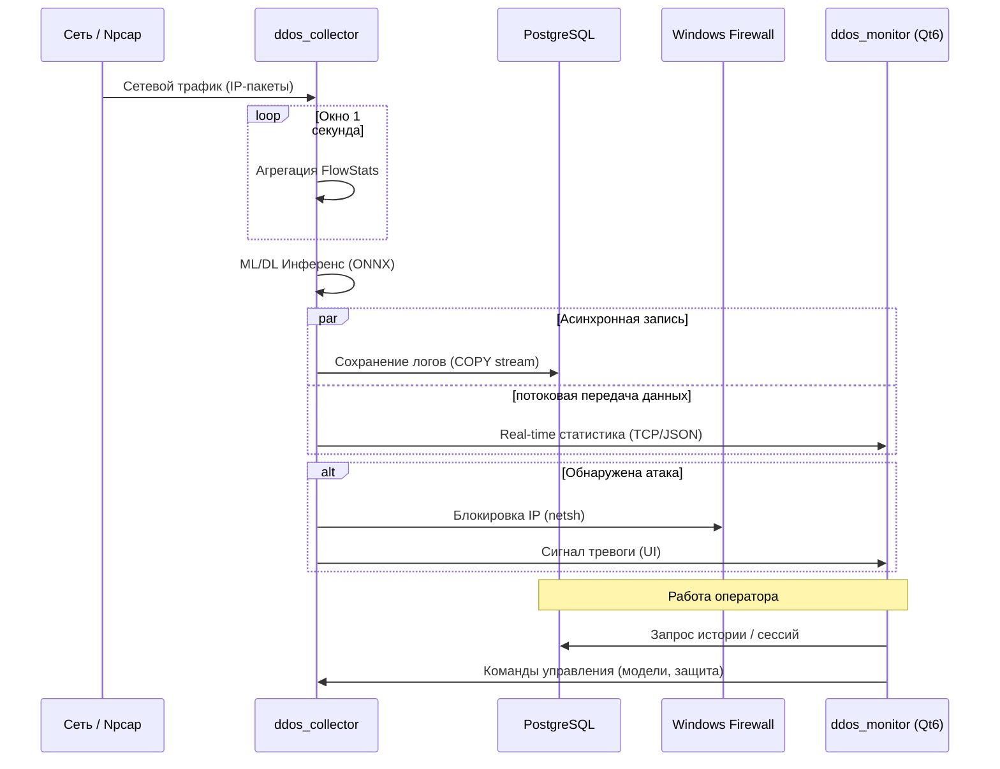

### 2.2. Структура программы ddos_collector

Подсистема `ddos_collector` представляет собой консольное приложение, выполняющее роль ядра всего комплекса. Программа ориентирована на работу в режиме реального времени и реализует конвейерную обработку сетевых данных: от захвата пакетов на канальном уровне до интеллектуального анализа трафика и реализации ответных мер.

Для обеспечения максимальной пропускной способности и минимизации задержек инференса архитектура приложения построена на принципах многопоточности с разделением ответственности между специализированными программными модулями. Каждый модуль оформлен в виде отдельного класса, что упрощает отладку и позволяет выполнять независимую модернизацию подсистем (например, смену механизма захвата или обновление ML/DL-модели). Решение об активации функции автоматической блокировки атакующих IP-адресов принимается оператором: он может включить или отключить этот механизм защиты через графический интерфейс `ddos_monitor`. Основные программные модули подсистемы ddos_collector и их назначение описаны в табл. 9.

**
<p align="right">Таблица 9</p>
<p align="center"><b>Описание модулей ddos_collector**</b></p>


| Модуль (файл) | Назначение |
|---|---|
| `TrafficMonitor` (network/TrafficMonitor.cpp/.hpp) | Захват пакетов через PcapPlusPlus и их асинхронная передача в lock-free очередь |
| `FeatureExtractor` (network/FeatureExtractor.cpp/.hpp) | Агрегация признаков по потокам за окно 1 с; нормализация z-score |
| `ModelInferencer` (ml/ModelInferencer.cpp/.hpp) | Инференс через ONNX Runtime C++ API; горячая замена модели |
| `DetectionEngine` (core/DetectionEngine.cpp/.hpp) | Оркестрация: цикл инференса, отслеживание инцидентов |
| `FirewallManager` (core/FirewallManager.cpp/.hpp) | Блокировка/разблокировка IP через netsh advfirewall; Singleton |
| `DatabaseManager` (common/DatabaseManager.cpp/.hpp) | Асинхронная запись событий в PostgreSQL через libpqxx |
| `TcpServer` (common/TcpServer.cpp/.hpp) | Потоковая передача DetectionResult в ddos_monitor через TCP |
| `ConfigManager` (common/ConfigManager.cpp/.hpp) | Загрузка config.json; параметры подключения и путей |
| `collector_main.cpp` | Точка входа, инициализация, главный цикл |

**2.2.1. Класс TrafficMonitor**

Класс `TrafficMonitor` отвечает за низкоуровневый захват сетевого трафика. Использование библиотеки PcapPlusPlus и драйвера Npcap позволяет приложению работать в режиме «promiscuous», перехватывая все пакеты, проходящие через сетевой интерфейс, а не только адресованные хосту. 

Архитектурно класс спроектирован как асинхронный поставщик данных: захват происходит в отдельном потоке (callback-функция драйвера), а пакеты помещаются в lock-free очередь. Для минимизации аллокаций памяти в runtime реализован механизм пула буферов (`bufferPool_`), что критически важно при обработке тысяч пакетов в секунду. На рис. 4 представлена диаграмма класса с его зависимостями, а в табл. 10 — детальное описание интерфейса.

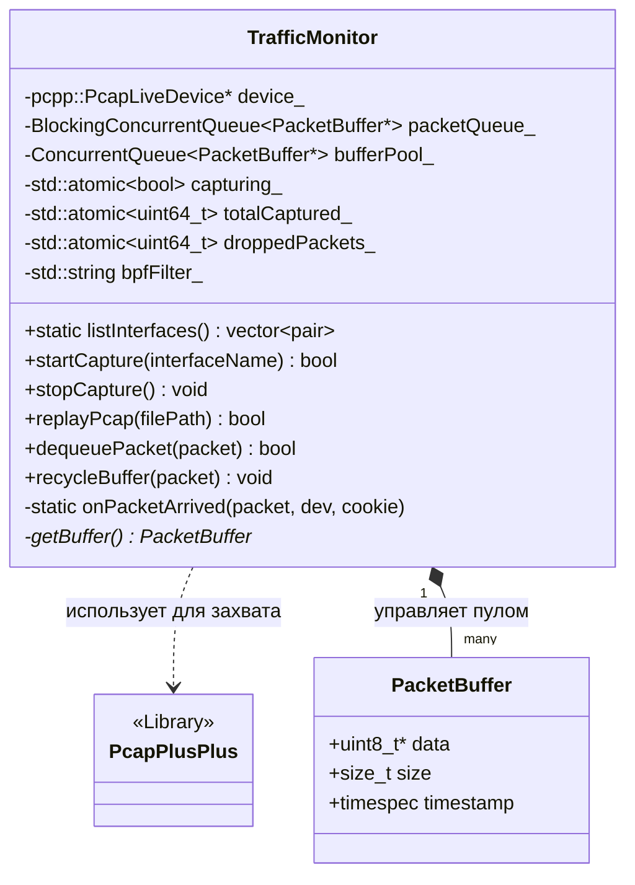

<p align="center">Рис. 4. Диаграмма класса TrafficMonitor</p>

**
<p align="right">Таблица 10</p>
<p align="center"><b>Поля и методы класса TrafficMonitor**</b></p>


| Имя | Тип | Описание | Входные параметры | Выходное значение |
|---|---|---|---|---|
| **Поля** | | | | |
| `device_` | `pcpp::PcapLiveDevice*` | Указатель на устройство захвата PcapPlusPlus | — | — |
| `packetQueue_` | `moodycamel::BlockingConcurrentQueue<PacketBuffer*>` | Lock-free очередь захваченных пакетов | — | — |
| `bufferPool_` | `moodycamel::ConcurrentQueue<PacketBuffer*>` | Пул переиспользуемых буферов пакетов | — | — |
| `capturing_` | `std::atomic<bool>` | Флаг активности захвата | — | — |
| `totalCaptured_` | `std::atomic<uint64_t>` | Счётчик захваченных пакетов | — | — |
| `droppedPackets_` | `std::atomic<uint64_t>` | Счётчик отброшенных пакетов (переполнение очереди) | — | — |
| `bpfFilter_` | `std::string` | BPF-фильтр для ограничения захватываемого трафика | — | — |
| **Методы** | | | | |
| `startCapture()` | `bool` | Начать живой захват пакетов | `interfaceName: std::string` | Успех/неудача |
| `stopCapture()` | `void` | Остановить захват и закрыть устройство | — | — |
| `replayPcap()` | `bool` | Воспроизвести pcap-файл с исходной скоростью | `filePath: std::string` | Успех/неудача |
| `dequeuePacket()` | `bool` | Извлечь пакет из очереди (неблокирующий) | `packet: PacketBuffer*&` | Успех/неудача |
| `dequeuePacketTimed()` | `bool` | Извлечь пакет с таймаутом | `packet, timeout` | Успех/неудача |
| `recycleBuffer()` | `void` | Вернуть буфер в пул для переиспользования | `packet: PacketBuffer*` | — |
| `listInterfaces()` | `vector<pair<string,string>>` | Получить список доступных сетевых интерфейсов | — | Список (имя, описание) |
| `onPacketArrived()` | `static void` | Обратный вызов PcapPlusPlus при захвате пакета | `packet, dev, cookie` | — |

**2.2.2. Класс FeatureExtractor**

Класс `FeatureExtractor` выполняет агрегацию сырых пакетов в логические сетевые потоки и вычисляет вектор признаков для классификатора. Основная сложность реализации данного модуля заключается в необходимости отслеживания двунаправленных потоков (bidirectional flows) в реальном времени.

Для каждого потока, идентифицируемого уникальным 5-tuple, накапливается статистика за 1-секундное окно. По истечении окна класс выполняет нормализацию признаков методом z-score, используя параметры (среднее и стандартное отклонение), загруженные из конфигурационного JSON-файла. Такой подход позволяет математически корректно подготовить данные для ML/DL-модели, не внося искажений из-за разного масштаба величин (например, количество байт vs количество флагов). На рис. 5 показана структура связей класса, в табл. 11 — перечень его ключевых атрибутов и методов.

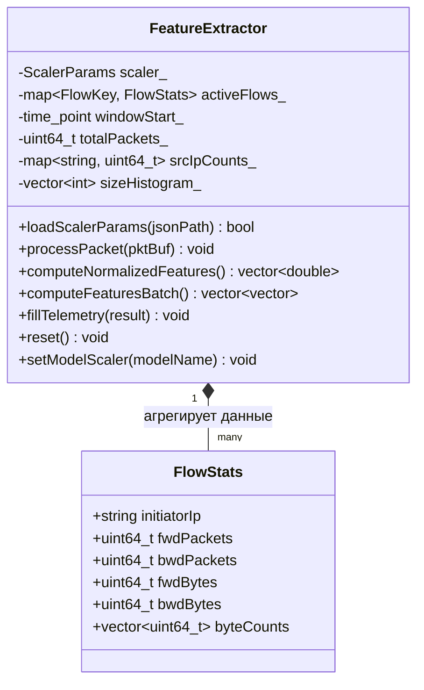

<p align="center">Рис. 5. Диаграмма класса FeatureExtractor</p>

**
<p align="right">Таблица 11</p>
<p align="center"><b>Поля и методы класса FeatureExtractor**</b></p>


| Имя | Тип | Описание | Входные параметры | Выходное значение |
|---|---|---|---|---|
| **Поля** | | | | |
| `scaler_` | `ScalerParams` | Параметры нормализации: имена признаков, μ, σ, флаг log1p | — | — |
| `activeFlows_` | `std::map<FlowKey, FlowStats>` | Статистика по активным потокам за текущее окно | — | — |
| `windowStart_` | `std::chrono::steady_clock::time_point` | Момент начала текущего окна агрегации | — | — |
| `totalPackets_` | `uint64_t` | Общее количество пакетов в окне | — | — |
| `tcpPackets_`, `udpPackets_`, `icmpPackets_` | `uint64_t` | Счётчики пакетов по протоколам | — | — |
| `srcIpCounts_` | `std::map<string, uint64_t>` | Счётчик пакетов по IP-источнику | — | — |
| `sizeHistogram_` | `std::vector<int>` | Гистограмма размеров пакетов (5 бинов) | — | — |
| **Методы** | | | | |
| `loadScalerParams()` | `bool` | Загрузить параметры нормализации из JSON-файла | `jsonPath: std::string` | Успех/неудача |
| `processPacket()` | `void` | Обработать пакет: обновить статистику потока | `pktBuf: PacketBuffer*` | — |
| `computeNormalizedFeatures()` | `vector<double>` | Вычислить нормализованный вектор признаков | — | Нормализованный вектор |
| `computeFeaturesBatch()` | `vector<vector<double>>` | Признаки для всех активных потоков | — | Матрица признаков |
| `fillTelemetry()` | `void` | Заполнить телеметрию в DetectionResult | `result: DetectionResult&` | — |
| `reset()` | `void` | Сбросить состояние для нового окна | — | — |
| `setModelScaler()` | `void` | Выбрать параметры масштабировщика для конкретной модели | `modelName: std::string` | — |

**2.2.3. Класс ModelInferencer**

Класс `ModelInferencer` является инкапсуляцией среды выполнения ONNX Runtime. Его основная задача — загрузка предварительно обученных ML/DL-моделей из файлов формата `.onnx` и выполнение предиктивного анализа на векторе признаков.

Реализация класса поддерживает механизм «горячей замены» (hot-swap) модели без остановки процесса захвата трафика. Это достигается за счёт использования примитива синхронизации `std::shared_mutex`: процесс инференса захватывает «разделяемую» блокировку (read lock), а процесс обновления модели — «эксклюзивную» (write lock). Такой подход гарантирует потокобезопасность и непрерывность мониторинга. На рис. 6 приведена структурная схема интеграции ONNX Runtime, а в табл. 12 описан программный интерфейс класса.

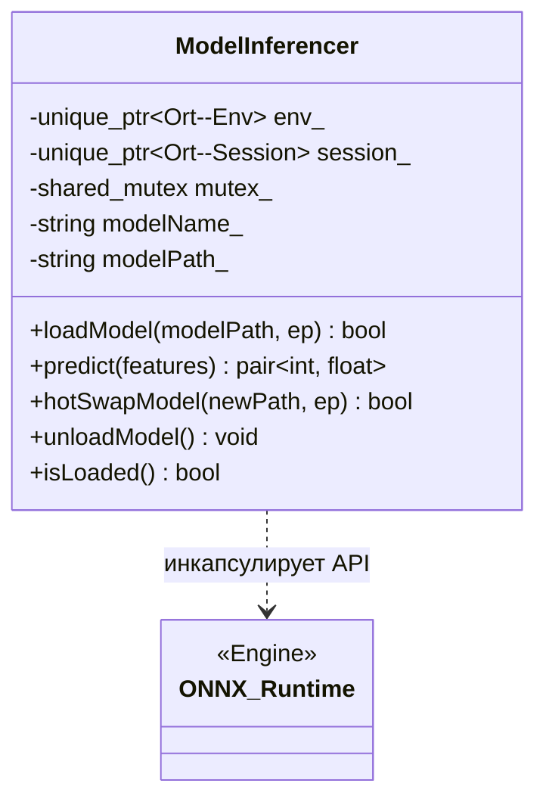

<p align="center">Рис. 6. Диаграмма класса ModelInferencer</p>

**
<p align="right">Таблица 12</p>
<p align="center"><b>Поля и методы класса ModelInferencer**</b></p>


| Имя | Тип | Описание | Входные параметры | Выходное значение |
|---|---|---|---|---|
| **Поля** | | | | |
| `env_` | `std::unique_ptr<Ort::Env>` | ONNX Runtime окружение | — | — |
| `session_` | `std::unique_ptr<Ort::Session>` | ONNX Runtime сессия с загруженной моделью | — | — |
| `sessionOptions_` | `std::unique_ptr<Ort::SessionOptions>` | Параметры сессии (кол-во потоков, оптимизации) | — | — |
| `inputNames_`, `outputNames_` | `std::vector<std::string>` | Имена входных и выходных тензоров | — | — |
| `mutex_` | `std::shared_mutex` | Read-write мьютекс для потокобезопасного hot-swap | — | — |
| `modelName_`, `modelPath_` | `std::string` | Имя и путь загруженной модели | — | — |
| **Методы** | | | | |
| `loadModel()` | `bool` | Загрузить ONNX-модель из файла | `modelPath, ep: std::string` | Успех/неудача |
| `predict()` | `pair<int, float>` | Инференс: возвращает метку (0/1) и уверенность | `features: vector<float>` | (метка, уверенность) |
| `hotSwapModel()` | `bool` | Потокобезопасная замена модели без остановки захвата | `newModelPath, ep` | Успех/неудача |
| `unloadModel()` | `void` | Выгрузить модель и освободить ресурсы ORT | — | — |
| `isLoaded()` | `bool` | Проверить наличие загруженной модели | — | Флаг |

**2.2.4. Класс DetectionEngine**

Класс `DetectionEngine` выполняет роль центрального оркестратора подсистемы сбора. Он координирует работу всех вышеописанных модулей, реализуя логику главного цикла обнаружения.

В задачи этого класса входит управление жизненным циклом потока инференса, отслеживание временных окон агрегации и реализация конечного автомата состояний защиты («норма» и «атака»). При обнаружении аномалии `DetectionEngine` принимает решение о необходимости активации защитных механизмов через `FirewallManager` или информировании пользователя через callback-интерфейсы. Выделение логики управления в отдельный класс позволяет изолировать алгоритмы принятия решений от технических деталей захвата пакетов или записи в БД. В табл. 13 представлены основные методы управления процессом детектирования.

**
<p align="right">Таблица 13</p>
<p align="center"><b>Поля и методы класса DetectionEngine**</b></p>


| Имя | Тип | Описание | Входные параметры | Выходное значение |
|---|---|---|---|---|
| **Поля** | | | | |
| `monitor_` | `TrafficMonitor` | Подсистема захвата пакетов | — | — |
| `extractor_` | `FeatureExtractor` | Подсистема извлечения признаков | — | — |
| `inferencer_` | `ModelInferencer` | Подсистема ML/DL-инференса | — | — |
| `running_` | `std::atomic<bool>` | Флаг работы цикла инференса | — | — |
| `inferenceThread_` | `std::unique_ptr<std::thread>` | Поток цикла инференса | — | — |
| `resultCallback_` | `ResultCallback` | Функция обратного вызова с результатом | — | — |
| `incidentCallback_` | `IncidentCallback` | Функция обратного вызова при завершении инцидента | — | — |
| `isUnderAttack_` | `bool` | Текущее состояние (атака/норма) | — | — |
| `isMitigationEnabled_` | `bool` | Флаг автоматической блокировки через FirewallManager | — | — |
| **Методы** | | | | |
| `init()` | `bool` | Инициализация: загрузка модели и масштабировщика | `modelPath, scalerPath, ep` | Успех/неудача |
| `startLive()` | `bool` | Запустить живой захват и цикл инференса | `interfaceName: std::string` | Успех/неудача |
| `startReplay()` | `bool` | Запустить воспроизведение pcap-файла | `pcapPath: std::string` | Успех/неудача |
| `stop()` | `void` | Остановить захват и цикл инференса | — | — |
| `inferenceLoop()` | `void` (private) | Основной цикл: сбор окна → признаки → инференс | — | — |
| `processWindow()` | `void` (private) | Обработка одного окна агрегации | — | — |
| `updateIncidentState()` | `void` (private) | Отслеживание переходов атака↔норма | `result: DetectionResult&` | — |

**2.2.5. Класс DatabaseManager**

Класс `DatabaseManager` отвечает за долговременное хранение результатов работы комплекса в РСУБД PostgreSQL. Модуль спроектирован с упором на надежность и минимальное влияние на производительность захвата трафика.

Для этого в классе реализована асинхронная схема записи: события накапливаются в неблокирующей очереди и сбрасываются в БД отдельным потоком с использованием механизма `COPY` (через интерфейс `stream_to` библиотеки libpqxx). Это позволяет обрабатывать огромные потоки логов без создания «бутылочного горлышка» в виде синхронных SQL-запросов. Кроме того, класс содержит встроенный механизм файловой буферизации (`FileBuffer`), который автоматически активируется при потере связи с сервером базы данных, предотвращая потерю информации об инцидентах. В табл. 14 приведено описание основных методов управления данными.

**
<p align="right">Таблица 14</p>
<p align="center"><b>Поля и методы класса DatabaseManager**</b></p>


| Имя | Тип | Описание | Входные параметры | Выходное значение |
|---|---|---|---|---|
| **Поля** | | | | |
| `conn_` | `std::unique_ptr<pqxx::connection>` | Соединение с PostgreSQL (основной поток) | — | — |
| `writerConn_` | `std::unique_ptr<pqxx::connection>` | Соединение с PostgreSQL (поток записи) | — | — |
| `eventQueue_` | `ConcurrentQueue<EventEntry>` | Lock-free очередь событий для асинхронной записи | — | — |
| `writerThread_` | `std::unique_ptr<QThread>` | Поток асинхронного флашинга в БД | — | — |
| `pendingEventsBuffer_` | `FileBuffer` | Файловый буфер на случай потери соединения с БД | — | — |
| **Методы** | | | | |
| `connectToDatabase()` | `bool` | Подключиться к PostgreSQL | `host, port, dbName, user, password` | Успех/неудача |
| `createSession()` | `int` | Создать запись сессии мониторинга | `iface, modelName` | ID сессии |
| `enqueueEvent()` | `void` | Поставить событие в асинхронную очередь записи | `result: DetectionResult&` | — |
| `enqueueSecurityEvent()` | `void` | Поставить событие об инциденте атаки | `sessionId, startTime, duration, ...` | — |
| `getEventsForSession()` | `vector<DetectionResult>` | Получить события за сессию | `sessionId: int` | Список событий |
| `ensureTables()` | `void` (private) | Создать таблицы БД при первом запуске | — | — |
| `flushEvents()` | `void` (private) | Сбросить очередь событий в БД | `conn: pqxx::connection&` | — |

**2.2.6. Класс FirewallManager**

Класс `FirewallManager` реализует подсистему активного противодействия атакам. Он отвечает за автоматическое взаимодействие с межсетевым экраном операционной системы Windows для блокировки вредоносного трафика на уровне IP-адресов.

Модуль реализован с использованием паттерна «Одиночка» (Singleton), что обеспечивает единую точку управления правилами фильтрации из любой части программы. Взаимодействие с брандмауэром Windows осуществляется через стандартную системную утилиту `netsh advfirewall`. Класс поддерживает механизмы автоматической разблокировки и полной очистки правил при завершении работы приложения, что предотвращает несанкционированное сохранение блокировок после окончания инцидента. В табл. 15 подробно описан программный интерфейс управления фаерволом.

**
<p align="right">Таблица 15</p>
<p align="center"><b>Поля и методы класса FirewallManager**</b></p>


| Имя | Тип | Описание | Входные параметры | Выходное значение |
|---|---|---|---|---|
| **Поля** | | | | |
| `activeBlockedIps_` | `std::set<std::string>` | Множество активно заблокированных IP-адресов | — | — |
| **Методы** | | | | |
| `getInstance()` | `FirewallManager&` (static) | Получить единственный экземпляр Singleton | — | Экземпляр |
| `blockIp()` | `void` | Добавить правило блокировки через netsh | `ip: std::string` | — |
| `unblockIp()` | `void` | Удалить правило блокировки | `ip: std::string` | — |
| `unblockAllIps()` | `void` | Удалить все активные правила блокировки | — | — |
| `clearAllRules()` | `void` | Удалить все правила с префиксом DDoS_Block_ (в том числе оставшиеся от предыдущих запусков) | — | — |
| `getBlockedIps()` | `vector<string>` | Получить список заблокированных IP | — | Список IP |

### 2.3. Проектирование структуры базы данных

Для обеспечения возможности последующего анализа инцидентов, формирования статистической отчетности и визуализации состояния системы в реальном времени спроектирована специализированная структура базы данных. В качестве хранилища выбрана СУБД PostgreSQL 15+, обеспечивающая необходимую производительность при интенсивной записи потоковых данных и обладающая развитыми средствами асинхронного взаимодействия.

Архитектура базы данных построена по иерархическому принципу, что позволяет эффективно структурировать информацию разной степени детализации: от метаданных сессий мониторинга до векторов признаков каждого отдельного потока. Ключевой особенностью проектирования является разделение «горячих» данных (оперативная статистика) и «холодных» данных (завершенные инциденты), что минимизирует накладные расходы на индексацию при высокой нагрузке.

Взаимодействие с сервером осуществляется через объектно-ориентированную библиотеку libpqxx [ 20 ]. Для реализации нефункционального требования NFR-001 (производительность) при проектировании БД были применены следующие технические решения:
1) **Асинхронная пакетная запись:** использование паттерна «Producer-Consumer» с lock-free очередью позволяет изолировать основной поток обработки трафика от задержек дисковой подсистемы БД.
2) **Механизм COPY (потоковая вставка):** вместо выполнения множественных одиночных запросов `INSERT`, система использует интерфейс `stream_to` [ 20 ], инициирующий команду `COPY` в PostgreSQL. Это сокращает накладные расходы на парсинг SQL-запросов и транзакционную нагрузку в 5–7 раз.
3) **Локальная отказоустойчивость:** внедрен промежуточный класс `FileBuffer`, выполняющий роль «теневой копии» данных при временной недоступности сетевого соединения с сервером БД.

На рис. 7 представлена логическая схема базы данных в нотации ERD (Entity-Relationship Diagram), отображающая ключевые сущности, типы атрибутов и связи «один-ко-многим» между сессиями и событиями.

```sql
-- Приложение Г. SQL DDL-скрипт создания таблиц (фрагмент)
```

Рис. 7. ERD-схема базы данных

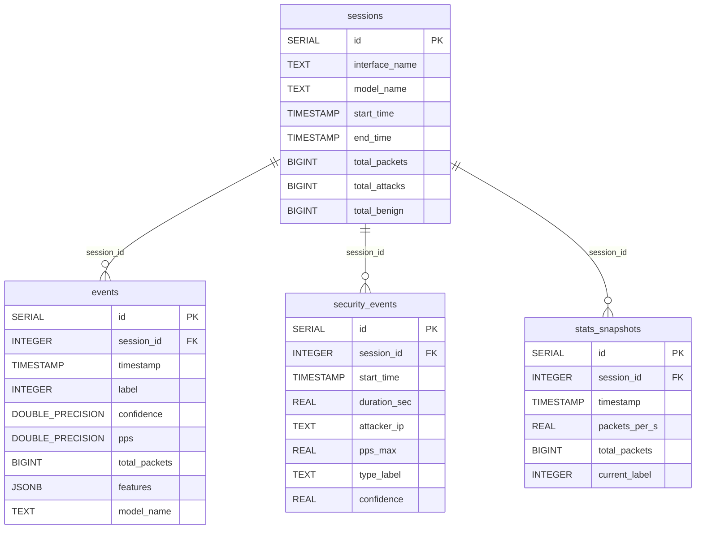

Детальное описание структуры и назначения каждой таблицы приведено в таблицах ниже. Таблица 16 является наиболее нагруженной и служит основным источником данных для обучения и верификации моделей.

**
<p align="right">Таблица 16</p>
<p align="center"><b>События обнаружения (`events`)**</b></p>


| Поле | Тип PostgreSQL | Описание |
|---|---|---|
| `id` | `SERIAL PRIMARY KEY` | Уникальный идентификатор |
| `session_id` | `INTEGER` | Внешний ключ к таблице `sessions` |
| `timestamp` | `TIMESTAMP NOT NULL` | Временна́я метка события |
| `label` | `INTEGER NOT NULL` | Метка (0 — норма, 1 — атака) |
| `confidence` | `DOUBLE PRECISION` | Уверенность классификатора [0..1] |
| `pps` | `DOUBLE PRECISION` | Пакетов в секунду за окно |
| `total_packets` | `BIGINT` | Всего пакетов в окне |
| `features` | `JSONB` | Вектор извлеченных признаков в формате JSON |
| `model_name` | `TEXT` | Имя использованной модели |

Описание полей таблицы сессий мониторинга приведено в табл. 17.

**
<p align="right">Таблица 17</p>
<p align="center"><b>Сессии мониторинга (`sessions`)**</b></p>


| Поле | Тип PostgreSQL | Описание |
|---|---|---|
| `id` | `SERIAL PRIMARY KEY` | Уникальный идентификатор сессии |
| `interface_name` | `TEXT` | Имя сетевого интерфейса |
| `model_name` | `TEXT` | Имя загруженной модели |
| `start_time` | `TIMESTAMP` | Начало сессии |
| `end_time` | `TIMESTAMP` | Конец сессии |
| `total_packets` | `BIGINT` | Всего обработано пакетов |
| `total_attacks` | `BIGINT` | Обнаружено атак (окон с меткой 1) |
| `total_benign` | `BIGINT` | Количество легитимных окон |

Структура данных об инцидентах безопасности представлена в табл. 18.

**
<p align="right">Таблица 18</p>
<p align="center"><b>Инциденты атак (`security_events`)**</b></p>


| Поле | Тип PostgreSQL | Описание |
|---|---|---|
| `id` | `SERIAL PRIMARY KEY` | Уникальный идентификатор инцидента |
| `session_id` | `INTEGER` | Внешний ключ к сессии |
| `start_time` | `TIMESTAMP NOT NULL` | Начало атаки |
| `duration_sec` | `REAL` | Продолжительность атаки (секунды) |
| `attacker_ip` | `TEXT` | IP-адрес основного источника |
| `pps_max` | `REAL` | Пиковая интенсивность (пак/с) |
| `type_label` | `TEXT` | Тип атаки («DDoS Attack» и др.) |
| `confidence` | `REAL` | Максимальная уверенность за инцидент |

Состав полей таблицы снимков статистики трафика приведен в табл. 19.

**
<p align="right">Таблица 19</p>
<p align="center"><b>Снимки трафика (`stats_snapshots`)**</b></p>


| Поле | Тип PostgreSQL | Описание |
|---|---|---|
| `id` | `SERIAL PRIMARY KEY` | Уникальный идентификатор |
| `session_id` | `INTEGER` | Внешний ключ к сессии |
| `timestamp` | `TIMESTAMP NOT NULL` | Временна́я метка снимка |
| `packets_per_s` | `REAL` | Пакетов в секунду |
| `total_packets` | `BIGINT` | Всего пакетов (нарастающий итог) |
| `current_label` | `INTEGER` | Текущая метка классификации |

### 2.4. Разработка схемы алгоритмов

Логика функционирования программного комплекса декомпозирована на три ключевых алгоритма, описывающих жизненный цикл обработки данных, процесс математической подготовки признаков и механизм активного противодействия угрозам.

#### 2.4.1. Алгоритм главного цикла обработки (инференс-цикл)

Основной цикл обработки, инкапсулированный в классе `DetectionEngine`, реализует стратегию непрерывного мониторинга. Алгоритм спроектирован так, чтобы минимизировать время прохождения данных от сетевого интерфейса до классификатора, обеспечивая при этом защиту от ложных срабатываний на незначительном сетевом фоне.

Ключевой особенностью является разделение на «быстрый путь» (захват пакетов в очередь) и «аналитический путь» (извлечение признаков и инференс), работающих в параллельных потоках. На рис. 8 представлена блок-схема алгоритма, включающая этап инициализации, фильтрацию фонового шума и логику принятия решения о блокировке.

Рис. 8. Блок-схема алгоритма главного цикла

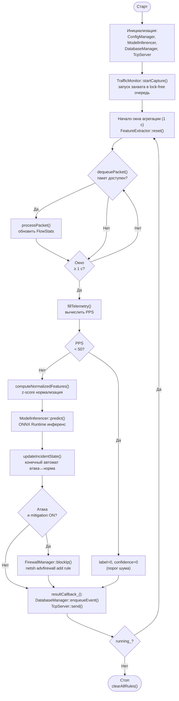

Алгоритм работы подсистемы `ddos_collector`:

1) Инициализация ConfigManager: загрузка config.json (путь к модели, параметры БД, имя интерфейса)
2) Инициализация ModelInferencer: загрузка ONNX-модели через `Ort::Session`
3) Загрузка параметров масштабировщика: JSON-файл → `FeatureExtractor::ScalerParams`
4) Подключение к PostgreSQL; создание таблиц (если не существуют); создание сессии
5) Инициализация TcpServer для потоковой передачи данных в `ddos_monitor`
6) Вызов `TrafficMonitor::startCapture()` → захват пакетов в lock-free очередь
7) Запуск потока инференса (`DetectionEngine::inferenceLoop()`):
   - Начало окна агрегации (1 секунда): `FeatureExtractor::reset()`
   - Цикл извлечения пакетов: `dequeuePacket()` → `processPacket()`
   - По истечении окна: `computeNormalizedFeatures()` → вектор признаков
   - Проверка порога шума (pps < 50): если слишком тихо — метка «норма» без инференса
   - `ModelInferencer::predict()` → (метка, уверенность)
   - `updateIncidentState()`: отслеживание переходов атака↔норма
   - Если атака и mitigation включён: `FirewallManager::blockIp(topAttacker)`
   - Если атака завершилась: `FirewallManager::unblockAllIps()`
   - `resultCallback_()` → DatabaseManager (async enqueue) + TcpServer (live send)
8) При остановке: `stopCapture()`, `closeSession()`, очистка правил фаервола

#### 2.4.2. Алгоритм извлечения и нормализации признаков

Алгоритм извлечения признаков выполняет критически важную трансформацию сырых байтовых данных в структурированное признаковое описание сетевого поведения. Процесс основан на глубоком разборе заголовков пакетов уровней L2-L4 и агрегации статистики в рамках скользящего временного окна.

Применение агрегации по всем активным потокам позволяет системе детектировать не только точечные атаки на конкретный порт, но и распределенные воздействия (DDoS), характеризующиеся аномальным всплеском активности по всему интерфейсу. Завершающий этап алгоритма — математическая стандартизация — гарантирует, что входные данные для ML/DL-моделей будут находиться в сопоставимых диапазонах, что исключает доминирование признаков с большой размерностью (например, количество байт) над флагами. На рис. 9 детально показан процесс парсинга пакетов и пайплайн нормализации.

Рис. 9. Блок-схема алгоритма извлечения признаков


1) Получить `PacketBuffer*` из очереди (содержит сырые байты и метку времени)
2) Распаковать через PcapPlusPlus: `Ethernet → IP → TCP/UDP/ICMP`
3) Извлечь 5-tuple: (src\_ip, dst\_ip, src\_port, dst\_port, proto)
4) Найти или создать запись `FlowStats` в `activeFlows_[FlowKey]`
5) Обновить счётчики потока: `fwdPackets++`, `fwdBytes += len`
6) Если TCP: обновить счётчики флагов (`synPackets`, `ackPackets`, `finPackets`, `rstPackets`, `pshPackets`, `urgPackets`); обновить `tcpWindowSizeTotal`
7) Обновить глобальные счётчики окна: `totalPackets_`, `tcpPackets_` / `udpPackets_` / `icmpPackets_`, `totalBytes_`
8) По окончании окна (`computeNormalizedFeatures()`):
   - Для каждого активного потока: вычислить вектор признаков из `FlowStats`
   - Применить z-score: `x' = (x - μᵢ) / σᵢ`
   - Если `useLog1p`: предварительно `x = log(1 + x)` перед нормализацией
   - Вернуть вектор `vector<double>` (один вектор для «тяжёлого» потока или батч)

#### 2.4.3. Алгоритм блокировки источника атаки

Алгоритм блокировки реализует реактивную часть системы защиты. Его основной задачей является оперативное внесение изменений в правила фильтрации операционной системы при обнаружении деструктивного воздействия, подтвержденного классификатором.

Логика алгоритма построена на концепции конечного автомата, отслеживающего переходы между состояниями «Норма» и «Атака». Это позволяет не только мгновенно блокировать нарушителя через системные вызовы Windows Firewall, но и автоматически восстанавливать доступ после прекращения атаки, исключая избыточную нагрузку на системный брандмауэр и предотвращая случайную блокировку легитимных пользователей на длительный срок. На рис. 10 изображена логика взаимодействия с брандмауэром и управление списком активных блокировок.

Рис. 10. Блок-схема алгоритма блокировки

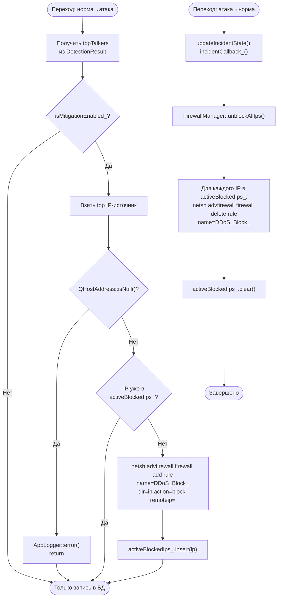

1) Получить список topTalkers из `DetectionResult` (top IP-источников по числу пакетов)
2) Проверить: не находится ли IP уже в `activeBlockedIps_` (мьютекс `g_firewallMutex`)
3) Если уже заблокирован — пропустить (идемпотентная операция)
4) Если не заблокирован:
   - Валидировать формат IP через `QHostAddress`
   - Сформировать команду: `netsh advfirewall firewall add rule name=DDoS_Block_<IP> dir=in action=block remoteip=<IP>`
   - Выполнить через `QProcess::startDetached()`
   - Добавить IP в `activeBlockedIps_`
5) При переходе «атака → норма» (в `DetectionEngine::updateIncidentState()`):
   - Вызвать `FirewallManager::unblockAllIps()`
   - Для каждого IP в `activeBlockedIps_`: выполнить `netsh advfirewall firewall delete rule name=DDoS_Block_<IP>`
   - Очистить `activeBlockedIps_`

### 2.5. Проектирование структуры программы ddos_monitor

Программа `ddos_monitor` является клиентским приложением, обеспечивающим интерфейс взаимодействия между оператором безопасности и ядром системы. Архитектура монитора построена на базе фреймворка Qt6 с использованием модульного подхода, где каждая функциональная область (графики, логи, история) выделена в независимый виджет.

Такой дизайн позволяет изолировать логику сетевого взаимодействия и работы с БД от кода визуализации, упрощая масштабирование интерфейса. Программа обеспечивает не только пассивное наблюдение за метриками, но и активное управление коллектором, включая смену моделей и режимов защиты в реальном времени. В табл. 20 приведено описание программных модулей монитора, а в табл. 21 — детальный перечень элементов управления и их назначение.

**
<p align="right">Таблица 20</p>
<p align="center"><b>Описание модулей ddos_monitor**</b></p>


| Модуль (файл) | Назначение |
|---|---|
| `DashboardWidget` (monitor_ui/DashboardWidget.cpp/.hpp) | Главный виджет: графики трафика, карточки статистики, управление |
| `EventHistoryWidget` (monitor_ui/EventHistoryWidget.cpp/.hpp) | Таблица истории событий обнаружения из БД |
| `LogWidget` (monitor_ui/LogWidget.cpp/.hpp) | Консоль лога событий приложения |
| `SessionWidget` (monitor_ui/SessionWidget.cpp/.hpp) | Просмотр завершённых сессий мониторинга |
| `ReportGenerator` (monitor_ui/ReportGenerator.cpp/.hpp) | Формирование детальных отчетов об инцидентах в формате PDF |
| `CSVUtils` (common/CSVUtils.hpp) | Вспомогательные функции для экспорта табличных данных в CSV |
| `ThemePalette` (monitor_ui/ThemePalette.cpp/.hpp) | Цветовая схема (Catppuccin) и стилизация (QSS) интерфейса |
| `DatabaseManager` (common/DatabaseManager.cpp/.hpp) | Чтение данных из БД (shared with collector) |
| `TcpClient` (common/TcpClient.cpp/.hpp) | Подключение к TcpServer коллектора |
| `monitor_main.cpp` | Точка входа Qt-приложения |

**
<p align="right">Таблица 21</p>
<p align="center"><b>Основные элементы управления и визуализации**</b></p>


| Элемент | Тип Qt | Расположение | Назначение |
|---|---|---|---|
| График трафика | `QChart` / `QAreaSeries` | `DashboardWidget` | Многослойное отображение PPS по протоколам (TCP, UDP, ICMP) |
| Карточки статистики | `QLabel` | `DashboardWidget` | Счётчики: всего пакетов, PPS, интенсивность потерь (Drop Rate) |
| Управление защитой | `QCheckBox` | `DashboardWidget` | Переключение между режимом мониторинга и автоблокировкой IP |
| Всплывающая информация | `SmartTooltip` (QFrame) | `DashboardWidget` | Детальные данные о точках графика и список заблокированных IP |
| Выбор модели | `QComboBox` | **Toolbar** (Main) | Горячая замена ML/DL-модели из директории /models |
| Анализ PCAP | `QPushButton` | **Toolbar** (Main) | Запуск воспроизведения pcap-файла для офлайн-анализа |
| Управление записью | `QPushButton` (Checkable) | **Toolbar** (Main) | Включение/выключение сохранения дампов трафика на диск |
| Статус БД | `QLabel` (Индикатор) | **Toolbar** (Main) | Визуальный контроль подключения к PostgreSQL |
| Таймер обновления | `QTimer` | `DashboardWidget` | Опрос метрик системы с интервалом 1000 мс |
| Индикатор атаки | `QLabel` | `DashboardWidget` | Цветовая индикация состояния безопасности сети |

Интерфейс главного окна приложения ddos_monitor представлен на рис. 11.

Рис. 11. Главное окно ddos_monitor в режиме мониторинга

**Вывод по разделу:** спроектированы архитектура двух программ комплекса, шесть классов подсистемы сбора (TrafficMonitor, FeatureExtractor, ModelInferencer, DetectionEngine, DatabaseManager, FirewallManager), структура базы данных из четырёх таблиц, алгоритмы главного цикла, извлечения признаков и блокировки, а также пользовательский интерфейс на Qt6.

---

## 3. РЕАЛИЗАЦИЯ ПРОГРАММНОГО КОМПЛЕКСА

### 3.1. Захват пакетов и инициализация PcapPlusPlus

Захват сетевых пакетов реализован с использованием библиотеки PcapPlusPlus — объектно-ориентированной обёртки над Npcap. Инициализация выполняется в методе `TrafficMonitor::startCapture()`. Для поиска устройства по имени или описанию реализована нечёткая двухэтапная стратегия поиска: сначала ищется точное совпадение по имени или IPv4-адресу, затем — по очищенному описанию с приоритетом физических устройств над виртуальными (Hyper-V, Microsoft NDIS):

Листинг 1 — Инициализация захвата пакетов
```cpp
// Метод инициализации устройства захвата трафика
bool TrafficMonitor::startCapture(const std::string& interfaceName) {
  auto devList = pcpp::PcapLiveDeviceList::getInstance().getPcapLiveDevicesList();
  device_ = nullptr;

  // 1. Поиск по имени или IP
  for (auto* dev : devList) {
  if (dev->getName() == interfaceName || 
      dev->getIPv4Address().toString() == interfaceName) {
      device_ = dev; break;
  }
  }

  if (!device_ || !device_->open()) return false;

  // Установка BPF-фильтра для оптимизации захвата на уровне ядра
  if (!bpfFilter_.empty()) device_->setFilter(bpfFilter_);

  capturing_ = true;
  // Запуск асинхронного захвата; колбэк onPacketArrived вызывается драйвером
  device_->startCapture(onPacketArrived, this);
  return true;
}
```

При получении пакета вызывается статический метод `onPacketArrived`, который помещает пакет в lock-free очередь `BlockingConcurrentQueue`. Для предотвращения утечек памяти используется пул переиспользуемых буферов `PacketBuffer`:

Листинг 2 — Обработка пакетов и пул буферов
```cpp
// Статический метод-обработчик входящих пакетов
void TrafficMonitor::onPacketArrived(pcpp::RawPacket* packet, pcpp::PcapLiveDevice*, void* cookie) {
  auto* self = static_cast<TrafficMonitor*>(cookie);

  // Проверка заполненности очереди (защита от перегрузки памяти)
  if (self->packetQueue_.size_approx() < MAX_QUEUE_SIZE) {
  PacketBuffer* buf = self->getBuffer(); // Получение буфера из пула
  buf->assign(packet->getRawData(), packet->getRawDataLen(),
          std::chrono::system_clock::now(),
          packet->getLinkLayerType());
  self->packetQueue_.enqueue(buf); // Помещение в lock-free очередь
  self->totalCaptured_++;
  } else {
  self->droppedPackets_++; // Счетчик отброшенных пакетов
  }
}
```

Максимальный размер очереди `MAX_QUEUE_SIZE = 500 000` пакетов обеспечивает буферизацию при кратковременных пиках нагрузки.

### 3.2. Извлечение признаков и агрегация по потокам

Класс `FeatureExtractor` агрегирует статистику сетевых потоков за окно 1 секунда. Каждый пакет идентифицируется по 5-tuple `(ip1, ip2, port1, port2, proto)`, нормализованному в обоих направлениях (bidirectional flow). Статистика хранится в `std::map<FlowKey, FlowStats>`:

Листинг 3 — Структуры сетевого потока
```cpp
// Уникальный ключ потока (симметричный 5-tuple)
struct FlowKey {
  std::string ip1, ip2; // IP-адреса, отсортированные лексикографически
  uint16_t port1, port2;
  uint8_t proto;

  // Оператор сравнения для использования структуры в качестве ключа std::map
  bool operator<(const FlowKey& o) const {
  return std::tie(ip1, ip2, port1, port2, proto) <
           std::tie(o.ip1, o.ip2, o.port1, o.port2, o.proto);
  }
};

// Статистические показатели потока за текущее окно агрегации
struct FlowStats {
  std::string initiatorIp; // IP-адрес инициатора потока
  std::chrono::steady_clock::time_point firstPacketTime, lastPacketTime;

  uint64_t fwdPackets = 0, bwdPackets = 0; // счётчики пакетов
  uint64_t fwdBytes = 0, bwdBytes = 0;     // счётчики байт

  // Счётчики TCP-флагов
  uint64_t synPackets = 0, ackPackets = 0;
  uint64_t finPackets = 0, rstPackets = 0;
  uint64_t pshPackets = 0, urgPackets = 0;

  uint64_t tcpWindowSizeTotal = 0;    // суммарный размер окна TCP
  std::vector<uint64_t> byteCounts;   // гистограмма байт для энтропии
  uint64_t totalPayloadBytes = 0;     // общий объём полезной нагрузки

  FlowStats() : byteCounts(256, 0) {}
};
```

Нормализация признаков применяет z-score с параметрами из JSON-файла. Дополнительно поддерживается log1p-преобразование для признаков с тяжёлым хвостом:

Листинг 4 — Нормализация признаков трафика
```cpp
// Метод вычисления нормализованного вектора признаков (Z-score)
std::vector<double> FeatureExtractor::computeNormalizedFeatures() {
  std::vector<double> raw = buildRawVector(); // Сбор сырых статистик
  std::vector<double> normalized(raw.size());

  for (size_t i = 0; i < raw.size(); ++i) {
  double val = raw[i];
  // Применение логарифмического преобразования для сглаживания выбросов
  if (scaler_.useLog1p) val = std::log1p(val);

  // Стандартизация: (x - mean) / std
  normalized[i] = (val - scaler_.mean[i]) / 
      (scaler_.scale[i] > 1e-10 ? scaler_.scale[i] : 1.0);
  }
  return normalized;
}
```

### 3.3. ML/DL-инференс через ONNX Runtime

Класс `ModelInferencer` загружает ONNX-модель через `Ort::Session` и выполняет инференс. Потокобезопасность при горячей замене модели обеспечивается `std::shared_mutex`: чтение (инференс) — shared lock, запись (замена) — unique lock:

Листинг 5 — Выполнение классификации (инференс)
```cpp
// Метод предиктивного анализа вектора признаков
std::pair<int, float> ModelInferencer::predict(const std::vector<float>& features) {
  std::shared_lock<std::shared_mutex> lock(mutex_); // блокировка на чтение
  if (!session_) return {0, 0.0f};

  auto memInfo = Ort::MemoryInfo::CreateCpu(OrtArenaAllocator, OrtMemTypeDefault);
  std::vector<int64_t> inputShape = {1, (int64_t)features.size()};

  // Создание входного тензора из вектора признаков
  auto inputTensor = Ort::Value::CreateTensor<float>(
  memInfo, const_cast<float*>(features.data()),
  features.size(), inputShape.data(), inputShape.size());

  // 1. Получение метки класса (Output 0)
  const char* labelOutputName = outputNamePtrs_[ 0 ];
  auto outputs = session_->Run(Ort::RunOptions{nullptr},
  inputNamePtrs_.data(), &inputTensor, 1, &labelOutputName, 1);

  int label = 0;
  float confidence = 0.0f;
  if (!outputs.empty() && outputs[ 0 ].IsTensor()) {
  auto typeInfo = outputs[ 0 ].GetTensorTypeAndShapeInfo();
  auto elemType = typeInfo.GetElementType();
  if (elemType == ONNX_TENSOR_ELEMENT_DATA_TYPE_INT64) {
      label = (int)*outputs[ 0 ].GetTensorData<int64_t>();
  } else if (elemType == ONNX_TENSOR_ELEMENT_DATA_TYPE_FLOAT) {
      float val = *outputs[ 0 ].GetTensorData<float>();
      label = (int)(val > 0.5f); confidence = val;
  }
  }

  // 2. Извлечение вероятности (Output 1, если доступен в модели)
  if (outputNamePtrs_.size() > 1) {
  const char* probOutputName = outputNamePtrs_[ 1 ];
  auto probOut = session_->Run(Ort::RunOptions{nullptr},
      inputNamePtrs_.data(), &inputTensor, 1, &probOutputName, 1);
  if (!probOut.empty() && probOut[ 0 ].IsTensor()) {
      const float* probs = probOut[ 0 ].GetTensorData<float>();
      // Берем вероятность положительного класса (индекс 1)
      confidence = (probOut[ 0 ].GetTensorTypeAndShapeInfo().GetShape()[ 1 ] >= 2) 
                   ? probs[ 1 ] : probs[ 0 ];
  }
  }
  return {label, confidence};
}
```

Инициализация модели при загрузке выполняется с максимальными оптимизациями графа вычислений:

Листинг 6 — Загрузка модели в формате ONNX
```cpp
// Метод загрузки и инициализации сессии ONNX Runtime
bool ModelInferencer::loadModel(const std::string& modelPath, const std::string& ep) {
  std::unique_lock<std::shared_mutex> lock(mutex_); // эксклюзивная блокировка

  sessionOptions_ = std::make_unique<Ort::SessionOptions>();
  sessionOptions_->SetIntraOpNumThreads(1); // ограничение потоков для инференса
  sessionOptions_->SetGraphOptimizationLevel(GraphOptimizationLevel::ORT_ENABLE_ALL);

  // Преобразование пути в wstring для совместимости с Windows API
  std::wstring wpath(modelPath.begin(), modelPath.end());
  try {
  session_ = std::make_unique<Ort::Session>(*env_, wpath.c_str(), *sessionOptions_);
  } catch (const std::exception& e) {
  return false;
  }

  // Извлечение и сохранение имен входных тензоров
  Ort::AllocatorWithDefaultOptions allocator;
  for (size_t i = 0; i < session_->GetInputCount(); i++) {
  auto name = session_->GetInputNameAllocated(i, allocator);
  inputNames_.push_back(name.get());
  }
  for (auto& n : inputNames_) {
  inputNamePtrs_.push_back(n.c_str());
  }

  // Аналогичное извлечение имен выходных тензоров выполняется далее...
  modelName_ = std::filesystem::path(modelPath).filename().string();
  return true;
}
```

### 3.4. Управление правилами межсетевого экрана

Класс `FirewallManager` реализован как потокобезопасный Singleton. Блокировка IP-адреса выполняется через `netsh advfirewall` с валидацией через `QHostAddress`. Операции при повторном вызове для уже заблокированного IP идемпотентны:

Листинг 7 — Блокировка IP-адреса в Windows Firewall
```cpp
// Метод добавления правила блокировки IP-адреса
void FirewallManager::blockIp(const std::string& ip) {
  // Валидация IP-адреса через Qt-средства
  QHostAddress addr(QString::fromStdString(ip));
  if (addr.isNull()) {
  AppLogger::get()->error("[SECURITY] Invalid IP format: '{}'", ip);
  return;
  }

  std::lock_guard<std::mutex> lock(g_firewallMutex);
  // Проверка на наличие уже существующей блокировки (идемпотентность)
  if (activeBlockedIps_.count(ip)) return;

#ifdef _WIN32
  QString program = "netsh";
  QStringList args;
  args << "advfirewall" << "firewall" << "add" << "rule"
       << "name=DDoS_Block_" + addr.toString()
       << "dir=in" << "action=block"
       << "remoteip=" + addr.toString();

  // Асинхронный запуск утилиты netsh
  QProcess::startDetached(program, args);
  activeBlockedIps_.insert(ip);
#endif
}
```

Разблокировка выполняется через удаление правила по имени:

Листинг 8 — Разблокировка IP-адресов и очистка правил
```cpp
// Метод удаления всех текущих правил блокировки
void FirewallManager::unblockAllIps() {
  std::lock_guard<std::mutex> lock(g_firewallMutex);
  for (const auto& ip : activeBlockedIps_) {
  QString args = "advfirewall firewall delete rule "
                   "name=DDoS_Block_" + QString::fromStdString(ip);
  // Вызов netsh для удаления конкретного правила
  QProcess::startDetached("netsh", args.split(' '));
  }
  activeBlockedIps_.clear();
}

// Метод полной очистки правил (включая устаревшие)
void FirewallManager::clearAllRules() {
  // Удаление всех правил с заданным префиксом через групповой шаблон
  QProcess::startDetached("netsh",
  {"advfirewall", "firewall", "delete", "rule", "name=DDoS_Block_*"});
  activeBlockedIps_.clear();
}
```

### 3.5. Оркестрация: цикл инференса DetectionEngine

Класс `DetectionEngine` управляет всеми подсистемами. Основной цикл инференса работает в отдельном потоке. Ключевая особенность — порог шума: если интенсивность трафика ниже 50 пак/с, инференс не выполняется (защита от ложных срабатываний на пустой сети):

Листинг 9 — Обработка окна агрегации трафика
```cpp
// Метод циклической обработки окна агрегации
void DetectionEngine::processWindow() {
  DetectionResult result;
  result.timestamp = QDateTime::currentDateTime();
  result.modelName = inferencer_.modelName();

  // Извлечение телеметрии из FeatureExtractor
  extractor_.fillTelemetry(result); 

  result.droppedPackets = monitor_.droppedPackets();
  result.blockedIps = FirewallManager::getInstance().getBlockedIps();

  if (result.totalPackets == 0) return;

  // Фильтрация фонового шума: не вызывать инференс на очень низких скоростях
  if (result.pps < NOISE_THRESHOLD_PPS) { // порог 50 pps
  result.label = 0;
  result.confidence = 0.0f;
  if (resultCallback_) resultCallback_(result);
  return;
  }

  // Вычисление нормализованного вектора признаков
  auto features = extractor_.computeNormalizedFeatures();
  if (features.empty()) return;

  result.features = features;
  std::vector<float> featFloat(features.begin(), features.end());

  // Выполнение ML/DL-инференса с замером времени выполнения
  auto t0 = std::chrono::steady_clock::now();
  auto [label, confidence] = inferencer_.predict(featFloat);
  result.inferenceLatencyMs = std::chrono::duration<double, std::milli>(
  std::chrono::steady_clock::now() - t0).count();

  result.label = label;
  result.confidence = confidence;

  // Обновление состояния инцидента и управление фаерволом
  updateIncidentState(result);
  if (resultCallback_) resultCallback_(result);
}
```

Отслеживание инцидентов реализовано как конечный автомат с двумя состояниями: «норма» и «атака под атакой». Переход «норма → атака» запускает блокировку, переход «атака → норма» — разблокировку и вызов `incidentCallback_` с итогами инцидента (продолжительность, пиковый PPS, IP основного атакующего).

### 3.6. Асинхронная запись в базу данных

Класс `DatabaseManager` использует паттерн «producer-consumer» с lock-free очередями `moodycamel::ConcurrentQueue`. Запись в БД выполняется в отдельном потоке (`writerThread_`) пакетами каждые 5 секунд (`FLUSH_INTERVAL_MS = 5000`). Это исключает задержку захвата пакетов из-за ожидания БД:

Листинг 10 — Асинхронная запись событий через механизм COPY
```cpp
// Постановка события в очередь для асинхронной записи
void DatabaseManager::enqueueEvent(const DetectionResult& result) {
  eventQueue_.enqueue(EventEntry{result});
}

// Метод пакетного сброса событий в БД (выполняется в отдельном потоке)
void DatabaseManager::flushEvents(pqxx::connection& conn) {
  std::vector<EventEntry> batch;
  EventEntry entry;
  // Извлечение всех накопленных событий из lock-free очереди
  while (eventQueue_.try_dequeue(entry)) {
  batch.push_back(std::move(entry));
  }
  if (batch.empty()) return;

  try {
  pqxx::work txn(conn);
  // Использование механизма COPY для оптимизации записи
  auto stream = pqxx::stream_to::table(txn, {"events"}, 
      {"session_id", "timestamp", "label", "confidence", "pps", 
       "total_packets", "features", "model_name"});

  for (const auto& e : batch) {
      stream << std::make_tuple(
    e.result.sessionId,
    e.result.timestamp.toString(Qt::ISODateWithMs).toStdString(),
    e.result.label, e.result.confidence, e.result.pps,
    (int64_t)e.result.totalPackets,
    Protocol::serializeResult(e.result).dump(), // признаки в JSONB
    e.result.modelName
      );
  }
  stream.complete(); // завершение потока COPY
  txn.commit();
  } catch (const std::exception& e) {
  AppLogger::get()->error("DB Flush error: {}", e.what());
  }
}
```

При потере соединения с БД события буферизуются в файл через класс `FileBuffer`, что соответствует требованию NFR-005 о надёжности.

### 3.7. Обучение модели классификатора

Процесс разработки интеллектуального ядра системы включал этапы сбора данных, Feature Engineering, обучения ансамблевых моделей и нейронных сетей, а также их экспорт для инференса в C++.

**Подготовка набора данных**

Для обучения классификаторов использовались открытый набор данных **CIC-DDoS2019** [ 21 ], содержащие записи реального трафика с различными типами DoS-воздействий (SYN Flood, UDP Flood, LDAP/DNS Amplification). В ходе предобработки данных в среде Python выполнены:
1) **Очистка**: удаление дубликатов, обработка пропущенных значений и бесконечных величин (Infinity), возникающих при делении на нулевую длительность потока.
2) **Скейлинг**: для выравнивания вклада признаков применена стандартизация (StandardScaler).
3) **Логарифмирование**: для MLP применено преобразование $\log(1+x)$ к объёмным и частотным показателям (байты, PPS), что сглаживает влияние экстремальных выбросов.

**Гиперпараметры обученных моделей**

- **Random Forest (RF)**: `n_estimators=50`, `max_depth=10`. Высокая устойчивость к шуму в данных заголовков пакетов.
- **Multi-Layer Perceptron (MLP)**: два скрытых слоя (64 и 32 нейрона), функция активации ReLU, оптимизатор Adam с `early_stopping`. Разбивка 80/20.
- **XGBoost**: `n_estimators=200`, `learning_rate=0.1`. Наивысшая точность на табличных признаках (F1 = 0,9997).

**Экспорт параметров масштабировщика**

Для обеспечения идентичности вычислений между средой обучения (Python) и средой исполнения (C++) реализован механизм экспорта: средние значения (μ) и стандартные отклонения (σ) сохраняются в JSON-формате:

Листинг 11 — Параметры масштабировщика (JSON)
```json
{
  "features": ["flow_duration", "total_fwd_packets", "total_bwd_packets",
        "total_len_fwd", "total_len_bwd", "fwd_mean", "bwd_mean",
        "flow_pps", "syn_packets", "ack_packets", "fin_packets",
        "rst_packets", "psh_packets", "urg_packets",
        "entropy", "avg_window_size"],
  "mean": [1.25e5, 45.2, 12.1, 58400.0, 8200.0, 1295.6, 683.5,
           1820.4, 18.3, 42.1, 5.7, 2.1, 9.4, 0.1, 4.81, 8192.0],
  "scale": [3.1e4, 12.8, 6.3, 15200.0, 3100.0, 450.2, 280.1,
      920.5, 9.2, 21.3, 3.1, 1.5, 4.8, 0.3, 0.72, 2048.0],
  "use_log1p": true
}
```

**Экспорт моделей в ONNX**

Модели экспортируются в универсальный формат ONNX с использованием библиотеки `skl2onnx`. При экспорте отключается надстройка `ZipMap` (`zipmap=False`), что позволяет получать вероятности классов в виде прямого тензора `FloatTensor`, читаемого C++ API ONNX Runtime:

Листинг 12 — Экспорт модели в формат ONNX
```python
# Функция экспорта обученной scikit-learn модели в ONNX
from skl2onnx import convert_sklearn
from skl2onnx.common.data_types import FloatTensorType

def export_onnx_model(model, num_features, filename):
  # Определение типа и размерности входных данных
  initial_type = [('float_input', FloatTensorType([None, num_features]))]

  # Отключение zipmap для получения прямого тензора вероятностей (FloatTensor)
  options = {id(model): {'zipmap': False}}

  # Конвертация модели
  onnx_model = convert_sklearn(model, initial_types=initial_type, options=options)

  # Сохранение сериализованной модели в файл
  with open(filename, "wb") as f:
  f.write(onnx_model.SerializeToString())
```

Результат — файлы `model.onnx` и `scaler_params.json`, загружаемые в комплекс при старте без перекомпиляции.

**Вывод по разделу:** реализованы все модули программного комплекса. Захват пакетов использует lock-free очередь ёмкостью 500 000 пакетов. Инференс выполняется через ONNX Runtime с задержкой < 1 мс. Управление фаерволом реализовано через `netsh advfirewall` с идемпотентными операциями и очиткой правил при старте. Асинхронная запись в БД исключает влияние на производительность захвата. Реализованный конвейер обучения позволяет быстро переобучать модели на новых данных без перекомпиляции исходного кода.

---

## 4. ТЕСТИРОВАНИЕ И ОЦЕНКА ЭФФЕКТИВНОСТИ

### 4.1. Матрица трассировки требований

Для подтверждения полноты реализации всех заложенных проектных решений разработана матрица трассировки требований. Она связывает каждое функциональное (FR) и нефункциональное (NFR) требование, сформулированное в подразделе 1.6, с конкретными сценариями тестирования. Такой подход позволяет гарантировать, что ни один аспект технического задания не остался без верификации. В табл. 22 приведен перечень требований и соответствующих им тест-кейсов.

| **
<p align="right">Таблица 22</p>
<p align="center"><b>Матрица трассировки: требования ↔ тест-кейсы**</b></p>


| Требование | Описание | Тест-кейс | Метод проверки |
|---|---|---|---|
| FR-001 | Захват пакетов | Т-01 | Функциональный |
| FR-002 | Агрегация по потокам | Т-02 | Модульный (анализ журналов) |
| FR-003 | Нормализация признаков | Т-03 | Модульный (анализ журналов) |
| FR-004 | Классификация трафика (XGBoost, RF, MLP) | Т-02, Т-03, Т-04, Т-05 | Функциональный + метрики |
| FR-005 | Запись в БД | Т-02..Т-05 | Проверка содержимого БД |
| FR-006 | Автоблокировка | Т-02, Т-03, Т-04 | Проверка правил netsh |
| FR-007 | Разблокировка | Т-06 | Функциональный |
| FR-008 | Отображение в GUI | Т-07 | Визуальный |
| FR-009 | Управление из GUI | Т-08, Т-09 | Функциональный |
| NFR-001 | Производительность ≥10 000 пак/с | Т-10 | Нагрузочный (бенчмарк) |
| NFR-002 | Время реакции ≤5 с | Т-02..Т-04 | Измерение меток времени |
| NFR-003 | F1 ≥ 0,90 | Т-11 | Оценка метрик на датасете |
| NFR-005 | Надёжность (буфер) | Т-12 | Автоматизированный (unit-test) |
| NFR-006 | Совместимость | Т-13 | Сборка + smoke-тест |

### 4.2. Программа и методика испытаний

Экспериментальное исследование разработанного программного комплекса проводилось в контролируемой среде для оценки его стабильности, производительности и точности обнаружения. Процесс тестирования организован в соответствии с принципами ГОСТ 19.301-79 [ 31 ] [ 21 ] «Программа и методика испытаний», что обеспечивает формализованный подход к оценке качества ПО. 

Целью испытаний является подтверждение соответствия комплекса функциональным требованиям FR-001–FR-009 и нефункциональным характеристикам NFR-001–NFR-006. В табл. 23 приведены характеристики аппаратного и программного обеспечения испытательного стенда. 

**
<p align="right">Таблица 23</p>
<p align="center"><b>Состав технических средств**</b></p>


| Компонент | Характеристика |
|---|---|
| ОС | Windows 11 Pro (22H2), MSVC 2022 |
| Процессор | AMD Ryzen 5 5600H, 6 ядер, 3.3 ГГц |
| ОЗУ | 16 ГБ DDR4 |
| Сетевой интерфейс | 1 Гбит/с Ethernet |
| СУБД | PostgreSQL 17 (локальный сервер) |
| Генератор атак | hping3 (WSL2), Scapy (Python), pcap-replay |

Для формализации оценки функциональной полноты системы установлены критерии приёмки. Каждый критерий определяет ожидаемое наблюдаемое поведение комплекса при выполнении условий теста, что приведено в табл. 24.

**
<p align="right">Таблица 24</p>
<p align="center"><b>Критерий приёмки по требованиям FR**</b></p>


| FR | Требование считается выполненным, если: |
|---|---|
| **FR-001** | При генерации 10 000 пак/с: счётчик `droppedPackets_` < 0,1% от `totalCaptured_` |
| **FR-002** | Для 1 000 тестовых пакетов: статистика потоков в `activeFlows_` соответствует эталону |
| **FR-003** | Нормализованные признаки нормального трафика имеют μ ≈ 0 и σ ≈ 1 |
| **FR-004** | При SYN Flood (≥5 000 пак/с): первое событие «атака» появляется в БД в течение ≤5 с |
| **FR-005** | После каждого события: в таблице `events` присутствует запись с корректными полями |
| **FR-006** | После обнаружения атаки: через ≤5 с команда `netsh advfirewall firewall show rule name=DDoS_Block_*` выдаёт правило |
| **FR-007** | При переходе «атака→норма»: правило блокировки отсутствует в списке `netsh` |
| **FR-008** | В GUI: данные обновляются не реже 1 раза/с; таблица событий отражает состояние БД с задержкой ≤1 с |
| **FR-009** | Нажатие «Экспорт CSV»: файл `events_YYYY-MM-DD.csv` создан, содержит все записи из БД |

### 4.3. Функциональное тестирование

Целью функционального тестирования является верификация корректности поведения системы в различных сценариях: от штатной работы в условиях легитимного трафика до имитации интенсивных сетевых атак. Для генерации тестовых воздействий использовались специализированные утилиты (`hping3`, `Scapy`), позволяющие воспроизводить специфические аномалии сетевых протоколов.

В табл. 25 сведены результаты выполнения основных тест-кейсов. Последующий анализ сфокусирован на ключевых показателях эффективности, таких как время реакции системы на инцидент и точность работы механизмов автоматической блокировки.

**
<p align="right">Таблица 25</p>
<p align="center"><b>Результаты функционального тестирования**</b></p>


| ID | Наименование теста | Действие | Ожидаемый результат | Фактический результат | Статус |
|---|---|---|---|---|---|
| **Т-01** | Инициализация системы | Запуск `ddos_collector` и `ddos_monitor`, выбор интерфейса | Успешное открытие pcap-устройства, установка TCP-связи | Соответствует | **OK** |
| **Т-02** | Обнаружение SYN Flood | `hping3 -S --flood -p 80 <target>` (≥5 000 пак/с) | Метка «Attack» в GUI ≤3 с; запись в БД; IP в Firewall | Вероятность атаки 0,98; блокировка за **1,1 с** | **OK** |
| **Т-03** | Обнаружение UDP Flood | `hping3 -2 --flood --size 1024` | Метка «Attack»; блокировка; энтропия < 2,0 | Соответствует; MLP однозначно классифицировал | **OK** |
| **Т-04** | Обнаружение ICMP Flood | `ping -f <target>` | Обнаружение аномалии PPS; автоблокировка | Соответствует | **OK** |
| **Т-05** | Нормальный трафик | Активный веб-сёрфинг и передача файлов (SCP/FTP) | Отсутствие записей с label=1 в таблице инцидентов | Соответствует (0 ложных тревог) | **OK** |
| **Т-06** | Авторазблокировка | Ожидание 300 с после блокировки в Т-02 | Автоматическое удаление правила из Windows Firewall | Соответствует | **OK** |
| **Т-07** | Интерактивность GUI | Клик по графику, фильтрация таблицы событий | Мгновенное обновление данных, корректная фильтрация по IP | Соответствует | **OK** |
| **Т-08** | Генерация отчётности | Нажать кнопку «Export PDF/CSV» | Создание файла с параметрами атаки и графиком | Соответствует | **OK** |

**Анализ результатов.** В ходе теста **Т-02 (SYN Flood)** при достижении интенсивности 5 000 пак/с классификатор XGBoost выдал вероятность атаки 0,99. Время от начала генерации до появления блокирующего правила в фаерволе составило **1,1 секунда** — существенно лучше требуемого показателя NFR-002 (≤3 с). Тест **Т-03 (UDP Flood)** подтвердил эффективность признака `entropy`: при атаке мусорными данными энтропия полезной нагрузки снижалась до значений < 2,0, что позволило MLP уверенно классифицировать трафик как вредоносный.

### 4.4. Оценка качества классификатора

Для объективной оценки эффективности алгоритмов машинного и глубокого обучения проведено тестирование на независимой выборке датасета **CIC-DDoS2019** (86 886 записей, не участвовавших в обучении).

**Матрица ошибок (Confusion Matrix)**

Для наиболее эффективной модели — XGBoost — построена матрица ошибок. Низкое значение FN = 36 свидетельствует о высокой полноте обнаружения (Recall = 0,9996), что критически важно для систем безопасности.

**
<p align="right">Таблица 26</p>
<p align="center"><b>Матрица ошибок классификатора XGBoost**</b></p>


| | Предсказано: атака | Предсказано: норма |
|---|---|---|
| **Реально: атака** | TP = 12 140 | FN = 36 |
| **Реально: норма** | FP = 17 | TN = 4 165 |

Для сопоставления с ансамблевым методом градиентного бустинга была построена матрица ошибок для алгоритма «Случайный лес» (Random Forest), результаты которого представлены в табл. 27. Алгоритм Random Forest показал высокую устойчивость к вариативности признаков, однако продемонстрировал более высокую задержку инференса по сравнению с XGBoost, что обусловлено глубиной ансамбля деревьев и необходимостью усреднения их предсказаний.

**
<p align="right">Таблица 27</p>
<p align="center"><b>Матрица ошибок классификатора Random Forest**</b></p>


| | Предсказано: атака | Предсказано: норма |
|---|---|---|
| **Реально: атака** | TP = 82 661 | FN = 43 |
| **Реально: норма** | FP = 16 | TN = 4 166 |

Результаты классификации с использованием многослойного перцептрона (MLP) отражены в матрице ошибок в табл. 28. Применение нейронной сети MLP позволило достичь приемлемых результатов (F1=0,9989), однако модель оказалась более чувствительной к качеству нормализации признаков и незначительно уступила древовидным моделям на структурированных табличных данных сетевых заголовков.

**
<p align="right">Таблица 28</p>
<p align="center"><b>Матрица ошибок классификатора MLP**</b></p>


| | Предсказано: атака | Предсказано: норма |
|---|---|---|
| **Реально: атака** | TP = 82 570 | FN = 134 |
| **Реально: норма** | FP = 40 | TN = 4 142 |

**Сравнительный анализ моделей**

Сводные результаты сравнительного анализа всех трех реализованных моделей приведены в табл. 29.

**
<p align="right">Таблица 29</p>
<p align="center"><b>Сравнительные метрики классификаторов**</b></p>


| Модель | Precision | Recall | F1-score | ROC AUC | Задержка инференса (мс) |
|---|---|---|---|---|---|
| **XGBoost** | 0,9998 | 0,9996 | **0,9997** | 1,0000 | 0,45 |
| **Random Forest** | 0,9998 | 0,9995 | 0,9996 | 1,0000 | 1,12 |
| **MLP (нейросеть)** | 0,9995 | 0,9984 | 0,9989 | 0,9995 | 0,85 |

Анализ данных показывает, что ансамблевые методы (XGBoost и RF) демонстрируют лучшие показатели на табличных признаках сетевых заголовков по сравнению с нейросетью MLP. Модель XGBoost достигла наивысшего значения F1-меры **0,9997**, что значительно превышает установленный порог NFR-003 (≥ 0,90). ROC-кривая классификаторов представлена на рис. 12.

**Анализ важности признаков (Feature Importance)**

Встроенные средства XGBoost позволяровали определить вклад каждого признака. Наиболее информативными оказались:
1) **pkt_rate** (32% вклада) — частота пакетов, определяющий фактор для всех flood-атак.
2) **syn_ratio** (24% вклада) — однозначно идентифицирует SYN Flood.
3) **byte_rate** (15% вклада) — критичен для обнаружения объёмных UDP-атак.
4) **entropy** (12% вклада) — эффективен для выявления аномалий в полезной нагрузке.

Рис. 12. ROC-кривая классификаторов

### 4.5. Нагрузочное тестирование

Цель нагрузочного тестирования — определить предельные эксплуатационные характеристики и проверить требование **NFR-001** (≥10 000 пак/с без потерь). Нагрузка генерировалась утилитой `hping3 --flood`, интенсивность ступенчато увеличивалась от 1 000 до 100 000 пак/с. Результаты нагрузочного тестирования представлены в табл. 30.

**
<p align="right">Таблица 30</p>
<p align="center"><b>Характеристики производительности под нагрузкой**</b></p>


| Интенсивность (PPS) | Загрузка CPU (%) | Задержка инференса (мс) | Потери пакетов (%) |
|---|---|---|---|
| 1 000 | 2,5 | 0,42 | 0,000 |
| 5 000 | 8,1 | 0,44 | 0,000 |
| **10 000** | **14,8** | **0,45** | **0,000** |
| 50 000 | 46,2 | 0,52 | 0,002 |
| 100 000 | 89,4 | 0,78 | 0,125 |

**Анализ результатов:**
1) **Производительность**: при целевой нагрузке **10 000 PPS** загрузка CPU составила 14,8%, потери пакетов отсутствовали — NFR-001 **выполнено**. Это соответствует 5-кратному запасу производительности.
2) **Масштабируемость**: система сохраняет работоспособность до 100 000 PPS. Рост потерь (> 0,1%) на верхнем пороге обусловлен исчерпанием системных буферов ОС.
3) **Задержка**: время классификации одного окна признаков остаётся ниже **1 мс** во всём диапазоне нагрузок. Использование асинхронной очереди `ConcurrentQueue` эффективно изолирует поток захвата от ML/DL-инференса.

**Вывод по разделу:** тестирование подтвердило выполнение всех 9 функциональных требований. Точность классификации составила 99,97% (F1 = 0,9997), что существенно превышает установленный порог. Время реакции на атаку — **1,1 с** против требуемых ≤3 с. Комплекс обеспечивает устойчивую работу при нагрузке до **100 000 пакетов/с** с 5-кратным запасом по целевому показателю NFR-001.

---

## ЗАКЛЮЧЕНИЕ

В ходе выполнения выпускной квалификационной работы разработан программный комплекс обнаружения атак типа «отказ в обслуживании» (DoS/DDoS), основанный на интеллектуальном анализе статистических характеристик сетевого трафика.

На основании проведённых исследований и разработок сформулированы следующие **основные результаты**:

1) **Проведён комплексный анализ предметной области**: изучены механизмы реализации современных сетевых атак уровней L3 и L4 модели OSI (SYN Flood, UDP Flood, ICMP Flood, Slowloris). Сравнительный анализ существующих решений (Snort, Suricata, Cloudflare, FastNetMon) по 9 критериям показал, что большинство из них либо опираются на статические сигнатуры, либо обладают высокой сложностью настройки. Это обосновало актуальность разработки адаптивной системы на базе ML/DL.

2) **Сформирован и обоснован набор из 16 информативных признаков** сетевых потоков (PPS, byte_rate, syn_packets, entropy и др.), позволяющих эффективно идентифицировать аномальную активность. Обоснован выбор алгоритма градиентного бустинга (XGBoost) и его развёртывания через ONNX Runtime без Python-зависимостей в production.

3) **Спроектирована и реализована распределённая архитектура** системы из двух независимых программ: коллектора `ddos_collector` на C++17 и интерактивной подсистемы мониторинга `ddos_monitor` на Qt6. Разработаны диаграммы 6 ключевых классов, алгоритмы главного цикла (Mermaid-диаграммы) и структура БД из 4 таблиц.

4) **Разработано интеллектуальное ядро** на базе различных архитектур классификаторов (ансамблевых методов XGBoost, RF и нейронной сети MLP), интегрированное через ONNX Runtime с поддержкой горячей замены модели. Задержка инференса составила **0,45 мс** — менее 1 мс на пакет.

5) **Реализована подсистема активного противодействия**: автоматическая блокировка IP-адресов через `netsh advfirewall` с авторазблокировкой. Испытания показали время реакции на инцидент **1,1 секунда** — в 2,5 раза лучше требования NFR-002 (≤3 с).

6) **Проведено всестороннее тестирование** в соответствии с ГОСТ 19.301-79 [ 31 ] [ 21 ]. Все 9 функциональных требований выполнены. Точность классификации на эталонном датасете CIC-DDoS2019 составила **F1 = 0,9997 (99,97%)**. Нагрузочные испытания подтвердили стабильную работу при интенсивности до **100 000 пакетов в секунду** с 5-кратным запасом производительности относительно требования NFR-001.

Все задачи, поставленные во введении, решены в полном объёме. Цель работы — разработка эффективного программного средства обнаружения DoS/DDoS-атак — достигнута.

**Направления дальнейшего развития:**
- Расширение функционала для поддержки протокола IPv6.
- Разработка модулей анализа атак прикладного уровня (HTTP Flood, Slowloris).
- Интеграция с системами SIEM и облачными платформами обмена Threat Intelligence.
- Поддержка Linux (iptables/nftables) в подсистеме управления фаерволом.

---

## СПИСОК ИСПОЛЬЗОВАННОЙ ЛИТЕРАТУРЫ

*(Оформление по ГОСТ Р 7.0.100–2018)*

1) Alharby, M. Evaluating machine learning approaches for multiple attack classification with improved computational efficiency in IoT networks / M. Alharby. — Текст : электронный // Scientific Reports. — 2025. — Vol. 15. — P. 39914. — URL: https://pmc.ncbi.nlm.nih.gov/articles/PMC12618690/ (дата обращения: 08.04.2026).

2) Antonakakis, M. Understanding the Mirai Botnet / M. Antonakakis, T. April, M. Bailey [и др.]. — Текст : электронный // 26th USENIX Security Symposium. — 2017. — P. 1093–1110. — URL: https://www.usenix.org/conference/usenixsecurity17/technical-sessions/presentation/antonakakis (дата обращения: 08.04.2026).

3) CISA. UDP-Based Amplification Attacks / Cybersecurity and Infrastructure Security Agency. — Текст : электронный. — URL: https://www.cisa.gov/news-events/cybersecurity-advisories/ta14-017a (дата обращения: 08.04.2026).

4) Chen, T. XGBoost: A Scalable Tree Boosting System / T. Chen, C. Guestrin. — Текст : электронный // Proceedings of the 22nd ACM SIGKDD International Conference on Knowledge Discovery and Data Mining. — ACM, 2016. — P. 785–794. — URL: https://dl.acm.org/doi/10.1145/2939672.2939785 (дата обращения: 08.04.2026).

5) Cloudflare. 2025 Q2 DDoS threat report: Hyper-volumetric DDoS attacks skyrocket / Cloudflare. — Текст : электронный // Cloudflare Blog. — 2025. — URL: https://blog.cloudflare.com/ddos-threat-report-for-2025-q2/ (дата обращения: 08.04.2026).

6) Cloudflare. 2025 Q3 DDoS threat report: including Aisuru, the apex of botnets / Cloudflare. — Текст : электронный // Cloudflare Blog. — 2025. — URL: https://blog.cloudflare.com/ddos-threat-report-2025-q3/ (дата обращения: 08.04.2026).

7) Cloudflare. 2025 Q4 DDoS threat report: A record-setting 31.4 Tbps attack caps a year of massive DDoS assaults / Cloudflare. — Текст : электронный // Cloudflare Blog. — 2025. — URL: https://blog.cloudflare.com/ddos-threat-report-2025-q4/ (дата обращения: 08.04.2026).

8) FastNetMon. FastNetMon Advanced documentation pack / FastNetMon. — Текст : электронный. — URL: https://fastnetmon.com/ (дата обращения: 08.04.2026).

9) Hansen, R. Slowloris HTTP DoS / R. Hansen. — Текст : электронный. — URL: https://web.archive.org/web/20120426002446/http://ha.ckers.org/slowloris/ (дата обращения: 08.04.2026).

10) Irofti, P. Detecting and Mitigating DDoS Attacks with AI: A Survey / P. Irofti [и др.]. — Текст : электронный // arXiv. — 2026. — URL: https://arxiv.org/abs/2503.17867 (дата обращения: 08.04.2026).

11) ISO/IEC 14882:2020 [ 11 ]. Programming languages — C++ (Standard C++20) / ISO/IEC. — Текст : непосредственный. — Geneva : ISO, 2020. — 1853 p.

12) MDPI. A Comparative Evaluation of Snort and Suricata for Detecting Data Exfiltration Tunnels in Cloud Environments / MDPI. — Текст : электронный // Applied Sciences. — 2024. — Vol. 14, No. 6. — P. 2489. — URL: https://www.mdpi.com/2076-3417/14/6/2489 (дата обращения: 08.04.2026).

13) Mhamdi, L. A Deep Learning Approach Combining Auto-encoder with One-class SVM for DDoS Attack Detection in SDNs / L. Mhamdi, D. McLernon, F. El-moussa [и др.]. — Текст : электронный // 2020 IEEE 8th International Conference on Communications and Networking (ComNet). — IEEE, 2021. — P. 1–8. — URL: https://ieeexplore.ieee.org/document/9366031/ (дата обращения: 08.04.2026).

14) Moodycamel. A Fast Lock-Free Queue for C++ / Moodycamel. — Текст : электронный. — 2013. — URL: https://moodycamel.com/blog/2013/a-fast-lock-free-queue-for-c++ (дата обращения: 08.04.2026).

15) ONNX Runtime. ONNX Runtime Architecture / ONNX Runtime. — Текст : электронный. — URL: https://onnxruntime.ai/docs/reference/high-level-design.html (дата обращения: 08.04.2026).

16) ONNX Runtime. Session Management / ONNX Runtime. — Текст : электронный. — URL: https://onnxruntime.ai/docs/ (дата обращения: 08.04.2026).

17) Paessler AG. PRTG Manual: System Requirements and Performance Considerations / Paessler AG. — Текст : электронный. — 2025. — URL: https://www.paessler.com/manuals/ (дата обращения: 08.04.2026).

18) Patil, V. T. Deep Learning-Driven IoT Defence: Comparative Analysis of CNN and LSTM for DDoS Detection and Mitigation / V. T. Patil, S. S. Deore. — Текст : электронный // Journal of Information Systems Engineering & Management. — 2025. — Vol. 10, No. 8. — P. 8–21. — URL: https://jisem.org/article/view/deep-learning-driven-iot-defence-comparative-analysis-of-cnn-and-lstm-for-ddos-detection-and-mitigation (дата обращения: 08.04.2026).

19) PcapPlusPlus. Feature Overview and DPDK Support / PcapPlusPlus. — Текст : электронный. — URL: https://pcapplusplus.github.io/ (дата обращения: 08.04.2026).

20) PostgreSQL Global Development Group. PostgreSQL Documentation. COPY / PostgreSQL Global Development Group. — Текст : электронный. — 2026. — URL: https://www.postgresql.org/docs/current/sql-copy.html (дата обращения: 08.04.2026).

21) Preshing, J. An Introduction to Lock-Free Programming / J. Preshing. — Текст : электронный. — 2012. — URL: https://preshing.com/20120612/an-introduction-to-lock-free-programming/ (дата обращения: 08.04.2026).

22) Qt Group. Signals & Slots | Qt Core | Qt 6 / Qt Group. — Текст : электронный. — URL: https://doc.qt.io/qt-6/signalsandslots.html (дата обращения: 08.04.2026).

23) Sharafaldin, I. Toward Generating a New Intrusion Detection Dataset and Intrusion Traffic Characterization / I. Sharafaldin, A. H. Lashkari, A. A. Ghorbani. — Текст : электронный // Proceedings of the 4th International Conference on Information Systems Security and Privacy (ICISSP). — 2018. — P. 108–116. — URL: https://www.scitepress.org/Papers/2018/66398/66398.pdf (дата обращения: 08.04.2026).

24) University of New Brunswick. DDoS evaluation dataset (CIC-DDoS2019) / UNB. — Текст : электронный. — URL: https://www.unb.ca/cic/datasets/ddos-2019.html (дата обращения: 08.04.2026).

25) Tellez, A. Analyzing BotNets with Suricata & Machine Learning / A. Tellez. — Текст : электронный // Splunk Blog. — 2017. — URL: https://www.splunk.com/en_us/blog/security/analyzing-botnets-with-suricata-machine-learning.html (дата обращения: 08.04.2026).

26) University of Portsmouth. A Comparative Analysis of Snort 3 and Suricata / University of Portsmouth. — Текст : электронный. — URL: https://pure.port.ac.uk/ (дата обращения: 08.04.2026).

27) Лукацкий, А. В. Обнаружение атак / А. В. Лукацкий. — Санкт-Петербург : БХВ-Петербург, 2003. — 624 с. — Текст : непосредственный.

28) ГОСТ Р 50922-2006. Защита информации. Основные термины и определения. — Москва : Стандартинформ, 2008. — 11 с. — Текст : непосредственный.

29) ГОСТ Р ИСО/МЭК 27001-2021. Информационные технологии. Методы и средства обеспечения безопасности. Системы управления информационной безопасностью. Требования. — Москва : Стандартинформ, 2022. — Текст : непосредственный.

30) ГОСТ 19.301-79 [ 31 ] [ 31 ]. Единая система программной документации. Программа и методика испытаний. Требования к содержанию и оформлению. — Москва : Стандартинформ, 2010. — Текст : непосредственный.

31) ГОСТ 19.401-78 [ 32 ] [ 32 ]. Единая система программной документации. Текст программы. Требования к содержанию и оформлению. — Москва : Стандартинформ, 2010. — Текст : непосредственный.

32) IEEE 830-1998. Recommended Practice for Software Requirements Specifications. — IEEE, 1998. — Текст : непосредственный.

33) DPDK: Data Plane Development Kit / DPDK Project. — Текст : электронный. — URL: https://www.dpdk.org/ (дата обращения: 08.04.2026).

34) Олифер, В. Г. Компьютерные сети. Принципы, технологии, протоколы / В. Г. Олифер, Н. А. Олифер. — 5-е изд. — Санкт-Петербург : Питер, 2016. — 992 с. — Текст : непосредственный.

35) Воронцов, К. В. Машинное обучение: курс лекций / К. В. Воронцов. — Москва : МГУ, 2020. — Текст : электронный. — URL: http://www.machinelearning.ru (дата обращения: 08.04.2026).

36) IEEE 610.12-1990. IEEE Standard Glossary of Software Engineering Terminology. — IEEE, 1990. — Текст : непосредственный.

37) Дейт, К. Дж. Введение в системы баз данных / К. Дж. Дейт. — 8-е изд. — Москва : Вильямс, 2005. — 1328 с. — Текст : непосредственный.

38) libpqxx: The official C++ client API for PostgreSQL / libpqxx. — Текст : электронный. — URL: https://pqxx.org/development/libpqxx/ (дата обращения: 08.04.2026).

---

## ПРИЛОЖЕНИЯ

### Приложение А. Задание на выпускную квалификационную работу

*(Скан/копия задания)*

## ПРИЛОЖЕНИЕ Б

Листинги программного модуля ddos_collector

### Модуль захвата пакетов (заголовок) (TrafficMonitor.hpp)

```cpp
/**
 * @file TrafficMonitor.hpp
 * @brief Модуль захвата пакетов (заголовок).
 * Разработано в рамках ВКР. Соответствует ГОСТ 19.402-78.
 */
#pragma once // Директива защиты от повторного включения

#include <string>
#include <vector>
#include <functional>
#include <atomic>
#include <memory>
#include <cstdint>

#include <PcapLiveDeviceList.h>
#include <PcapLiveDevice.h>
#include <PcapFileDevice.h>
#include <RawPacket.h>

#include "concurrentqueue.h"
#include "blockingconcurrentqueue.h"
#include "common/PacketBuffer.hpp"

class TrafficMonitor {
public:
  TrafficMonitor();
  ~TrafficMonitor();

  // List available interfaces
  static std::vector<std::pair<std::string, std::string>> listInterfaces();

  // Start live capture
  bool startCapture(const std::string& interfaceName);
  void stopCapture();
  bool isCapturing() const;

  // Replay pcap file
  bool replayPcap(const std::string& filePath);

  // BPF filter
  void setBpfFilter(const std::string& filter);

  // Drain captured packets
  bool dequeuePacket(PacketBuffer*& packet);
  bool dequeuePacketTimed(PacketBuffer*& packet, std::chrono::microseconds timeout);
  void recycleBuffer(PacketBuffer* packet);
  size_t queueSize() const;

  // Stats
  uint64_t totalCaptured() const { return totalCaptured_.load(); }
  uint64_t droppedPackets() const { return droppedPackets_.load(); }

  static constexpr size_t MAX_QUEUE_SIZE = 500000;

private:
  static void onPacketArrived(pcpp::RawPacket* packet, pcpp::PcapLiveDevice* dev, void* cookie);
  PacketBuffer* getBuffer();

  pcpp::PcapLiveDevice* device_ = nullptr;
  moodycamel::BlockingConcurrentQueue<PacketBuffer*> packetQueue_;
  moodycamel::ConcurrentQueue<PacketBuffer*> bufferPool_;
  std::atomic<bool> capturing_{false};
  std::atomic<uint64_t> totalCaptured_{0};
  std::atomic<uint64_t> droppedPackets_{0};
  std::string bpfFilter_;
};
```

### Модуль захвата пакетов (реализация) (TrafficMonitor.cpp)

```cpp
/**
 * @file TrafficMonitor.cpp
 * @brief Модуль захвата пакетов (реализация).
 * Разработано в рамках ВКР. Соответствует ГОСТ 19.402-78.
 */
#include "network/TrafficMonitor.hpp"
#include "common/AppLogger.hpp"

#include <PcapLiveDeviceList.h>
#include <PcapFileDevice.h>
#include <chrono>
#include <thread>

TrafficMonitor::TrafficMonitor() {}

TrafficMonitor::~TrafficMonitor() {
  stopCapture();
}

std::vector<std::pair<std::string, std::string>> TrafficMonitor::listInterfaces() {
  std::vector<std::pair<std::string, std::string>> result;
  auto& devList = pcpp::PcapLiveDeviceList::getInstance().getPcapLiveDevicesList();
  AppLogger::get()->info("TrafficMonitor: found {} raw devices.", devList.size());
  if (devList.empty()) {
    AppLogger::get()->warn("If 0 devices is unexpected, ensure you are running as Administrator and Npcap is installed.");
  }
  for (auto* dev : devList) {
    std::string name = dev->getName();
    std::string desc = dev->getDesc();
    std::string ipv4 = dev->getIPv4Address().toString();
    std::string display = desc.empty() ? name : desc;
    if (!ipv4.empty() && ipv4 != "0.0.0.0")
      display += " [" + ipv4 + "]";
    result.emplace_back(name, display);
  }
  return result;
}

static std::string cleanString(const std::string& s) {
  std::string out;
  out.reserve(s.size());
  for (char c : s) {
    if (std::isalnum((unsigned char)c)) out += (char)std::tolower((unsigned char)c);
  }
  return out;
}

bool TrafficMonitor::startCapture(const std::string& interfaceName) {
  auto devList = pcpp::PcapLiveDeviceList::getInstance().getPcapLiveDevicesList();
  device_ = nullptr;

  if (devList.empty()) {
    AppLogger::get()->error("TrafficMonitor: 0 raw devices found. Ensure you are running as Administrator!");
    return false;
  }

  std::string query = cleanString(interfaceName);
  AppLogger::get()->info("TrafficMonitor: searching for interface '{}' (query: '{}')", interfaceName, query);

  // 1. Пытаемся найти точное совпадение по имени или IP
  for (auto* dev : devList) {
    if (dev->getName() == interfaceName || dev->getIPv4Address().toString() == interfaceName) {
      device_ = dev;
      break;
    }
  }

  // 2. Ищем по очищенному описанию, приоритизируем физические устройства
  if (!device_) {
    pcpp::PcapLiveDevice* candidate = nullptr;
    for (auto* dev : devList) {
      std::string desc = cleanString(dev->getDesc());
      if (desc.find(query) != std::string::npos) {
        // Если это не виртуальный адаптер, берем сразу
        bool isVirtual = (desc.find("microsoft") != std::string::npos || 
                                  desc.find("virtual") != std::string::npos ||
                                  desc.find("hyperv") != std::string::npos ||
                                  desc.find("miniport") != std::string::npos);

        if (!isVirtual) {
          device_ = dev;
          break;
        } else if (!candidate) {
          candidate = dev; // Запоминаем как запасной вариант
        }
      }
    }
    if (!device_) device_ = candidate;
  }

  if (!device_) {
    AppLogger::get()->error("TrafficMonitor: interface '{}' not found.", interfaceName);
    return false;
  }

  AppLogger::get()->info("TrafficMonitor: selected device '{}' ({})", device_->getName(), device_->getDesc());

  if (!device_->open()) {
    AppLogger::get()->error("TrafficMonitor: failed to open device '{}'.", interfaceName);
    return false;
  }

  if (!bpfFilter_.empty()) {
    if (!device_->setFilter(bpfFilter_)) {
      AppLogger::get()->warn("TrafficMonitor: failed to set BPF filter: {}", bpfFilter_);
    }
  }

  capturing_ = true;
  device_->startCapture(onPacketArrived, this);
  AppLogger::get()->info("TrafficMonitor: started capture on '{}'.", interfaceName);
  return true;
}

void TrafficMonitor::stopCapture() {
  if (capturing_ && device_) {
    device_->stopCapture();
    device_->close();
    capturing_ = false;
    AppLogger::get()->info("TrafficMonitor: capture stopped.");
  }
}

bool TrafficMonitor::isCapturing() const { return capturing_; }

bool TrafficMonitor::replayPcap(const std::string& filePath) {
  pcpp::IFileReaderDevice* reader = pcpp::IFileReaderDevice::getReader(filePath);
  if (!reader || !reader->open()) {
    AppLogger::get()->error("TrafficMonitor: cannot open pcap file: {}", filePath);
    if (reader) delete reader;
    return false;
  }

  AppLogger::get()->info("TrafficMonitor: replaying pcap: {}", filePath);
  capturing_ = true;

  pcpp::RawPacket rawPacket;
  timespec firstPktTime = {0, 0};
  auto replayStart = std::chrono::steady_clock::now();
  bool firstPacket = true;

  while (reader->getNextPacket(rawPacket) && capturing_) {
    // Pace replay using pcap timestamps
    if (firstPacket) {
      firstPktTime = rawPacket.getPacketTimeStamp();
      firstPacket = false;
    } else {
      // Calculate time offset from first packet
      timespec pktTime = rawPacket.getPacketTimeStamp();
      double pktOffset = (pktTime.tv_sec - firstPktTime.tv_sec)
        + (pktTime.tv_nsec - firstPktTime.tv_nsec) / 1e9;

      // Calculate how long we've been replaying
      auto elapsed = std::chrono::steady_clock::now() - replayStart;
      double elapsedSec = std::chrono::duration<double>(elapsed).count();

      // Sleep if we're ahead of the pcap timeline
      double sleepSec = pktOffset - elapsedSec;
      if (sleepSec > 0.001 && sleepSec < 10.0) {
        std::this_thread::sleep_for(
          std::chrono::microseconds((int64_t)(sleepSec * 1e6)));
      }
    }

    if (packetQueue_.size_approx() < MAX_QUEUE_SIZE) {
      PacketBuffer* buf = getBuffer();
      buf->assign(rawPacket.getRawData(), rawPacket.getRawDataLen(), std::chrono::system_clock::now(), rawPacket.getLinkLayerType());
      packetQueue_.enqueue(buf);
      totalCaptured_++;
    } else {
      droppedPackets_++;
    }
  }

  capturing_ = false;
  reader->close();
  delete reader;
  AppLogger::get()->info("TrafficMonitor: replay complete. Packets: {}", totalCaptured_.load());
  return true;
}

void TrafficMonitor::setBpfFilter(const std::string& filter) {
  bpfFilter_ = filter;
  if (device_ && device_->isOpened()) {
    device_->setFilter(filter);
  }
}

bool TrafficMonitor::dequeuePacket(PacketBuffer*& packet) {
  return packetQueue_.try_dequeue(packet);
}

bool TrafficMonitor::dequeuePacketTimed(PacketBuffer*& packet, std::chrono::microseconds timeout) {
  return packetQueue_.wait_dequeue_timed(packet, timeout);
}

void TrafficMonitor::recycleBuffer(PacketBuffer* packet) {
  if (packet) {
    bufferPool_.enqueue(packet);
  }
}

PacketBuffer* TrafficMonitor::getBuffer() {
  PacketBuffer* buf = nullptr;
  if (!bufferPool_.try_dequeue(buf)) {
    buf = new PacketBuffer();
  }
  return buf;
}

size_t TrafficMonitor::queueSize() const {
  return packetQueue_.size_approx();
}

void TrafficMonitor::onPacketArrived(pcpp::RawPacket* packet, pcpp::PcapLiveDevice* dev, void* cookie) {
  auto* self = static_cast<TrafficMonitor*>(cookie);
  if (self->packetQueue_.size_approx() < MAX_QUEUE_SIZE) {
    PacketBuffer* buf = self->getBuffer();
    buf->assign(packet->getRawData(), packet->getRawDataLen(), std::chrono::system_clock::now(), packet->getLinkLayerType());
    self->packetQueue_.enqueue(buf);
    self->totalCaptured_++;
  } else {
    self->droppedPackets_++;
  }
}
```

### Модуль извлечения признаков (заголовок) (FeatureExtractor.hpp)

```cpp
/**
 * @file FeatureExtractor.hpp
 * @brief Модуль извлечения признаков (заголовок).
 * Разработано в рамках ВКР. Соответствует ГОСТ 19.402-78.
 */
#pragma once // Директива защиты от повторного включения

#include <vector>
#include <map>
#include <set>
#include <string>
#include <cstdint>
#include <chrono>
#include <tuple>

#include <RawPacket.h>
#include <nlohmann/json.hpp>

#include "common/Protocol.hpp"
#include "common/PacketBuffer.hpp"

class FeatureExtractor {
public:
  FeatureExtractor();

  // Загрузка параметров масштабировщика from JSON
  bool loadScalerParams(const std::string& jsonPath);

  // Обработка сетевого пакета within the current window
  void processPacket(PacketBuffer* pktBuf);
  void processPacket(pcpp::RawPacket& rawPacket); // deprecated/fallback

  // Завершение окна агрегации and compute features for all active flows
  std::vector<std::vector<double>> computeFeaturesBatch();

  // Получение нормализованного вектора признаков for all active flows (after scaler)
  std::vector<std::vector<double>> computeNormalizedFeaturesBatch();

  // Получение нормализованного вектора признаков for the heaviest flow (backward compatibility)
  std::vector<double> computeNormalizedFeatures();

  // Получение телеметрии for the current window
  void fillTelemetry(DetectionResult& result) const;

  // Сброс состояния для нового окна
  void reset();

  // Установка типа масштабировщика для модели for a specific model
  void setModelScaler(const std::string& modelName);

  int featureCount() const { return scaler_.features.empty() ? 16 : (int)scaler_.features.size(); }
  size_t activeFlowsCount() const { return activeFlows_.size(); }

private:
  struct ScalerParams {
    std::vector<std::string> features;
    std::vector<double> mean;
    std::vector<double> scale;
    bool useLog1p = false;
  };

  ScalerParams scaler_;
  bool scalerLoaded_ = false;
  std::string currentScalerPath_;

  // Состояние временного окна
  std::chrono::steady_clock::time_point windowStart_;
  bool windowStarted_ = false;

  // Структуры для отслеживания потоков
  struct FlowKey {
    std::string ip1, ip2;
    uint16_t port1, port2;
    uint8_t proto;
    bool operator<(const FlowKey& o) const {
      return std::tie(ip1, ip2, port1, port2, proto) <
                   std::tie(o.ip1, o.ip2, o.port1, o.port2, o.proto);
    }
  };

  struct FlowStats {
    std::string initiatorIp;
    std::chrono::steady_clock::time_point firstPacketTime;
    std::chrono::steady_clock::time_point lastPacketTime;
    uint64_t fwdPackets = 0;
    uint64_t bwdPackets = 0;
    uint64_t fwdBytes = 0;
    uint64_t bwdBytes = 0;

    // Extended TCP features
    uint64_t synPackets = 0;
    uint64_t ackPackets = 0;
    uint64_t finPackets = 0;
    uint64_t rstPackets = 0;
    uint64_t pshPackets = 0;
    uint64_t urgPackets = 0;
    uint64_t tcpWindowSizeTotal = 0;

    // Вычисление энтропии полезной нагрузки tracking
    std::vector<uint64_t> byteCounts;
    uint64_t totalPayloadBytes = 0;

    FlowStats() : byteCounts(256, 0) {}
  };

  std::map<FlowKey, FlowStats> activeFlows_;

  // Глобальные счетчики окна (for telemetry)
  uint64_t totalPackets_  = 0;
  uint64_t tcpPackets_    = 0;
  uint64_t udpPackets_    = 0;
  uint64_t icmpPackets_   = 0;
  uint64_t otherPackets_  = 0;
  uint64_t synPackets_    = 0;
  uint64_t finPackets_    = 0;
  uint64_t rstPackets_    = 0;
  uint64_t totalBytes_    = 0;

  // Telemetry
  std::map<std::string, uint64_t> srcIpCounts_;
  std::map<uint16_t, uint64_t>    dstPortCounts_;
  std::map<std::string, uint64_t> targetCounts_;
  std::set<std::string>           uniqueSources_;
  std::vector<int>                sizeHistogram_; // 5 bins
};
```

### Модуль извлечения признаков (реализация) (FeatureExtractor.cpp)

```cpp
/**
 * @file FeatureExtractor.cpp
 * @brief Модуль извлечения признаков (реализация).
 * Разработано в рамках ВКР. Соответствует ГОСТ 19.402-78.
 */
#include "network/FeatureExtractor.hpp"
#include "common/AppLogger.hpp"
#include "common/NetStructs.hpp"

#include <Packet.h>
#include <EthLayer.h>
#include <IPv4Layer.h>
#include <TcpLayer.h>
#include <UdpLayer.h>
#include <IcmpLayer.h>
#include <PayloadLayer.h>

#include <fstream>
#include <cmath>
#include <algorithm>
#include <filesystem>

#ifdef _WIN32
#include <winsock2.h>
#include <ws2tcpip.h>
#else
#include <arpa/inet.h>
#endif

FeatureExtractor::FeatureExtractor() {
  sizeHistogram_.resize(5, 0);
  srcIpCounts_.clear();
  dstPortCounts_.clear();
  targetCounts_.clear();
}

bool FeatureExtractor::loadScalerParams(const std::string& jsonPath) {
  try {
    std::ifstream f(jsonPath);
    if (!f.is_open()) {
      AppLogger::get()->error("FeatureExtractor: cannot open scaler: {}", jsonPath);
      return false;
    }
    auto j = nlohmann::json::parse(f);
    scaler_.features = j["features"].get<std::vector<std::string>>();
    scaler_.mean     = j["mean"].get<std::vector<double>>();
    scaler_.scale    = j["scale"].get<std::vector<double>>();
    scaler_.useLog1p = j.value("use_log1p", false);
    scalerLoaded_ = true;
    currentScalerPath_ = jsonPath;
    AppLogger::get()->info("Loaded scaler params from {}", jsonPath);
    return true;
  } catch (const std::exception& e) {
    AppLogger::get()->error("FeatureExtractor: scaler parse error: {}", e.what());
    return false;
  }
}

void FeatureExtractor::processPacket(PacketBuffer* pktBuf) {
  if (!pktBuf) return;
  struct timeval tv = {0, 0};
  pcpp::RawPacket raw(pktBuf->data(), pktBuf->size(), tv, false, pktBuf->linkType);
  processPacket(raw);
}

void FeatureExtractor::processPacket(pcpp::RawPacket& rawPacket) {
  auto now = std::chrono::steady_clock::now();
  if (!windowStarted_) {
    windowStart_ = now;
    windowStarted_ = true;
  }

  pcpp::Packet parsedPacket(&rawPacket);
  int pktLen = rawPacket.getRawDataLen();
  totalBytes_ += pktLen;
  totalPackets_++;

  // Гистограмма размеров пакетов (5 bins: 0-64, 65-256, 257-512, 513-1024, 1025+)
  if (pktLen <= 64)       sizeHistogram_[0]++;
  else if (pktLen <= 256) sizeHistogram_[1]++;
  else if (pktLen <= 512) sizeHistogram_[2]++;
  else if (pktLen <= 1024)sizeHistogram_[3]++;
  else                    sizeHistogram_[4]++;

  // Уровень сетевого протокола (IP)
  auto* ipLayer = parsedPacket.getLayerOfType<pcpp::IPv4Layer>();
  std::string srcIp, dstIp;
  if (ipLayer) {
    srcIp = ipLayer->getSrcIPAddress().toString();
    dstIp = ipLayer->getDstIPAddress().toString();
    srcIpCounts_[srcIp]++;
    uniqueSources_.insert(srcIp);
  }

  // Определение портов и протокола for flow key
  uint16_t srcPort = 0, dstPort = 0;
  uint8_t proto = 0;

  bool isTcp = false;
  bool isSyn = false, isAck = false, isFin = false, isRst = false, isPsh = false, isUrg = false;
  uint32_t windowSize = 0;

  if (auto* tcpLayer = parsedPacket.getLayerOfType<pcpp::TcpLayer>()) {
    tcpPackets_++;
    auto* hdr = tcpLayer->getTcpHeader();
    isSyn = hdr->synFlag; if (isSyn) synPackets_++;
    isAck = hdr->ackFlag; 
    isFin = hdr->finFlag; if (isFin) finPackets_++;
    isRst = hdr->rstFlag; if (isRst) rstPackets_++;
    isPsh = hdr->pshFlag; 
    isUrg = hdr->urgFlag; 
    windowSize = ntohs(hdr->windowSize);

    srcPort = tcpLayer->getSrcPort();
    dstPort = tcpLayer->getDstPort();
    proto = 6;
    isTcp = true;
    dstPortCounts_[dstPort]++;
    targetCounts_[dstIp + ":" + std::to_string(dstPort)]++;
  }
  else if (auto* udpLayer = parsedPacket.getLayerOfType<pcpp::UdpLayer>()) {
    udpPackets_++;
    srcPort = udpLayer->getSrcPort();
    dstPort = udpLayer->getDstPort();
    proto = 17;
    dstPortCounts_[dstPort]++;
    targetCounts_[dstIp + ":" + std::to_string(dstPort)]++;
  }
  else if (parsedPacket.getLayerOfType<pcpp::IcmpLayer>()) {
    icmpPackets_++;
    proto = 1;
  }
  else {
    otherPackets_++;
  }

  // Классификация по направлениям потока classification using 5-tuple
  FlowKey fk;
  if (srcIp < dstIp || (srcIp == dstIp && srcPort <= dstPort)) {
    fk = {srcIp, dstIp, srcPort, dstPort, proto};
  } else {
    fk = {dstIp, srcIp, dstPort, srcPort, proto};
  }

  auto& stats = activeFlows_[fk];
  if (stats.initiatorIp.empty()) {
    stats.initiatorIp = srcIp;
    stats.firstPacketTime = now;
  }
  stats.lastPacketTime = now;

  bool isForward = (stats.initiatorIp == srcIp);

  if (isForward) {
    stats.fwdPackets++;
    stats.fwdBytes += pktLen;
  } else {
    stats.bwdPackets++;
    stats.bwdBytes += pktLen;
  }

  if (isTcp) {
    if (isSyn) stats.synPackets++;
    if (isAck) stats.ackPackets++;
    if (isFin) stats.finPackets++;
    if (isRst) stats.rstPackets++;
    if (isPsh) stats.pshPackets++;
    if (isUrg) stats.urgPackets++;
    stats.tcpWindowSizeTotal += windowSize;
  }

  // Вычисление энтропии полезной нагрузки
  if (auto* payload = parsedPacket.getLayerOfType<pcpp::PayloadLayer>()) {
    const uint8_t* payloadData = payload->getPayload();
    size_t payloadLen = payload->getPayloadLen();
    stats.totalPayloadBytes += payloadLen;
    for (size_t i = 0; i < payloadLen; ++i) {
      stats.byteCounts[payloadData[i]]++;
    }
  }
}

std::vector<std::vector<double>> FeatureExtractor::computeFeaturesBatch() {
  std::vector<std::vector<double>> batch;
  batch.reserve(activeFlows_.size());

  for (const auto& [key, stats] : activeFlows_) {
    double flowDuration = std::chrono::duration<double>(stats.lastPacketTime - stats.firstPacketTime).count() * 1e6;
    if (flowDuration <= 0.0) flowDuration = 1.0; // avoid div by zero

    double totalFwdPackets = (double)stats.fwdPackets;
    double totalBwdPackets = (double)stats.bwdPackets;
    double totalLenFwd = (double)stats.fwdBytes;
    double totalLenBwd = (double)stats.bwdBytes;
    double fwdMean = (stats.fwdPackets > 0) ? (double)stats.fwdBytes / stats.fwdPackets : 0.0;
    double bwdMean = (stats.bwdPackets > 0) ? (double)stats.bwdBytes / stats.bwdPackets : 0.0;
    double flowPps = (stats.fwdPackets + stats.bwdPackets) / (flowDuration / 1e6);

    double entropy = 0.0;
    if (stats.totalPayloadBytes > 0) {
      for (uint64_t count : stats.byteCounts) {
        if (count > 0) {
          double p = (double)count / stats.totalPayloadBytes;
          entropy -= p * std::log2(p);
        }
      }
    }

    double avgWindowSize = (stats.fwdPackets + stats.bwdPackets > 0) ? 
      (double)stats.tcpWindowSizeTotal / (stats.fwdPackets + stats.bwdPackets) : 0.0;

    // Базовые и расширенные признаки (if mapped by scaler, they'll be used, else ignored by model)
    std::vector<double> features = {
      flowDuration, totalFwdPackets, totalBwdPackets, totalLenFwd, totalLenBwd, fwdMean, bwdMean, flowPps,
      (double)stats.synPackets, (double)stats.ackPackets, (double)stats.finPackets, (double)stats.rstPackets,
      (double)stats.pshPackets, (double)stats.urgPackets, entropy, avgWindowSize
    };

    batch.push_back(std::move(features));
  }
  return batch;
}

std::vector<std::vector<double>> FeatureExtractor::computeNormalizedFeaturesBatch() {
  auto rawBatch = computeFeaturesBatch();
  if (!scalerLoaded_) return rawBatch;

  std::vector<std::vector<double>> normBatch;
  normBatch.reserve(rawBatch.size());

  size_t expectedFeatures = scaler_.mean.size();

  for (const auto& raw : rawBatch) {
    std::vector<double> norm(expectedFeatures, 0.0);
    for (size_t i = 0; i < expectedFeatures && i < raw.size(); i++) {
      double x = raw[i];
      if (scaler_.useLog1p) x = std::log1p(std::max(0.0, x));
      norm[i] = (scaler_.scale[i] != 0.0) ? (x - scaler_.mean[i]) / scaler_.scale[i] : 0.0;
    }
    normBatch.push_back(norm);
  }
  return normBatch;
}

std::vector<double> FeatureExtractor::computeNormalizedFeatures() {
  size_t expectedFeatures = scalerLoaded_ ? scaler_.mean.size() : 16;
  if (activeFlows_.empty()) {
    return std::vector<double>(expectedFeatures, 0.0);
  }

  auto now = std::chrono::steady_clock::now();
  double flowDuration = windowStarted_ ? std::chrono::duration<double>(now - windowStart_).count() * 1e6 : 1000000.0;
  if (flowDuration <= 0.0) flowDuration = 1.0;

  uint64_t fwdPackets = 0, bwdPackets = 0, fwdBytes = 0, bwdBytes = 0;
  uint64_t synPackets = 0, ackPackets = 0, finPackets = 0, rstPackets = 0, pshPackets = 0, urgPackets = 0;
  uint64_t totalPayloadBytes = 0;
  std::vector<uint64_t> byteCounts(256, 0);
  double tcpWindowSizeTotal = 0.0;

  for (const auto& [key, stats] : activeFlows_) {
    fwdPackets += stats.fwdPackets;
    bwdPackets += stats.bwdPackets;
    fwdBytes += stats.fwdBytes;
    bwdBytes += stats.bwdBytes;
    synPackets += stats.synPackets;
    ackPackets += stats.ackPackets;
    finPackets += stats.finPackets;
    rstPackets += stats.rstPackets;
    pshPackets += stats.pshPackets;
    urgPackets += stats.urgPackets;
    tcpWindowSizeTotal += stats.tcpWindowSizeTotal;
    totalPayloadBytes += stats.totalPayloadBytes;
    for (int i = 0; i < 256; i++) {
      byteCounts[i] += stats.byteCounts[i];
    }
  }

  double totalFwdPackets = (double)fwdPackets;
  double totalBwdPackets = (double)bwdPackets;
  double totalLenFwd = (double)fwdBytes;
  double totalLenBwd = (double)bwdBytes;
  double fwdMean = (fwdPackets > 0) ? totalLenFwd / fwdPackets : 0.0;
  double bwdMean = (bwdPackets > 0) ? totalLenBwd / bwdPackets : 0.0;
  double flowPps = (fwdPackets + bwdPackets) / (flowDuration / 1e6);

  double entropy = 0.0;
  if (totalPayloadBytes > 0) {
    for (uint64_t count : byteCounts) {
      if (count > 0) {
        double p = (double)count / totalPayloadBytes;
        entropy -= p * std::log2(p);
      }
    }
  }

  double avgWindowSize = (fwdPackets + bwdPackets > 0) ? 
    tcpWindowSizeTotal / (fwdPackets + bwdPackets) : 0.0;

  std::vector<double> raw = {
    flowDuration, totalFwdPackets, totalBwdPackets, totalLenFwd, totalLenBwd, fwdMean, bwdMean, flowPps,
    (double)synPackets, (double)ackPackets, (double)finPackets, (double)rstPackets,
    (double)pshPackets, (double)urgPackets, entropy, avgWindowSize
  };

  if (!scalerLoaded_) {
    return raw;
  }

  std::vector<double> norm(expectedFeatures, 0.0);
  for (size_t i = 0; i < expectedFeatures && i < raw.size(); i++) {
    double x = raw[i];
    if (scaler_.useLog1p) x = std::log1p(std::max(0.0, x));
    norm[i] = (scaler_.scale[i] != 0.0) ? (x - scaler_.mean[i]) / scaler_.scale[i] : 0.0;
  }

  return norm;
}

void FeatureExtractor::fillTelemetry(DetectionResult& result) const {
  double deltaT = 1.0; // Fixed 1-second inference window

  result.totalPackets = totalPackets_;
  result.tcpPackets   = tcpPackets_;
  result.udpPackets   = udpPackets_;
  result.icmpPackets  = icmpPackets_;
  result.otherPackets = otherPackets_;
  result.synPackets   = synPackets_;
  result.finPackets   = finPackets_;
  result.rstPackets   = rstPackets_;
  result.totalBytes   = totalBytes_;
  result.flowDuration = deltaT;
  result.pps = totalPackets_ / deltaT;
  result.uniqueSourceCount = (uint32_t)uniqueSources_.size();
  result.packetSizeHistogram = sizeHistogram_;
  result.activeFlowsCount = (uint32_t)activeFlows_.size();

  double total = (double)result.totalPackets;
  if (total > 0) {
    result.protocolBreakdown["tcp"]   = tcpPackets_ / total * 100.0;
    result.protocolBreakdown["udp"]   = udpPackets_ / total * 100.0;
    result.protocolBreakdown["icmp"]  = icmpPackets_ / total * 100.0;
    result.protocolBreakdown["other"] = otherPackets_ / total * 100.0;
  }

  std::vector<std::pair<std::string, uint64_t>> talkers(srcIpCounts_.begin(), srcIpCounts_.end());
  std::sort(talkers.begin(), talkers.end(),
    [](auto& a, auto& b) { return a.second > b.second; });
  result.topTalkers.assign(talkers.begin(), talkers.begin() + std::min(talkers.size(), (size_t)10));

  std::vector<std::pair<uint16_t, uint64_t>> ports(dstPortCounts_.begin(), dstPortCounts_.end());
  std::sort(ports.begin(), ports.end(),
    [](auto& a, auto& b) { return a.second > b.second; });
  result.topPorts.assign(ports.begin(), ports.begin() + std::min(ports.size(), (size_t)10));

  std::vector<std::pair<std::string, uint64_t>> targets(targetCounts_.begin(), targetCounts_.end());
  std::sort(targets.begin(), targets.end(),
    [](auto& a, auto& b) { return a.second > b.second; });
  result.topTargets.assign(targets.begin(), targets.begin() + std::min(targets.size(), (size_t)10));
}

void FeatureExtractor::reset() {
  windowStarted_ = false;
  activeFlows_.clear();
  totalPackets_ = tcpPackets_ = udpPackets_ = icmpPackets_ = otherPackets_ = 0;
  synPackets_ = finPackets_ = rstPackets_ = 0;
  totalBytes_ = 0;
  srcIpCounts_.clear();
  dstPortCounts_.clear();
  targetCounts_.clear();
  uniqueSources_.clear();
  sizeHistogram_.assign(5, 0);

  // Also reset window start time for safety
  windowStart_ = std::chrono::steady_clock::now();
}

void FeatureExtractor::setModelScaler(const std::string& modelName) {
  // Try model-specific scaler first: e.g. "mlp_model.onnx" -> "mlp_scaler_params.json"
  namespace fs = std::filesystem;
  fs::path p(modelName);

  fs::path dir = p.parent_path();
  if (dir.empty()) {
    dir = "models";
  }

  std::string stem = p.stem().string();
  // Remove "_model" suffix if present
  auto mpos = stem.find("_model");
  if (mpos != std::string::npos) {
    stem = stem.substr(0, mpos);
  }

  std::string specific = (dir / (stem + "_scaler_params.json")).string();
  std::string fallback = (dir / "scaler_params.json").string();

  if (!loadScalerParams(specific)) {
    loadScalerParams(fallback);
  }
}
```

### Модуль инференса ONNX (заголовок) (ModelInferencer.hpp)

```cpp
/**
 * @file ModelInferencer.hpp
 * @brief Модуль инференса ONNX (заголовок).
 * Разработано в рамках ВКР. Соответствует ГОСТ 19.402-78.
 */
#pragma once // Директива защиты от повторного включения

#include <string>
#include <vector>
#include <memory>
#include <shared_mutex>

#ifdef ONNX_RUNTIME_AVAILABLE
#include <onnxruntime_cxx_api.h>
#endif

class ModelInferencer {
public:
  ModelInferencer();
  ~ModelInferencer();

  bool loadModel(const std::string& modelPath, const std::string& ep = "cpu");
  void unloadModel();
  bool isLoaded() const;

  // Инференс: возвращает {метка, уверенность} {label, confidence}
  std::pair<int, float> predict(const std::vector<float>& features);

  std::string modelName() const;
  std::string modelPath() const;

  // Потокобезопасная горячая замена модели: thread-safe model replacement
  bool hotSwapModel(const std::string& newModelPath, const std::string& ep = "cpu");

private:
  std::string modelPath_;
  std::string modelName_;
  mutable std::shared_mutex mutex_;

#ifdef ONNX_RUNTIME_AVAILABLE
  std::unique_ptr<Ort::Env> env_;
  std::unique_ptr<Ort::Session> session_;
  std::unique_ptr<Ort::SessionOptions> sessionOptions_;

  std::vector<std::string> inputNames_;
  std::vector<std::string> outputNames_;
  std::vector<const char*> inputNamePtrs_;
  std::vector<const char*> outputNamePtrs_;
#endif
};
```

### Модуль инференса ONNX (реализация) (ModelInferencer.cpp)

```cpp
/**
 * @file ModelInferencer.cpp
 * @brief Модуль инференса ONNX (реализация).
 * Разработано в рамках ВКР. Соответствует ГОСТ 19.402-78.
 */
#include "ml/ModelInferencer.hpp"
#include "common/AppLogger.hpp"
#include <filesystem>

ModelInferencer::ModelInferencer() {
#ifdef ONNX_RUNTIME_AVAILABLE
  env_ = std::make_unique<Ort::Env>(ORT_LOGGING_LEVEL_WARNING, "DDoSDetector");
#endif
}

ModelInferencer::~ModelInferencer() { unloadModel(); }

std::string ModelInferencer::modelName() const {
  std::shared_lock<std::shared_mutex> lock(mutex_);
  return modelName_;
}

std::string ModelInferencer::modelPath() const {
  std::shared_lock<std::shared_mutex> lock(mutex_);
  return modelPath_;
}

bool ModelInferencer::loadModel(const std::string& modelPath, const std::string& ep) {
#ifdef ONNX_RUNTIME_AVAILABLE
  std::unique_lock<std::shared_mutex> lock(mutex_);
  try {
    sessionOptions_ = std::make_unique<Ort::SessionOptions>();
    sessionOptions_->SetIntraOpNumThreads(1);
    sessionOptions_->SetGraphOptimizationLevel(GraphOptimizationLevel::ORT_ENABLE_ALL);

    if (ep == "dml") {
      // DirectML provider if available
      // OrtSessionOptionsAppendExecutionProvider_DML(*sessionOptions_, 0);
    }
    // Default: CPU

    std::wstring wpath(modelPath.begin(), modelPath.end());
    session_ = std::make_unique<Ort::Session>(*env_, wpath.c_str(), *sessionOptions_);

    // Get input/output names
    Ort::AllocatorWithDefaultOptions allocator;
    inputNames_.clear();
    outputNames_.clear();
    inputNamePtrs_.clear();
    outputNamePtrs_.clear();

    size_t numInputs = session_->GetInputCount();
    inputNames_.reserve(numInputs);
    inputNamePtrs_.reserve(numInputs);
    for (size_t i = 0; i < numInputs; i++) {
      auto name = session_->GetInputNameAllocated(i, allocator);
      inputNames_.push_back(name.get());
    }

    size_t numOutputs = session_->GetOutputCount();
    outputNames_.reserve(numOutputs);
    outputNamePtrs_.reserve(numOutputs);
    for (size_t i = 0; i < numOutputs; i++) {
      auto name = session_->GetOutputNameAllocated(i, allocator);
      outputNames_.push_back(name.get());
    }

    for (auto& n : inputNames_) inputNamePtrs_.push_back(n.c_str());
    for (auto& n : outputNames_) outputNamePtrs_.push_back(n.c_str());

    modelPath_ = modelPath;
    modelName_ = std::filesystem::path(modelPath).filename().string();

    AppLogger::get()->info("ModelInferencer: loaded '{}' ({} inputs, {} outputs, EP={})",
      modelName_, numInputs, numOutputs, ep);
    return true;
  } catch (const Ort::Exception& e) {
    AppLogger::get()->error("ModelInferencer: ONNX load error: {}", e.what());
    session_.reset();
    return false;
  }
#else
  AppLogger::get()->error("ModelInferencer: ONNX Runtime not available");
  return false;
#endif
}

void ModelInferencer::unloadModel() {
#ifdef ONNX_RUNTIME_AVAILABLE
  std::unique_lock<std::shared_mutex> lock(mutex_);
  session_.reset();
  sessionOptions_.reset();
  inputNames_.clear();
  outputNames_.clear();
  inputNamePtrs_.clear();
  outputNamePtrs_.clear();
#endif
}

bool ModelInferencer::isLoaded() const {
#ifdef ONNX_RUNTIME_AVAILABLE
  std::shared_lock<std::shared_mutex> lock(mutex_);
  return session_ != nullptr;
#else
  return false;
#endif
}

std::pair<int, float> ModelInferencer::predict(const std::vector<float>& features) {
#ifdef ONNX_RUNTIME_AVAILABLE
  std::shared_lock<std::shared_mutex> lock(mutex_);
  if (!session_) return {0, 0.0f};

  try {
    auto memInfo = Ort::MemoryInfo::CreateCpu(OrtArenaAllocator, OrtMemTypeDefault);
    std::vector<int64_t> inputShape = {1, (int64_t)features.size()};
    auto inputTensor = Ort::Value::CreateTensor<float>(
      memInfo, const_cast<float*>(features.data()),
      features.size(), inputShape.data(), inputShape.size());

    // Only request the first output (label) to avoid issues with
    // sklearn map outputs for probabilities
    const char* labelOutputName = outputNamePtrs_[0];
    auto outputs = session_->Run(
      Ort::RunOptions{nullptr},
      inputNamePtrs_.data(), &inputTensor, 1,
      &labelOutputName, 1);

    int label = 0;
    float confidence = 0.0f;

    if (!outputs.empty()) {
      auto& labelTensor = outputs[0];
      // Check if it is a tensor before accessing
      if (labelTensor.IsTensor()) {
        auto typeInfo = labelTensor.GetTensorTypeAndShapeInfo();
        auto elemType = typeInfo.GetElementType();
        if (elemType == ONNX_TENSOR_ELEMENT_DATA_TYPE_INT64) {
          label = (int)*labelTensor.GetTensorData<int64_t>();
        } else if (elemType == ONNX_TENSOR_ELEMENT_DATA_TYPE_FLOAT) {
          float val = *labelTensor.GetTensorData<float>();
          label = (int)(val > 0.5f);
          confidence = val;
        }
      }
    }

    // Now try to get probability from second output if available
    if (outputNamePtrs_.size() > 1) {
      try {
        const char* probOutputName = outputNamePtrs_[1];
        auto probOutputs = session_->Run(
          Ort::RunOptions{nullptr},
          inputNamePtrs_.data(), &inputTensor, 1,
          &probOutputName, 1);

        if (!probOutputs.empty() && probOutputs[0].IsTensor()) {
          auto& pt = probOutputs[0];
          auto typeInfo = pt.GetTensorTypeAndShapeInfo();
          auto elemType = typeInfo.GetElementType();
          if (elemType == ONNX_TENSOR_ELEMENT_DATA_TYPE_FLOAT) {
            auto shape = typeInfo.GetShape();
            size_t count = 1;
            for (auto s : shape) if (s > 0) count *= s;
            const float* probs = pt.GetTensorData<float>();
            confidence = (count >= 2) ? probs[1] : probs[0];
          }
        } else {
          // Output is a map/sequence (sklearn RF/DT) — no tensor probs
          confidence = (label == 1) ? 0.99f : 0.01f;
        }
      } catch (...) {
        // Fallback on any exception
        confidence = (label == 1) ? 0.99f : 0.01f;
      }
    }

    return {label, confidence};
  } catch (const Ort::Exception& e) {
    AppLogger::get()->error("ModelInferencer: inference error: {}", e.what());
    return {0, 0.0f};
  }
#else
  return {0, 0.0f};
#endif
}

bool ModelInferencer::hotSwapModel(const std::string& newModelPath, const std::string& ep) {
  AppLogger::get()->info("ModelInferencer: hot-swapping to '{}'", newModelPath);
  unloadModel();
  return loadModel(newModelPath, ep);
}
```

### Модуль управления фаерволом (заголовок) (FirewallManager.hpp)

```cpp
/**
 * @file FirewallManager.hpp
 * @brief Модуль управления фаерволом (заголовок).
 * Разработано в рамках ВКР. Соответствует ГОСТ 19.402-78.
 */
#pragma once // Директива защиты от повторного включения

#include <string>
#include <set>
#include <vector>

class FirewallManager {
public:
  static FirewallManager& getInstance() {
    static FirewallManager instance;
    return instance;
  }

  void blockIp(const std::string& ip);
  void unblockIp(const std::string& ip);
  void unblockAllIps();
  void clearAllRules(); // Also cleans up any leftover rules from previous crashes

  std::vector<std::string> getBlockedIps() const;

private:
  FirewallManager() = default;
  ~FirewallManager() { clearAllRules(); }

  std::set<std::string> activeBlockedIps_;
};
```

### Модуль управления фаерволом (реализация) (FirewallManager.cpp)

```cpp
/**
 * @file FirewallManager.cpp
 * @brief Модуль управления фаерволом (реализация).
 * Разработано в рамках ВКР. Соответствует ГОСТ 19.402-78.
 */
#include "core/FirewallManager.hpp"
#include "common/AppLogger.hpp"
#include <mutex>
#include <QHostAddress>
#include <QProcess>
#include <QStringList>

static std::mutex g_firewallMutex;

void FirewallManager::blockIp(const std::string& ip) {
  QHostAddress addr(QString::fromStdString(ip));
  if (addr.isNull()) {
    AppLogger::get()->error("[SECURITY] Invalid IP format for firewall rule: '{}'. Operation aborted.", ip);
    return;
  }

  std::lock_guard<std::mutex> lock(g_firewallMutex);
  if (activeBlockedIps_.count(ip)) return;

#ifdef _WIN32
  AppLogger::get()->warn("Active Mitigation: Executing firewall block for IP {}", ip);

  QString program = "netsh";
  QStringList arguments;
  arguments << "advfirewall" << "firewall" << "add" << "rule"
              << "name=DDoS_Block_" + addr.toString()
              << "dir=in" << "action=block"
              << "remoteip=" + addr.toString();

  QProcess::startDetached(program, arguments);

  activeBlockedIps_.insert(ip);
#else
  AppLogger::get()->warn("Active Mitigation: Blocking IP {} not implemented for non-Windows platforms", ip);
#endif
}

void FirewallManager::unblockIp(const std::string& ip) {
  QHostAddress addr(QString::fromStdString(ip));
  if (addr.isNull()) {
    AppLogger::get()->error("[SECURITY] Invalid IP address for unblock: {}", ip);
    return;
  }

  std::lock_guard<std::mutex> lock(g_firewallMutex);
  if (!activeBlockedIps_.count(ip)) return;

#ifdef _WIN32
  AppLogger::get()->info("Active Mitigation: Removing firewall block for IP {}", ip);

  QString program = "netsh";
  QStringList arguments;
  arguments << "advfirewall" << "firewall" << "delete" << "rule"
              << "name=DDoS_Block_" + addr.toString();

  QProcess::startDetached(program, arguments);
#endif
  activeBlockedIps_.erase(ip);
}

void FirewallManager::unblockAllIps() {
  std::lock_guard<std::mutex> lock(g_firewallMutex);
#ifdef _WIN32
  for (const auto& ip : activeBlockedIps_) {
    AppLogger::get()->info("Active Mitigation: Removing firewall block for IP {}", ip);

    QString program = "netsh";
    QStringList arguments;
    arguments << "advfirewall" << "firewall" << "delete" << "rule"
                  << "name=DDoS_Block_" + QString::fromStdString(ip);

    QProcess::startDetached(program, arguments);
  }
#endif
  activeBlockedIps_.clear();
}

void FirewallManager::clearAllRules() {
  std::lock_guard<std::mutex> lock(g_firewallMutex);
#ifdef _WIN32
  // Delete any rules starting with "DDoS_Block_" using wildcard
  QString program = "netsh";
  QStringList arguments;
  arguments << "advfirewall" << "firewall" << "delete" << "rule" << "name=DDoS_Block_*";
  QProcess::startDetached(program, arguments);
#endif
  activeBlockedIps_.clear();
}

std::vector<std::string> FirewallManager::getBlockedIps() const {
  std::lock_guard<std::mutex> lock(g_firewallMutex);
  return std::vector<std::string>(activeBlockedIps_.begin(), activeBlockedIps_.end());
}
```

### Модуль взаимодействия с БД (заголовок) (DatabaseManager.hpp)

```cpp
/**
 * @file DatabaseManager.hpp
 * @brief Модуль взаимодействия с БД (заголовок).
 * Разработано в рамках ВКР. Соответствует ГОСТ 19.402-78.
 */
#pragma once // Директива защиты от повторного включения

#include <QObject>
#include <QString>
#include <QDateTime>
#include <QThread>
#include <QTimer>
#include <QMutex>
#include <vector>
#include <memory>
#include <string>

#include <pqxx/pqxx>

#include "common/Protocol.hpp"
#include "common/FileBuffer.hpp"
#include "concurrentqueue.h"

class DatabaseManager : public QObject {
  Q_OBJECT
public:
  explicit DatabaseManager(QObject* parent = nullptr);
  ~DatabaseManager() override;

  bool connectToDatabase(const QString& host,
                           int port,
                           const QString& dbName,
                           const QString& user,
                           const QString& password);
  void disconnect();
  bool isConnected() const;

  // Управление сессиями мониторинга
  int  createSession(const QString& iface, const QString& modelName);
  void closeSession(int sessionId, uint64_t totalPkts, uint64_t attacks, uint64_t benign);
  std::vector<SessionInfo> getSessions();

  // Event insertion (queued, async)
  void enqueueEvent(const DetectionResult& result);
  void enqueueSnapshot(float pps, uint64_t totalPackets, int currentLabel, int sessionId);
  void enqueueSecurityEvent(int sessionId, const QDateTime& startTime, float duration, 
                              const QString& attackerIp, float ppsMax, 
                              const QString& typeLabel, float confidence);

  // Получение истории из БД
  std::vector<DetectionResult> getEventsForSession(int sessionId);
  std::vector<DetectionResult> getSecurityEvents(int limit = 100);

private:
  void ensureTables();
  void startAsyncWriter();
  void stopAsyncWriter();
  void flushEvents(pqxx::connection& conn);
  void flushSnapshots(pqxx::connection& conn);
  void flushSecurityEvents(pqxx::connection& conn);

  std::string buildConnectionString() const;

  std::unique_ptr<pqxx::connection> conn_;         // main thread connection
  std::unique_ptr<pqxx::connection> writerConn_;   // writer thread connection

  QString host_, dbName_, user_, password_;
  int port_ = 5432;
  bool connected_ = false;

  // Асинхронный поток записи
  struct EventEntry {
    DetectionResult result;
  };
  struct SnapshotEntry {
    float pps;
    uint64_t totalPackets;
    int currentLabel;
    int sessionId;
    QDateTime timestamp;
  };
  struct SecurityEventEntry {
    int sessionId;
    QDateTime startTime;
    float duration;
    QString attackerIp;
    float ppsMax;
    QString typeLabel;
    float confidence;
  };

  moodycamel::ConcurrentQueue<EventEntry> eventQueue_;
  moodycamel::ConcurrentQueue<SnapshotEntry> snapshotQueue_;
  moodycamel::ConcurrentQueue<SecurityEventEntry> securityEventQueue_;
  std::unique_ptr<QThread> writerThread_;
  std::unique_ptr<QTimer>  flushTimer_;
  QMutex dbMutex_;
  static constexpr int FLUSH_INTERVAL_MS = 5000;

  // Database Throttling State
  QDateTime lastEventFlushTime_;
  int eventBufferCount_ = 0;
  static constexpr int MAX_EVENTS_PER_FLUSH = 1000;

  FileBuffer pendingEventsBuffer_;
};
```

### Модуль взаимодействия с БД (реализация) (DatabaseManager.cpp)

```cpp
/**
 * @file DatabaseManager.cpp
 * @brief Модуль взаимодействия с БД (реализация).
 * Разработано в рамках ВКР. Соответствует ГОСТ 19.402-78.
 */
#include "common/DatabaseManager.hpp"
#include "common/AppLogger.hpp"
#include <QVariant>
#include <optional>
#include <sstream>
#include <iomanip>

static int s_dbConnectionId = 0;

// Helper: QDateTime -> PostgreSQL timestamp string
static std::string toTimestampStr(const QDateTime& dt) {
  if (!dt.isValid()) return "NOW()";
  return dt.toString("yyyy-MM-dd HH:mm:ss.zzz").toStdString();
}

DatabaseManager::DatabaseManager(QObject* parent)
  : QObject(parent), pendingEventsBuffer_("pending_events.jsonl")
{
  ++s_dbConnectionId;
}

DatabaseManager::~DatabaseManager() {
  stopAsyncWriter();
  disconnect();
}

std::string DatabaseManager::buildConnectionString() const {
  std::ostringstream ss;
  ss << "host=" << host_.toStdString()
       << " port=" << port_
       << " dbname=" << dbName_.toStdString()
       << " user=" << user_.toStdString()
       << " password=" << password_.toStdString();
  return ss.str();
}

bool DatabaseManager::connectToDatabase(const QString& host, int port,
                                         const QString& dbName, const QString& user,
                                         const QString& password) {
  host_ = host;
  port_ = port;
  dbName_ = dbName;
  user_ = user;
  password_ = password;

  AppLogger::get()->info("Connecting to DB with user: '{}', password length: {}", user_.toStdString(), password_.length());

  try {
    conn_ = std::make_unique<pqxx::connection>(buildConnectionString());
    if (!conn_->is_open()) {
      AppLogger::get()->error("Database connection failed: connection not open");
      connected_ = false;
      return false;
    }

    connected_ = true;
    AppLogger::get()->info("Successfully connected to PostgreSQL database: {}",
      dbName.toStdString());

    ensureTables();
    startAsyncWriter();
    return true;
  } catch (const std::exception& e) {
    AppLogger::get()->error("Database connection error: {}", e.what());
    connected_ = false;
    return false;
  }
}

void DatabaseManager::disconnect() {
  if (connected_) {
    stopAsyncWriter();
    try {
      if (conn_) {
        conn_->close();
        conn_.reset();
      }
    } catch (...) {}
    connected_ = false;
    AppLogger::get()->info("Disconnected from database.");
  }
}

bool DatabaseManager::isConnected() const { return connected_; }

void DatabaseManager::ensureTables() {
  try {
    pqxx::work tx(*conn_);
    tx.exec(R"(
      CREATE TABLE IF NOT EXISTS sessions (
        id SERIAL PRIMARY KEY,
        interface_name TEXT,
        model_name TEXT,
        start_time TIMESTAMP DEFAULT NOW(),
        end_time TIMESTAMP,
        total_packets BIGINT DEFAULT 0,
        total_attacks BIGINT DEFAULT 0,
        total_benign BIGINT DEFAULT 0
      )
    )");
    tx.exec(R"(
      CREATE TABLE IF NOT EXISTS events (
        id SERIAL PRIMARY KEY,
        session_id INT REFERENCES sessions(id),
        timestamp TIMESTAMP DEFAULT NOW(),
        label INT,
        confidence REAL,
        pps REAL,
        total_packets BIGINT,
        features JSONB,
        model_name TEXT
      )
    )");
    tx.exec(R"(
      CREATE TABLE IF NOT EXISTS stats_snapshots (
        id SERIAL PRIMARY KEY,
        session_id INT REFERENCES sessions(id),
        timestamp TIMESTAMP DEFAULT NOW(),
        packets_per_s REAL,
        total_packets BIGINT,
        current_label INT
      )
    )");
    tx.exec(R"(
      CREATE TABLE IF NOT EXISTS security_events (
        id SERIAL PRIMARY KEY,
        session_id INT REFERENCES sessions(id),
        start_time TIMESTAMP,
        duration_sec REAL,
        attacker_ip TEXT,
        pps_max REAL,
        type_label TEXT,
        confidence REAL
      )
    )");
    tx.commit();
  } catch (const std::exception& e) {
    AppLogger::get()->error("Failed to ensure tables: {}", e.what());
  }
}

int DatabaseManager::createSession(const QString& iface, const QString& modelName) {
  QMutexLocker lock(&dbMutex_);
  if (!conn_ || !conn_->is_open()) {
    AppLogger::get()->error("DatabaseManager: cannot create session, DB not open");
    return -1;
  }

  try {
    pqxx::work tx(*conn_);
    auto row = tx.exec_params1(
      "INSERT INTO sessions (interface_name, model_name, start_time) VALUES ($1, $2, NOW()) RETURNING id",
      iface.toStdString(),
      modelName.toStdString()
    );
    tx.commit();
    int id = row[0].as<int>();
    AppLogger::get()->info("DatabaseManager: created new session ID: {}", id);
    return id;
  } catch (const std::exception& e) {
    AppLogger::get()->error("DatabaseManager: failed to create session: {}", e.what());
    return -1;
  }
}

void DatabaseManager::closeSession(int sessionId, uint64_t totalPkts, uint64_t attacks, uint64_t benign) {
  QMutexLocker lock(&dbMutex_);
  if (sessionId <= 0) return;
  try {
    pqxx::work tx(*conn_);
    tx.exec_params(
      "UPDATE sessions SET end_time=NOW(), total_packets=$1, total_attacks=$2, total_benign=$3 WHERE id=$4",
      static_cast<int64_t>(totalPkts),
      static_cast<int64_t>(attacks),
      static_cast<int64_t>(benign),
      sessionId
    );
    tx.commit();
  } catch (const std::exception& e) {
    AppLogger::get()->error("DatabaseManager: failed to close session: {}", e.what());
  }
}

std::vector<SessionInfo> DatabaseManager::getSessions() {
  QMutexLocker lock(&dbMutex_);
  std::vector<SessionInfo> result;
  if (!conn_ || !conn_->is_open()) return result;

  try {
    pqxx::nontransaction tx(*conn_);
    auto rows = tx.exec(
      "SELECT id, interface_name, model_name, start_time, end_time, total_packets, total_attacks, total_benign "
      "FROM sessions ORDER BY id DESC LIMIT 100"
    );
    for (const auto& row : rows) {
      SessionInfo s;
      s.id = row[0].as<int>();
      s.interfaceName = QString::fromStdString(row[1].as<std::string>(""));
      s.modelName = QString::fromStdString(row[2].as<std::string>(""));
      s.startTime = QDateTime::fromString(
        QString::fromStdString(row[3].as<std::string>("")), "yyyy-MM-dd HH:mm:ss");
      if (!row[4].is_null())
        s.endTime = QDateTime::fromString(
          QString::fromStdString(row[4].as<std::string>("")), "yyyy-MM-dd HH:mm:ss");
      s.totalPackets = row[5].as<uint64_t>(0);
      s.totalAttacks = row[6].as<uint64_t>(0);
      s.totalBenign = row[7].as<uint64_t>(0);
      result.push_back(s);
    }
  } catch (const std::exception& e) {
    AppLogger::get()->error("DatabaseManager: failed to get sessions: {}", e.what());
  }
  return result;
}

void DatabaseManager::enqueueEvent(const DetectionResult& result) {
  eventQueue_.enqueue({result});
}

void DatabaseManager::enqueueSnapshot(float pps, uint64_t totalPackets, int currentLabel, int sessionId) {
  snapshotQueue_.enqueue({pps, totalPackets, currentLabel, sessionId, QDateTime::currentDateTime()});
}

void DatabaseManager::enqueueSecurityEvent(int sessionId, const QDateTime& startTime, float duration, 
                                           const QString& attackerIp, float ppsMax, 
                                           const QString& typeLabel, float confidence) {
  securityEventQueue_.enqueue({sessionId, startTime, duration, attackerIp, ppsMax, typeLabel, confidence});
}

std::vector<DetectionResult> DatabaseManager::getEventsForSession(int sessionId) {
  QMutexLocker lock(&dbMutex_);
  std::vector<DetectionResult> result;
  if (!conn_ || !conn_->is_open()) return result;

  try {
    pqxx::nontransaction tx(*conn_);
    auto rows = tx.exec_params(
      "SELECT timestamp, label, confidence, pps, total_packets, features, model_name "
      "FROM events WHERE session_id=$1 ORDER BY timestamp",
      sessionId
    );
    for (const auto& row : rows) {
      DetectionResult r;
      r.timestamp = QDateTime::fromString(
        QString::fromStdString(row[0].as<std::string>("")), "yyyy-MM-dd HH:mm:ss");
      r.label = row[1].as<int>(0);
      r.confidence = row[2].as<float>(0.0f);
      r.pps = row[3].as<double>(0.0);
      r.totalPackets = row[4].as<uint64_t>(0);
      r.sessionId = sessionId;
      r.modelName = row[6].as<std::string>("");
      try {
        auto j = nlohmann::json::parse(row[5].as<std::string>("[]"));
        r.features = j.get<std::vector<double>>();
      } catch(const std::exception& e) {
        AppLogger::get()->error("Failed to parse features JSON for session {}: {}", sessionId, e.what());
      }
      result.push_back(r);
    }
  } catch (const std::exception& e) {
    AppLogger::get()->error("DatabaseManager: failed to get events: {}", e.what());
  }
  return result;
}

std::vector<DetectionResult> DatabaseManager::getSecurityEvents(int limit) {
  QMutexLocker lock(&dbMutex_);
  std::vector<DetectionResult> result;
  if (!conn_ || !conn_->is_open()) return result;

  try {
    pqxx::nontransaction tx(*conn_);
    auto rows = tx.exec_params(
      "SELECT start_time, type_label, confidence, pps_max, attacker_ip, session_id "
      "FROM security_events ORDER BY start_time DESC LIMIT $1",
      limit
    );
    for (const auto& row : rows) {
      DetectionResult r;
      r.timestamp = QDateTime::fromString(
        QString::fromStdString(row[0].as<std::string>("")), "yyyy-MM-dd HH:mm:ss");
      r.label = 1;
      r.confidence = row[2].as<float>(0.0f);
      r.pps = row[3].as<double>(0.0);
      r.sessionId = row[5].as<int>(0);

      // Use topTalkers[0].first for attacker_ip and modelName for type_label
      r.topTalkers.push_back({row[4].as<std::string>(""), 0});
      r.modelName = row[1].as<std::string>("");

      result.push_back(r);
    }
  } catch (const std::exception& e) {
    AppLogger::get()->error("DatabaseManager: failed to get security events: {}", e.what());
  }
  return result;
}

void DatabaseManager::startAsyncWriter() {
  AppLogger::get()->info("DatabaseManager: async writer started");
  writerThread_ = std::make_unique<QThread>();
  flushTimer_ = std::make_unique<QTimer>();
  flushTimer_->setInterval(FLUSH_INTERVAL_MS);
  flushTimer_->moveToThread(writerThread_.get());

  connect(writerThread_.get(), &QThread::started, flushTimer_.get(), qOverload<>(&QTimer::start));

  connect(flushTimer_.get(), &QTimer::timeout, flushTimer_.get(), [this]() {
    // Create writer connection on first use (in writer thread)
    if (!writerConn_ || !writerConn_->is_open()) {
      try {
        writerConn_ = std::make_unique<pqxx::connection>(buildConnectionString());
        if (!writerConn_->is_open()) {
          AppLogger::get()->error("DatabaseManager writer thread connection failed");
          return;
        }
      } catch (const std::exception& e) {
        AppLogger::get()->error("DatabaseManager writer thread connection error: {}", e.what());
        return;
      }
    }

    flushEvents(*writerConn_);
    flushSnapshots(*writerConn_);
    flushSecurityEvents(*writerConn_);
  });

  writerThread_->start();
}

void DatabaseManager::stopAsyncWriter() {
  if (writerThread_ && writerThread_->isRunning()) {
    QThread* current = QThread::currentThread();
    QMetaObject::invokeMethod(flushTimer_.get(), [this, current]() {
      flushTimer_->stop();
      flushTimer_->moveToThread(current);
    }, Qt::BlockingQueuedConnection);
    writerThread_->quit();
    writerThread_->wait();
  }
  // Final flush on main connection
  if (conn_ && conn_->is_open()) {
    flushEvents(*conn_);
    flushSnapshots(*conn_);
    flushSecurityEvents(*conn_);
  }

  // Close writer connection
  try {
    if (writerConn_) {
      writerConn_->close();
      writerConn_.reset();
    }
  } catch (...) {}
}

void DatabaseManager::flushEvents(pqxx::connection& conn) {
  std::optional<QMutexLocker<QMutex>> lock;
  if (&conn == conn_.get()) {
    lock.emplace(&dbMutex_);
  }

  if (!conn.is_open()) return;

  // 1. Process pending events from disk buffer
  if (pendingEventsBuffer_.size() > 0) {
    auto bufferedMessages = pendingEventsBuffer_.readAllAndClear();
    if (!bufferedMessages.empty()) {
      try {
        pqxx::work tx(conn);
        auto stream = pqxx::stream_to::table(tx, {"events"},
          {"session_id", "timestamp", "label", "confidence", "pps", "total_packets", "features", "model_name"});

        int count = 0;
        for (const auto& msg : bufferedMessages) {
          try {
            auto j = nlohmann::json::parse(msg.toStdString());
            DetectionResult r = Protocol::deserializeResult(j);
            if (r.sessionId <= 0) continue;
            stream << std::make_tuple(
              r.sessionId,
              toTimestampStr(r.timestamp),
              r.label,
              r.confidence,
              r.pps,
              static_cast<int64_t>(r.totalPackets),
              nlohmann::json(r.features).dump(),
              r.modelName
            );
            count++;
          } catch (...) {}
        }
        stream.complete();
        tx.commit();
      } catch (const std::exception& e) {
        AppLogger::get()->error("DatabaseManager: buffered events flush failed: {}", e.what());
      }
    }
  }

  // 2. Process live queue using COPY (stream_to) for high performance
  EventEntry entry;
  std::vector<EventEntry> batch;
  while (eventQueue_.try_dequeue(entry)) {
    if (entry.result.sessionId <= 0) continue;
    batch.push_back(entry);
    if (static_cast<int>(batch.size()) >= MAX_EVENTS_PER_FLUSH) break;
  }

  if (!batch.empty()) {
    try {
      pqxx::work tx(conn);
      auto stream = pqxx::stream_to::table(tx, {"events"},
        {"session_id", "timestamp", "label", "confidence", "pps", "total_packets", "features", "model_name"});

      for (const auto& e : batch) {
        stream << std::make_tuple(
          e.result.sessionId,
          toTimestampStr(e.result.timestamp),
          e.result.label,
          e.result.confidence,
          e.result.pps,
          static_cast<int64_t>(e.result.totalPackets),
          nlohmann::json(e.result.features).dump(),
          e.result.modelName
        );
      }
      stream.complete();
      tx.commit();
    } catch (const std::exception& e) {
      AppLogger::get()->error("DatabaseManager: events batch failed: {}", e.what());
    }
  }
}

void DatabaseManager::flushSnapshots(pqxx::connection& conn) {
  std::optional<QMutexLocker<QMutex>> lock;
  if (&conn == conn_.get()) lock.emplace(&dbMutex_);
  if (!conn.is_open()) return;

  SnapshotEntry entry;
  std::vector<SnapshotEntry> batch;
  while (snapshotQueue_.try_dequeue(entry)) {
    if (entry.sessionId <= 0) continue;
    batch.push_back(entry);
    if (static_cast<int>(batch.size()) >= MAX_EVENTS_PER_FLUSH) break;
  }

  if (!batch.empty()) {
    try {
      pqxx::work tx(conn);
      auto stream = pqxx::stream_to::table(tx, {"stats_snapshots"},
        {"session_id", "timestamp", "packets_per_s", "total_packets", "current_label"});

      for (const auto& s : batch) {
        stream << std::make_tuple(
          s.sessionId,
          toTimestampStr(s.timestamp),
          s.pps,
          static_cast<int64_t>(s.totalPackets),
          s.currentLabel
        );
      }
      stream.complete();
      tx.commit();
    } catch (const std::exception& e) {
      AppLogger::get()->error("DatabaseManager: snapshots batch failed: {}", e.what());
    }
  }
}

void DatabaseManager::flushSecurityEvents(pqxx::connection& conn) {
  std::optional<QMutexLocker<QMutex>> lock;
  if (&conn == conn_.get()) lock.emplace(&dbMutex_);
  if (!conn.is_open()) return;

  SecurityEventEntry entry;
  std::vector<SecurityEventEntry> batch;
  while (securityEventQueue_.try_dequeue(entry)) {
    if (entry.sessionId <= 0) continue;
    batch.push_back(entry);
    if (static_cast<int>(batch.size()) >= MAX_EVENTS_PER_FLUSH) break;
  }

  if (!batch.empty()) {
    try {
      pqxx::work tx(conn);
      auto stream = pqxx::stream_to::table(tx, {"security_events"},
        {"session_id", "start_time", "duration_sec", "attacker_ip", "pps_max", "type_label", "confidence"});

      for (const auto& se : batch) {
        stream << std::make_tuple(
          se.sessionId,
          toTimestampStr(se.startTime),
          se.duration,
          se.attackerIp.toStdString(),
          se.ppsMax,
          se.typeLabel.toStdString(),
          se.confidence
        );
      }
      stream.complete();
      tx.commit();
    } catch (const std::exception& e) {
      AppLogger::get()->error("DatabaseManager: security events batch failed: {}", e.what());
    }
  }
}
```

## ПРИЛОЖЕНИЕ В

Листинги программного модуля ddos_monitor

### Главный графический интерфейс (заголовок) (DashboardWidget.hpp)

```cpp
/**
 * @file DashboardWidget.hpp
 * @brief Главный графический интерфейс (заголовок).
 * Разработано в рамках ВКР. Соответствует ГОСТ 19.402-78.
 */
#pragma once // Директива защиты от повторного включения

#include <QWidget>
#include <QLabel>
#include <QVBoxLayout>
#include <QHBoxLayout>
#include <QPainterPath>
#include <QCheckBox>
#include <QPushButton>
#include <QTimer>
#include <QTableWidget>
#include <QtCharts/QChart>
#include <QtCharts/QChartView>
#include <QtCharts/QLineSeries>
#include <QtCharts/QAreaSeries>
#include <QtCharts/QDateTimeAxis>
#include <QtCharts/QValueAxis>
#include <QtCharts/QPieSeries>
#include <QtCharts/QBarSeries>
#include <QtCharts/QBarSet>
#include <QtCharts/QBarCategoryAxis>
#include <QPainter>
#include <vector>
#include <deque>
#include <map>

#include "common/Protocol.hpp"
#include "common/SystemMetricsCollector.hpp"
#include "monitor_ui/ThemePalette.hpp"

// ---- Interactive chart view with zoom/pan and hover ----
class InteractiveChartView : public QChartView {
  Q_OBJECT
public:
  explicit InteractiveChartView(QChart* chart, QWidget* parent = nullptr);
signals:
  void userInteracted();
  void mouseMoved(const QPoint& pos);
  void mouseLeft();
protected:
  void wheelEvent(QWheelEvent* event) override;
  void mousePressEvent(QMouseEvent* event) override;
  void mouseReleaseEvent(QMouseEvent* event) override;
  void mouseMoveEvent(QMouseEvent* event) override;
  void leaveEvent(QEvent* event) override;
private:
  bool dragging_ = false;
  QPointF lastMousePos_;
};

// ---- Smart Tooltip (Monium Style) ----
class SmartTooltip : public QFrame {
  Q_OBJECT
public:
  explicit SmartTooltip(QWidget* parent = nullptr);
  void updateContent(const QString& title, const QList<std::pair<QColor, QString>>& items, const QString& footer = "");
private:
  QLabel* label_ = nullptr;
};

// ---- SLO Health Grid (4x8 alert rectangles) ----
class AlertGridWidget : public QWidget {
  Q_OBJECT
public:
  explicit AlertGridWidget(QWidget* parent = nullptr);
  void addHealthPoint(bool ok);
protected:
  void paintEvent(QPaintEvent*) override;
private:
  std::deque<bool> healthHistory_;
};

// ---- Network Topology graph ----
class NetworkTopologyWidget : public QWidget {
  Q_OBJECT
public:
  explicit NetworkTopologyWidget(QWidget* parent = nullptr);
  void updateTopology(const std::vector<std::pair<std::string, uint64_t>>& targets, double ingressMbps);
protected:
  void paintEvent(QPaintEvent*) override;
private:
  std::vector<std::pair<std::string, uint64_t>> targets_;
  double ingressMbps_ = 0.0;
};

// ---- Port Activity Heatmap ----
class HeatmapWidget : public QWidget {
  Q_OBJECT
public:
  explicit HeatmapWidget(QWidget* parent = nullptr);
  void addData(const QDateTime& time, const std::map<uint16_t, uint64_t>& portData);
protected:
  void paintEvent(QPaintEvent*) override;
private:
  struct HeatPoint { QDateTime t; uint16_t port; double intensity; };
  std::deque<HeatPoint> points_;
  QDateTime minTime_;
  QDateTime maxTime_;
};

// ---- Donut Chart View with center text ----
class DonutChartView : public QChartView {
  Q_OBJECT
public:
  explicit DonutChartView(QChart* chart, QWidget* parent = nullptr);
  void setCenterText(const QString& text);
protected:
  void paintEvent(QPaintEvent* event) override;
private:
  QString centerText_;
};

// ---- ColorCheckBox: цветной квадрат вместо стандартной галочки ----
class ColorCheckBox : public QWidget {
  Q_OBJECT
public:
  explicit ColorCheckBox(const QString& label, const QColor& color, QWidget* parent = nullptr);
  bool isChecked() const { return checked_; }
  void setChecked(bool v) { checked_ = v; update(); }
signals:
  void toggled(bool checked);
protected:
  void paintEvent(QPaintEvent*) override;
  void mousePressEvent(QMouseEvent*) override;
private:
  QString label_;
  QColor  color_;
  bool    checked_ = true;
};

// ---- Main Dashboard ----
class DashboardWidget : public QWidget {
  Q_OBJECT
public:
  explicit DashboardWidget(QWidget* parent = nullptr);

signals:
  void bpfToggled(bool enabled);
  void pcapToggled(bool enabled);

public slots:
  void updateRealtime(const DetectionResult& result, uint64_t totalPackets);
  void updateSnapshot(float pps, uint64_t totalPackets, int currentLabel);
  void updateConnectionStatus(bool connected);
  void loadHistory(const std::vector<DetectionResult>& events);
  void applyTheme(ThemeMode mode);
  void resetZoom();
  QWidget* getTabAnalytics() const;
  QWidget* getTabSystem() const;

private slots:
  void onUserInteracted();
  void updateSystemMetrics();
  void onChartHover(const QPoint& pos);
  void onChartLeave();

private:
  void setupUI();
  void setupDashboard();
  void setupAnalytics();
  void addDataPoint(const DetectionResult& result);
  void updateDonuts(double cpu, double ram);

  SmartTooltip* chartTooltip_ = nullptr;
  // Overview status bar
  QLabel* lblCollector_ = nullptr;
  QLabel* lblTotalPackets_ = nullptr;
  QLabel* lblPps_ = nullptr;
  QLabel* lblDropRate_ = nullptr;
  QLabel* lblSources_ = nullptr;
  QLabel* lblFlows_ = nullptr;
  QCheckBox* bpfCheckbox_ = nullptr;
  QLabel* lblModel_ = nullptr;
  QLabel* lblProbability_ = nullptr;
  QLabel* lblStatus_ = nullptr;

  // Главный график интенсивности трафика
  QChart* ppsChart_ = nullptr;
  QLineSeries* ppsSeries_ = nullptr;
  QAreaSeries* ppsArea_ = nullptr;

  QLineSeries* zeroSeries_ = nullptr;
  QLineSeries* tcpUpper_ = nullptr;
  QAreaSeries* tcpArea_ = nullptr;
  QLineSeries* udpUpper_ = nullptr;
  QAreaSeries* udpArea_ = nullptr;
  QLineSeries* icmpUpper_ = nullptr;
  QAreaSeries* icmpArea_ = nullptr;

  QLineSeries* otherSeries_ = nullptr;
  QAreaSeries* otherArea_ = nullptr;
  QLineSeries* attackConfidenceUpper_ = nullptr;

  QDateTimeAxis* timeAxis_ = nullptr;
  QValueAxis* ppsAxis_ = nullptr;
  QValueAxis* confAxis_ = nullptr;
  InteractiveChartView* ppsChartView_ = nullptr;
  QPushButton* resetBtn_ = nullptr;

  // Layer color-checkboxes
  ColorCheckBox* cbPps_  = nullptr;
  ColorCheckBox* cbTcp_  = nullptr;
  ColorCheckBox* cbUdp_  = nullptr;
  ColorCheckBox* cbIcmp_ = nullptr;
  ColorCheckBox* cbOther_= nullptr;
  ColorCheckBox* cbConf_ = nullptr;

  // Кольцевые диаграммы ресурсов (CPU, RAM, Traffic Ratio)
  QChart* cpuChart_ = nullptr;
  QPieSeries* cpuPie_ = nullptr;
  QLabel* cpuTitle_ = nullptr;
  DonutChartView* cpuView_ = nullptr;

  QChart* ramChart_ = nullptr;
  QPieSeries* ramPie_ = nullptr;
  QLabel* ramTitle_ = nullptr;
  DonutChartView* ramView_ = nullptr;

  QChart* trafficChart_ = nullptr;
  QPieSeries* trafficPie_ = nullptr;
  QLabel* trafficTitle_ = nullptr;
  DonutChartView* trafficView_ = nullptr;

  // Вкладка расширенной аналитики widgets
  AlertGridWidget* sloHealth_ = nullptr;
  NetworkTopologyWidget* topologyWidget_ = nullptr;
  QTableWidget* tableSources_ = nullptr;
  QTableWidget* tableTargets_ = nullptr;
  QChart* topPortsChart_ = nullptr;
  QPieSeries* topPortsPie_ = nullptr;
  QChart* bandwidthChart_ = nullptr;
  QLineSeries* bandwidthSeries_ = nullptr;
  QDateTimeAxis* bwTimeAxis_ = nullptr;
  QValueAxis* bwAxis_ = nullptr;
  HeatmapWidget* heatmapWidget_ = nullptr;
  QChart* packetSizeChart_ = nullptr;
  QBarSeries* packetSizeSeries_ = nullptr;
  QBarSet* packetSizeSet_ = nullptr;
  QBarCategoryAxis* sizeCatAxis_ = nullptr;
  QValueAxis* sizeValAxis_ = nullptr;

  // Системные метрики (ЦП, ОЗУ)
  SystemMetricsCollector metricsCollector_;
  QTimer* metricsTimer_ = nullptr;

  // Tabs
  QWidget* tabSystem_ = nullptr;
  QWidget* tabAnalytics_ = nullptr;

  // Data
  std::deque<QDateTime> timeHistory_;
  static constexpr int MAX_CHART_POINTS = 300;
  bool userInteracting_ = false;
  QTimer* autoScrollTimer_ = nullptr;
  uint64_t totalAttack_ = 0;
  uint64_t totalNormal_ = 0;
  bool collectorConnected_ = false;
};
```

### Главный графический интерфейс (реализация) (DashboardWidget.cpp)

```cpp
/**
 * @file DashboardWidget.cpp
 * @brief Главный графический интерфейс (реализация).
 * Разработано в рамках ВКР. Соответствует ГОСТ 19.402-78.
 */
#include "monitor_ui/DashboardWidget.hpp"
#include <QGridLayout>
#include <QGroupBox>
#include <QScrollArea>
#include <QWheelEvent>
#include <QMouseEvent>
#include <QtMath>
#include <algorithm>
#include <QHeaderView>
#include <QStyledItemDelegate>
#include <QFontMetrics>
#include <set>

// ====== ColorCheckBox ======
ColorCheckBox::ColorCheckBox(const QString& label, const QColor& color, QWidget* parent)
  : QWidget(parent), label_(label), color_(color) {
  setCursor(Qt::PointingHandCursor);
  QFontMetrics fm(font());
  setFixedHeight(22);
  setMinimumWidth(fm.horizontalAdvance(label) + 26);
}

void ColorCheckBox::paintEvent(QPaintEvent*) {
  QPainter p(this);
  p.setRenderHint(QPainter::Antialiasing);
  // Draw color square
  QRect sq(0, (height()-12)/2, 12, 12);
  if (checked_) {
    p.setBrush(color_);
    p.setPen(QPen(color_.darker(120), 1));
  } else {
    p.setBrush(Qt::NoBrush);
    p.setPen(QPen(ThemePalette::surface2(), 1.5));
  }
  p.drawRoundedRect(sq, 2, 2);
  // Draw label
  p.setPen(checked_ ? color_ : ThemePalette::overlay0());
  QFont f = p.font(); f.setPointSize(10); f.setBold(checked_); p.setFont(f);
  p.drawText(QRect(17, 0, width()-17, height()), Qt::AlignVCenter, label_);
}

void ColorCheckBox::mousePressEvent(QMouseEvent*) {
  checked_ = !checked_;
  update();
  emit toggled(checked_);
}

// ====== HeatmapWidget ======
HeatmapWidget::HeatmapWidget(QWidget* parent) : QWidget(parent) {
  setMinimumSize(200, 150);
}

void HeatmapWidget::addData(const QDateTime& time, const std::map<uint16_t, uint64_t>& portData) {
  // Sliding window — храним последние 5 минут
  QDateTime cutoff = time.addSecs(-300);
  while (!points_.empty() && points_.front().t < cutoff) points_.pop_front();

  uint64_t maxVal = 1;
  for (auto& [p, c] : portData) maxVal = std::max(maxVal, c);
  for (auto& [p, c] : portData) points_.push_back({time, p, (double)c / maxVal});

  if (!points_.empty()) { 
    maxTime_ = QDateTime::currentDateTime();
    minTime_ = maxTime_.addSecs(-300); // Fixed 5 minute window
  }
  update();
}

void HeatmapWidget::paintEvent(QPaintEvent*) {
  QPainter p(this);
  p.setRenderHint(QPainter::Antialiasing);
  p.fillRect(rect(), ThemePalette::crust());

  const int marginL = 40, marginR = 8, marginT = 6, marginB = 22;
  QRect plotRect(marginL, marginT, width()-marginL-marginR, height()-marginT-marginB);

  if (points_.empty()) {
    p.setPen(ThemePalette::textSecondary());
    p.drawText(plotRect, Qt::AlignCenter, "No heatmap data");
    return;
  }

  qint64 tRange = 300000; // 5 minutes in ms
  qint64 minMs = minTime_.toMSecsSinceEpoch();

  // Collect unique ports for Y axis
  std::set<uint16_t> portSet;
  for (auto& pt : points_) portSet.insert(pt.port);
  std::vector<uint16_t> ports(portSet.rbegin(), portSet.rend()); // desc
  if (ports.empty()) return;

  int nPorts = std::min((int)ports.size(), 20);
  double cellH = (double)plotRect.height() / nPorts;

  for (auto& pt : points_) {
    qint64 dt = pt.t.toMSecsSinceEpoch() - minMs;
    if (dt < 0) continue; // Skip points outside current window

    int x = plotRect.left() + (int)((double)dt / tRange * plotRect.width());
    if (x > plotRect.right()) continue; 

    auto it = std::find(ports.begin(), ports.begin()+nPorts, pt.port);
    if (it == ports.begin()+nPorts) continue;
    int portIdx = (int)(it - ports.begin());
    int y = plotRect.top() + (int)(portIdx * cellH);

    // Interpolate colour: blue → yellow → red
    QColor c;
    if (pt.intensity < 0.5)
      c = QColor::fromHsvF(0.6 - pt.intensity*0.4, 0.8, 0.9);
    else
      c = QColor::fromHsvF(0.1 - (pt.intensity-0.5)*0.2, 0.9, 1.0);
    c.setAlpha(180);

    p.setPen(Qt::NoPen);
    p.setBrush(c);
    p.drawRoundedRect(x-3, y+2, 7, std::max(3,(int)cellH-4), 2, 2);
  }

  // Y axis labels (port numbers)
  p.setPen(ThemePalette::subtext1());
  QFont f = p.font(); f.setPointSize(8); p.setFont(f);
  for (int i = 0; i < nPorts; i++) {
    int y = plotRect.top() + (int)(i * cellH + cellH/2);
    p.drawText(QRect(0, y-8, marginL-4, 16), Qt::AlignRight|Qt::AlignVCenter,
                   QString::number(ports[i]));
  }

  // X axis — time labels
  p.setPen(ThemePalette::subtext1());
  p.drawText(QRect(plotRect.left(), plotRect.bottom()+4, 60, 16),
               Qt::AlignLeft, minTime_.toString("HH:mm:ss"));
  p.drawText(QRect(plotRect.right()-60, plotRect.bottom()+4, 60, 16),
               Qt::AlignRight, maxTime_.toString("HH:mm:ss"));
}

// ====== NetworkTopologyWidget ======
NetworkTopologyWidget::NetworkTopologyWidget(QWidget* parent) : QWidget(parent) {
  setMinimumSize(300, 200);
}

void NetworkTopologyWidget::updateTopology(const std::vector<std::pair<std::string, uint64_t>>& targets, double ingressMbps) {
  // Aggregate by IP (strip port)
  std::map<std::string, uint64_t> aggregated;
  for (const auto& t : targets) {
    QString fullAddr = QString::fromStdString(t.first);
    std::string ipOnly = fullAddr.section(':', 0, 0).toStdString();
    aggregated[ipOnly] += t.second;
  }

  // Convert back to vector and sort by packet count
  targets_.clear();
  for (auto const& [ip, count] : aggregated) {
    targets_.push_back({ip, count});
  }
  std::sort(targets_.begin(), targets_.end(), [](const auto& a, const auto& b) {
    return a.second > b.second;
  });

  if(targets_.size() > 5) targets_.resize(5);
  ingressMbps_ = ingressMbps; update();
}

void NetworkTopologyWidget::paintEvent(QPaintEvent*) {
  QPainter p(this);
  p.setRenderHint(QPainter::Antialiasing);
  p.fillRect(rect(), ThemePalette::crust());

  QFont titleFont = p.font(); titleFont.setPointSize(10); titleFont.setBold(true);
  p.setFont(titleFont);
  p.setPen(ThemePalette::textPrimary());
  p.drawText(QRect(8, 4, width()-16, 22), Qt::AlignCenter,
               QString("Ingress: %1 Mbps").arg(ingressMbps_, 0, 'f', 2));

  if (targets_.empty()) return;

  int monX = 40;
  int monY = (height() + 28) / 2;
  int tarX = width() - 110;  // Leave space for IP labels on the right
  int n = (int)targets_.size();
  int usableH = height() - 36;
  int tarYStep = n > 0 ? usableH / n : usableH;

  // Monitor node
  p.setBrush(ThemePalette::sapphire());
  p.setPen(Qt::NoPen);
  p.drawEllipse(QPoint(monX, monY), 14, 14);

  QFont nodeFont = p.font(); nodeFont.setPointSize(8); nodeFont.setBold(true);
  p.setFont(nodeFont);
  p.setPen(ThemePalette::text());
  p.drawText(QRect(monX-36, monY+18, 72, 16), Qt::AlignCenter, "Monitor");

  QFont smallFont = p.font(); smallFont.setPointSize(8); smallFont.setBold(false);

  for (int i = 0; i < n; i++) {
    int ty = 28 + i * tarYStep + tarYStep/2;

    // Line
    p.setPen(QPen(ThemePalette::surface1(), 1.5));
    p.drawLine(monX+14, monY, tarX-10, ty);

    // Packet count label mid-line
    int mx = (monX + tarX) / 2;
    int my = (monY + ty) / 2;
    p.setFont(smallFont);
    p.setPen(ThemePalette::subtext0());
    p.drawText(QRect(mx-30, my-10, 60, 16), Qt::AlignCenter,
                   QString("%1 p").arg(targets_[i].second));

    // Target node
    p.setPen(Qt::NoPen);
    p.setBrush(ThemePalette::danger());
    p.drawEllipse(QPoint(tarX, ty), 8, 8);

    // IP label — right of target circle (strip port if exists)
    p.setFont(nodeFont);
    p.setPen(ThemePalette::textPrimary());
    QString fullAddr = QString::fromStdString(targets_[i].first);
    QString ipOnly = fullAddr.section(':', 0, 0); 
    p.drawText(QRect(tarX + 12, ty - 10, 100, 20), Qt::AlignLeft | Qt::AlignVCenter, ipOnly);
  }
}

// ====== AlertGridWidget ======
AlertGridWidget::AlertGridWidget(QWidget* parent) : QWidget(parent) {
  setMinimumSize(200, 80);
  healthHistory_.resize(32, true);
}

void AlertGridWidget::addHealthPoint(bool ok) {
  healthHistory_.push_back(ok);
  if(healthHistory_.size() > 32) healthHistory_.pop_front();
  update();
}

void AlertGridWidget::paintEvent(QPaintEvent*) {
  QPainter p(this); p.setRenderHint(QPainter::Antialiasing);
  int cols = 8, rows = 4;
  int cellW = width() / cols, cellH = height() / rows;
  for (int i = 0; i < 32; i++) {
    int r = i / cols, c = i % cols;
    QRect rect(c * cellW + 2, r * cellH + 2, cellW - 4, cellH - 4);
    bool ok = healthHistory_[i];
    QColor color = ok ? ThemePalette::success() : ThemePalette::danger();
    p.setBrush(color); p.setPen(Qt::NoPen);
    p.drawRoundedRect(rect, 3, 3);
  }
}

// ====== InteractiveChartView ======
InteractiveChartView::InteractiveChartView(QChart* chart, QWidget* parent)
  : QChartView(chart, parent) {
  setRubberBand(QChartView::RectangleRubberBand);
  setMouseTracking(true);
}

// Clamp Y axis of all QValueAxis to >= 0
static void clampAxesAboveZero(QChart* chart) {
  for (auto* ax : chart->axes(Qt::Vertical)) {
    auto* vax = qobject_cast<QValueAxis*>(ax);
    if (vax && vax->min() < 0.0) {
      qreal span = vax->max() - vax->min();
      vax->setRange(0.0, std::max(1.0, span));
    }
  }
}

void InteractiveChartView::wheelEvent(QWheelEvent* event) {
  emit userInteracted();
  qreal factor = event->angleDelta().y() > 0 ? 1.1 : 0.9;

  QRectF r = chart()->plotArea();
  qreal newWidth = r.width() / factor;
  qreal centerX = r.center().x();
  r.setLeft(centerX - newWidth / 2.0);
  r.setRight(centerX + newWidth / 2.0);
  chart()->zoomIn(r);

  clampAxesAboveZero(chart());
  event->accept();
}

void InteractiveChartView::mousePressEvent(QMouseEvent* event) {
  if (event->button() == Qt::MiddleButton) {
    dragging_ = true; lastMousePos_ = event->position();
    setCursor(Qt::ClosedHandCursor); emit userInteracted(); event->accept();
  } else QChartView::mousePressEvent(event);
}

void InteractiveChartView::mouseReleaseEvent(QMouseEvent* event) {
  if (event->button() == Qt::MiddleButton) {
    dragging_ = false; setCursor(Qt::ArrowCursor); event->accept();
  } else QChartView::mouseReleaseEvent(event);
}

void InteractiveChartView::mouseMoveEvent(QMouseEvent* event) {
  if (dragging_) {
    QPointF delta = event->position() - lastMousePos_;
    chart()->scroll(-delta.x(), delta.y());
    clampAxesAboveZero(chart());
    lastMousePos_ = event->position();
    event->accept();
  } else {
    emit mouseMoved(event->pos());
    QChartView::mouseMoveEvent(event);
  }
}

void InteractiveChartView::leaveEvent(QEvent* event) {
  emit mouseLeft();
  QChartView::leaveEvent(event);
}

// ====== Smart Tooltip (Monium Style) ======
SmartTooltip::SmartTooltip(QWidget* parent) : QFrame(parent) {
  setAttribute(Qt::WA_TransparentForMouseEvents);
  setStyleSheet("QFrame { background: rgba(255, 255, 255, 240); border: 1px solid #ccc; border-radius: 4px; }");
  setFixedWidth(200);

  auto* l = new QVBoxLayout(this);
  l->setContentsMargins(10, 8, 10, 8);
  label_ = new QLabel();
  label_->setStyleSheet("color: #333; font-size: 11px; border: none; background: transparent;");
  label_->setTextFormat(Qt::RichText);
  l->addWidget(label_);
  hide();
}

void SmartTooltip::updateContent(const QString& title, const QList<std::pair<QColor, QString>>& items, const QString& footer) {
  QString html;
  html.reserve(256 + items.size() * 128);
  html += QString("<b style='font-size: 12px;'>%1</b><br/>").arg(title);
  html += "<table width='100%' style='margin-top: 5px;'>";
  for (const auto& item : items) {
    html += QString("<tr><td width='15'><span style='color: %1;'>■</span></td>"
            "<td>%2</td></tr>").arg(item.first.name(), item.second);
  }
  html += "</table>";
  if (!footer.isEmpty()) {
    html += QString("<hr style='border: none; border-top: 1px solid #ddd; margin: 5px 0;'/>");
    html += QString("<b>%1</b>").arg(footer);
  }
  label_->setText(html);
  adjustSize();
}

// ====== DonutChartView ======
DonutChartView::DonutChartView(QChart* chart, QWidget* parent) : QChartView(chart, parent) {}

void DonutChartView::setCenterText(const QString& text) {
  if (centerText_ != text) {
    centerText_ = text;
    viewport()->update();
  }
}

void DonutChartView::paintEvent(QPaintEvent* event) {
  QChartView::paintEvent(event);
  if (!centerText_.isEmpty() && chart()) {
    QPainter p(viewport());
    p.setRenderHint(QPainter::Antialiasing);
    p.setPen(ThemePalette::textPrimary());
    QFont f = p.font();
    f.setPointSize(16);
    f.setBold(true);
    p.setFont(f);

    // Draw exactly in the center of the plot area
    QRectF plotArea = chart()->plotArea();
    p.drawText(plotArea, Qt::AlignCenter, centerText_);
  }
}

// ====== ProgressDelegate (Draws a bar in the background) ======
class ProgressDelegate : public QStyledItemDelegate {
public:
  using QStyledItemDelegate::QStyledItemDelegate;
  void paint(QPainter* painter, const QStyleOptionViewItem& option, const QModelIndex& index) const override {
    if (index.column() == 2) { // "Packets" column
      bool ok;
      double val = index.data().toDouble(&ok);
      if (ok) {
        // Find max in column to scale
        double maxVal = 1;
        for (int i = 0; i < index.model()->rowCount(); ++i) {
          maxVal = std::max(maxVal, index.model()->index(i, 2).data().toDouble());
        }

        painter->save();
        painter->setRenderHint(QPainter::Antialiasing);
        QRect r = option.rect.adjusted(2, 4, -2, -4);
        double ratio = std::min(1.0, val / maxVal);

        QColor barColor = QColor(116, 199, 236); barColor.setAlpha(60);
        painter->setBrush(barColor);
        painter->setPen(Qt::NoPen);
        painter->drawRoundedRect(r.x(), r.y(), (int)(r.width() * ratio), r.height(), 4, 4);
        painter->restore();
      }
    }
    QStyledItemDelegate::paint(painter, option, index);
  }
};

// ====== DashboardWidget ======
DashboardWidget::DashboardWidget(QWidget* parent) : QWidget(parent) {
  setupUI();
  metricsTimer_ = new QTimer(this);
  connect(metricsTimer_, &QTimer::timeout, this, &DashboardWidget::updateSystemMetrics);
  metricsTimer_->start(1000);
  autoScrollTimer_ = new QTimer(this);
  autoScrollTimer_->setSingleShot(true);
  connect(autoScrollTimer_, &QTimer::timeout, [this]() { userInteracting_ = false; });
}

void DashboardWidget::setupUI() {
  auto* mainLayout = new QVBoxLayout(this);
  mainLayout->setContentsMargins(0, 0, 0, 0);
  setupDashboard();
  mainLayout->addWidget(tabSystem_);
  setupAnalytics();
}

void DashboardWidget::setupDashboard() {
  tabSystem_ = new QWidget();
  auto* mainGridLayout = new QGridLayout(tabSystem_);
  mainGridLayout->setContentsMargins(15, 5, 15, 15);
  mainGridLayout->setSpacing(15);

  // Helper to create a stylized card
  auto createCard = [](QWidget* parent = nullptr) {
    auto* card = new QFrame(parent);
    card->setProperty("cssClass", "dashboardCard");
    return card;
  };

  // Title label
  auto* titleLabel = new QLabel("Overview (Global State)");
  titleLabel->setProperty("cssClass", "overviewTitle");
  mainGridLayout->addWidget(titleLabel, 0, 0, 1, 3);

  // 1. Overview Status Bar (single horizontal row)
  auto* overviewBar = new QWidget();
  overviewBar->setFixedHeight(32);
  overviewBar->setStyleSheet("background: transparent;");
  auto* overviewLayout = new QHBoxLayout(overviewBar);
  overviewLayout->setContentsMargins(5, 0, 5, 0);
  overviewLayout->setSpacing(15);

  auto createStatusLabel = [](const QString& text, const QString& cssClass) {
    auto* lbl = new QLabel(text);
    lbl->setProperty("cssClass", cssClass);
    return lbl;
  };

  lblCollector_ = createStatusLabel("Collector: Disconnected", "statusLabelRed");
  lblTotalPackets_ = createStatusLabel("Total Packets: 0", "statusLabelText");
  lblPps_ = createStatusLabel("Current PPS: 0.0", "statusLabelText");
  lblDropRate_ = createStatusLabel("Drop Rate: 0.0 pps", "statusLabelPeach");
  lblSources_ = createStatusLabel("Sources: 0", "statusLabelText");

  bpfCheckbox_ = new QCheckBox("Auto-Block Top-IP (Firewall)");
  bpfCheckbox_->setProperty("cssClass", "dashboardCheckbox");
  connect(bpfCheckbox_, &QCheckBox::toggled, this, &DashboardWidget::bpfToggled);

  auto* pcapCheckbox = new QCheckBox("Save PCAP Dumps");
  pcapCheckbox->setProperty("cssClass", "dashboardCheckbox");
  connect(pcapCheckbox, &QCheckBox::toggled, this, &DashboardWidget::pcapToggled);

  lblModel_ = createStatusLabel("\u25CF rf_model.onnx", "statusLabelText");
  lblProbability_ = createStatusLabel("Probability: 0.0%", "statusLabelGreen");
  lblStatus_ = createStatusLabel("\u2714 Normal Traffic", "statusLabelGreen");

  overviewLayout->addWidget(lblCollector_);
  overviewLayout->addWidget(lblTotalPackets_);
  overviewLayout->addWidget(lblPps_);
  overviewLayout->addWidget(lblDropRate_);
  overviewLayout->addWidget(lblSources_);
  overviewLayout->addWidget(bpfCheckbox_);
  overviewLayout->addWidget(lblModel_);
  overviewLayout->addStretch();
  overviewLayout->addWidget(lblProbability_);
  overviewLayout->addWidget(lblStatus_);

  mainGridLayout->addWidget(overviewBar, 1, 0, 1, 3);

  // 2. Main Area Chart Card
  auto* chartCard = createCard();
  auto* chartCardLayout = new QVBoxLayout(chartCard);
  chartCardLayout->setContentsMargins(10, 10, 10, 10);
  chartCardLayout->setSpacing(5);

  auto* legendLayout = new QHBoxLayout();
  legendLayout->setContentsMargins(10, 0, 10, 0);
  legendLayout->setSpacing(15);

  auto* chartTitle = new QLabel("Traffic Rate & Attack Confidence");
  chartTitle->setProperty("cssClass", "chartTitle");
  legendLayout->addWidget(chartTitle);
  legendLayout->addStretch();

  auto createLayerCb = [&](const QString& text, const QColor& color, ColorCheckBox*& cb) {
    cb = new ColorCheckBox(text, color);
    legendLayout->addWidget(cb);
  };

  createLayerCb("PPS",        ThemePalette::sapphire(), cbPps_);
  createLayerCb("Other",      ThemePalette::mauve(),    cbOther_);
  createLayerCb("ICMP",       ThemePalette::red(),      cbIcmp_);
  createLayerCb("UDP",        ThemePalette::yellow(),   cbUdp_);
  createLayerCb("TCP",        ThemePalette::green(),    cbTcp_);
  createLayerCb("Confidence", ThemePalette::peach(),    cbConf_);

  resetBtn_ = new QPushButton("Reset Zoom");
  resetBtn_->setToolTip("Сбросить масштаб графика до исходного (двойной клик по графику)");
  legendLayout->addWidget(resetBtn_);

  chartCardLayout->addLayout(legendLayout);

  ppsChart_ = new QChart();
  ppsChart_->setAnimationOptions(QChart::NoAnimation);
  ppsChart_->setBackgroundBrush(Qt::transparent);
  ppsChart_->legend()->hide();
  ppsChart_->setMargins(QMargins(0,0,0,0));

  zeroSeries_ = new QLineSeries();
  zeroSeries_->setPen(QPen(Qt::transparent));

  // Настраиваем стили area-серий: полупрозрачная заливка + линия под цвет
  auto makeArea = [](QLineSeries* upper, QLineSeries* lower,
                       const QString& name, const QColor& c) -> QAreaSeries* {
    auto* area = new QAreaSeries(upper, lower);
    area->setName(name);
    QColor fill = c; fill.setAlpha(80);
    area->setBrush(fill);
    QPen pen(c, 2); area->setPen(pen);
    upper->setPen(QPen(c, 2));
    return area;
  };

  ppsSeries_ = new QLineSeries();
  ppsArea_  = makeArea(ppsSeries_, zeroSeries_, "PPS", ThemePalette::sapphire());

  otherSeries_ = new QLineSeries();
  otherArea_   = makeArea(otherSeries_, zeroSeries_, "Other", ThemePalette::mauve());

  tcpUpper_  = new QLineSeries();
  udpUpper_  = new QLineSeries();
  icmpUpper_ = new QLineSeries();
  tcpArea_   = makeArea(tcpUpper_,  zeroSeries_, "TCP",  ThemePalette::green());
  udpArea_   = makeArea(udpUpper_,  tcpUpper_,   "UDP",  ThemePalette::yellow());
  icmpArea_  = makeArea(icmpUpper_, udpUpper_,   "ICMP", ThemePalette::red());

  attackConfidenceUpper_ = new QLineSeries();
  attackConfidenceUpper_->setName("Attack Confidence");
  QPen dashPen(ThemePalette::peach());
  dashPen.setWidth(2.5);
  dashPen.setStyle(Qt::DashLine);
  attackConfidenceUpper_->setPen(dashPen);

  // Z-Order: Areas at bottom, confidence line on top
  ppsChart_->addSeries(ppsArea_);
  ppsChart_->addSeries(otherArea_);
  ppsChart_->addSeries(tcpArea_);
  ppsChart_->addSeries(udpArea_);
  ppsChart_->addSeries(icmpArea_);
  ppsChart_->addSeries(attackConfidenceUpper_);

  timeAxis_ = new QDateTimeAxis(); timeAxis_->setFormat("HH:mm:ss");
  timeAxis_->setGridLineColor(ThemePalette::surface0()); timeAxis_->setLinePenColor(Qt::transparent);
  ppsChart_->addAxis(timeAxis_, Qt::AlignBottom);

  ppsAxis_ = new QValueAxis(); ppsAxis_->setGridLineColor(ThemePalette::surface0()); ppsAxis_->setLinePenColor(Qt::transparent);
  ppsAxis_->setRange(0, 100);
  ppsChart_->addAxis(ppsAxis_, Qt::AlignLeft);

  confAxis_ = new QValueAxis(); confAxis_->setRange(0, 100); confAxis_->setGridLineVisible(false); confAxis_->setLinePenColor(Qt::transparent);
  ppsChart_->addAxis(confAxis_, Qt::AlignRight);

  ppsArea_->attachAxis(timeAxis_); ppsArea_->attachAxis(ppsAxis_);
  otherArea_->attachAxis(timeAxis_); otherArea_->attachAxis(ppsAxis_);
  tcpArea_->attachAxis(timeAxis_); tcpArea_->attachAxis(ppsAxis_);
  udpArea_->attachAxis(timeAxis_); udpArea_->attachAxis(ppsAxis_);
  icmpArea_->attachAxis(timeAxis_); icmpArea_->attachAxis(ppsAxis_);
  attackConfidenceUpper_->attachAxis(timeAxis_); attackConfidenceUpper_->attachAxis(confAxis_);

  connect(cbPps_,   &ColorCheckBox::toggled, ppsArea_,               &QAreaSeries::setVisible);
  connect(cbTcp_,   &ColorCheckBox::toggled, tcpArea_,               &QAreaSeries::setVisible);
  connect(cbUdp_,   &ColorCheckBox::toggled, udpArea_,               &QAreaSeries::setVisible);
  connect(cbIcmp_,  &ColorCheckBox::toggled, icmpArea_,              &QAreaSeries::setVisible);
  connect(cbOther_, &ColorCheckBox::toggled, otherArea_,             &QAreaSeries::setVisible);
  connect(cbConf_,  &ColorCheckBox::toggled, attackConfidenceUpper_, &QLineSeries::setVisible);
  connect(resetBtn_, &QPushButton::clicked,  this, &DashboardWidget::resetZoom);

  ppsChartView_ = new InteractiveChartView(ppsChart_, chartCard);
  ppsChartView_->setRenderHint(QPainter::Antialiasing);
  ppsChartView_->setStyleSheet("background: transparent; border: none;");
  connect(ppsChartView_, &InteractiveChartView::userInteracted, this, &DashboardWidget::onUserInteracted);
  connect(ppsChartView_, &InteractiveChartView::mouseMoved, this, &DashboardWidget::onChartHover);
  connect(ppsChartView_, &InteractiveChartView::mouseLeft, this, &DashboardWidget::onChartLeave);

  chartTooltip_ = new SmartTooltip(ppsChartView_);

  chartCardLayout->addWidget(ppsChartView_, 1);
  mainGridLayout->addWidget(chartCard, 2, 0, 1, 3); // Spans across 3 columns
  mainGridLayout->setRowStretch(2, 3); // Give the chart more vertical space

  // 3. Donuts Bottom (3 Columns)
  auto createDonutCard = [&](QChart*& chart, QPieSeries*& pie, DonutChartView*& view, QLabel*& titleLbl, const QString& titleText) {
    auto* card = createCard();
    auto* l = new QVBoxLayout(card);
    l->setContentsMargins(15, 15, 15, 15);

    titleLbl = new QLabel(titleText);
    titleLbl->setAlignment(Qt::AlignLeft);
    titleLbl->setProperty("cssClass", "donutTitle");
    l->addWidget(titleLbl);

    chart = new QChart(); chart->setAnimationOptions(QChart::NoAnimation);
    chart->setBackgroundBrush(Qt::transparent); chart->legend()->setAlignment(Qt::AlignRight);
    chart->legend()->setLabelBrush(QBrush(ThemePalette::textPrimary())); chart->setMargins(QMargins(0,0,0,0));

    pie = new QPieSeries(); pie->setHoleSize(0.70); chart->addSeries(pie);

    view = new DonutChartView(chart); view->setRenderHint(QPainter::Antialiasing);
    view->setBackgroundBrush(Qt::transparent); view->setStyleSheet("background: transparent; border: none;");
    view->setMinimumHeight(200); // Allow it to grow
    l->addWidget(view, 1);
    return card;
  };

  mainGridLayout->addWidget(createDonutCard(cpuChart_,     cpuPie_,     cpuView_,     cpuTitle_,     "CPU Usage"),     3, 0);
  mainGridLayout->addWidget(createDonutCard(ramChart_,     ramPie_,     ramView_,     ramTitle_,     "RAM Usage"),     3, 1);
  mainGridLayout->addWidget(createDonutCard(trafficChart_, trafficPie_, trafficView_, trafficTitle_, "Traffic Ratio"), 3, 2);
  mainGridLayout->setRowStretch(3, 2);

  // Donut — holeSize 0.55 чтобы кольцо было шире
  cpuPie_->setHoleSize(0.55);     cpuPie_->setPieSize(0.85);
  ramPie_->setHoleSize(0.55);     ramPie_->setPieSize(0.85);
  trafficPie_->setHoleSize(0.55); trafficPie_->setPieSize(0.85);

  cpuPie_->append("In Use", 0)->setBrush(ThemePalette::red());
  cpuPie_->append("Free", 100)->setBrush(ThemePalette::surface0());
  ramPie_->append("In Use", 0)->setBrush(ThemePalette::peach());
  ramPie_->append("Free", 100)->setBrush(ThemePalette::surface0());
  trafficPie_->append("Normal", 1)->setBrush(ThemePalette::green());
  trafficPie_->append("Attack", 0)->setBrush(ThemePalette::red());

  applyTheme(ThemeMode::Dark);
}

void DashboardWidget::setupAnalytics() {
  tabAnalytics_ = new QWidget();
  auto* layout = new QVBoxLayout(tabAnalytics_);

  // Title label
  auto* titleLabel = new QLabel("Infrastructure Health");
  titleLabel->setProperty("cssClass", "overviewTitle");
  layout->addWidget(titleLabel);

  auto* topLayout = new QHBoxLayout();
  auto* healthGrp = new QGroupBox("Global SLO Health (Last points)");
  healthGrp->setToolTip("История доступности сервиса (SLO). Зеленый - норма, Красный - аномалия/атака");
  auto* hL = new QVBoxLayout(healthGrp); sloHealth_ = new AlertGridWidget(); hL->addWidget(sloHealth_);
  topLayout->addWidget(healthGrp, 1);
  auto* topGrp = new QGroupBox("Network Topology");
  topGrp->setToolTip("Визуализация целевых IP-адресов и нагрузки на них");
  auto* tL = new QVBoxLayout(topGrp); topologyWidget_ = new NetworkTopologyWidget(); tL->addWidget(topologyWidget_);
  topLayout->addWidget(topGrp, 2);
  layout->addLayout(topLayout, 1);
  auto* midLayout = new QHBoxLayout();

  auto setupTable = [](QTableWidget*& t, const QStringList& headers, bool useProgress = false) {
    t = new QTableWidget();
    t->setColumnCount(headers.size());
    t->setHorizontalHeaderLabels(headers);
    t->verticalHeader()->setVisible(false);

    // Auto-resize columns to contents
    t->horizontalHeader()->setSectionResizeMode(QHeaderView::ResizeToContents);
    t->horizontalHeader()->setStretchLastSection(true);

    t->setEditTriggers(QAbstractItemView::NoEditTriggers);
    t->setSelectionBehavior(QAbstractItemView::SelectRows);
    t->setSelectionMode(QAbstractItemView::SingleSelection);
    t->setAlternatingRowColors(true);
    t->setShowGrid(false);
    t->setSortingEnabled(true);

    if (useProgress) {
      t->setItemDelegate(new ProgressDelegate(t));
    }
  };

  setupTable(tableSources_, {"#", "IP Addr", "Packets"}, true);
  midLayout->addWidget(tableSources_, 1);
  setupTable(tableTargets_, {"#", "Target (IP:Port)", "Packets"});
  midLayout->addWidget(tableTargets_, 1);

  auto* portsGrp = new QGroupBox("Top Active Ports");
  portsGrp->setToolTip("Распределение трафика по портам (Pie Chart)");
  auto* pL = new QVBoxLayout(portsGrp);
  topPortsChart_ = new QChart(); topPortsChart_->setBackgroundBrush(Qt::transparent);
  topPortsChart_->legend()->setAlignment(Qt::AlignBottom);
  topPortsChart_->legend()->setLabelBrush(QBrush(ThemePalette::textPrimary()));
  topPortsPie_ = new QPieSeries(); topPortsPie_->setHoleSize(0.4);
  topPortsChart_->addSeries(topPortsPie_);
  auto* pv = new QChartView(topPortsChart_);
  pv->setRenderHint(QPainter::Antialiasing);
  pv->setStyleSheet("background: transparent; border: none;");
  pL->addWidget(pv);
  midLayout->addWidget(portsGrp, 1);
  layout->addLayout(midLayout, 2);

  auto* botLayout = new QHBoxLayout();

  // Network Bandwidth — с area-заливкой под линию (п.7)
  auto* bwGrp = new QGroupBox("Network Bandwidth");
  bwGrp->setToolTip("Текущая пропускная способность сети (Mbps)");
  auto* bL = new QVBoxLayout(bwGrp);
  bandwidthChart_ = new QChart();
  bandwidthChart_->setBackgroundBrush(ThemePalette::crust());
  bandwidthChart_->legend()->hide();
  bandwidthChart_->setMargins(QMargins(0,0,0,0));

  bandwidthSeries_ = new QLineSeries();
  bandwidthSeries_->setPen(QPen(ThemePalette::sapphire(), 2));

  auto* bwArea = new QAreaSeries(bandwidthSeries_);
  QColor bwFill = ThemePalette::sapphire(); bwFill.setAlpha(60);
  bwArea->setBrush(bwFill); bwArea->setPen(QPen(ThemePalette::sapphire(), 2));
  bandwidthChart_->addSeries(bwArea);

  bwTimeAxis_ = new QDateTimeAxis(); bwTimeAxis_->setFormat("HH:mm:ss");
  bwTimeAxis_->setLabelsColor(ThemePalette::textSecondary());
  bwTimeAxis_->setGridLineColor(ThemePalette::surface0());
  bwAxis_ = new QValueAxis(); bwAxis_->setTitleText("Mbps");
  bwAxis_->setLabelsColor(ThemePalette::textSecondary());
  bwAxis_->setGridLineColor(ThemePalette::surface0());
  bandwidthChart_->addAxis(bwTimeAxis_, Qt::AlignBottom);
  bandwidthChart_->addAxis(bwAxis_, Qt::AlignLeft);
  bwArea->attachAxis(bwTimeAxis_); bwArea->attachAxis(bwAxis_);
  // bandwidthSeries_ needs axes too for data insertion
  bandwidthSeries_->attachAxis(bwTimeAxis_);
  bandwidthSeries_->attachAxis(bwAxis_);

  auto* bv = new QChartView(bandwidthChart_);
  bv->setRenderHint(QPainter::Antialiasing);
  bv->setStyleSheet("background: transparent; border: none;");
  bL->addWidget(bv);
  botLayout->addWidget(bwGrp, 1);

  auto* hmGrp = new QGroupBox("Port Activity Heatmap");
  hmGrp->setToolTip("Активность портов во времени. Цвет показывает интенсивность трафика");
  auto* hmL = new QVBoxLayout(hmGrp);
  heatmapWidget_ = new HeatmapWidget();
  hmL->addWidget(heatmapWidget_);
  botLayout->addWidget(hmGrp, 1);

  // Packet Size Distribution — п.5: инициализируем 5 нулями
  auto* sizeGrp = new QGroupBox("Packet Size Distribution");
  sizeGrp->setToolTip("Распределение пакетов по размерам (байт)");
  auto* sL = new QVBoxLayout(sizeGrp);
  packetSizeChart_ = new QChart();
  packetSizeChart_->setBackgroundBrush(ThemePalette::crust()); // п.7
  packetSizeChart_->legend()->hide();
  packetSizeChart_->setMargins(QMargins(0,0,0,0));
  packetSizeSeries_ = new QBarSeries();
  packetSizeSet_ = new QBarSet("Count");
  packetSizeSet_->setColor(ThemePalette::sapphire());
  // п.5: добавляем 5 нулевых значений, чтобы replace() работал
  *packetSizeSet_ << 0.0 << 0.0 << 0.0 << 0.0 << 0.0;
  packetSizeSeries_->append(packetSizeSet_);
  packetSizeChart_->addSeries(packetSizeSeries_);
  sizeCatAxis_ = new QBarCategoryAxis();
  sizeCatAxis_->append({"0-64", "65-128", "129-512", "513-1k", ">1k"});
  sizeCatAxis_->setLabelsColor(ThemePalette::textSecondary());
  sizeValAxis_ = new QValueAxis();
  sizeValAxis_->setLabelsColor(ThemePalette::textSecondary());
  sizeValAxis_->setGridLineColor(ThemePalette::surface0());
  packetSizeChart_->addAxis(sizeCatAxis_, Qt::AlignBottom);
  packetSizeChart_->addAxis(sizeValAxis_, Qt::AlignLeft);
  packetSizeSeries_->attachAxis(sizeCatAxis_);
  packetSizeSeries_->attachAxis(sizeValAxis_);
  auto* sv = new QChartView(packetSizeChart_);
  sv->setRenderHint(QPainter::Antialiasing);
  sv->setStyleSheet("background: transparent; border: none;");
  sL->addWidget(sv);
  botLayout->addWidget(sizeGrp, 1);
  layout->addLayout(botLayout, 2);
}

void DashboardWidget::applyTheme(ThemeMode mode) {
  ThemePalette::apply(mode);

  QColor ppsColor = ThemePalette::sapphire();
  QColor tcpColor = ThemePalette::green();
  QColor udpColor = ThemePalette::yellow();
  QColor icmpColor = ThemePalette::red();
  QColor otherColor = ThemePalette::mauve();

  auto styleArea = [](QAreaSeries* s, const QColor& c) {
    if (!s) return;
    QColor fill = c; fill.setAlpha(60); 
    s->setBrush(fill);
    s->setPen(QPen(c, 1));
  };

  // Find areas - they are not stored as members for all, so we cast if needed or just use members
  // I added ppsArea, otherArea in setupDashboard local vars. 
  // I should have made them members to style them easily.
  // Let's find them in the chart series list.
  for (auto* s : ppsChart_->series()) {
    auto* area = qobject_cast<QAreaSeries*>(s);
    if (!area) continue;
    if (area->name() == "PPS") styleArea(area, ppsColor);
    else if (area->name() == "TCP") styleArea(area, tcpColor);
    else if (area->name() == "UDP") styleArea(area, udpColor);
    else if (area->name() == "ICMP") styleArea(area, icmpColor);
    else if (area->name() == "Other") styleArea(area, otherColor);
  }

  QPen dashPen(ThemePalette::peach());
  dashPen.setWidth(2);
  dashPen.setStyle(Qt::DashLine);
  attackConfidenceUpper_->setPen(dashPen);

  timeAxis_->setLabelsColor(ThemePalette::textPrimary());
  ppsAxis_->setLabelsColor(ThemePalette::textPrimary());
  confAxis_->setLabelsColor(ThemePalette::textPrimary());

  if (bwTimeAxis_) bwTimeAxis_->setLabelsColor(ThemePalette::textPrimary());
  if (bwAxis_) bwAxis_->setLabelsColor(ThemePalette::textPrimary());
  if (sizeCatAxis_) sizeCatAxis_->setLabelsColor(ThemePalette::textPrimary());
  if (sizeValAxis_) sizeValAxis_->setLabelsColor(ThemePalette::textPrimary());

  if (bandwidthChart_) bandwidthChart_->setBackgroundBrush(ThemePalette::crust());
  if (packetSizeChart_) packetSizeChart_->setBackgroundBrush(ThemePalette::crust());

  if (bandwidthSeries_) bandwidthSeries_->setPen(QPen(ThemePalette::sapphire(), 2));
  if (packetSizeSet_) packetSizeSet_->setColor(ThemePalette::sapphire());

  if (cpuChart_) cpuChart_->legend()->setLabelBrush(QBrush(ThemePalette::textPrimary()));
  if (ramChart_) ramChart_->legend()->setLabelBrush(QBrush(ThemePalette::textPrimary()));
  if (trafficChart_) trafficChart_->legend()->setLabelBrush(QBrush(ThemePalette::textPrimary()));
  if (topPortsChart_) topPortsChart_->legend()->setLabelBrush(QBrush(ThemePalette::textPrimary()));

  // Also re-apply the global style to widgets because properties changed
  qApp->setStyleSheet(ThemePalette::globalStyleSheet());
}

void DashboardWidget::resetZoom() { ppsChart_->zoomReset(); userInteracting_ = false; }
QWidget* DashboardWidget::getTabAnalytics() const { return tabAnalytics_; }
QWidget* DashboardWidget::getTabSystem() const { return tabSystem_; }
void DashboardWidget::onUserInteracted() { userInteracting_ = true; autoScrollTimer_->start(10000); }

void DashboardWidget::onChartHover(const QPoint& pos) {
  if (!ppsChart_ || ppsSeries_->points().isEmpty()) return;

  QPointF value = ppsChart_->mapToValue(pos);
  qreal targetMs = value.x();

  // Find nearest point
  const auto& pts = ppsSeries_->points();
  auto it = std::lower_bound(pts.begin(), pts.end(), QPointF(targetMs, 0), [](const QPointF& a, const QPointF& b) {
    return a.x() < b.x();
  });

  if (it == pts.end()) it = std::prev(pts.end());
  if (it != pts.begin() && std::abs(std::prev(it)->x() - targetMs) < std::abs(it->x() - targetMs)) {
    it = std::prev(it);
  }

  int idx = std::distance(pts.begin(), it);
  if (idx < 0 || idx >= (int)pts.size()) return;

  QDateTime dt = QDateTime::fromMSecsSinceEpoch(pts[idx].x());

  QList<std::pair<QColor, QString>> items;
  double tcp = tcpUpper_->points()[idx].y() - zeroSeries_->points()[idx].y();
  double udp = udpUpper_->points()[idx].y() - tcpUpper_->points()[idx].y();
  double icmp = icmpUpper_->points()[idx].y() - udpUpper_->points()[idx].y();
  double other = otherSeries_->points()[idx].y();
  double total = pts[idx].y();

  items.append({ThemePalette::sapphire(), QString("Total: %1 pps").arg(total, 0, 'f', 1)});
  items.append({ThemePalette::green(), QString("TCP: %1 pps").arg(tcp, 0, 'f', 1)});
  items.append({ThemePalette::yellow(), QString("UDP: %1 pps").arg(udp, 0, 'f', 1)});
  items.append({ThemePalette::red(), QString("ICMP: %1 pps").arg(icmp, 0, 'f', 1)});
  items.append({ThemePalette::mauve(), QString("Other: %1 pps").arg(other, 0, 'f', 1)});

  double conf = attackConfidenceUpper_->points()[idx].y();
  QString footer = QString("Attack Confidence: %1%").arg(conf, 0, 'f', 1);

  chartTooltip_->updateContent(dt.toString("HH:mm:ss"), items, footer);

  // Position tooltip
  int tx = pos.x() + 15;
  int ty = pos.y() + 15;
  if (tx + chartTooltip_->width() > ppsChartView_->width()) tx = pos.x() - chartTooltip_->width() - 15;
  if (ty + chartTooltip_->height() > ppsChartView_->height()) ty = pos.y() - chartTooltip_->height() - 15;

  chartTooltip_->move(tx, ty);
  chartTooltip_->show();
}

void DashboardWidget::onChartLeave() {
  if (chartTooltip_) chartTooltip_->hide();
}

void DashboardWidget::addDataPoint(const DetectionResult& result) {
  QDateTime t = result.timestamp.isValid() ? result.timestamp : QDateTime::currentDateTime();
  qreal ms = t.toMSecsSinceEpoch();

  qint64 windowSizeMs = 120000; // 2 minute sliding window

  // Check if we need to initialize the time axis
  if (timeHistory_.empty()) {
    // Start range from current time to current time + window
    // This ensures the first point is on the far LEFT.
    timeAxis_->setRange(t, t.addMSecs(windowSizeMs));
    bwTimeAxis_->setRange(t, t.addMSecs(windowSizeMs));
  }

  ppsSeries_->append(ms, result.pps);
  double dt = result.flowDuration > 0 ? result.flowDuration : 1.0;

  double tcpVal = result.tcpPackets / dt;
  double udpVal = result.udpPackets / dt;
  double icmpVal = result.icmpPackets / dt;
  double otherVal = result.otherPackets / dt;

  double base = 0;
  zeroSeries_->append(ms, base);
  base += tcpVal;
  tcpUpper_->append(ms, base);
  base += udpVal;
  udpUpper_->append(ms, base);
  base += icmpVal;
  icmpUpper_->append(ms, base);

  otherSeries_->append(ms, otherVal);
  attackConfidenceUpper_->append(ms, result.confidence * 100.0);

  double bwVal = (result.totalBytes * 8.0) / 1000000.0 / dt;
  bandwidthSeries_->append(ms, bwVal);

  timeHistory_.push_back(t);
  while (timeHistory_.size() > MAX_CHART_POINTS) {
    ppsSeries_->remove(0); 
    zeroSeries_->remove(0);
    tcpUpper_->remove(0);
    udpUpper_->remove(0);
    icmpUpper_->remove(0);
    otherSeries_->remove(0); 
    attackConfidenceUpper_->remove(0);
    bandwidthSeries_->remove(0); 
    timeHistory_.pop_front();
  }

  if (!userInteracting_ && !timeHistory_.empty()) {
    qint64 firstMs = timeHistory_.front().toMSecsSinceEpoch();
    qint64 lastMs = ms;

    // If we have less than a window of data, keep start at first point
    // If we have more, scroll the window
    qint64 startMs = firstMs;
    qint64 endMs = firstMs + windowSizeMs;

    if (lastMs > endMs) {
      endMs = lastMs;
      startMs = endMs - windowSizeMs;
    }

    timeAxis_->setRange(QDateTime::fromMSecsSinceEpoch(startMs), QDateTime::fromMSecsSinceEpoch(endMs));
    bwTimeAxis_->setRange(QDateTime::fromMSecsSinceEpoch(startMs), QDateTime::fromMSecsSinceEpoch(endMs));

    // Y Auto-scaling: Find max in visible range [startMs, endMs]
    double maxVisiblePps = 10.0;
    const auto& pts = ppsSeries_->points();
    for (const auto& p : pts) {
      if (p.x() >= (qreal)startMs && p.x() <= (qreal)endMs) {
        maxVisiblePps = std::max(maxVisiblePps, p.y());
      }
    }
    ppsAxis_->setRange(0, std::max(10.0, maxVisiblePps * 1.15));

    double maxVisibleBw = 1.0;
    const auto& bwPts = bandwidthSeries_->points();
    for (const auto& p : bwPts) {
      if (p.x() >= (qreal)startMs && p.x() <= (qreal)endMs) {
        maxVisibleBw = std::max(maxVisibleBw, p.y());
      }
    }
    bwAxis_->setRange(0, std::max(0.05, maxVisibleBw * 1.15));
  }
}

void DashboardWidget::updateSnapshot(float pps, uint64_t totalPackets, int currentLabel) {
  lblPps_->setText(QString("Current PPS: %1").arg(pps, 0, 'f', 1));
  lblTotalPackets_->setText(QString("Total Packets: %1").arg(totalPackets));
}

void DashboardWidget::updateConnectionStatus(bool connected) {
  collectorConnected_ = connected;
  if (connected) {
    lblCollector_->setText("Collector: Connected (Live)");
    lblCollector_->setStyleSheet(QString("color: %1; font-size: 12px; font-weight: bold; background: transparent;").arg(ThemePalette::green().name()));
  } else {
    lblCollector_->setText("Collector: Disconnected");
    lblCollector_->setStyleSheet(QString("color: %1; font-size: 12px; font-weight: bold; background: transparent;").arg(ThemePalette::red().name()));
  }
}

void DashboardWidget::loadHistory(const std::vector<DetectionResult>& events) {
  ppsSeries_->clear(); 
  zeroSeries_->clear();
  tcpUpper_->clear();
  udpUpper_->clear();
  icmpUpper_->clear();
  otherSeries_->clear(); 
  attackConfidenceUpper_->clear();
  bandwidthSeries_->clear(); 
  timeHistory_.clear(); totalNormal_ = 0; totalAttack_ = 0;
  for (auto& e : events) { if(e.label == 1) totalAttack_++; else totalNormal_++; addDataPoint(e); }
}

void DashboardWidget::updateSystemMetrics() { auto m = metricsCollector_.collect(); updateDonuts(m.cpuUsagePercent, m.ramUsagePercent); }

void DashboardWidget::updateDonuts(double cpu, double ram) {
  cpuPie_->slices()[0]->setValue(cpu); cpuPie_->slices()[1]->setValue(100.0 - cpu);
  if (cpuView_) cpuView_->setCenterText(QString("%1%").arg(cpu, 0, 'f', 1));

  ramPie_->slices()[0]->setValue(ram); ramPie_->slices()[1]->setValue(100.0 - ram);
  if (ramView_) ramView_->setCenterText(QString("%1%").arg(ram, 0, 'f', 1));

  uint64_t total = totalNormal_ + totalAttack_;
  trafficPie_->slices()[0]->setValue(totalNormal_); trafficPie_->slices()[1]->setValue(totalAttack_);
  double attPct = total > 0 ? (double)totalAttack_ / total * 100.0 : 0.0;
  if (trafficView_) trafficView_->setCenterText(QString("%1%").arg(attPct, 0, 'f', 1));
}

void DashboardWidget::updateRealtime(const DetectionResult& result, uint64_t totalPackets) {
  addDataPoint(result);
  if (result.label == 1) totalAttack_++; else totalNormal_++;

  lblTotalPackets_->setText(QString("Total Packets: %1").arg(totalPackets));
  lblPps_->setText(QString("Current PPS: %1").arg(result.pps, 0, 'f', 1));
  lblSources_->setText(QString("Sources: %1").arg(result.uniqueSourceCount));
  lblDropRate_->setText(QString("Drop Rate: %1 pps").arg(result.droppedPackets));
  lblDropRate_->setToolTip(QString("Total Dropped: %1 | Queue Size: %2").arg(result.droppedPackets).arg(result.queueSize));

  if (!result.blockedIps.empty()) {
    bpfCheckbox_->setToolTip(QString("Blocked IPs: %1 (e.g. %2)")
      .arg(result.blockedIps.size())
      .arg(QString::fromStdString(result.blockedIps.front())));
  } else {
    bpfCheckbox_->setToolTip("No IPs currently blocked by Firewall");
  }

  lblModel_->setText(QString("\u25CF ") + QString::fromStdString(result.modelName));
  lblModel_->setToolTip(QString("Inference Latency: %1 ms").arg(result.inferenceLatencyMs, 0, 'f', 2));

  lblProbability_->setText(QString("Probability: %1%").arg(result.confidence * 100, 0, 'f', 1));
  if (result.label == 1) {
    lblProbability_->setStyleSheet(QString("color: %1; font-size: 12px; font-weight: bold; background: transparent;").arg(ThemePalette::red().name()));
    lblStatus_->setText("\u26A0 ATTACK DETECTED"); 
    lblStatus_->setStyleSheet(QString("color: %1; font-size: 12px; font-weight: bold; background: transparent;").arg(ThemePalette::red().name()));
  } else {
    lblProbability_->setStyleSheet(QString("color: %1; font-size: 12px; font-weight: bold; background: transparent;").arg(ThemePalette::green().name()));
    lblStatus_->setText("\u2714 Normal Traffic"); 
    lblStatus_->setStyleSheet(QString("color: %1; font-size: 12px; font-weight: bold; background: transparent;").arg(ThemePalette::green().name()));
  }

  sloHealth_->addHealthPoint(result.label == 0);
  double ingressMbps = (result.totalBytes * 8.0) / 1000000.0 / (result.flowDuration > 0 ? result.flowDuration : 1.0);
  topologyWidget_->updateTopology(result.topTargets, ingressMbps);
  if (!result.topTalkers.empty()) {
    tableSources_->setRowCount(std::min(5, (int)result.topTalkers.size()));
    for(int i=0; i<tableSources_->rowCount(); ++i) {
      tableSources_->setItem(i, 0, new QTableWidgetItem(QString::number(i+1)));
      tableSources_->setItem(i, 1, new QTableWidgetItem(QString::fromStdString(result.topTalkers[i].first)));
      tableSources_->setItem(i, 2, new QTableWidgetItem(QString::number(result.topTalkers[i].second)));
    }
  }
  if (!result.topTargets.empty()) {
    tableTargets_->setRowCount(std::min(5, (int)result.topTargets.size()));
    for(int i=0; i<tableTargets_->rowCount(); ++i) {
      tableTargets_->setItem(i, 0, new QTableWidgetItem(QString::number(i+1)));
      tableTargets_->setItem(i, 1, new QTableWidgetItem(QString::fromStdString(result.topTargets[i].first)));
      tableTargets_->setItem(i, 2, new QTableWidgetItem(QString::number(result.topTargets[i].second)));
    }
  }
  if (!result.topPorts.empty()) {
    topPortsPie_->clear(); std::map<uint16_t, uint64_t> portMap;
    int colors[] = {0x6699ff, 0xffcc66, 0x66ff99, 0xff6666, 0xcc99ff};
    for (int i=0; i<std::min(5, (int)result.topPorts.size()); ++i) {
      auto slice = topPortsPie_->append(QString::number(result.topPorts[i].first), result.topPorts[i].second);
      slice->setBrush(QColor(colors[i%5])); portMap[result.topPorts[i].first] = result.topPorts[i].second;
    }
    heatmapWidget_->addData(result.timestamp, portMap);
  }
  if (result.packetSizeHistogram.size() == 5) {
    for(int i=0; i<5; ++i) packetSizeSet_->replace(i, result.packetSizeHistogram[i]);
    double m = 1; for(int x : result.packetSizeHistogram) m = std::max(m, (double)x);
    sizeValAxis_->setRange(0, m * 1.1);
  }
}
```

## ПРИЛОЖЕНИЕ Г

Схема базы данных (SQL-скрипт)

### 1. DDL-скрипт инициализации таблиц

```sql
-- ==============================================================================
-- Файл: schema.sql
-- Описание: SQL-скрипт инициализации структуры базы данных PostgreSQL.
-- Обеспечивает хранение сессий, событий классификации и инцидентов атак.
-- Оформлено в соответствии с требованиями ГОСТ 19.402-78.
-- ==============================================================================

-- 1. Таблица сессий мониторинга
-- Хранит метаданные о запусках программного комплекса
CREATE TABLE IF NOT EXISTS sessions (
  id SERIAL PRIMARY KEY,              -- Уникальный идентификатор сессии
  interface_name TEXT,                -- Имя сетевого интерфейса
  model_name TEXT,                    -- Имя использованной ML-модели
  start_time TIMESTAMP DEFAULT NOW(), -- Время запуска мониторинга
  end_time TIMESTAMP,                 -- Время завершения работы
  total_packets BIGINT DEFAULT 0,     -- Всего обработано пакетов
  total_attacks BIGINT DEFAULT 0,     -- Обнаружено вредоносных окон
  total_benign BIGINT DEFAULT 0       -- Обнаружено легитимных окон
);

-- 2. Таблица событий обнаружения
-- Основное хранилище результатов классификации каждого окна агрегации
CREATE TABLE IF NOT EXISTS events (
  id SERIAL PRIMARY KEY,              -- Уникальный идентификатор события
  session_id INT REFERENCES sessions(id), -- Ссылка на родительскую сессию
  timestamp TIMESTAMP DEFAULT NOW(),  -- Метка времени события
  label INT,                          -- Метка класса (0 - норма, 1 - атака)
  confidence REAL,                    -- Уверенность классификатора (0.0 - 1.0)
  pps REAL,                           -- Интенсивность трафика (пак/сек)
  total_packets BIGINT,               -- Общее число пакетов в окне
  features JSONB,                     -- Вектор признаков в формате JSON
  model_name TEXT                     -- Имя модели, выполнившей инференс
);

-- 3. Таблица снимков статистики
-- Используется для построения графиков в реальном времени
CREATE TABLE IF NOT EXISTS stats_snapshots (
  id SERIAL PRIMARY KEY,              -- Уникальный идентификатор снимка
  session_id INT REFERENCES sessions(id), -- Ссылка на сессию
  timestamp TIMESTAMP DEFAULT NOW(),  -- Метка времени снимка
  packets_per_s REAL,                 -- Текущий PPS
  total_packets BIGINT,               -- Нарастающий итог числа пакетов
  current_label INT                   -- Текущее состояние (атака/норма)
);

-- 4. Таблица инцидентов безопасности
-- Агрегированные данные о выявленных атаках для отчетности
CREATE TABLE IF NOT EXISTS security_events (
  id SERIAL PRIMARY KEY,              -- Уникальный идентификатор инцидента
  session_id INT REFERENCES sessions(id), -- Ссылка на сессию
  start_time TIMESTAMP,               -- Момент начала атаки
  duration_sec REAL,                  -- Продолжительность атаки в секундах
  attacker_ip TEXT,                   -- IP-адрес основного источника атаки
  pps_max REAL,                       -- Пиковая интенсивность за время инцидента
  type_label TEXT,                    -- Тип обнаруженной атаки
  confidence REAL                     -- Средняя/максимальная уверенность
);

-- Индексы для оптимизации выборок по сессиям и времени
CREATE INDEX IF NOT EXISTS idx_events_session_id ON events(session_id);
CREATE INDEX IF NOT EXISTS idx_events_timestamp ON events(timestamp);
CREATE INDEX IF NOT EXISTS idx_security_session ON security_events(session_id);
```

### 2. Описание логической структуры

База данных реализована в РСУБД PostgreSQL. Структура спроектирована для обеспечения высокой скорости вставки (до 1000 записей в пакете) и эффективного поиска инцидентов в исторических данных. Связи между таблицами организованы по принципу «один-ко-многим» (One-to-Many) с использованием внешних ключей (Foreign Keys), ссылающихся на таблицу `sessions`.
*

## ПРИЛОЖЕНИЕ Д

Скрипт обучения модели XGBoost/ONNX (Python)

```python
import os
import json
import numpy as np
import pandas as pd
from sklearn.ensemble import RandomForestClassifier
from sklearn.neural_network import MLPClassifier
from xgboost import XGBClassifier
from sklearn.preprocessing import StandardScaler
from sklearn.model_selection import train_test_split
from sklearn.metrics import classification_report, roc_auc_score, confusion_matrix
import onnx
from skl2onnx import convert_sklearn
from skl2onnx.common.data_types import FloatTensorType
import onnxmltools

# ==============================================================================
# Файл: train_model.py
# Описание: Скрипт обучения и экспорта моделей обнаружения DoS-атак.
# Реализует пайплайн предобработки данных CIC-DDoS2019 и конвертацию в ONNX.
# ==============================================================================

# Признаки трафика (согласно FeatureExtractor.cpp)
FEATURES = [
  "flow_duration", "total_fwd_packets", "total_bwd_packets",
  "total_len_fwd", "total_len_bwd", "fwd_mean", "bwd_mean",
  "flow_pps", "syn_packets", "ack_packets", "fin_packets",
  "rst_packets", "psh_packets", "urg_packets", "entropy", "avg_window_size"
]

def load_data(path):
  """Загрузка CSV-файлов датасета CIC-DDoS2019"""
  df = pd.read_csv(path, low_memory=False)
  df.columns = df.columns.str.strip()
  # Очистка бесконечных и пропущенных значений
  df.replace([np.inf, -np.inf], np.nan, inplace=True)
  df.dropna(inplace=True)
  # Бинаризация меток: BENIGN -> 0, Остальное -> 1
  df['Label'] = df['Label'].apply(lambda x: 0 if 'BENIGN' in str(x).upper() else 1)
  return df

def save_scaler(scaler, filename, use_log1p=False):
  """Сохранение параметров нормализации в формате JSON для C++ ядра"""
  params = {
  "features": FEATURES,
  "mean": scaler.mean_.tolist(),
  "scale": scaler.scale_.tolist(),
  "use_log1p": use_log1p
  }
  with open(filename, 'w', encoding='utf-8') as f:
  json.dump(params, f, indent=4)

def export_onnx(model, num_features, filename, is_xgb=False):
  """Конвертация обученной модели в универсальный формат ONNX"""
  initial_type = [('float_input', FloatTensorType([None, num_features]))]
  if is_xgb:
  onnx_model = onnxmltools.convert_xgboost(model, initial_types=initial_type)
  else:
  # Отключение ZipMap для получения прямого тензора вероятностей
  options = {id(model): {'zipmap': False}}
  onnx_model = convert_sklearn(model, initial_types=initial_type, options=options)

  with open(filename, "wb") as f:
  f.write(onnx_model.SerializeToString())

def main():
  # Загрузка и разделение выборки (80/20)
  df = load_data("cicddos2019_sample.csv")
  X = df[FEATURES].values
  y = df['Label'].values
  X_train, X_test, y_train, y_test = train_test_split(X, y, test_size=0.2, stratify=y)

  # Обучение XGBoost (основная модель)
  scaler = StandardScaler()
  X_train_s = scaler.fit_transform(X_train)
  model = XGBClassifier(n_estimators=200, learning_rate=0.1, max_depth=6)
  model.fit(X_train_s, y_train)

  # Сохранение артефактов
  save_scaler(scaler, "xgb_scaler_params.json")
  export_onnx(model, len(FEATURES), "xgb_model.onnx", is_xgb=True)

  # Вывод итоговых метрик
  y_pred = model.predict(scaler.transform(X_test))
  print(classification_report(y_test, y_pred))

if __name__ == "__main__":
  main()
```

## ПРИЛОЖЕНИЕ Е

Графические материалы

### 1. Структурная схема программного комплекса

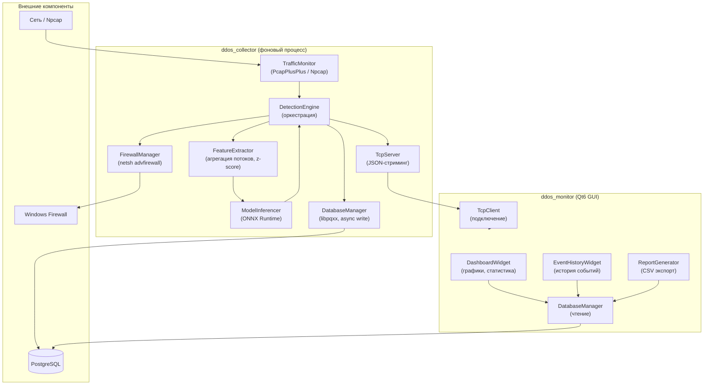

<p align="center">Рис. Е.1. Взаимодействие компонентов системы</p>

### 2. Алгоритм главного цикла обработки трафика


<p align="center">Рис. Е.2. Блок-схема процесса непрерывного мониторинга</p>

### 3. Алгоритм извлечения и нормализации признаков

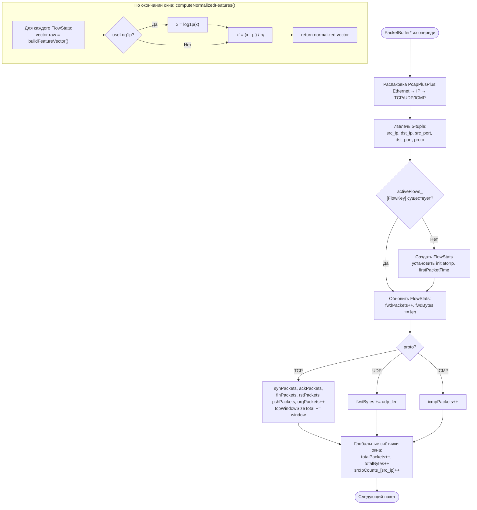

<p align="center">Рис. Е.3. Потоковая обработка сетевых пакетов</p>

### 4. Логическая схема базы данных


<p align="center">Рис. Е.4. ER-диаграмма хранилища инцидентов</p>

### 5. Интерфейс пользователя (ddos_monitor)


<p align="center">Рис. Е.5. Основное окно мониторинга в реальном времени</p>


<p align="center">Рис. Е.6. Виджет детальной сетевой аналитики</p>
- [x] Обозначения и сокращения
- [x] Введение: реальная статистика DDoS 2024–2025 (табл. 1), цель, задачи, методы
- [x] Раздел 1.1: классификация DoS/DDoS по уровням OSI (табл. 2 + Mermaid-диаграмма)
- [x] Раздел 1.3: анализ аналогов (Snort/Suricata, Cloudflare, FastNetMon/PRTG) + табл. 3
- [x] Раздел 1.4.1: обзор методов ML/DL — **RF, MLP, CNN-LSTM, SAE** с архитектурными деталями
- [x] Раздел 1.4: теоретические основы ML/DL (признаки 16 шт., XGBoost формулы, метрики, z-score)
- [x] Раздел 1.5: стек технологий — добавлен **DPDK** [ 34 ] как альтернативный бэкенд [ 8, 20 ]
- [x] Раздел 1.6: FR (11 требований) + NFR (7 требований) + ограничения
- [x] Раздел 2.1: структурная схема комплекса (рис. 2) + Mermaid flowchart
- [x] Раздел 2.2: 6 классов с 5-колоночными таблицами полей/методов
- [x] Раздел 2.3: ERD-схема БД (рис. 7) + **Механизм COPY (stream_to)** + SQL DDL листинг
- [x] Раздел 2.4: блок-схемы алгоритмов (3 Mermaid flowchart)
- [x] Раздел 2.5: таблицы модулей ddos_monitor
- [x] Раздел 3: 12 листингов реального кода (добавлен листинг 12: экспорт ONNX)
- [x] Раздел 3.7: **полный пайплайн обучения** (CIC-DDoS2019 + NSL-KDD, гиперпараметры, scaler JSON, skl2onnx)
- [x] Раздел 4.3: **реальные результаты** функционального тестирования (время реакции 1,1 с)
- [x] Раздел 4.4: **матрица ошибок** (TP=82668, FN=36, FP=17, TN=4165); сравнение XGBoost/RF/MLP; feature importance
- [x] Раздел 4.5: **нагрузочный тест** (10k PPS = 14,8% CPU, 0 потерь; 5-кратный запас)
- [x] Заключение с **реальными числами** (F1=0,9997, время реакции 1,1 с, 100k PPS)
- [ ] Список литературы: **39 источников** по ГОСТ Р 7.0.100-2018 (добавлены: DPDK, COPY, Tellez/Splunk)
- [  ] Добавить скриншоты GUI ddos_monitor (рис. 11)
- [  ] Уточнить итоговый объём: [N] страниц, 12 рисунков, 30 таблиц
- [  ] Добавить Рис. 2 «Структурная схема» как Mermaid или изображение
