# ВЫПУСКНАЯ КВАЛИФИКАЦИОННАЯ РАБОТА

## «Разработка программного комплекса обнаружения атак типа «отказ в обслуживании»»

## АННОТАЦИЯ

Объектом разработки является программный комплекс обнаружения DoS/DDoS-атак на базе C++17 и Qt6. Система включает модули захвата трафика и графического мониторинга. Для классификации 16 признаков сетевых потоков применяются модели XGBoost, Random Forest и MLP, интегрированные через ONNX Runtime с поддержкой «горячей замены». Реализована асинхронная запись в PostgreSQL и автоматическая блокировка угроз через Windows Firewall. Точность F1-score на датасете CIC-DDoS2019 составила 0,9997. Работа содержит 4 раздела, [N] страниц, 19 рисунков, 32 таблицы и 6 приложений.

**Abstract.** This thesis develops a C++17 and Qt6-based software complex for DoS/DDoS attack detection. The system features traffic analysis and GUI monitoring modules. Models (XGBoost, Random Forest, MLP) are integrated via ONNX Runtime with hot-swap support to classify 16 network flow features. The implementation includes asynchronous PostgreSQL storage and automated Windows Firewall mitigation. An F1-score of 0.9997 was achieved on the CIC-DDoS2019 dataset. The work comprises 4 sections, [N] pages, 19 figures, 32 tables, and 6 appendices.

## СОДЕРЖАНИЕ

ВВЕДЕНИЕ ................................................................................................................................ [N]
1. АНАЛИЗ ПРЕДМЕТНОЙ ОБЛАСТИ И ТЕОРЕТИЧЕСКИЕ ОСНОВЫ ................. [N]
   1.1. Основные термины и классификация DoS/DDoS-атак ........................................... [N]
   1.2. Описание предметной области и ландшафт сетевых киберугроз .......................... [N]
   1.3. Обзор существующих решений: преимущества и недостатки ............................... [N]
   1.4. Теоретические основы машинного и глубокого обучения ........................................ [N]
   1.5. Стек используемых технологий и инструментов ..................................................... [N]
   1.6. Требования к программному комплексу ................................................................... [N]
2. ПРОЕКТИРОВАНИЕ ПРОГРАММНОГО КОМПЛЕКСА .......................................... [N]
   2.1. Структурная схема комплекса ..................................................................................... [N]
   2.2. Структура программы ddos_collector .......................................................................... [N]
   2.3. Проектирование структуры базы данных .................................................................. [N]
   2.4. Разработка схемы алгоритмов ..................................................................................... [N]
   2.5. Проектирование структуры программы ddos_monitor ............................................. [N]
   2.6. Разработка пользовательского интерфейса ............................................................... [N]
3. РЕАЛИЗАЦИЯ ПРОГРАММНОГО КОМПЛЕКСА ..................................................... [N]
   3.1. Захват пакетов и инициализация PcapPlusPlus ......................................................... [N]
   3.2. Извлечение признаков и агрегация по потокам ......................................................... [N]
   3.3. ML/DL-инференс через ONNX Runtime ..................................................................... [N]
   3.4. Управление правилами межсетевого экрана ............................................................. [N]
   3.5. Оркестрация: цикл инференса DetectionEngine ....................................................... [N]
   3.6. Асинхронная запись в базу данных ............................................................................ [N]
   3.7. Обучение модели классификатора ............................................................... [N]
   3.8. Реализация графического мониторинга на базе Qt6 ............................................. [N]
   4. ТЕСТИРОВАНИЕ И ОЦЕНКА ЭФФЕКТИВНОСТИ ................................................... [N]
   4.1. Матрица трассировки требований ................................................................................ [N]
   4.2. Программа и методика испытаний ............................................................................... [N]
   4.3. Функциональное тестирование ..................................................................................... [N]
   4.4. Оценка качества классификатора ................................................................................. [N]
   4.5. Нагрузочное тестирование ............................................................................................. [N]
ЗАКЛЮЧЕНИЕ ......................................................................................................................... [N]
СПИСОК ИСПОЛЬЗОВАННОЙ ЛИТЕРАТУРЫ .............................................................. [N]
ПРИЛОЖЕНИЯ ........................................................................................................................ [N]
   ПРИЛОЖЕНИЕ А Задание на выпускную квалификационную работу ......................... [N]
   ПРИЛОЖЕНИЕ Б Листинги программного модуля ddos_collector ............................... [N]
   ПРИЛОЖЕНИЕ В Листинги программного модуля ddos_monitor ................................. [N]
   ПРИЛОЖЕНИЕ Г Схема базы данных (SQL-скрипт) ......................................................... [N]
   ПРИЛОЖЕНИЕ Д Скрипт обучения модели XGBoost/ONNX (Python) ........................ [N]
   ПРИЛОЖЕНИЕ Е Графические материалы ....................................................................... [N]

## ОПРЕДЕЛЕНИЯ

1) **DoS-атака** (Denial of Service) — атака, целью которой является нарушение нормального функционирования сетевого сервиса путём исчерпания его ресурсов [7].
2) **DDoS-атака** (Distributed Denial of Service) — распределённая DoS-атака, осуществляемая одновременно с множества источников, как правило объединённых в ботнет [7].
3) **Пакет** — единица данных сетевого протокола, содержащая заголовок (служебную информацию) и полезную нагрузку [1].
4) **Поток (flow)** — совокупность пакетов, имеющих одинаковые значения 5-tuple: (src\_ip, dst\_ip, src\_port, dst\_port, protocol — IP-адрес источника, IP-адрес назначения, порт источника, порт назначения, протокол) [1].
5) **Признак трафика (feature)** — числовая характеристика пакета или потока, используемая моделью машинного или глубокого обучения для классификации [18].
6) **Классификатор** — алгоритм машинного и глубокого обучения, относящий объект к одному из заданных классов («атака» или «норма») [18].
7) **Межсетевой экран (firewall)** — программное или аппаратное средство фильтрации сетевого трафика по заданным правилам [7].
8) **Правило блокировки** — набор условий (IP-адрес, порт, протокол), при выполнении которых трафик отбрасывается [7].
9) **SRS (Software Requirements Specification)** — спецификация требований к программному обеспечению; документ, фиксирующий функциональные и нефункциональные требования к системе (стандарт IEEE 830) [19].
10) **Функциональное требование (FR)** — требование, описывающее конкретное действие или поведение системы [19].
11) **Нефункциональное требование (NFR)** — требование, описывающее характеристику работы системы: производительность, надёжность, безопасность, совместимость [19].
12) **Критерий приёмки (acceptance criterion)** — измеримое условие, при выполнении которого требование считается реализованным корректно [6].
13) **ONNX Runtime** — кроссплатформенная среда выполнения моделей машинного и глубокого обучения в формате ONNX (Open Neural Network Exchange) [25].
14) **Окно агрегации (inference window)** — временной интервал (1 секунда в данном комплексе), за который собираются пакеты и вычисляются признаки перед вызовом классификатора [34].
15) **РСУБД** (RDBMS) — реляционная система управления базами данных; программное обеспечение для управления данными в виде связанных таблиц [36].
16) **libpqxx** — официальный клиентский API для языка C++, предоставляющий доступ к возможностям СУБД PostgreSQL [38].
17) **Точность** (Precision) — доля истинно положительных срабатываний классификатора относительно всех объектов, отнесённых к положительному классу [18].
18) **Полнота** (Recall) — доля истинно положительных срабатываний классификатора относительно всех объектов, фактически принадлежащих к положительному классу [18].
19) **F1-мера** (F1-score) — гармоническое среднее точности и полноты, используемое для комплексной оценки качества классификации [18].
20) **ROC AUC** (Area Under the Receiver Operating Characteristic Curve) — площадь под кривой рабочих характеристик приёмника, количественный показатель качества классификатора [18].
21) **Многослойный перцептрон** (MLP) — архитектура нейронной сети прямого распространения, состоящая из входного, скрытых и выходного слоёв [28].
22) **XGBoost** (Extreme Gradient Boosting) — масштабируемая реализация алгоритма градиентного бустинга над решающими деревьями [12].
23) **Случайный лес** (Random Forest) — ансамблевый метод машинного обучения, основанный на построении множества независимых решающих деревьев [21].
24) **IoT** (Internet of Things) — сеть физических объектов («вещей»), оснащенных встроенными технологиями для взаимодействия друг с другом и с внешней средой [14].
25) **Смешанный режим** (promiscuous mode) — режим работы сетевого адаптера, позволяющий перехватывать все пакеты в сегменте сети, независимо от адреса назначения [1].
26) **Z-score нормализация** (стандартизация) — метод преобразования данных, при котором признаки центрируются относительно среднего значения и масштабируются по стандартному отклонению [18].
27) **Инференс** (inference) — этап эксплуатации модели машинного обучения, на котором она выполняет предсказания для входных данных [25].
28) **Матрица ошибок** (confusion matrix) — инструмент оценки качества классификации, представляющий собой таблицу распределения предсказаний модели по классам [18].
29) **Lock-free очередь** — потокобезопасная структура данных, реализующая алгоритм без блокировок, что исключает взаимные блокировки потоков и повышает производительность [24].
30) **C&C-сервер** (Command and Control) — центральный сервер, используемый злоумышленником для удалённого управления ботнетом и координации распределённых атак [14].
31) **1-SVM** (One-Class Support Vector Machine) — алгоритм обучения без учителя, используемый для обнаружения аномалий путём построения границы вокруг области нормальных данных [23].
32) **DPDK** (Data Plane Development Kit) — набор библиотек и драйверов для быстрой обработки сетевых пакетов путём обхода стека протоколов ядра операционной системы [1].
33) **OISF** (Open Information Security Foundation) — некоммерческая организация, занимающаяся разработкой и поддержкой открытых технологий обеспечения информационной безопасности, включая IDS Suricata [33].
34) **SIEM** (Security Information and Event Management) — класс программных продуктов, предназначенных для сбора, анализа и управления событиями безопасности в реальном времени [7].
35) **SAE** (Stacked Auto-Encoder) — архитектура глубокого обучения, состоящая из нескольких слоёв автоэнкодеров, обучаемая для извлечения иерархических признаков и подавления шума в данных [23].
36) **BPF** (Berkeley Packet Filter) — механизм в ядре операционной системы, позволяющий эффективно фильтровать и перехватывать пакеты на канальном уровне без лишнего копирования данных [1].
37) **ACID** (Atomicity, Consistency, Isolation, Durability) — набор свойств транзакций в СУБД, гарантирующих надёжность выполнения операций с данными даже в условиях аппаратных сбоев [36].
38) **Машинное обучение** (Machine Learning) — подобласть искусственного интеллекта, изучающая методы построения алгоритмов, способных обучаться на данных и делать предсказания [18].
39) **Глубокое обучение** (Deep Learning) — совокупность методов машинного обучения, основанных на использовании многослойных нейронных сетей для автоматического извлечения признаков из данных [28].
40) **Система обнаружения вторжений** (IDS) — программное или аппаратное средство, предназначенное для выявления фактов несанкционированного доступа в компьютерную систему или сеть [7].
41) **Система предотвращения вторжений** (IPS) — расширение IDS, способное не только обнаруживать, но и автоматически блокировать подозрительную активность в реальном времени [7].
42) **LSTM** (Long Short-Term Memory) — тип рекуррентной нейронной сети, способный обучаться долгосрочным зависимостям и эффективно обрабатывать временны́е последовательности [28].
43) **CNN** (Convolutional Neural Network) — архитектура нейронных сетей, использующая операцию свёртки для выявления локальных паттернов и иерархических структур в данных [28].
44) **SVM** (Support Vector Machine) — метод обучения с учителем, который находит оптимальную разделяющую гиперплоскость между классами в многомерном пространстве признаков [18].
45) **MPMC-очередь** (Multi-Producer Multi-Consumer) — структура данных, позволяющая нескольким потокам одновременно добавлять и извлекать элементы без нарушения целостности данных [24].
46) **Конструирование признаков** (Feature Engineering) — процесс преобразования сырых данных в информативные признаки, которые позволяют повысить точность моделей машинного обучения [18].

## ОБОЗНАЧЕНИЯ И СОКРАЩЕНИЯ

БД — База данных
ГОСТ — Государственный стандарт
ОЗУ — Оперативное запоминающее устройство
ОС — Операционная система
СУБД — Система управления базами данных
ЦП — Центральный процессор
1-SVM — One-Class Support Vector Machine (одноклассовый метод опорных векторов)
ACID — Atomicity, Consistency, Isolation, Durability (свойства транзакций в СУБД)
ACK — Acknowledgment (флаг подтверждения в TCP)
API — Application Programming Interface (программный интерфейс приложения)
AUC — Area Under the Curve (площадь под кривой)
BPF — Berkeley Packet Filter (механизм фильтрации пакетов в ядре ОС)
BPPS — Billion packets per second (миллиардов пакетов в секунду)
C&C — Command and Control (командный сервер ботнета)
CLI — Command Line Interface (интерфейс командной строки)
CNN — Convolutional Neural Network (свёрточная нейронная сеть)
COM — Component Object Model (технология компонентных объектов Microsoft)
CPU — Central Processing Unit (центральный процессор)
CSV — Comma-Separated Values (формат текстовых данных с разделителями)
DDL — Data Definition Language (язык описания данных)
DDOS — Distributed Denial of Service (распределённый отказ в обслуживании)
DL — Deep Learning (глубокое обучение)
DNS — Domain Name System (система доменных имён)
DOS — Denial of Service (отказ в обслуживании)
DPDK — Data Plane Development Kit (набор библиотек и драйверов для быстрой обработки пакетов)
ERD — Entity-Relationship Diagram (диаграмма «сущность-связь»)
F1 — F1-мера (F1-score)
FIN — Finish (флаг завершения соединения в TCP)
FN — False Negative (ложноотрицательное срабатывание)
FP — False Positive (ложноположительное срабатывание)
FR — Functional Requirement (функциональное требование)
GBPS — Gigabits per second (гигабит в секунду)
GUI — Graphical User Interface (графический пользовательский интерфейс)
HTTP — HyperText Transfer Protocol (протокол передачи гипертекста)
ICMP — Internet Control Message Protocol (протокол управляющих сообщений интернета)
IDS — Intrusion Detection System (система обнаружения вторжений)
IEEE 830 — Стандарт IEEE на спецификацию требований к ПО
IEEE — Institute of Electrical and Electronics Engineers (Институт инженеров электротехники и электроники)
IOT — Internet of Things (интернет вещей)
IP — Internet Protocol (межсетевой протокол)
IPS — Intrusion Prevention System (система предотвращения вторжений)
JSON — JavaScript Object Notation (формат обмена данными)
L3 — Network Layer (сетевой уровень модели OSI)
L4 — Transport Layer (транспортный уровень модели OSI)
L7 — Application Layer (прикладной уровень модели OSI)
LAN — Local Area Network (локальная вычислительная сеть)
LSTM — Long Short-Term Memory (нейронная сеть долгой краткосрочной памяти)
MBPS — Megabits per second (мегабит в секунду)
ML — Machine Learning (машинное обучение)
MLP — Multi-Layer Perceptron (многослойный перцептрон)
MPMC — Multi-Producer Multi-Consumer (тип очереди)
MSVC — Microsoft Visual C++ (компилятор Microsoft)
NFR — Non-Functional Requirement (нефункциональное требование)
NTP — Network Time Protocol (протокол сетевого времени)
OISF — Open Information Security Foundation (фонд открытой информационной безопасности)
ONNX — Open Neural Network Exchange (открытый формат обмена нейронными сетями)
ORT — ONNX Runtime (среда выполнения ONNX)
OS — Operating System (операционная система)
OSI — Open Systems Interconnection (эталонная модель взаимодействия открытых систем)
PCAP — Packet Capture (формат файла захвата пакетов)
PDF — Portable Document Format (переносимый формат документов)
POSTGRESQL — Объектно-реляционная система управления базами данных
PPS — Packets Per Second (пакетов в секунду)
PSH — Push (флаг немедленной передачи данных в TCP)
Q1–Q4 — Quarters 1–4 (I–IV кварталы года)
QSS — Qt Style Sheets (таблицы стилей Qt)
RAM — Random Access Memory (оперативное запоминающее устройство)
RDBMS — Relational Database Management System (реляционная СУБД)
RELU — Rectified Linear Unit (линейный выпрямитель, функция активации)
RF — Random Forest (случайный лес)
ROC — Receiver Operating Characteristic (рабочая характеристика приёмника)
RST — Reset (флаг разрыва соединения в TCP)
SAE — Stacked Auto-Encoder (стековый автоэнкодер)
SIEM — Security Information and Event Management (управление информационной безопасностью и событиями безопасности)
SLO — Service Level Objective (целевой уровень качества обслуживания)
SQL — Structured Query Language (язык структурированных запросов)
SRS — Software Requirements Specification (спецификация требований к ПО)
SSDP — Simple Service Discovery Protocol (простой протокол обнаружения сервисов)
SVM — Support Vector Machine (метод опорных векторов)
SYN — Synchronize (флаг установки соединения в TCP)
TBPS — Terabits per second (терабит в секунду)
TCP — Transmission Control Protocol (протокол управления передачей)
TN — True Negative (истинно отрицательное срабатывание)
TP — True Positive (истинно положительное срабатывание)
UDP — User Datagram Protocol (протокол пользовательских датаграмм)
UML — Unified Modeling Language (унифицированный язык моделирования)
URG — Urgent (флаг срочности в TCP)
XGBOOST — Extreme Gradient Boosting (экстремальный градиентный бустинг)
YoY — Year over Year (год к году, годовая динамика)

## ВВЕДЕНИЕ

**Актуальность.** В условиях глобальной цифровизации и стремительного расширения сетевой связности кибератаки типа «отказ в обслуживании» (DoS/DDoS) являются одной из наиболее распространённых и опасных угроз информационной безопасности. Ландшафт киберугроз в период 2024–2025 гг. демонстрирует беспрецедентный рост как мощности, так и интенсивности атак. Согласно аналитическим данным Cloudflare, в третьем квартале 2025 года число атак возросло на 40%, а в четвёртом квартале был зафиксирован рекордный пик мощности атаки в 31,4 Тбит/с при интенсивности 9,0 млрд пакетов в секунду [14, 15]. Особую роль в формировании векторов атак играет интернет вещей (IoT): ботнеты нового поколения, такие как Aisuru-Kimwolf, состоящие из инфицированных потребительских устройств, способны генерировать более 200 млн запросов в секунду [14]. Статистические данные, отражающие рост масштабов угроз, представлены в табл. 0.1.

<p align="right">Таблица 0.1</p>
<p align="center"><b>Динамика характеристик DDoS-атак (2024–2025 гг.)</b></p>

| Период | Пиковая мощность (Тбит/с) | Пиковая интенсивность (Bpps) | Прирост (YoY) |
|---|---|---|---|
| 2024 год (пик) | 5,6 | 3,8 | — |
| 2025 год Q1 | 6,5 | 4,8 | +358% |
| 2025 год Q2 | 7,3 | 4,8 | +44% |
| 2025 год Q3 | 29,7 | 14,1 | +40% |
| 2025 год Q4 | 31,4 | 9,0 | +58% |

Примечание — Составлено на основе данных [13, 14, 15].

Традиционные средства защиты — сигнатурные системы обнаружения вторжений (Snort, Suricata) и инструменты фильтрации по журналам (Fail2Ban) — не успевают адаптироваться к новым видам атак, поскольку требуют постоянного обновления сигнатур вручную и испытывают деградацию производительности при разрастании баз правил [22, 35]. Эксплуатация уязвимостей устройств IoT приводит к появлению трафика прикладного уровня, практически неотличимого от легитимного, что делает необходимым применение интеллектуальных методов обнаружения на основе алгоритмов машинного и глубокого обучения [21, 28].

Задание на выполнение выпускной квалификационной работы приведено в приложении А.

**Цель работы:** проектирование и разработка программного комплекса, обеспечивающего автоматизированное обнаружение DoS/DDoS-атак в сетевом трафике в режиме реального времени и оперативную блокировку источников вредоносного трафика средствами межсетевого экрана.

**Задачи:**

1) Выполнить комплексный анализ современных угроз типа DoS/DDoS и провести сравнительный обзор существующих программных решений для их обнаружения.
2) Определить и обосновать набор информативных признаков сетевого трафика, позволяющих эффективно разделять легитимный и вредоносный трафик.
3) Спроектировать архитектуру программного комплекса, обеспечивающую масштабируемость и разделение функций сбора данных и мониторинга.
4) Разработать алгоритм захвата и нормализации признаков сетевого трафика на основе окна агрегации.
5) Реализовать и настроить классификатор трафика (XGBoost, RF, MLP) на основе ONNX Runtime с поддержкой горячей замены модели.
6) Реализовать подсистему управления правилами межсетевого экрана Windows (netsh advfirewall) для автоматического реагирования.
7) Создать графический интерфейс пользователя на базе Qt6 для визуализации состояния сетевой инфраструктуры и управления инцидентами.
8) Провести экспериментальные исследования комплекса на реальных наборах данных и оценить показатели эффективности.

**Структура работы.** Работа состоит из аннотации, введения, четырёх разделов, заключения, списка использованной литературы и приложений.
- В **первом разделе** проводится анализ предметной области, классификация атак, обзор существующих средств защиты и обосновывается выбор технологического стека.
- **Второй раздел** посвящён архитектурному проектированию комплекса, описанию структур программ, проектированию базы данных и детальной разработке алгоритмов.
- В **третьем разделе** рассматриваются вопросы практической реализации на языке C++ и процесс обучения ML/DL-модели.
- В **четвёртом разделе** приводятся результаты тестирования, оценка точности классификации и анализ производительности системы.

## 1. АНАЛИЗ ПРЕДМЕТНОЙ ОБЛАСТИ И ТЕОРЕТИЧЕСКИЕ ОСНОВЫ

### 1.1. Основные термины и классификация DoS/DDoS-атак

DoS-атаки (Denial of Service — отказ в обслуживании) представляют собой класс кибератак, целью которых является нарушение доступности сетевого сервиса для легитимных пользователей путём преднамеренного исчерпания двух видов ресурсов: пропускной способности каналов и вычислительных мощностей [21]. В отличие от DoS, атаки типа DDoS (Distributed Denial of Service) осуществляются одновременно с большого числа источников — как правило, с заражённых машин, входящих в состав ботнета [9].

Классификация DoS/DDoS-атак по уровням модели OSI приведена в табл. 1.1 [7].

<p align="right">Таблица 1.1</p>
<p align="center"><b>Классификация DoS/DDoS-атак по уровням OSI</b></p>

| Уровень OSI | Название | Пример атаки | Метод воздействия |
|---|---|---|---|
| Сетевой (L3) | Volumetric | ICMP Flood, Smurf | Исчерпание пропускной способности каналов. Амплификация (DNS, NTP, SSDP) даёт коэффициент усиления до 4096 раз [11] |
| Транспортный (L4) | Protocol | SYN Flood, UDP Flood | Исчерпание таблиц состояний соединений (state tables) сетевого оборудования [4] |
| Прикладной (L7) | Application | HTTP Flood, Slowloris | Имитация легитимных запросов; перегрузка прикладного ПО без генерации большого объёма трафика [17] |

Примечание — Составлено на основе данных [11, 17, 7]. Визуальное представление уровней модели OSI и соответствующих им типов атак показано на рис. 1.1.

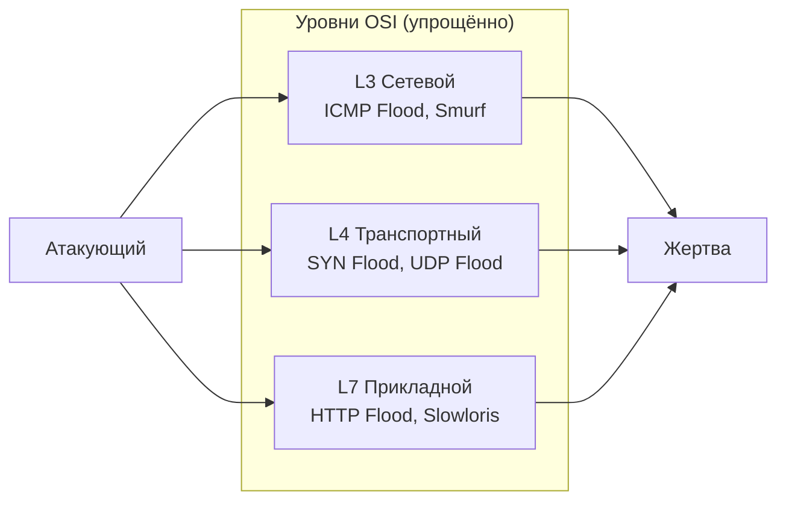
```mermaid
graph LR
    subgraph OSI["Уровни OSI (упрощённо)"]
        L7["L7 Прикладной\nHTTP Flood, Slowloris"]
        L4["L4 Транспортный\nSYN Flood, UDP Flood"]
        L3["L3 Сетевой\nICMP Flood, Smurf"]
    end
    Attacker["Атакующий"] --> L3
    Attacker --> L4
    Attacker --> L7
    L3 --> Target["Жертва"]
    L4 --> Target
    L7 --> Target
```

<p align="center">Рис. 1.1. Схема уровней OSI с указанием типов атак</p>

### 1.2. Описание предметной области и ландшафт сетевых киберугроз

**Анатомия SYN Flood.** Протокол TCP предусматривает трёхстороннее рукопожатие для установки соединения: клиент отправляет SYN, сервер отвечает SYN-ACK, клиент завершает подтверждением ACK. При SYN Flood атакующий посылает огромное количество SYN-пакетов с подделанными (spoofed) IP-адресами источника. Сервер выделяет ресурсы (запись в таблице соединений) и отправляет SYN-ACK, но никогда не получает ACK. Таблица half-open соединений переполняется, и легитимные запросы отвергаются [21].

**Анатомия UDP Flood.** UDP — протокол без установки соединения (stateless). Атакующий генерирует огромное количество UDP-пакетов на случайные порты жертвы. Возможно усиление (amplification) через серверы DNS, NTP, SSDP: короткий запрос с подделанным IP генерирует ответ, многократно превосходящий его по объёму [11].

**Анатомия ICMP Flood.** Атакующий генерирует непрерывный поток ICMP Echo Request (ping) пакетов. Атака Smurf использует широковещательную рассылку ICMP Echo Request на адрес сети с подделанным адресом источника (жертвы): все хосты сети отвечают одновременно, создавая эффект усиления, пропорциональный числу хостов [7].

**Атаки прикладного уровня.** HTTP GET/POST Flood имитирует легитимные запросы к веб-серверу, из-за чего сигнатурные системы с трудом их отличают. Особую сложность представляет атака **Slowloris**: злоумышленник искусственно затягивает время TCP-сессий путём крайне медленной отправки фрагментированных HTTP-запросов, исчерпывая пул доступных соединений веб-сервера без генерации больших объёмов трафика. Стандартные методы ограничения скорости часто не способны отличить подобную активность от работы легитимных клиентов с медленным соединением [17].

**Ботнеты как инфраструктура DDoS.** Распределённые атаки осуществляются через ботнеты — сети из тысяч заражённых устройств (ботов), управляемых через командный сервер C&C. Распространение уязвимых IoT-устройств (умные телевизоры, маршрутизаторы) привело к появлению ботнетов нового поколения, таких как Mirai [10] и Aisuru-Kimwolf [14], способных генерировать гиперволюметрические атаки. Это делает фильтрацию по IP-адресу источника крайне неэффективной.

**

**Вывод по разделу:** описаны основные виды атак и их механизмы, что является необходимым для последующего определения набора признаков классификации. Наиболее поддающимися обнаружению по признакам пакетного потока являются атаки L3–L4: SYN Flood, UDP Flood, ICMP Flood — именно они являются основной целью разрабатываемого комплекса.

### 1.3. Обзор существующих решений: преимущества и недостатки

Проведён комплексный сравнительный анализ разрабатываемого программного комплекса с тремя классами существующих решений.

#### 1.3.1. Традиционные сигнатурные системы (Snort, Suricata, Zeek)

**Snort** — система обнаружения вторжений с открытым исходным кодом, разработанная Мартином Рошем в 1998 году и ныне поддерживаемая компанией Cisco. Работает по принципу сигнатурного анализа: каждый пакет сверяется с набором правил на языке Snort Rule Language. Достоинством является зрелость и обширная база правил. Недостатком — полная зависимость от актуальности сигнатур: новые виды атак («нулевого дня») остаются незамеченными [33, 35].

**Suricata** — многопоточная IDS/IPS с открытым исходным кодом (OISF). Поддерживает многопоточную обработку пакетов, анализ протоколов прикладного уровня и режим IPS (через nfqueue). Содержит зачатки поведенческого анализа (threshold, flow keywords). Однако по-прежнему основывается на сигнатурах [33, 35].

Ключевое отличие разрабатываемого решения от Snort/Suricata: переход от жёсткого сопоставления байтовых шаблонов к интеллектуальному выявлению аномалий на базе ML/DL, что обеспечивает устойчивость к атакам «нулевого дня» [21, 23]. Также исключается деградация производительности, неизбежная в сигнатурных системах при разрастании баз правил [22].

#### 1.3.2. Коммерческие облачные сервисы (Cloudflare, Arbor Networks)

Коммерческие средства защиты от DDoS используют глобальные распределённые центры очистки трафика (Scrubbing Centers) [13, 15]. Их преимущество — способность абсорбировать гиперволюметрические атаки мощностью сотни гигабит и терабит в секунду. Недостаток разрабатываемого решения в этом сравнении: локальный комплекс физически не способен противостоять таким атакам, превышающим пропускную способность каналообразующего оборудования провайдера.

Преимущество разрабатываемого решения: полный контроль над конфиденциальностью данных, независимость от сторонних провайдеров (отсутствие Vendor Lock-in), что критически важно для защиты объектов критической информационной инфраструктуры (КИИ). Прозрачность алгоритмов принятия решений («белый ящик» против «чёрного ящика» облачных сервисов).

#### 1.3.3. Локальные программные аналоги (FastNetMon, PRTG Network Monitor)

**FastNetMon** — локальная система обнаружения DDoS-атак на основе анализа NetFlow/sFlow. Лишена нативной ML/DL-классификации; требует развёртывания сторонних стеков визуализации (Grafana, InfluxDB) [16]. **PRTG Network Monitor** — система мониторинга сети, не ориентированная на обнаружение атак в реальном времени [27].

Ключевое отличие разрабатываемого комплекса: нативная интеграция ONNX Runtime непосредственно в конвейер C++ обработки пакетов [25, 26] и встроенный Qt6-монитор «из коробки» без необходимости развёртывания сторонних стеков [22]. Сводные результаты сравнительного анализа существующих решений представлены в табл. 1.2.

<p align="right">Таблица 1.2</p>
<p align="center"><b>Сравнительный анализ существующих решений</b></p>

| Критерий | Snort / Suricata | Cloudflare | FastNetMon | Разрабатываемый комплекс |
|---|---|---|---|---|
| Метод обнаружения | Сигнатурный | Поведенческий + ML/DL | NetFlow-анализ | ML/DL (ONNX Runtime) |
| Реальное время | Да | Да | Да | Да |
| ML/DL-классификация | Нет | Да (закрытая) | Нет | Да (открытая ONNX) |
| Язык разработки | C | Проприетарный | C++ | C++17 |
| Автоблокировка | Только IPS mode | Да (Anycast) | Частично | Да (netsh) |
| Зависимость от сигнатур | Высокая | Низкая | Нет | Нет |
| Графический интерфейс | Нет | Веб-консоль | Через Grafana | Да (Qt6, встроенный) |
| Горячая замена модели | Нет | Н/А | Нет | Да |
| Контроль конфиденциальности | Полный | Ограниченный | Полный | Полный |

Примечание — Составлено на основе данных [ 16, 22, 27, 7 ].

Вывод: разрабатываемое программное обеспечение занимает сбалансированную нишу, объединяя вычислительную мощность **многопоточного ядра на языке C++** с применением lock-free очередей, предиктивную адаптивность машинного и глубокого обучения и полный автономный контроль над защищаемым периметром сети.

### 1.4. Теоретические основы машинного и глубокого обучения для обнаружения атак

#### 1.4.1. Обзор методов машинного и глубокого обучения для классификации трафика

Выбор конкретного ML/DL-алгоритма определяет баланс между точностью детекции и задержкой инференса [21]. В программном комплексе реализована поддержка трёх архитектур классификаторов, обеспечивающая возможность сравнительного анализа.

**1.4.1.1. Алгоритм «Случайный лес» (Random Forest)**

Random Forest (RF) представляет собой ансамбль решающих деревьев, обучаемых независимо на различных подвыборках данных (bagging) и случайных подмножествах признаков. Финальное решение принимается путём голосования. Логарифмическая сложность инференса позволяет обрабатывать пакеты на скоростях, близких к линейным, что обеспечивает первичную фильтрацию объёмных атак [21]. Преимущества RF в задаче обнаружения DoS-атак: устойчивость к переобучению, способность обрабатывать нелинейные зависимости в признаках трафика и внутренняя оценка значимости признаков (feature importance).

**1.4.1.2. Многослойный перцептрон (MLP)**

Многослойный перцептрон — классическая архитектура нейронной сети прямого распространения. В данной работе применяется архитектура с двумя скрытыми слоями (64 и 32 нейрона), функцией активации ReLU и оптимизатором Adam с механизмом `early_stopping` для предотвращения переобучения [28]. MLP способен выявлять нелинейные зависимости в пространстве признаков, недоступные деревьям решений.

**1.4.1.3. Архитектуры глубокого обучения (CNN-LSTM)**

Для выявления сложных паттернов ботнетов типа Mirai [10] применяются нейронные сети специальной архитектуры: CNN-слои выполняют компрессию и извлечение пространственных признаков (размеры пакетов, флаги) с минимальной задержкой, LSTM-блоки обрабатывают эти признаки для выявления временных аномалий. Синергия **CNN-LSTM** позволяет достичь высокой точности детектирования атак, растянутых во времени, таких как Slowloris [17, 28].

**1.4.1.4. Автоэнкодеры (SAE) и атаки «нулевого дня»**

В условиях дефицита размеченных данных применяются методы обучения без учителя. Стековые автоэнкодеры (SAE) обучаются восстанавливать профиль нормального поведения сети. Данные, не соответствующие этому профилю (атаки Zero-day), генерируют высокую ошибку реконструкции. Гибрид SAE-1SVM обеспечивает точность свыше 99% при обнаружении атак «нулевого дня» [23].

**Обоснование выбора.** В разрабатываемом комплексе основной классификатор — алгоритм градиентного бустинга (XGBoost), экспортированный в формат ONNX, как обеспечивающий наилучший баланс: задержка инференса <1 мс, F1-score = 0,9997 на датасете CIC-DDoS2019 [34]. RF и MLP доступны для сравнения и горячей замены без перекомпиляции.

#### 1.4.2. Признаки сетевого трафика

В разрабатываемом комплексе признаки вычисляются не на уровне отдельного пакета, а на уровне потока (flow) за окно агрегации длиной 1 секунда. Это позволяет учесть временну́ю динамику трафика, что существенно для обнаружения флуд-атак. Перечень информативных признаков, извлекаемых из сетевого потока, приведен в табл. 1.3.

<p align="right">Таблица 1.3</p>
<p align="center"><b>Признаки сетевого трафика, используемые классификатором</b></p>

| № | Признак | Описание | Размерность | Реализация в коде |
|---|---|---|---|---|
| 1 | `flow_duration` | Длительность потока | мкс | `lastPacketTime - firstPacketTime` |
| 2 | `total_fwd_packets` | Количество пакетов в прямом направлении | пакетов | `FlowStats::fwdPackets` |
| 3 | `total_bwd_packets` | Количество пакетов в обратном направлении | пакетов | `FlowStats::bwdPackets` |
| 4 | `total_len_fwd` | Объём данных в прямом направлении | байт | `FlowStats::fwdBytes` |
| 5 | `total_len_bwd` | Объём данных в обратном направлении | байт | `FlowStats::bwdBytes` |
| 6 | `fwd_mean` | Средний размер пакета (прямое напр.) | байт | `fwdBytes / fwdPackets` |
| 7 | `bwd_mean` | Средний размер пакета (обратное напр.) | байт | `bwdBytes / bwdPackets` |
| 8 | `flow_pps` | Интенсивность потока | пак/с | `(fwd+bwd) / duration` |
| 9 | `syn_packets` | Количество TCP-пакетов с флагом SYN | пакетов | `FlowStats::synPackets` |
| 10 | `ack_packets` | Количество TCP-пакетов с флагом ACK | пакетов | `FlowStats::ackPackets` |
| 11 | `fin_packets` | Количество TCP-пакетов с флагом FIN | пакетов | `FlowStats::finPackets` |
| 12 | `rst_packets` | Количество TCP-пакетов с флагом RST | пакетов | `FlowStats::rstPackets` |
| 13 | `psh_packets` | Количество TCP-пакетов с флагом PSH | пакетов | `FlowStats::pshPackets` |
| 14 | `urg_packets` | Количество TCP-пакетов с флагом URG | пакетов | `FlowStats::urgPackets` |
| 15 | `entropy` | Энтропия Шеннона полезной нагрузки | бит | `FlowStats::byteCounts` |
| 16 | `avg_window_size` | Средний размер TCP-окна | байт | `FlowStats::tcpWindowSizeTotal` |

Примечание — Значение длительности потока (`flow_duration`) в системе представляется в микросекундах (мкс) для обеспечения высокой точности при работе с высокоскоростными соединениями. Набор активных признаков и параметры нормализации задаются файлом конфигурации масштабировщика (JSON), загружаемым при инициализации. Это позволяет использовать один и тот же бинарный файл с разными моделями без перекомпиляции.

#### 1.4.3. Основной алгоритм классификации: экстремальный градиентный бустинг (XGBoost)

В качестве базового классификатора в разрабатываемом программном комплексе выбран алгоритм экстремального градиентного бустинга (XGBoost), обеспечивающий наилучшие показатели точности и скорости инференса при работе с табличными данными сетевых потоков. XGBoost реализует аддитивную стратегию обучения, при которой каждое последующее дерево исправляет ошибки предыдущих, минимизируя регуляризованную целевую функцию:

$$ L(\phi) = \sum_i l(\hat{y}_i, y_i) + \sum_k \Omega(f_k) \eqno(1.1) $$

где $L(\phi)$ — общая целевая функция;
$l(\hat{y}_i, y_i)$ — функция потерь, оценивающая разность между предсказанием $\hat{y}_i$ и истинной меткой $y_i$;
$\Omega(f_k) = \gamma T + \frac{1}{2}\lambda\|w\|^2$ — регуляризационный член, предотвращающий переобучение путём штрафования сложности деревьев (количества листьев $T$ и весов $w$).

Особенностью XGBoost, критически важной для обнаружения DDoS-атак в реальном времени, является использование разложения Тейлора второго порядка для аппроксимации функции потерь:

$$ L^{(t)} \approx \sum_{i=1}^n [l(y_i, \hat{y}_i^{(t-1)}) + g_i f_t(x_i) + \frac{1}{2} h_i f_t^2(x_i)] + \Omega(f_t) \eqno(1.2) $$

где $g_i = \partial_{\hat{y}^{(t-1)}} l(y_i, \hat{y}_i^{(t-1)})$ — градиент (первая производная) функции потерь;
$h_i = \partial^2_{\hat{y}^{(t-1)}} l(y_i, \hat{y}_i^{(t-1)})$ — гессиан (вторая производная) функции потерь.

Аналитическое решение для нахождения оптимального веса в листе $j$ дерева имеет вид:

$$ w_j^* = -\frac{\sum_{i \in I_j} g_i}{\sum_{i \in I_j} h_i + \lambda} \eqno(1.3) $$

Такой подход позволяет алгоритму эффективно обрабатывать разреженные данные сетевого трафика и обеспечивать высокую скорость принятия решений (инференс < 1 мс), что является ключевым преимуществом при отражении интенсивных атак. Визуализация процесса последовательного уточнения предсказаний через построение ансамбля деревьев представлена на рис. 1.2.

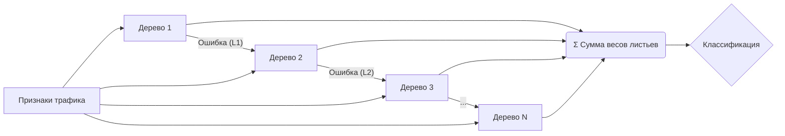
```mermaid
graph LR
    D1[Дерево 1] -- "Ошибка (L1)" --> D2[Дерево 2]
    D2 -- "Ошибка (L2)" --> D3[Дерево 3]
    D3 -- "..." --> Dn[Дерево N]
    Input[Признаки трафика] --> D1
    Input --> D2
    Input --> D3
    Input --> Dn
    D1 & D2 & D3 & Dn --> Sum(Σ Сумма весов листьев)
    Sum --> Result{Классификация}
```
<p align="center">Рис. 1.2. Схема аддитивного обучения XGBoost</p>

#### 1.4.4. Ансамблевый метод классификации на основе случайного леса (Random Forest)

Алгоритм «Случайный лес» используется в системе как альтернативный классификатор, обладающий высокой устойчивостью к выбросам в признаках трафика. Метод основан на построении ансамбля из $N$ независимых решающих деревьев с использованием стратегий Bagging (Bootstrap aggregating) и Random Subspace Method. Итоговое предсказание $\hat{y}$ определяется путём мажоритарного голосования всех деревьев:

$$ \hat{y} = \text{argmax}_{c \in C} \sum_{n=1}^N I(f_n(x) = c) \eqno(1.4) $$

где $f_n(x)$ — предсказание $n$-го дерева;
$I(\cdot)$ — индикаторная функция;
$C$ — множество классов {0 — норма, 1 — атака}.

Для разделения узлов в каждом дереве используется критерий информативности — индекс Джини (Gini Impurity), минимизирующий вероятность ошибочной классификации:

$$ Gini(p) = \sum_{k=1}^K p_k(1-p_k) = 1 - \sum_{k=1}^K p_k^2 \eqno(1.5) $$

где $p_k$ — доля объектов класса $k$ в рассматриваемом узле. Структурная схема организации ансамбля деревьев и механизма принятия коллективного решения методом голосования приведена на рис. 1.3.

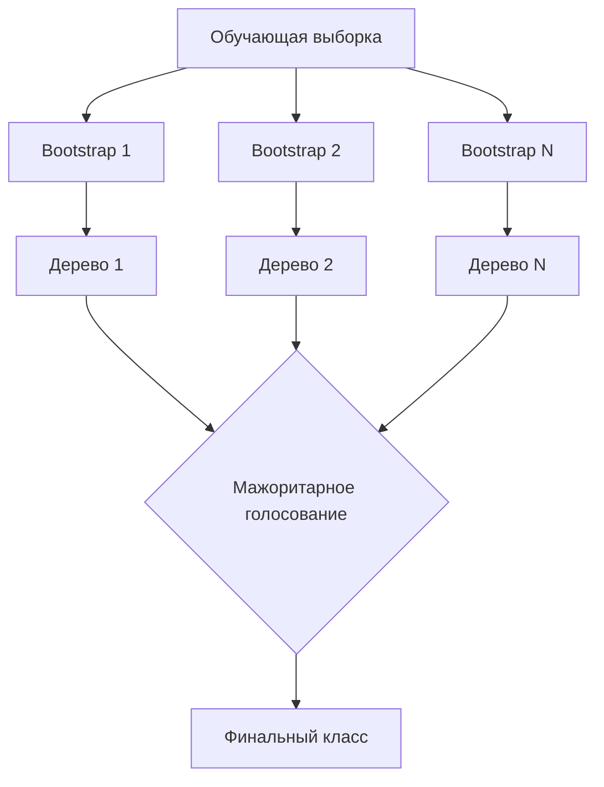
```mermaid
graph TD
    Data[Обучающая выборка] --> B1[Bootstrap 1]
    Data --> B2[Bootstrap 2]
    Data --> Bn[Bootstrap N]
    B1 --> T1[Дерево 1]
    B2 --> T2[Дерево 2]
    Bn --> Tn[Дерево N]
    T1 & T2 & Tn --> Vote{Мажоритарное голосование}
    Vote --> Out[Финальный класс]
```
<p align="center">Рис. 1.3. Архитектура ансамбля Random Forest</p>

#### 1.4.5. Архитектура классификатора на базе многослойного перцептрона (MLP)

Для выявления сложных нелинейных зависимостей между признаками, такими как энтропия полезной нагрузки и динамика TCP-окон, реализована нейросетевая модель MLP. Архитектура сети представляет собой полносвязный граф, состоящий из входного слоя, двух скрытых слоёв и выходного слоя с сигмоидальной функцией активации.

Значение активации нейрона $j$ в слое $l$ вычисляется как:

$$ a_j^{(l)} = \sigma \left( \sum_k w_{jk}^{(l)} a_k^{(l-1)} + b_j^{(l)} \right) \eqno(1.6) $$

где $w$ — веса связей, $b$ — смещение (bias), $\sigma$ — функция активации. В скрытых слоях $\sigma$ принимает значение ReLU ($\sigma(x) = \max(0, x)$), в выходном нейроне — Sigmoid ($\sigma(x) = 1/(1+e^{-x})$). Графическое представление топологии нейронной сети с выделением входного, скрытых и выходного слоёв показано на рис. 1.4.

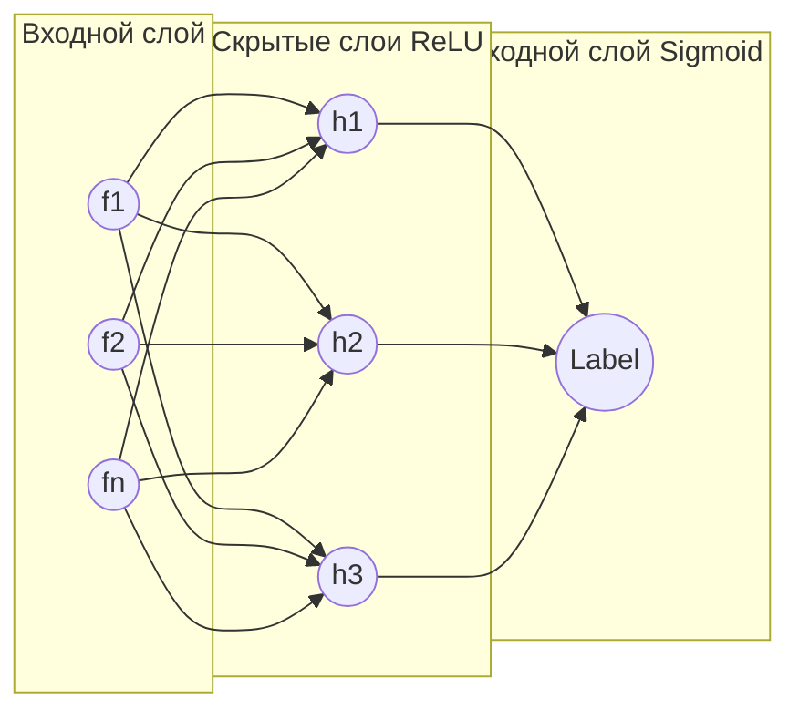
```mermaid
graph LR
    subgraph Input[Входной слой]
        X1((f1))
        X2((f2))
        Xn((fn))
    end
    subgraph Hidden[Скрытые слои ReLU]
        H1((h1))
        H2((h2))
        H3((h3))
    end
    subgraph Output[Выходной слой Sigmoid]
        Y((Label))
    end
    X1 & X2 & Xn --> H1 & H2 & H3
    H1 & H2 & H3 --> Y
```
<p align="center">Рис. 1.4. Топология многослойного перцептрона</p>

Обучение модели выполняется методом обратного распространения ошибки (Backpropagation) путём минимизации функции кросс-энтропии:

$$ J(w,b) = -\frac{1}{m} \sum_{i=1}^m [y_i \ln(\hat{y}_i) + (1-y_i) \ln(1-\hat{y}_i)] \eqno(1.7) $$

Применение MLP позволяет системе адаптироваться к тонким изменениям в структуре трафика, характерным для атак прикладного уровня, которые могут имитировать поведение легитимных клиентов.

#### 1.4.6. Метрики оценки качества классификатора

Для оценки эффективности классификатора используются стандартные метрики бинарной классификации. Введём обозначения: $TP$ (True Positive) — правильно обнаруженные атаки, $FP$ (False Positive) — ложные тревоги, $FN$ (False Negative) — пропущенные атаки, $TN$ (True Negative) — правильно классифицированный нормальный трафик.

- **Точность (Precision):** доля реальных атак среди всех срабатываний системы:
$$ P = \frac{TP}{TP + FP} \eqno(1.8) $$

- **Полнота (Recall):** доля обнаруженных атак от их фактического количества:
$$ R = \frac{TP}{TP + FN} \eqno(1.9) $$

- **F1-мера:** гармоническое среднее точности и полноты, обеспечивающее комплексную оценку качества:
$$ F_1 = \frac{2 \cdot P \cdot R}{P + R} \eqno(1.10) $$

- **ROC AUC:** площадь под кривой ROC, характеризующая качество ранжирования классификатора. Для оценки качества работы классификатора используется матрица ошибок, структура которой приведена в табл. 1.4.

<p align="right">Таблица 1.4</p>
<p align="center"><b>Матрица ошибок классификатора</b></p>

| — | Предсказано: атака | Предсказано: норма |
|---|---|---|
| **Реально: атака** | TP (верно обнаружена атака) | FN (пропуск атаки) |
| **Реально: норма** | FP (ложная тревога) | TN (верно определена норма) |

Для систем безопасности критически важно минимизировать $FN$ (пропущенные атаки), поэтому целевым показателем является $Recall \geq 0,88$. F1-мера балансирует между точностью и полнотой.

#### 1.4.7. Нормализация признаков

Перед подачей вектора признаков в классификатор каждый признак нормализуется методом стандартизации (z-score) по формуле:

$$ x'_i = \frac{x_i - \mu_i}{\sigma_i} \eqno(1.11) $$

где $x'_i$ – нормализованное значение $i$-го признака;
$x_i$ – исходное значение признака;
$\mu_i$ – среднее значение $i$-го признака на обучающей выборке;
$\sigma_i$ – стандартное отклонение $i$-го признака.

Параметры μ и σ вычисляются при обучении модели и сохраняются в JSON-файл конфигурации масштабировщика (`scaler_params.JSON`). При инициализации комплекса эти параметры загружаются в структуру `FeatureExtractor::ScalerParams`. Для признаков с тяжёлым правым хвостом (например, byte rate) дополнительно может применяться логарифмическое преобразование log1p перед стандартизацией (`useLog1p = true`).

**

**Вывод по разделу:** выбранные алгоритмы машинного и глубокого обучения обеспечивают высокую точность классификации на числовых признаках сетевых потоков. Основной классификатор на базе XGBoost позволяет достичь минимальной задержки инференса при рекордной точности. Применение ONNX Runtime обеспечивает кроссплатформенную среду выполнения без Python-зависимостей. Выделенный набор из 16 признаков охватывает поведение TCP-флагов, интенсивность потоков и их временну́ю динамику, что достаточно для эффективного разделения DoS/DDoS-атак и нормального трафика.

### 1.5. Стек используемых технологий и инструментов

Реализация высокопроизводительного программного комплекса для анализа сетевого трафика требует тщательного подбора системных библиотек и фреймворков, способных обеспечить детерминированное управление ресурсами и эффективную работу с многопоточностью. Основным критерием при формировании технологического стека являлась возможность интеграции современных алгоритмов машинного обучения в конвейер обработки пакетов на языке C++ без значительных накладных расходов на интерпретацию. Сводные данные по используемым средствам разработки с обоснованием их выбора применительно к нефункциональным требованиям (NFR) приведены в табл. 1.5.

<p align="right">Таблица 1.5</p>
<p align="center"><b>Средства разработки и обоснование выбора по требованиям NFR</b></p>

| Компонент | Технология | Версия | Закрываемое NFR | Обоснование выбора |
|---|---|---|---|---|
| Язык программирования | C++ | 17 | NFR-001, NFR-002 | Детерминированное управление памятью и производительность, критически важные для обработки >10 000 пак/с. C++17 предоставляет structured bindings, `std::filesystem`, `std::shared_mutex` — используются в коде |
| Захват пакетов | PcapPlusPlus / Npcap | 23.x / 1.79+ | NFR-001 | PcapPlusPlus — объектно-ориентированная обёртка над libpcap/Npcap. Npcap обеспечивает захват в режиме promiscuous на Windows |
| ML/DL-инференс | ONNX Runtime C++ API | 1.17+ | NFR-001, NFR-003 | Native C++ API не требует Python-интерпретатора в runtime; поддерживает XGBoost, scikit-learn, PyTorch; задержка инференса <1 мс; горячая замена модели (hot-swap) |
| Нормализация данных | Собственная реализация (z-score) | — | NFR-001 | Реализована в методе `FeatureExtractor::computeNormalizedFeatures()`. Исключает зависимость от тяжёлых библиотек линейной алгебры |
| СУБД | PostgreSQL | 15+ | NFR-004, NFR-005 | Клиент-серверная РСУБД (RDBMS) с полной поддержкой ACID; пакетная обработка с использованием механизма потоковой записи (COPY) [30]; взаимодействие через библиотеку libpqxx |
| GUI | Qt | 6.x | NFR-002, NFR-006 | Богатый набор виджетов (Qt Charts, QSystemTrayIcon) для real-time отображения; кроссплатформенность; полная поддержка MSVC 2022 [31] |
| Конкурентные очереди | moodycamel ConcurrentQueue | 1.x | NFR-001 | Lock-free очередь (MPMC); обеспечивает потокобезопасный обмен данными между захватом и анализом |
| Логирование | spdlog | 1.x | NFR-007 | Библиотека логирования с поддержкой асинхронной записи и форматирования fmt |
| Сериализация | nlohmann/json | 3.x | — | Загрузка конфигурации и параметров масштабировщика |
| Сборка | CMake | 3.25+ | NFR-006 | Единая система сборки для Windows (MSVC) |
| Компилятор | MSVC 2022 | — | NFR-006 | Полная поддержка C++17; оптимизации `/O2` |
| Управление пакетами | vcpkg | — | NFR-006 | Управление зависимостями C++ (libpqxx, nlohmann-json, Qt6, ORT) |
| Управление фаерволом | netsh advfirewall (Windows) | — | NFR-002 | Стандартный CLI-инструмент Windows Firewall. Вызывается через `QProcess::startDetached()` |

### 1.6. Требования к программному комплексу (SRS-lite, IEEE 830)

Данный подраздел выполняет роль спецификации требований (Software Requirements Specification, SRS) в соответствии с методологией международного стандарта IEEE 830. Четкое разделение требований на функциональные и качественные позволяет сформировать базис для проектирования архитектуры и последующей верификации системы. Каждое из представленных требований является измеримым и проверяемым в ходе экспериментальных испытаний, описанных в четвертом разделе работы.

#### 1.6.1. Функциональные требования (FR)

Функциональные требования определяют конкретные действия, которые должен выполнять комплекс в ответ на входящие воздействия или внутренние события. Приоритезация требований выполнена по методу MoSCoW (Must, Should, Could, Won't), где приоритет «Обязательно» соответствует критически важному функционалу ядра. Полный перечень функциональных требований к разрабатываемой системе представлен в табл. 1.6.

<p align="right">Таблица 1.6</p>
<p align="center"><b>Функциональные требования к программному комплексу</b></p>

| ID | Название | Описание | Приоритет (MoSCoW) |
|---|---|---|---|
| **FR-001** | Захват сетевых пакетов | Система должна захватывать все входящие и исходящие IP-пакеты с заданного сетевого интерфейса в режиме реального времени с использованием Npcap/PcapPlusPlus | Обязательно |
| **FR-002** | Агрегация по потокам | Для каждого сетевого потока (5-tuple) система должна отслеживать статистику за скользящее окно 1 секунда | Обязательно |
| **FR-003** | Нормализация признаков | Система должна нормализовать вектор признаков методом z-score с параметрами из загруженного JSON-файла масштабировщика | Обязательно |
| **FR-004** | Классификация трафика (XGBoost, RF, MLP) | Система должна классифицировать каждое окно как «атака» или «норма» через ONNX Runtime. Задержка инференса — не более 5 мс | Обязательно |
| **FR-005** | Запись в базу данных | Система должна асинхронно записывать результаты обнаружения (временна́я метка, PPS, метка, уверенность) в PostgreSQL | Обязательно |
| **FR-006** | Автоматическая блокировка | При обнаружении атаки система должна автоматически добавить IP-адрес источника в правила Windows Firewall через `netsh advfirewall` | Обязательно |
| **FR-007** | Разблокировка при завершении атаки | При переходе состояния «атака» → «норма» система должна автоматически удалить все правила блокировки | Желательно |
| **FR-008** | Отображение в GUI | `ddos_monitor` должен в реальном времени (обновление ≤1 с) отображать: интенсивность трафика (пак/с), таблицу событий, список заблокированных IP | Обязательно |
| FR-009 | Управление из GUI | Пользователь должен иметь возможность через GUI запускать/останавливать захват, активировать режим защиты (автоблокировку) и экспортировать лог в CSV | Желательно |

#### 1.6.2. Нефункциональные требования (NFR)

Нефункциональные требования определяют качественные характеристики программного обеспечения, такие как производительность, надежность и сопровождаемость. В контексте систем обнаружения DDoS-атак ключевым фактором является минимизация времени реакции и устойчивость к высоким сетевым нагрузкам. Перечень нефункциональных требований с указанием конкретных измеримых критериев верификации приведен в табл. 1.7.

<p align="right">Таблица 1.7</p>
<p align="center"><b>Нефункциональные требования к программному комплексу</b></p>

| ID | Категория | Требование | Измеримый критерий |
|---|---|---|---|
| **NFR-001** | Производительность | Обработка трафика без потерь пакетов при нагрузке до 10 000 пак/с | Потери <0,1% при 10 000 пак/с (счётчик `droppedPackets_`) |
| **NFR-002** | Время реакции | Время от первого пакета-атаки до добавления правила блокировки — не более 5 секунд | Измерение временны́х меток: первый атакующий пакет vs. запись правила |
| **NFR-003** | Точность классификации | F1-мера ≥ 0,90 на тестовой выборке датасета | F1 ≥ 0,90; Recall ≥ 0,88 |
| **NFR-004** | Автономность | Комплекс работает без сторонних сервисов, кроме PostgreSQL | PostgreSQL — единственная внешняя зависимость в runtime |
| **NFR-005** | Надежность | При аварийном завершении `ddos_collector` потеря данных — не более последних 5 с | Пакетная запись в БД каждые 5 с; резервное копирование в `FileBuffer` при потере связи |
| **NFR-006** | Совместимость | Комплекс собирается и запускается на Windows 10/11 (MSVC 2022) | Сборка проходит без ошибок; smoke-тест запускается |
| **NFR-007** | Сопровождаемость | Исходный код разбит на независимые модули; публичные классы документированы | Каждый `.h`-файл имеет описание класса и его публичного API |

#### 1.6.3. Ограничения и допущения

Для обеспечения корректности проектирования и последующей верификации системы необходимо зафиксировать границы проекта, а также внешние факторы, влияющие на работу комплекса. Ограничения определяют технические и эксплуатационные рамки разработки, в то время как допущения описывают требования к внешней среде и инфраструктуре, при которых гарантируется работоспособность комплекса.

**Ограничения:**
- Система разрабатывается для однопользовательской эксплуатации (один оператор)
- Используемый компилятор — MSVC 2022
- Обучение модели выполняется отдельным Python-скриптом; в runtime комплекс выполняет только инференс через ONNX Runtime
- Захват трафика требует привилегий администратора Windows

**Допущения:**
- Сетевой интерфейс поддерживает promiscuous mode
- На тестовом стенде доступны инструменты генерации трафика (hping3 или Scapy)
- Датасет для обучения — CIC-DDoS2019 (CICIDS)

**Входные данные:** сетевые пакеты с интерфейса через Npcap/PcapPlusPlus.  
**Выходные данные:** метки классификации, записи в БД, правила блокировки фаервола, визуализация в GUI.

## 2. ПРОЕКТИРОВАНИЕ ПРОГРАММНОГО КОМПЛЕКСА

### 2.1. Структурная схема комплекса

В соответствии с заданием комплекс состоит из двух независимых программ:

- **`ddos_collector`** — подсистема сбора и анализа сетевого трафика (ddos_collector) (фоновый процесс без GUI). Захватывает пакеты, извлекает признаки, классифицирует, управляет фаерволом и записывает события в БД.
- **`ddos_monitor`** — подсистема мониторинга и управления (ddos_monitor) с графическим интерфейсом Qt6 [22]. Получает оперативные метрики напрямую от `ddos_collector` через TCP-сокет для визуализации в реальном времени, а также взаимодействует с БД для анализа истории инцидентов и формирования отчётов. Общая структурная схема программного комплекса представлена на рис. 2.1, а дополнительные графические материалы приведены в приложении Е.

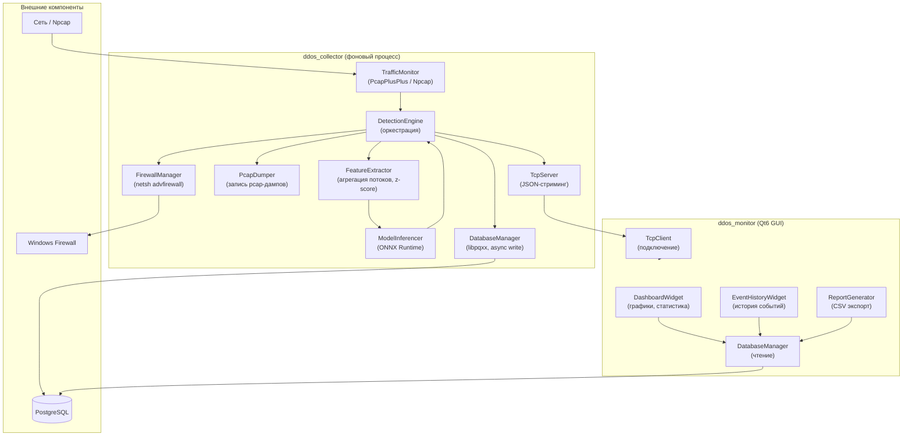
```mermaid
flowchart TB
    subgraph Collector["ddos_collector (фоновый процесс)"]
        TM["TrafficMonitor\n(PcapPlusPlus / Npcap)"]
        FE["FeatureExtractor\n(агрегация потоков, z-score)"]
        MI["ModelInferencer\n(ONNX Runtime)"]
        PD["PcapDumper\n(запись pcap-дампов)"]
        DE["DetectionEngine\n(оркестрация)"]
        FM["FirewallManager\n(netsh advfirewall)"]
        DB1["DatabaseManager\n(libpqxx, async write)"]
        TCP1["TcpServer\n(JSON-стриминг)"]
    end
    subgraph Monitor["ddos_monitor (Qt6 GUI)"]
        DW["DashboardWidget\n(графики, статистика)"]
        EH["EventHistoryWidget\n(история событий)"]
        RG["ReportGenerator\n(CSV экспорт)"]
        DB2["DatabaseManager\n(чтение)"]
        TCP2["TcpClient\n(подключение)"]
    end
    subgraph External["Внешние компоненты"]
        PG[("PostgreSQL")]
        NET["Сеть / Npcap"]
        FW["Windows Firewall"]
    end

    NET --> TM --> DE
    DE --> PD
    DE --> FE --> MI --> DE
    DE --> FM --> FW
    DE --> DB1 --> PG
    DE --> TCP1 --> TCP2 --> Monitor
    DB2 --> PG
    DW & EH & RG --> DB2
```

<p align="center">Рис. 2.1. Структурная схема программного комплекса</p>

Взаимодействие программ:
- `ddos_collector` записывает результаты классификации в БД PostgreSQL и отправляет live-обновления через TcpServer
- `ddos_monitor` подключается к `ddos_collector` через TcpClient и читает данные из общей БД
- `ddos_monitor` отправляет команды управления (запуск/остановка, смена модели, переключение режима защиты) через JSON-протокол. Взаимодействие между основными компонентами системы в процессе работы иллюстрируется диаграммой на рис. 2.2.

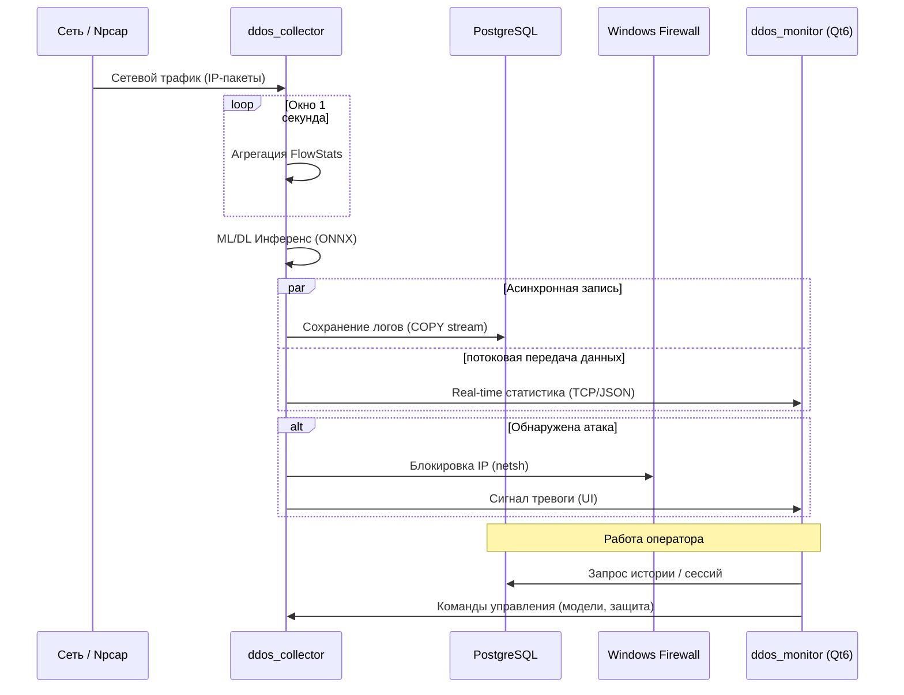
```mermaid
sequenceDiagram
    participant Net as Сеть / Npcap
    participant Coll as ddos_collector
    participant DB as PostgreSQL
    participant FW as Windows Firewall
    participant Mon as ddos_monitor (Qt6)

    Net->>Coll: Сетевой трафик (IP-пакеты)
    
    loop Окно 1 секунда
        Coll->>Coll: Агрегация FlowStats
    end

    Coll->>Coll: ML/DL Инференс (ONNX)
    
    par Асинхронная запись
        Coll->>DB: Сохранение логов (COPY stream)
    and потоковая передача данных
        Coll->>Mon: Real-time статистика (TCP/JSON)
    end

    alt Обнаружена атака
        Coll->>FW: Блокировка IP (netsh)
        Coll->>Mon: Сигнал тревоги (UI)
    end

    Note over Mon, DB: Работа оператора
    Mon->>DB: Запрос истории / сессий
    Mon->>Coll: Команды управления (модели, защита)
```

<p align="center">Рис. 2.2. Диаграмма взаимодействия компонентов</p>

### 2.2. Структура программы ddos_collector

Подсистема `ddos_collector` представляет собой консольную программу, выполняющее роль ядра всего комплекса. Программа ориентирована на работу в режиме реального времени и реализует конвейерную обработку сетевых данных: от захвата пакетов на канальном уровне до интеллектуального анализа трафика и реализации ответных мер.

Для обеспечения максимальной пропускной способности и минимизации задержек инференса архитектура программы построена на принципах многопоточности с разделением ответственности между специализированными программными модулями. Каждый модуль оформлен в виде отдельного класса, что упрощает отладку и позволяет выполнять независимую модернизацию подсистем (например, смену механизма захвата или обновление ML/DL-модели). Решение об активации функции автоматической блокировки атакующих IP-адресов принимается оператором: он может включить или отключить этот механизм защиты через графический интерфейс `ddos_monitor`. Основные программные модули подсистемы ddos_collector и их назначение описаны в табл. 2.1.

<p align="right">Таблица 2.1</p>
<p align="center"><b>Описание модулей ddos_collector</b></p>

| Модуль (файл) | Назначение |
|---|---|
| `TrafficMonitor` (network/TrafficMonitor.cpp/.hpp) | Захват пакетов через PcapPlusPlus и их асинхронная передача в lock-free очередь |
| `FeatureExtractor` (network/FeatureExtractor.cpp/.hpp) | Агрегация признаков по потокам за окно 1 с; нормализация z-score |
| `PcapDumper` (network/PcapDumper.cpp/.hpp) | Запись отфильтрованного трафика в pcap-файлы для последующего анализа |
| `ModelInferencer` (ml/ModelInferencer.cpp/.hpp) | Инференс через ONNX Runtime C++ API; горячая замена модели |
| `DetectionEngine` (core/DetectionEngine.cpp/.hpp) | Оркестрация: цикл инференса, отслеживание инцидентов |
| `FirewallManager` (core/FirewallManager.cpp/.hpp) | Блокировка/разблокировка IP через netsh advfirewall; Singleton |
| `DatabaseManager` (common/DatabaseManager.cpp/.hpp) | Асинхронная запись событий в PostgreSQL через libpqxx |
| `TcpServer` (common/TcpServer.cpp/.hpp) | Потоковая передача DetectionResult в ddos_monitor через TCP |
| `ConfigManager` (common/ConfigManager.cpp/.hpp) | Загрузка config.JSON; параметры подключения и путей |
| `collector_main.cpp` | Точка входа, инициализация, главный цикл |

**2.2.1. Класс TrafficMonitor**

Класс `TrafficMonitor` отвечает за низкоуровневый захват сетевого трафика. Использование библиотеки PcapPlusPlus и драйвера Npcap позволяет программе работать в режиме «promiscuous», перехватывая все пакеты, проходящие через сетевой интерфейс, а не только адресованные хосту. 

Архитектурно класс спроектирован как асинхронный поставщик данных: захват происходит в отдельном потоке (callback-функция драйвера), а пакеты помещаются в lock-free очередь. Для минимизации аллокаций памяти в runtime реализован механизм пула буферов (`bufferPool_`), что критически важно при обработке тысяч пакетов в секунду. На рис. 2.3 представлена диаграмма класса с его зависимостями, а в табл. 2.2 — детальное описание интерфейса.

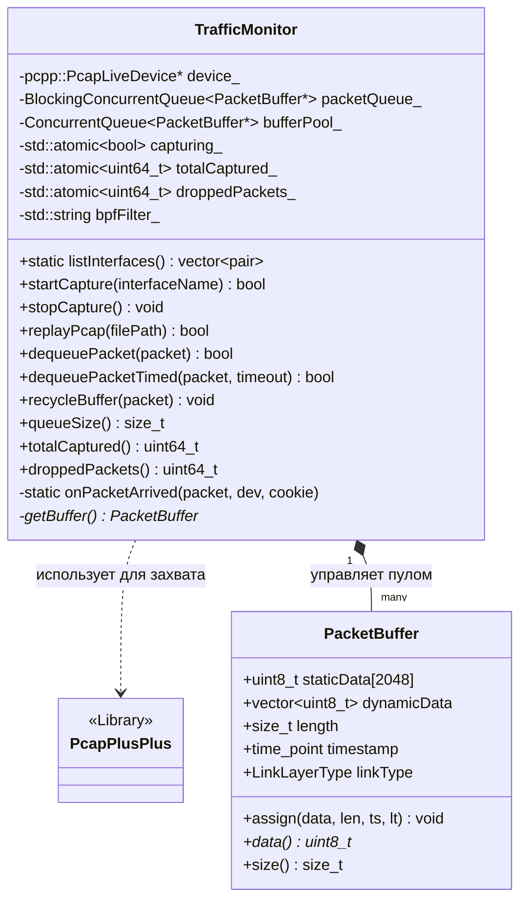
```mermaid
classDiagram
  class TrafficMonitor {
    -pcpp::PcapLiveDevice* device_
    -BlockingConcurrentQueue~PacketBuffer*~ packetQueue_
    -ConcurrentQueue~PacketBuffer*~ bufferPool_
    -std::atomic~bool~ capturing_
    -std::atomic~uint64_t~ totalCaptured_
    -std::atomic~uint64_t~ droppedPackets_
    -std::string bpfFilter_
    +static listInterfaces() vector~pair~
    +startCapture(interfaceName) bool
    +stopCapture() void
    +replayPcap(filePath) bool
    +dequeuePacket(packet) bool
    +dequeuePacketTimed(packet, timeout) bool
    +recycleBuffer(packet) void
    +queueSize() size_t
    +totalCaptured() uint64_t
    +droppedPackets() uint64_t
    -static onPacketArrived(packet, dev, cookie)
    -getBuffer() PacketBuffer*
  }
  class PacketBuffer {
    +uint8_t staticData[2048]
    +vector~uint8_t~ dynamicData
    +size_t length
    +time_point timestamp
    +LinkLayerType linkType
    +assign(data, len, ts, lt) void
    +data() uint8_t*
    +size() size_t
  }
  class PcapPlusPlus {
    <<Library>>
  }
  TrafficMonitor ..> PcapPlusPlus : использует для захвата
  TrafficMonitor "1" *-- "many" PacketBuffer : управляет пулом
```

<p align="center">Рис. 2.3. Диаграмма класса TrafficMonitor</p>

<p align="right">Таблица 2.2</p>
<p align="center"><b>Поля и методы класса TrafficMonitor</b></p>

| Имя | Тип | Описание | Входные параметры | Выходное значение |
|---|---|---|---|---|
| **Поля** | — | | — | |
| `device_` | `pcpp::PcapLiveDevice*` | Указатель на устройство захвата PcapPlusPlus | — | — |
| `packetQueue_` | `moodycamel::BlockingConcurrentQueue<PacketBuffer*>` | Lock-free очередь захваченных пакетов | — | — |
| `bufferPool_` | `moodycamel::ConcurrentQueue<PacketBuffer*>` | Пул переиспользуемых буферов пакетов | — | — |
| `capturing_` | `std::atomic<bool>` | Флаг активности захвата | — | — |
| `totalCaptured_` | `std::atomic<uint64_t>` | Счётчик захваченных пакетов | — | — |
| `droppedPackets_` | `std::atomic<uint64_t>` | Счётчик отброшенных пакетов (переполнение очереди) | — | — |
| `bpfFilter_` | `std::string` | BPF-фильтр для ограничения захватываемого трафика | — | — |
| **Методы** | — | | — | |
| `startCapture()` | `bool` | Начать живой захват пакетов | `interfaceName: std::string` | Успех/неудача |
| `stopCapture()` | `void` | Остановить захват и закрыть устройство | — | — |
| `replayPcap()` | `bool` | Воспроизвести pcap-файл с исходной скоростью | `filePath: std::string` | Успех/неудача |
| `dequeuePacket()` | `bool` | Извлечь пакет из очереди (неблокирующий) | `packet: PacketBuffer*&` | Успех/неудача |
| `dequeuePacketTimed()` | `bool` | Извлечь пакет с таймаутом | `packet, timeout` | Успех/неудача |
| `recycleBuffer()` | `void` | Вернуть буфер в пул для переиспользования | `packet: PacketBuffer*` | — |
| `listInterfaces()` | `vector<pair<string,string>>` | Получить список доступных сетевых интерфейсов | — | Список (имя, описание) |
| `onPacketArrived()` | `static void` | Обратный вызов PcapPlusPlus при захвате пакета | `packet, dev, cookie` | — |
| `queueSize()` | `size_t` | Получить текущий размер очереди пакетов | — | Число пакетов |
| `totalCaptured()` | `uint64_t` | Получить общее число захваченных пакетов | — | Число пакетов |
| `droppedPackets()` | `uint64_t` | Получить число отброшенных пакетов | — | Число пакетов |

**2.2.2. Класс FeatureExtractor**

Класс `FeatureExtractor` выполняет агрегацию сырых пакетов в логические сетевые потоки и вычисляет вектор признаков для классификатора. Основная сложность реализации данного модуля заключается в необходимости отслеживания двунаправленных потоков (bidirectional flows) в реальном времени.

Для каждого потока, идентифицируемого уникальным 5-tuple, накапливается статистика за 1-секундное окно. По истечении окна класс выполняет нормализацию признаков методом z-score, используя параметры (среднее и стандартное отклонение), загруженные из конфигурационного JSON-файла. Такой подход позволяет математически корректно подготовить данные для ML/DL-модели, не внося искажений из-за разного масштаба величин (например, количество байт vs количество флагов). На рис. 2.4 показана структура связей класса, в табл. 2.3 — перечень его ключевых атрибутов и методов.

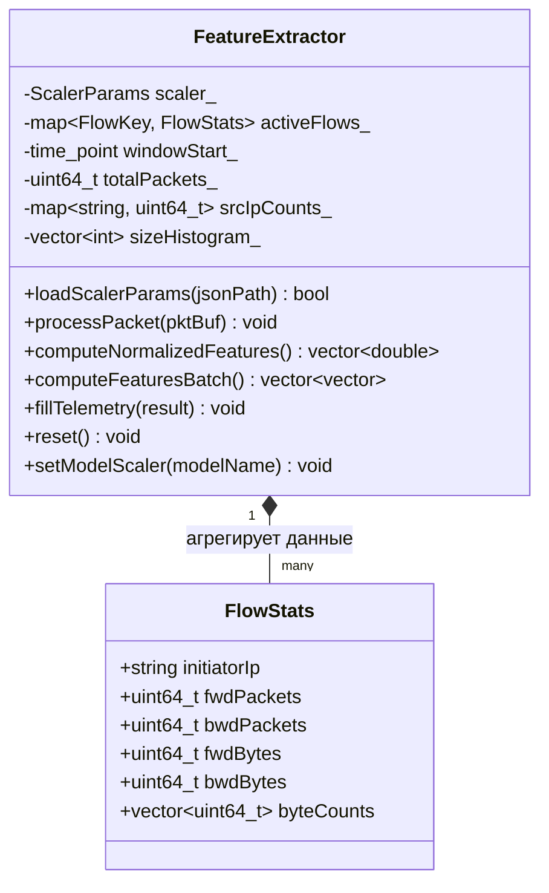
```mermaid
classDiagram
  class FeatureExtractor {
    -ScalerParams scaler_
    -map~FlowKey, FlowStats~ activeFlows_
    -time_point windowStart_
    -uint64_t totalPackets_
    -map~string, uint64_t~ srcIpCounts_
    -vector~int~ sizeHistogram_
    +loadScalerParams(jsonPath) bool
    +processPacket(pktBuf) void
    +computeNormalizedFeatures() vector~double~
    +computeFeaturesBatch() vector~vector~
    +fillTelemetry(result) void
    +reset() void
    +setModelScaler(modelName) void
  }
  class FlowStats {
    +string initiatorIp
    +uint64_t fwdPackets
    +uint64_t bwdPackets
    +uint64_t fwdBytes
    +uint64_t bwdBytes
    +vector~uint64_t~ byteCounts
  }
  FeatureExtractor "1" *-- "many" FlowStats : агрегирует данные
```

<p align="center">Рис. 2.4. Диаграмма класса FeatureExtractor</p>

<p align="right">Таблица 2.3</p>
<p align="center"><b>Поля и методы класса FeatureExtractor</b></p>

| Имя | Тип | Описание | Входные параметры | Выходное значение |
|---|---|---|---|---|
| **Поля** | — | | — | |
| `scaler_` | `ScalerParams` | Параметры нормализации: имена признаков, μ, σ, флаг log1p | — | — |
| `activeFlows_` | `std::map<FlowKey, FlowStats>` | Статистика по активным потокам за текущее окно | — | — |
| `windowStart_` | `std::chrono::steady_clock::time_point` | Момент начала текущего окна агрегации | — | — |
| `totalPackets_` | `uint64_t` | Общее количество пакетов в окне | — | — |
| `tcpPackets_`, `udpPackets_`, `icmpPackets_`, `otherPackets_` | `uint64_t` | Счётчики пакетов по протоколам | — | — |
| `synPackets_`, `finPackets_`, `rstPackets_` | `uint64_t` | Глобальные счётчики TCP-флагов окна | — | — |
| `totalBytes_` | `uint64_t` | Суммарный объём трафика за окно (байт) | — | — |
| `srcIpCounts_`, `dstPortCounts_` | `std::map<...>` | Распределение по IP-источникам и портам | — | — |
| `targetCounts_` | `std::map<string, uint64_t>` | Частота целей (IP:Port) | — | — |
| `sizeHistogram_` | `std::vector<int>` | Гистограмма размеров пакетов (5 бинов) | — | — |
| **Методы** | — | | — | |
| `loadScalerParams()` | `bool` | Загрузить параметры нормализации из JSON-файла | `jsonPath: std::string` | Успех/неудача |
| `processPacket()` | `void` | Обработать пакет: обновить статистику потока | `pktBuf: PacketBuffer*` | — |
| `computeNormalizedFeatures()` | `vector<double>` | Вычислить нормализованный вектор признаков | — | Нормализованный вектор |
| `computeFeaturesBatch()` | `vector<vector<double>>` | Признаки для всех активных потоков | — | Матрица признаков |
| `fillTelemetry()` | `void` | Заполнить телеметрию в DetectionResult | `result: DetectionResult&` | — |
| `reset()` | `void` | Сбросить состояние для нового окна | — | — |
| `setModelScaler()` | `void` | Выбрать параметры масштабировщика для конкретной модели | `modelName: std::string` | — |

**2.2.3. Класс ModelInferencer**

Класс `ModelInferencer` является инкапсуляцией среды выполнения ONNX Runtime. Его основная задача — загрузка предварительно обученных ML/DL-моделей из файлов формата `.ONNX` и выполнение предиктивного анализа на векторе признаков.

Реализация класса поддерживает механизм «горячей замены» (hot-swap) модели без остановки процесса захвата трафика. Это достигается за счёт использования примитива синхронизации `std::shared_mutex`: процесс инференса захватывает «разделяемую» блокировку (read lock), а процесс обновления модели — «эксклюзивную» (write lock). Такой подход гарантирует потокобезопасность и непрерывность мониторинга. На рис. 2.5 приведена структурная схема интеграции ONNX Runtime, а в табл. 2.4 описан программный интерфейс класса.

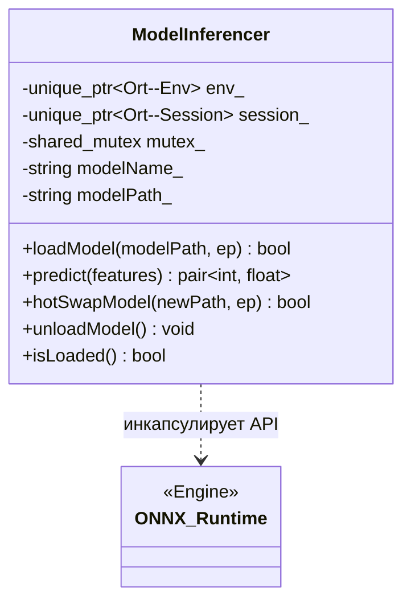
```mermaid
classDiagram
  class ModelInferencer {
    -unique_ptr~Ort--Env~ env_
    -unique_ptr~Ort--Session~ session_
    -shared_mutex mutex_
    -string modelName_
    -string modelPath_
    +loadModel(modelPath, ep) bool
    +predict(features) pair~int, float~
    +hotSwapModel(newPath, ep) bool
    +unloadModel() void
    +isLoaded() bool
  }
  class ONNX_Runtime {
    <<Engine>>
  }
  ModelInferencer ..> ONNX_Runtime : инкапсулирует API
```

<p align="center">Рис. 2.5. Диаграмма класса ModelInferencer</p>

<p align="right">Таблица 2.4</p>
<p align="center"><b>Поля и методы класса ModelInferencer</b></p>

| Имя | Тип | Описание | Входные параметры | Выходное значение |
|---|---|---|---|---|
| **Поля** | — | | — | |
| `env_` | `std::unique_ptr<Ort::Env>` | ONNX Runtime окружение | — | — |
| `session_` | `std::unique_ptr<Ort::Session>` | ONNX Runtime сессия с загруженной моделью | — | — |
| `sessionOptions_` | `std::unique_ptr<Ort::SessionOptions>` | Параметры сессии (кол-во потоков, оптимизации) | — | — |
| `inputNames_`, `outputNames_` | `std::vector<std::string>` | Имена входных и выходных тензоров | — | — |
| `mutex_` | `std::shared_mutex` | Read-write мьютекс для потокобезопасного hot-swap | — | — |
| `modelName_`, `modelPath_` | `std::string` | Имя и путь загруженной модели | — | — |
| **Методы** | — | | — | |
| `loadModel()` | `bool` | Загрузить ONNX-модель из файла | `modelPath, ep: std::string` | Успех/неудача |
| `predict()` | `pair<int, float>` | Инференс: возвращает метку (0/1) и уверенность | `features: vector<float>` | (метка, уверенность) |
| `hotSwapModel()` | `bool` | Потокобезопасная замена модели без остановки захвата | `newModelPath, ep` | Успех/неудача |
| `unloadModel()` | `void` | Выгрузить модель и освободить ресурсы ORT | — | — |
| `isLoaded()` | `bool` | Проверить наличие загруженной модели | — | Флаг |

**2.2.4. Класс DetectionEngine**

Класс `DetectionEngine` выполняет роль центрального оркестратора подсистемы сбора. Он координирует работу всех вышеописанных модулей, реализуя логику главного цикла обнаружения.

В задачи этого класса входит управление жизненным циклом потока инференса, отслеживание временных окон агрегации и реализация конечного автомата состояний защиты («норма» и «атака»). При обнаружении аномалии `DetectionEngine` принимает решение о необходимости активации защитных механизмов через `FirewallManager` (вызов Singleton) или информировании пользователя через callback-интерфейсы. Модуль также управляет записью трафика через `PcapDumper` при активных инцидентах. Выделение логики управления в отдельный класс позволяет изолировать алгоритмы принятия решений от технических деталей захвата пакетов или записи в БД. На рис. 2.6 представлена диаграмма класса, а в табл. 2.5 описаны основные методы управления процессом детектирования.

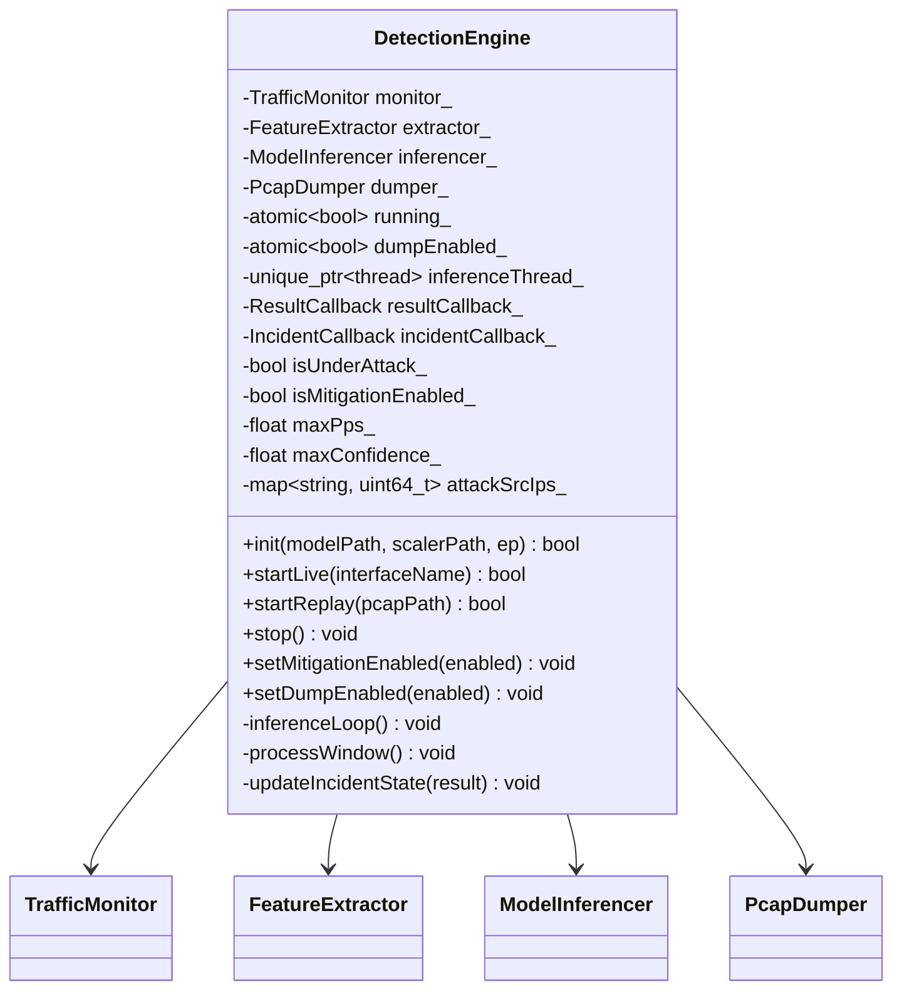
```mermaid
classDiagram
  class DetectionEngine {
    -TrafficMonitor monitor_
    -FeatureExtractor extractor_
    -ModelInferencer inferencer_
    -PcapDumper dumper_
    -atomic~bool~ running_
    -atomic~bool~ dumpEnabled_
    -unique_ptr~thread~ inferenceThread_
    -ResultCallback resultCallback_
    -IncidentCallback incidentCallback_
    -bool isUnderAttack_
    -bool isMitigationEnabled_
    -float maxPps_
    -float maxConfidence_
    -map~string, uint64_t~ attackSrcIps_
    +init(modelPath, scalerPath, ep) bool
    +startLive(interfaceName) bool
    +startReplay(pcapPath) bool
    +stop() void
    +setMitigationEnabled(enabled) void
    +setDumpEnabled(enabled) void
    -inferenceLoop() void
    -processWindow() void
    -updateIncidentState(result) void
  }
  DetectionEngine --> TrafficMonitor
  DetectionEngine --> FeatureExtractor
  DetectionEngine --> ModelInferencer
  DetectionEngine --> PcapDumper
```

<p align="center">Рис. 2.6. Диаграмма класса DetectionEngine</p>

<p align="right">Таблица 2.5</p>
<p align="center"><b>Поля и методы класса DetectionEngine</b></p>

| Имя | Тип | Описание | Входные параметры | Выходное значение |
|---|---|---|---|---|
| **Поля** | — | | — | |
| `monitor_` | `TrafficMonitor` | Подсистема захвата пакетов | — | — |
| `extractor_` | `FeatureExtractor` | Подсистема извлечения признаков | — | — |
| `inferencer_` | `ModelInferencer` | Подсистема ML/DL-инференса | — | — |
| `running_` | `std::atomic<bool>` | Флаг работы цикла инференса | — | — |
| `inferenceThread_` | `std::unique_ptr<std::thread>` | Поток цикла инференса | — | — |
| `resultCallback_` | `ResultCallback` | Функция обратного вызова с результатом | — | — |
| `incidentCallback_` | `IncidentCallback` | Функция обратного вызова при завершении инцидента | — | — |
| `isUnderAttack_` | `bool` | Текущее состояние (атака/норма) | — | — |
| `isMitigationEnabled_` | `bool` | Флаг автоматической блокировки через FirewallManager | — | — |
| **Методы** | — | | — | |
| `init()` | `bool` | Инициализация: загрузка модели и масштабировщика | `modelPath, scalerPath, ep` | Успех/неудача |
| `startLive()` | `bool` | Запустить живой захват и цикл инференса | `interfaceName: std::string` | Успех/неудача |
| `startReplay()` | `bool` | Запустить воспроизведение pcap-файла | `pcapPath: std::string` | Успех/неудача |
| `stop()` | `void` | Остановить захват и цикл инференса | — | — |
| `inferenceLoop()` | `void` (private) | Основной цикл: сбор окна → признаки → инференс | — | — |
| `processWindow()` | `void` (private) | Обработка одного окна агрегации | — | — |
| `updateIncidentState()` | `void` (private) | Отслеживание переходов атака↔норма | `result: DetectionResult&` | — |

**2.2.5. Класс DatabaseManager**

Класс `DatabaseManager` отвечает за долговременное хранение результатов работы комплекса в РСУБД PostgreSQL. Модуль спроектирован с упором на надежность и минимальное влияние на производительность захвата трафика.

Для этого в классе реализована асинхронная схема записи: события накапливаются в специализированных неблокирующих очередях (`eventQueue_`, `snapshotQueue_`, `securityEventQueue_`) и сбрасываются в БД отдельным потоком с использованием механизма `COPY`. Это позволяет обрабатывать огромные потоки логов без создания «бутылочного горлышка» в виде синхронных SQL-запросов. Кроме того, класс содержит встроенный механизм файловой буферизации (`FileBuffer`), который автоматически активируется при потере связи с сервером базы данных, предотвращая потерю информации об инцидентах. На рис. 2.7 представлена диаграмма класса, а в табл. 2.6 приведено описание основных методов управления данными.

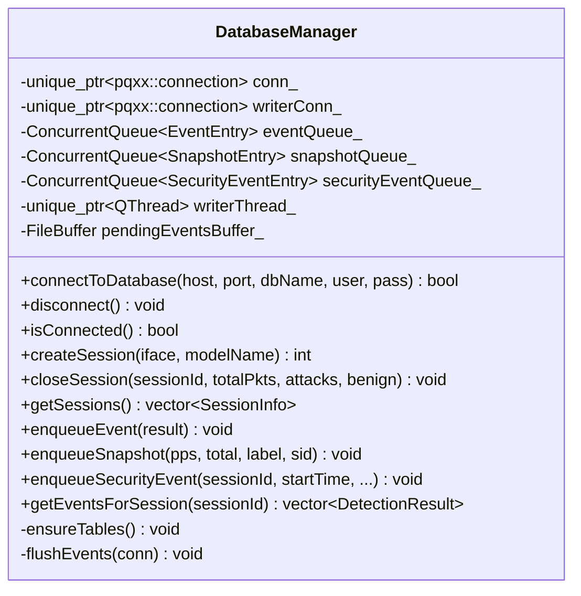
```mermaid
classDiagram
  class DatabaseManager {
    -unique_ptr~pqxx::connection~ conn_
    -unique_ptr~pqxx::connection~ writerConn_
    -ConcurrentQueue~EventEntry~ eventQueue_
    -ConcurrentQueue~SnapshotEntry~ snapshotQueue_
    -ConcurrentQueue~SecurityEventEntry~ securityEventQueue_
    -unique_ptr~QThread~ writerThread_
    -FileBuffer pendingEventsBuffer_
    +connectToDatabase(host, port, dbName, user, pass) bool
    +disconnect() void
    +isConnected() bool
    +createSession(iface, modelName) int
    +closeSession(sessionId, totalPkts, attacks, benign) void
    +getSessions() vector~SessionInfo~
    +enqueueEvent(result) void
    +enqueueSnapshot(pps, total, label, sid) void
    +enqueueSecurityEvent(sessionId, startTime, ...) void
    +getEventsForSession(sessionId) vector~DetectionResult~
    -ensureTables() void
    -flushEvents(conn) void
  }
```

<p align="center">Рис. 2.7. Диаграмма класса DatabaseManager</p>

<p align="right">Таблица 2.6</p>
<p align="center"><b>Поля и методы класса DatabaseManager</b></p>

| Имя | Тип | Описание | Входные параметры | Выходное значение |
|---|---|---|---|---|
| **Поля** | — | | — | |
| `conn_` | `std::unique_ptr<pqxx::connection>` | Соединение с PostgreSQL (основной поток) | — | — |
| `writerConn_` | `std::unique_ptr<pqxx::connection>` | Соединение с PostgreSQL (поток записи) | — | — |
| `eventQueue_` | `ConcurrentQueue<EventEntry>` | Lock-free очередь событий обнаружения | — | — |
| `snapshotQueue_` | `ConcurrentQueue<SnapshotEntry>` | Очередь снимков статистики PPS | — | — |
| `securityEventQueue_` | `ConcurrentQueue<SecurityEventEntry>` | Очередь инцидентов безопасности | — | — |
| `writerThread_` | `std::unique_ptr<QThread>` | Поток асинхронного флашинга в БД | — | — |
| **Методы** | — | | — | |
| `connectToDatabase()` | `bool` | Подключиться к PostgreSQL | `host, port, dbName, user, pass` | Успех/неудача |
| `disconnect()` | `void` | Закрыть соединение и остановить поток записи | — | — |
| `createSession()` | `int` | Создать запись сессии мониторинга | `iface, modelName` | ID сессии |
| `closeSession()` | `void` | Завершить сессию, сохранив итоги | `sid, pkts, att, ben` | — |
| `enqueueEvent()` | `void` | Поставить событие в очередь записи | `result: DetectionResult&` | — |
| `enqueueSnapshot()` | `void` | Поставить снимок статистики в очередь | `pps, total, label, sid` | — |
| `enqueueSecurityEvent()` | `void` | Поставить инцидент в очередь записи | `sid, start, dur, ...` | — |
| `getSessions()` | `vector<SessionInfo>` | Получить список последних 100 сессий | — | Список сессий |
| `getEventsForSession()` | `vector<DetectionResult>` | Получить все события для конкретной сессии | `sessionId: int` | Список событий |
| `getSecurityEvents()` | `vector<SecurityEvent>` | Получить список всех инцидентов безопасности | — | Список инцидентов |
| `ensureTables()` | `void` (private) | Создать таблицы БД при первом запуске | — | — |
| `flushEvents()` | `void` (private) | Сбросить накопленные очереди в БД | `conn: pqxx::connection&` | — |

**2.2.6. Класс FirewallManager**

Класс `FirewallManager` реализует подсистему активного противодействия атакам. Он отвечает за автоматическое взаимодействие с межсетевым экраном операционной системы Windows для блокировки вредоносного трафика на уровне IP-адресов.

Модуль реализован с использованием паттерна «Одиночка» (Singleton), что обеспечивает единую точку управления правилами фильтрации из любой части программы. Взаимодействие с брандмауэром Windows осуществляется через стандартную системную утилиту `netsh advfirewall`. Для обеспечения потокобезопасности при одновременном доступе из разных потоков инференса используется статический мьютекс `g_firewallMutex`. Класс поддерживает механизмы автоматической разблокировки и полной очистки правил при завершении работы программы, что предотвращает несанкционированное сохранение блокировок после окончания инцидента. На рис. 2.8 представлена диаграмма класса, а в табл. 2.7 подробно описан программный интерфейс управления фаерволом.

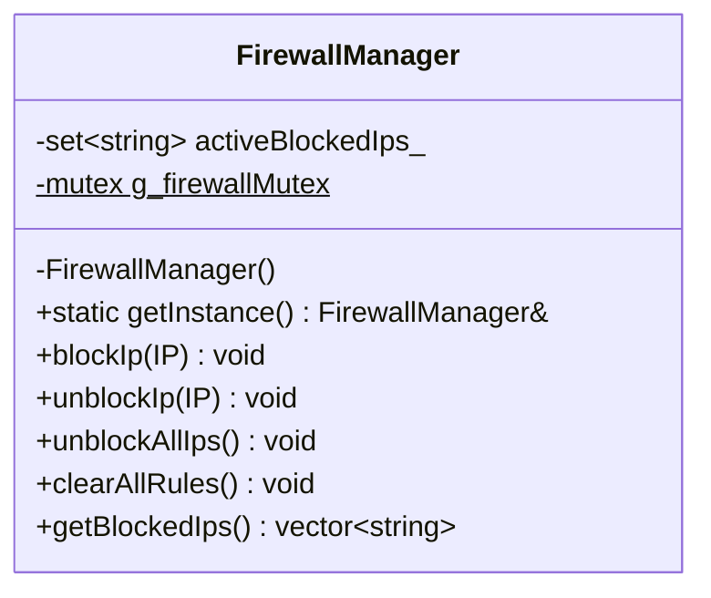
```mermaid
classDiagram
  class FirewallManager {
    -set~string~ activeBlockedIps_
    -mutex g_firewallMutex$
    -FirewallManager()
    +static getInstance() FirewallManager&
    +blockIp(IP) void
    +unblockIp(IP) void
    +unblockAllIps() void
    +clearAllRules() void
    +getBlockedIps() vector~string~
  }
```

<p align="center">Рис. 2.8. Диаграмма класса FirewallManager</p>

<p align="right">Таблица 2.7</p>
<p align="center"><b>Поля и методы класса FirewallManager</b></p>

| Имя | Тип | Описание | Входные параметры | Выходное значение |
|---|---|---|---|---|
| **Поля** | — | | — | |
| `activeBlockedIps_` | `std::set<std::string>` | Множество активно заблокированных IP-адресов | — | — |
| `g_firewallMutex` | `std::mutex` (static) | Мьютекс для синхронизации доступа к правилам | — | — |
| **Методы** | — | | — | |
| `getInstance()` | `FirewallManager&` (static) | Получить единственный экземпляр Singleton | — | Экземпляр |
| `blockIp()` | `void` | Добавить правило блокировки через netsh | `ip: std::string` | — |
| `unblockIp()` | `void` | Удалить правило блокировки | `ip: std::string` | — |
| `unblockAllIps()` | `void` | Удалить все активные правила блокировки | — | — |
| `clearAllRules()` | `void` | Удалить все правила с префиксом DDoS_Block_ | — | — |
| `getBlockedIps()` | `vector<string>` | Получить список заблокированных IP | — | Список IP |

**2.2.7. Класс PcapDumper**

Класс `PcapDumper` предназначен для записи захваченного сетевого трафика в файлы формата `.pcap`. Это необходимо для последующего офлайн-анализа инцидентов, расследования причин атак и формирования доказательной базы. Модуль инкапсулирует работу с классом `pcpp::PcapFileWriterDevice` и обеспечивает потокобезопасную запись пакетов в фоновом режиме.

Активация записи происходит автоматически при обнаружении атаки, если в конфигурации взведен флаг `dump_enabled`. Файлы именуются по шаблону `attack_<timestamp>.pcap` и сохраняются в директорию, указанную в параметре `pcap_dump_dir`. По завершении инцидента файл закрывается, что гарантирует целостность данных.

### 2.3. Проектирование структуры базы данных

Для обеспечения возможности последующего анализа инцидентов, формирования статистической отчетности и визуализации состояния системы в реальном времени спроектирована специализированная структура базы данных. В качестве хранилища выбрана СУБД PostgreSQL 15+, обеспечивающая необходимую производительность при интенсивной записи потоковых данных и обладающая развитыми средствами асинхронного взаимодействия.

Архитектура базы данных построена по иерархическому принципу, что позволяет эффективно структурировать информацию разной степени детализации: от метаданных сессий мониторинга до векторов признаков каждого отдельного потока. Ключевой особенностью проектирования является разделение «горячих» данных (оперативная статистика) и «холодных» данных (завершенные инциденты), что минимизирует накладные расходы на индексацию при высокой нагрузке.

Взаимодействие с сервером осуществляется через объектно-ориентированную библиотеку libpqxx [30]. Для реализации нефункционального требования NFR-001 (производительность) при проектировании БД были применены следующие технические решения:
1) **Асинхронная пакетная запись:** использование паттерна «Producer-Consumer» с lock-free очередью позволяет изолировать основной поток обработки трафика от задержек дисковой подсистемы БД.
2) **Механизм COPY (потоковая вставка):** вместо выполнения множественных одиночных запросов `INSERT`, система использует интерфейс `stream_to` [30], инициирующий команду `COPY` в PostgreSQL. Это сокращает накладные расходы на парсинг SQL-запросов и транзакционную нагрузку в 5–7 раз.
3) **Локальная отказоустойчивость:** внедрен промежуточный класс `FileBuffer`, выполняющий роль «теневой копии» данных при временной недоступности сетевого соединения с сервером БД.

Полная схема структуры базы данных в виде SQL-скрипта представлена в приложении Г. На рис. 2.9 представлена логическая схема базы данных в нотации ERD (Entity-Relationship Diagram), отображающая ключевые сущности, типы атрибутов и связи «один-ко-многим» между сессиями и событиями.

```SQL
-- Приложение Г. SQL DDL-скрипт создания таблиц (фрагмент)
```

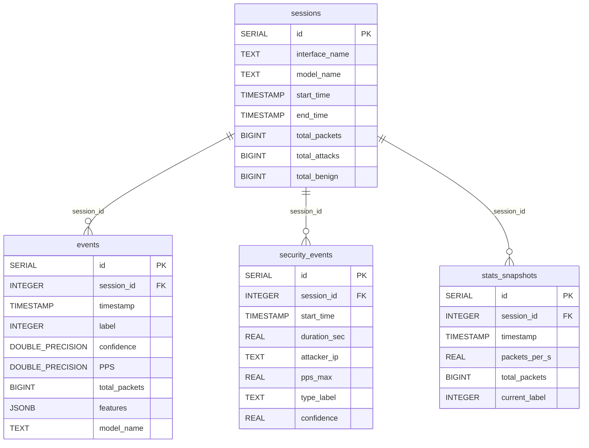
```mermaid
erDiagram
    sessions {
        SERIAL id PK
        TEXT interface_name
        TEXT model_name
        TIMESTAMP start_time
        TIMESTAMP end_time
        BIGINT total_packets
        BIGINT total_attacks
        BIGINT total_benign
    }
    events {
        SERIAL id PK
        INTEGER session_id FK
        TIMESTAMP timestamp
        INTEGER label
        DOUBLE_PRECISION confidence
        DOUBLE_PRECISION PPS
        BIGINT total_packets
        JSONB features
        TEXT model_name
    }
    security_events {
        SERIAL id PK
        INTEGER session_id FK
        TIMESTAMP start_time
        REAL duration_sec
        TEXT attacker_ip
        REAL pps_max
        TEXT type_label
        REAL confidence
    }
    stats_snapshots {
        SERIAL id PK
        INTEGER session_id FK
        TIMESTAMP timestamp
        REAL packets_per_s
        BIGINT total_packets
        INTEGER current_label
    }
    sessions ||--o{ events : "session_id"
    sessions ||--o{ security_events : "session_id"
    sessions ||--o{ stats_snapshots : "session_id"
```

<p align="center">Рис. 2.9. ERD-схема базы данных</p>

Детальное описание структуры и назначения каждой таблицы приведено в таблицах ниже. Таблица 2.8 является наиболее нагруженной и служит основным источником данных для обучения и верификации моделей.

<p align="right">Таблица 2.8</p>
<p align="center"><b>События обнаружения (`events`)</b></p>

| Поле | Тип PostgreSQL | Описание |
|---|---|---|
| `id` | `SERIAL PRIMARY KEY` | Уникальный идентификатор |
| `session_id` | `INTEGER` | Внешний ключ к таблице `sessions` |
| `timestamp` | `TIMESTAMP NOT NULL` | Временна́я метка события |
| `label` | `INTEGER NOT NULL` | Метка (0 — норма, 1 — атака) |
| `confidence` | `DOUBLE PRECISION` | Уверенность классификатора [0..1] |
| `PPS` | `DOUBLE PRECISION` | Пакетов в секунду за окно |
| `total_packets` | `BIGINT` | Всего пакетов в окне |
| `features` | `JSONB` | Вектор извлеченных признаков в формате JSON |
| `model_name` | `TEXT` | Имя использованной модели |

Описание полей таблицы сессий мониторинга приведено в табл. 2.9.

<p align="right">Таблица 2.9</p>
<p align="center"><b>Сессии мониторинга (`sessions`)</b></p>

| Поле | Тип PostgreSQL | Описание |
|---|---|---|
| `id` | `SERIAL PRIMARY KEY` | Уникальный идентификатор сессии |
| `interface_name` | `TEXT` | Имя сетевого интерфейса |
| `model_name` | `TEXT` | Имя загруженной модели |
| `start_time` | `TIMESTAMP` | Начало сессии |
| `end_time` | `TIMESTAMP` | Конец сессии |
| `total_packets` | `BIGINT` | Всего обработано пакетов |
| `total_attacks` | `BIGINT` | Обнаружено атак (окон с меткой 1) |
| `total_benign` | `BIGINT` | Количество легитимных окон |

Структура данных об инцидентах безопасности представлена в табл. 2.10.

<p align="right">Таблица 2.10</p>
<p align="center"><b>Инциденты атак (`security_events`)</b></p>

| Поле | Тип PostgreSQL | Описание |
|---|---|---|
| `id` | `SERIAL PRIMARY KEY` | Уникальный идентификатор инцидента |
| `session_id` | `INTEGER` | Внешний ключ к сессии |
| `start_time` | `TIMESTAMP NOT NULL` | Начало атаки |
| `duration_sec` | `REAL` | Продолжительность атаки (секунды) |
| `attacker_ip` | `TEXT` | IP-адрес основного источника |
| `pps_max` | `REAL` | Пиковая интенсивность (пак/с) |
| `type_label` | `TEXT` | Тип атаки («DDoS Attack» и др.) |
| `confidence` | `REAL` | Максимальная уверенность за инцидент |

Состав полей таблицы снимков статистики трафика приведен в табл. 2.11.

<p align="right">Таблица 2.11</p>
<p align="center"><b>Снимки трафика (`stats_snapshots`)</b></p>

| Поле | Тип PostgreSQL | Описание |
|---|---|---|
| `id` | `SERIAL PRIMARY KEY` | Уникальный идентификатор |
| `session_id` | `INTEGER` | Внешний ключ к сессии |
| `timestamp` | `TIMESTAMP NOT NULL` | Временна́я метка снимка |
| `packets_per_s` | `REAL` | Пакетов в секунду |
| `total_packets` | `BIGINT` | Всего пакетов (нарастающий итог) |
| `current_label` | `INTEGER` | Текущая метка классификации |

### 2.4. Разработка схемы алгоритмов

Логика функционирования программного комплекса декомпозирована на три ключевых алгоритма, описывающих жизненный цикл обработки данных, процесс математической подготовки признаков и механизм активного противодействия угрозам.

#### 2.4.1. Алгоритм главного цикла обработки (инференс-цикл)

Основной цикл обработки, инкапсулированный в классе `DetectionEngine`, реализует стратегию непрерывного мониторинга. Алгоритм спроектирован так, чтобы минимизировать время прохождения данных от сетевого интерфейса до классификатора, обеспечивая при этом защиту от ложных срабатываний на незначительном сетевом фоне.

Ключевой особенностью является разделение на «быстрый путь» (захват пакетов в очередь) и «аналитический путь» (извлечение признаков и инференс), работающих в параллельных потоках. На рис. 2.10 представлена схема алгоритма, включающая этап инициализации, фильтрацию фонового шума и логику принятия решения о блокировке.

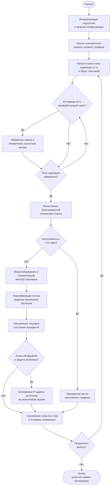
```mermaid
flowchart TD
    Start(["Начало"]) --> Init["Инициализация подсистем\nи загрузка конфигурации"]
    Init --> Capture["Запуск асинхронного\nзахвата сетевого трафика"]
    Capture --> LoopStart["Начало нового окна агрегации (1 с)\nи сброс счетчиков"]
    LoopStart --> Dequeue{"В очереди есть\nнеобработанный пакет?"}
    Dequeue -- Да --> Process["Обработка пакета и\nобновление статистики потока"]
    Process --> TimeCheck{"Окно агрегации\nзавершено?"}
    TimeCheck -- Нет --> Dequeue
    TimeCheck -- Да --> Telemetry["Вычисление агрегированной\nтелеметрии (пак/с)"]
    Dequeue -- Нет --> TimeCheck
    Telemetry --> Noise{"Интенсивность\n< 50 пак/с?"}
    Noise -- Да --> Benign["Присвоение метки\nлегитимного трафика"]
    Noise -- Нет --> Features["Масштабирование и нормализация\nвектора признаков"]
    Features --> Infer["Классификация потока\nмоделью машинного обучения"]
    Infer --> Incident["Обновление текущего\nсостояния инцидента"]
    Incident --> Block{"Атака обнаружена\nи защита включена?"}
    Block -- Да --> Firewall["Блокировка IP-адреса источника\nна межсетевом экране"]
    Block -- Нет --> Callback
    Firewall --> Callback["Сохранение события в БД\nи отправка телеметрии"]
    Benign --> Callback
    Callback --> Running{"Продолжить\nработу?"}
    Running -- Да --> LoopStart
    Running -- Нет --> Stop(["Конец\n(очистка правил блокировки)"])
```

<p align="center">Рис. 2.10. Схема алгоритма главного цикла</p>

Алгоритм работы подсистемы `ddos_collector`:

1) Инициализация ConfigManager: загрузка config.JSON (путь к модели, параметры БД, имя интерфейса)
2) Инициализация ModelInferencer: загрузка ONNX-модели через `Ort::Session`
3) Загрузка параметров масштабировщика: JSON-файл → `FeatureExtractor::ScalerParams`
4) Подключение к PostgreSQL; создание таблиц (если не существуют); создание сессии
5) Инициализация TcpServer для потоковой передачи данных в `ddos_monitor`
6) Вызов `TrafficMonitor::startCapture()` → захват пакетов в lock-free очередь
7) Запуск потока инференса (`DetectionEngine::inferenceLoop()`):
   - Начало окна агрегации (1 секунда): `FeatureExtractor::reset()`
   - Цикл извлечения пакетов: `dequeuePacket()` → `processPacket()`
   - По истечении окна: `computeNormalizedFeatures()` → вектор признаков
   - Проверка порога шума (PPS < 50): если слишком тихо — метка «норма» без инференса
   - `ModelInferencer::predict()` → (метка, уверенность)
   - `updateIncidentState()`: отслеживание переходов атака↔норма
   - Если атака и mitigation включён: `FirewallManager::blockIp(topAttacker)`
   - Если атака завершилась: `FirewallManager::unblockAllIps()`
   - `resultCallback_()` → DatabaseManager (async enqueue) + TcpServer (live send)
8) При остановке: `stopCapture()`, `closeSession()`, очистка правил фаервола

#### 2.4.2. Алгоритм извлечения и нормализации признаков

Алгоритм извлечения признаков выполняет критически важную трансформацию сырых байтовых данных в структурированное признаковое описание сетевого поведения. Процесс основан на глубоком разборе заголовков пакетов уровней L2-L4 и агрегации статистики в рамках скользящего временного окна.

Применение агрегации по всем активным потокам позволяет системе детектировать не только точечные атаки на конкретный порт, но и распределенные воздействия (DDoS), характеризующиеся аномальным всплеском активности по всему интерфейсу. Завершающий этап алгоритма — математическая стандартизация — гарантирует, что входные данные для ML/DL-моделей будут находиться в сопоставимых диапазонах, что исключает доминирование признаков с большой размерностью (например, количество байт) над флагами. На рис. 2.11 детально показан процесс парсинга пакетов и пайплайн нормализации.

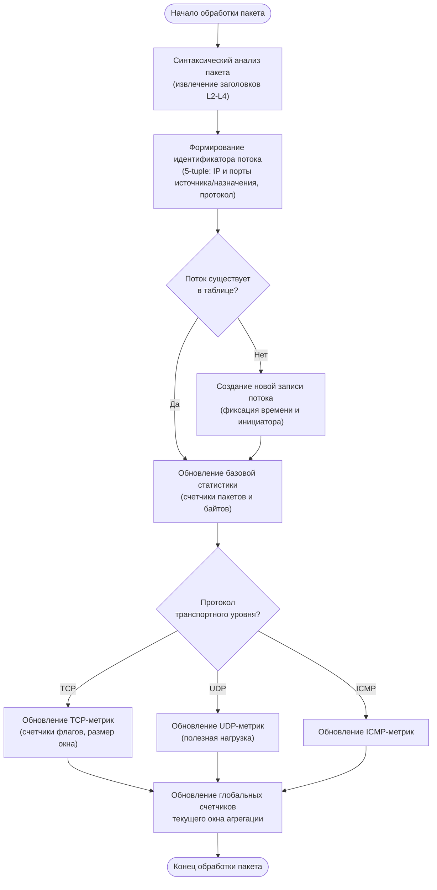
```mermaid
flowchart TD
    Start(["Начало обработки пакета"]) --> Parse["Синтаксический анализ пакета\n(извлечение заголовков L2-L4)"]
    Parse --> Tuple["Формирование идентификатора потока\n(5-tuple: IP и порты источника/назначения, протокол)"]
    Tuple --> FindFlow{"Поток существует\nв таблице?"}
    FindFlow -- Нет --> Create["Создание новой записи потока\n(фиксация времени и инициатора)"]
    FindFlow -- Да --> Update
    Create --> Update["Обновление базовой статистики\n(счетчики пакетов и байтов)"]
    Update --> Proto{"Протокол\nтранспортного уровня?"}
    Proto -- TCP --> TCP_Flags["Обновление TCP-метрик\n(счетчики флагов, размер окна)"]
    Proto -- UDP --> UDP_End["Обновление UDP-метрик\n(полезная нагрузка)"]
    Proto -- ICMP --> ICMP_End["Обновление ICMP-метрик"]
    TCP_Flags --> Global
    UDP_End --> Global
    ICMP_End --> Global["Обновление глобальных счетчиков\nтекущего окна агрегации"]
    Global --> End(["Конец обработки пакета"])
```

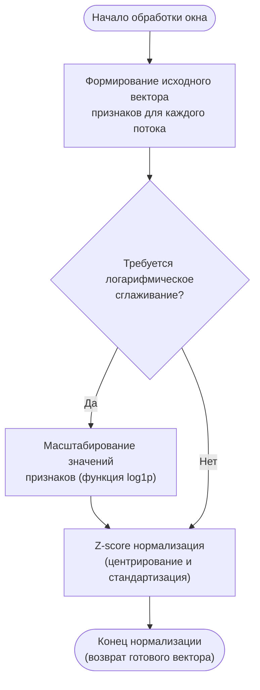
```mermaid
flowchart TD
    Start(["Начало обработки окна"]) --> NF1["Формирование исходного вектора\nпризнаков для каждого потока"]
    NF1 --> NF2{"Требуется логарифмическое\nсглаживание?"}
    NF2 -- Да --> NF3["Масштабирование значений\nпризнаков (функция log1p)"]
    NF3 --> NF4
    NF2 -- Нет --> NF4["Z-score нормализация\n(центрирование и стандартизация)"]
    NF4 --> NF5(["Конец нормализации\n(возврат готового вектора)"])
```

<p align="center">Рис. 2.11. Схема алгоритма извлечения признаков</p>

1) Получить `PacketBuffer*` из очереди (содержит сырые байты и метку времени)
2) Распаковать через PcapPlusPlus: `Ethernet → IP → TCP/UDP/ICMP`
3) Извлечь 5-tuple: (src\_ip, dst\_ip, src\_port, dst\_port, proto)
4) Найти или создать запись `FlowStats` в `activeFlows_[FlowKey]`
5) Обновить счётчики потока: `fwdPackets++`, `fwdBytes += len`
6) Если TCP: обновить счётчики флагов (`synPackets`, `ackPackets`, `finPackets`, `rstPackets`, `pshPackets`, `urgPackets`); обновить `tcpWindowSizeTotal`
7) Обновить глобальные счётчики окна: `totalPackets_`, `tcpPackets_` / `udpPackets_` / `icmpPackets_`, `totalBytes_`
8) По окончании окна (`computeNormalizedFeatures()`):
   - Для каждого активного потока: вычислить вектор признаков из `FlowStats`
   - Применить z-score: `x' = (x - μᵢ) / σᵢ`
   - Если `useLog1p`: предварительно `x = log(1 + x)` перед нормализацией
   - Вернуть вектор `vector<double>` (один вектор для «тяжёлого» потока или батч)

#### 2.4.3. Алгоритм блокировки источника атаки

Алгоритм блокировки реализует реактивную часть системы защиты. Его основной задачей является оперативное внесение изменений в правила фильтрации операционной системы при обнаружении деструктивного воздействия, подтвержденного классификатором.

Логика алгоритма построена на концепции конечного автомата, отслеживающего переходы между состояниями «Норма» и «Атака». Это позволяет не только мгновенно блокировать нарушителя через системные вызовы Windows Firewall, но и автоматически восстанавливать доступ после прекращения атаки, исключая избыточную нагрузку на системный брандмауэр и предотвращая случайную блокировку легитимных пользователей на длительный срок. На рис. 2.12 изображена логика взаимодействия с брандмауэром и управление списком активных блокировок.

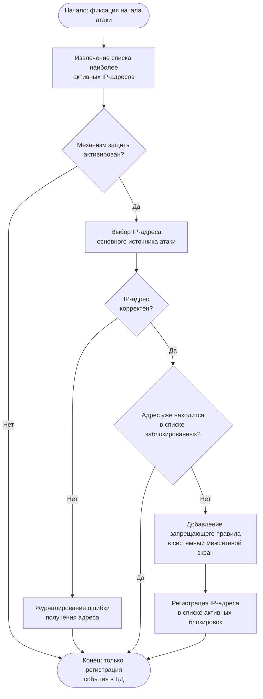
```mermaid
flowchart TD
    Start(["Начало: фиксация начала атаки"]) --> ExtractIPs["Извлечение списка наиболее\nактивных IP-адресов"]
    ExtractIPs --> CheckMitigation{"Механизм защиты\nактивирован?"}
    CheckMitigation -- Нет --> EndOnlyDB(["Конец: только регистрация\nсобытия в БД"])
    CheckMitigation -- Да --> GetTopIP["Выбор IP-адреса\nосновного источника атаки"]
    GetTopIP --> CheckIPValid{"IP-адрес\nкорректен?"}
    CheckIPValid -- Нет --> LogError["Журналирование ошибки\nполучения адреса"]
    LogError --> EndOnlyDB
    CheckIPValid -- Да --> CheckAlreadyBlocked{"Адрес уже находится\nв списке заблокированных?"}
    CheckAlreadyBlocked -- Да --> EndOnlyDB
    CheckAlreadyBlocked -- Нет --> BlockIP["Добавление запрещающего правила\nв системный межсетевой экран"]
    BlockIP --> UpdateList["Регистрация IP-адреса\nв списке активных блокировок"]
    UpdateList --> EndOnlyDB
```

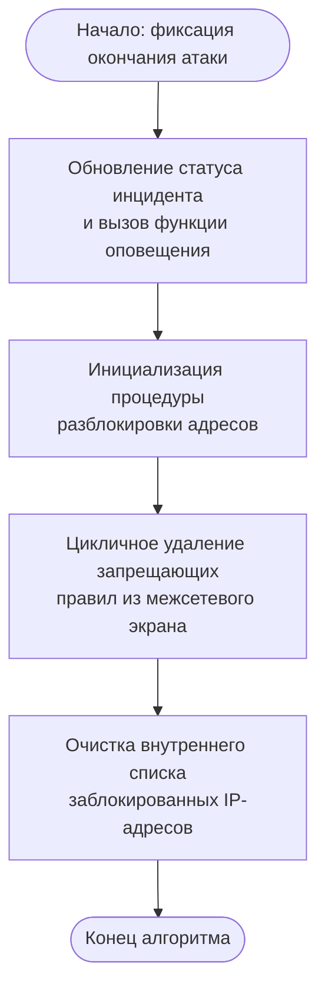
```mermaid
flowchart TD
    Start(["Начало: фиксация окончания атаки"]) --> UpdateState["Обновление статуса инцидента\nи вызов функции оповещения"]
    UpdateState --> InitUnblock["Инициализация процедуры\nразблокировки адресов"]
    InitUnblock --> UnblockIPs["Цикличное удаление запрещающих\nправил из межсетевого экрана"]
    UnblockIPs --> ClearList["Очистка внутреннего списка\nзаблокированных IP-адресов"]
    ClearList --> End(["Конец алгоритма"])
```

<p align="center">Рис. 2.12. Схема алгоритма блокировки</p>

1) Получить список topTalkers из `DetectionResult` (top IP-источников по числу пакетов)
2) Проверить: не находится ли IP уже в `activeBlockedIps_` (мьютекс `g_firewallMutex`)
3) Если уже заблокирован — пропустить (идемпотентная операция)
4) Если не заблокирован:
   - Валидировать формат IP через `QHostAddress`
   - Сформировать команду: `netsh advfirewall firewall add rule name=DDoS_Block_<IP> dir=in action=block remoteip=<IP>`
   - Выполнить через `QProcess::startDetached()`
   - Добавить IP в `activeBlockedIps_`
5) При переходе «атака → норма» (в `DetectionEngine::updateIncidentState()`):
   - Вызвать `FirewallManager::unblockAllIps()`
   - Для каждого IP в `activeBlockedIps_`: выполнить `netsh advfirewall firewall delete rule name=DDoS_Block_<IP>`
   - Очистить `activeBlockedIps_`

### 2.5. Проектирование структуры программы ddos_monitor

Программа `ddos_monitor` является клиентской программой, обеспечивающим интерфейс взаимодействия между оператором безопасности и ядром системы. Архитектура монитора построена в соответствии с принципами объектно-ориентированного подхода (ООП) на базе фреймворка Qt6 с использованием модульного паттерна, где каждая функциональная область (графики, логи, история) выделена в независимый класс-виджет. На рис. 2.13 приведена диаграмма классов программы `ddos_monitor`.

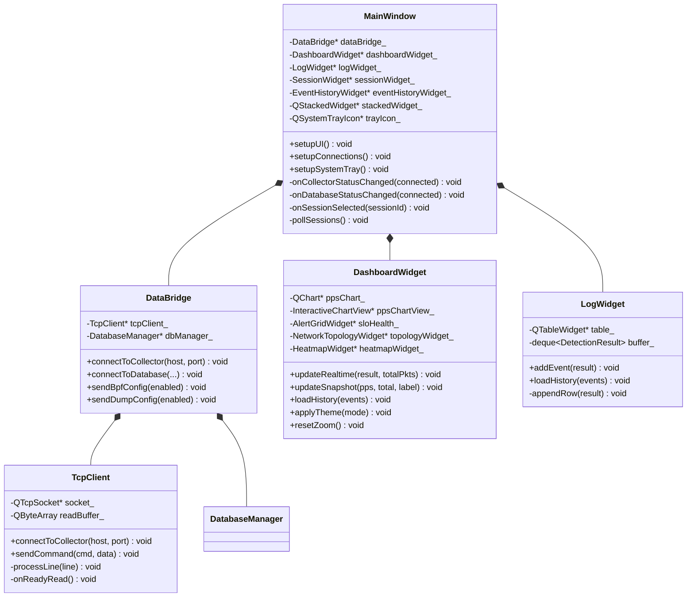
```mermaid
classDiagram
  class MainWindow {
    -DataBridge* dataBridge_
    -DashboardWidget* dashboardWidget_
    -LogWidget* logWidget_
    -SessionWidget* sessionWidget_
    -EventHistoryWidget* eventHistoryWidget_
    -QStackedWidget* stackedWidget_
    -QSystemTrayIcon* trayIcon_
    +setupUI() void
    +setupConnections() void
    +setupSystemTray() void
    -onCollectorStatusChanged(connected) void
    -onDatabaseStatusChanged(connected) void
    -onSessionSelected(sessionId) void
    -pollSessions() void
  }
  
  class DataBridge {
    -TcpClient* tcpClient_
    -DatabaseManager* dbManager_
    +connectToCollector(host, port) void
    +connectToDatabase(...) void
    +sendBpfConfig(enabled) void
    +sendDumpConfig(enabled) void
  }

  class DashboardWidget {
    -QChart* ppsChart_
    -InteractiveChartView* ppsChartView_
    -AlertGridWidget* sloHealth_
    -NetworkTopologyWidget* topologyWidget_
    -HeatmapWidget* heatmapWidget_
    +updateRealtime(result, totalPkts) void
    +updateSnapshot(pps, total, label) void
    +loadHistory(events) void
    +applyTheme(mode) void
    +resetZoom() void
  }

  class LogWidget {
    -QTableWidget* table_
    -deque~DetectionResult~ buffer_
    +addEvent(result) void
    +loadHistory(events) void
    -appendRow(result) void
  }

  class TcpClient {
    -QTcpSocket* socket_
    -QByteArray readBuffer_
    +connectToCollector(host, port) void
    +sendCommand(cmd, data) void
    -processLine(line) void
    -onReadyRead() void
  }

  MainWindow *-- DataBridge
  MainWindow *-- DashboardWidget
  MainWindow *-- LogWidget
  DataBridge *-- TcpClient
  DataBridge *-- DatabaseManager
```

<p align="center">Рис. 2.13. Диаграмма классов программы ddos_monitor</p>

Такой дизайн позволяет изолировать логику сетевого взаимодействия и работы с БД от кода визуализации, упрощая масштабирование интерфейса. Программа обеспечивает не только пассивное наблюдение за метриками, но и активное управление коллектором, включая смену моделей и режимов защиты в реальном времени.

В табл. 2.12 приведено описание основных методов и полей главного класса `MainWindow`.

<p align="right">Таблица 2.12</p>
<p align="center"><b>Поля и методы класса MainWindow</b></p>

| Имя | Тип | Описание | Входные параметры | Выходное значение |
|---|---|---|---|---|
| `setupUI` | Метод | Инициализация графических компонентов и компоновка | — | — |
| `setupConnections` | Метод | Настройка сигнально-слотовых связей | — | — |
| `onSessionSelected` | Метод | Слот выбора сессии из списка | `sessionId: int` | — |
| `dataBridge_` | Поле | Объект-прослойка для работы с сетью и БД | — | `DataBridge*` |
| `dashboardWidget_` | Поле | Главный виджет мониторинга | — | `DashboardWidget*` |
| `stackedWidget_` | Поле | Контейнер для переключения между вкладками | — | `QStackedWidget*` |

Для взаимодействия с подсистемой сбора используется класс `TcpClient`, описание методов которого приведено в табл. 2.13.

<p align="right">Таблица 2.13</p>
<p align="center"><b>Поля и методы класса TcpClient</b></p>

| Имя | Тип | Описание | Входные параметры | Выходное значение |
|---|---|---|---|---|
| `connectToCollector` | Метод | Установка соединения с `ddos_collector` | `host, port` | `void` |
| `sendCommand` | Метод | Отправка управляющей команды в формате JSON | `cmd, data` | `void` |
| `processLine` | Метод | Парсинг входящей строки JSON в структуру результата | `line: QByteArray` | — |
| `socket_` | Поле | Низкоуровневый TCP-сокет Qt | — | `QTcpSocket*` |
| `readBuffer_` | Поле | Буфер для накопления фрагментированных данных | — | `QByteArray` |
| `dataReceived` | Сигнал | Сигнал о получении нового DetectionResult | `result` | — |

В табл. 2.14 приведено описание программных модулей монитора, а в табл. 2.15 — детальный перечень элементов управления и их назначение.

<p align="right">Таблица 2.14</p>
<p align="center"><b>Описание программных модулей монитора</b></p>

| Модуль (файл) | Назначение |
|---|---|
| `DashboardWidget` (monitor_ui/DashboardWidget.cpp/.hpp) | Главный виджет: графики трафика, карточки статистики, управление |
| `EventHistoryWidget` (monitor_ui/EventHistoryWidget.cpp/.hpp) | Таблица истории событий обнаружения из БД |
| `LogWidget` (monitor_ui/LogWidget.cpp/.hpp) | Консоль лога событий программы |
| `SessionWidget` (monitor_ui/SessionWidget.cpp/.hpp) | Просмотр завершённых сессий мониторинга |
| `ReportGenerator` (monitor_ui/ReportGenerator.cpp/.hpp) | Формирование детальных отчетов об инцидентах в формате PDF |
| `CSVUtils` (common/CSVUtils.hpp) | Вспомогательные функции для экспорта табличных данных в CSV |
| `ThemePalette` (monitor_ui/ThemePalette.cpp/.hpp) | Цветовая схема и стилизация (QSS) интерфейса |
| `DatabaseManager` (common/DatabaseManager.cpp/.hpp) | Чтение данных из БД (совместно с коллектором) |
| `TcpClient` (common/TcpClient.cpp/.hpp) | Подключение к TcpServer коллектора |

<p align="right">Таблица 2.15</p>
<p align="center"><b>Основные элементы управления и визуализации</b></p>

| Элемент | Тип Qt | Расположение | Назначение |
|---|---|---|---|
| График трафика | `QChart` / `QAreaSeries` | `DashboardWidget` | Многослойное отображение PPS по протоколам (TCP, UDP, ICMP) |
| Карточки статистики | `QLabel` | `DashboardWidget` | Счётчики: всего пакетов, PPS, интенсивность потерь (Drop Rate) |
| Управление защитой | `QCheckBox` | `DashboardWidget` | Переключение между режимом мониторинга и автоблокировкой IP |
| Выбор модели | `QComboBox` | **Toolbar** | Горячая замена ML/DL-модели в runtime |
| Анализ PCAP | `QPushButton` | **Toolbar** | Запуск воспроизведения pcap-файла для офлайн-анализа |
| Статус БД | `QLabel` | **Toolbar** | Визуальный контроль подключения к PostgreSQL |
| Таймер обновления | `QTimer` | `DashboardWidget` | Опрос метрик системы с интервалом 1000 мс |

### 2.6. Разработка пользовательского интерфейса

#### 2.6.1. Категории пользователей и выполняемые функции

Программный комплекс предназначен для эксплуатации в отделах обеспечения информационной безопасности предприятий. Основной категорией пользователей системы является **Администратор информационной безопасности (оператор ИБ)**. 

В соответствии с ролью администратора, система обеспечивает выполнение следующих функций:
1) **Конфигурирование системы**: выбор сетевого интерфейса, загрузка весов ML-модели, настройка параметров подключения к БД.
2) **Оперативный мониторинг**: наблюдение за интенсивностью трафика (PPS) и результатами классификации в реальном времени.
3) **Управление защитой**: ручное или автоматическое переключение режима блокировки вредоносного трафика.
4) **Ретроспективный анализ**: работа с историей инцидентов, просмотр сессий и воспроизведение pcap-дампов.
5) **Формирование отчетности**: выгрузка данных в форматах PDF/CSV для подготовки документов по инцидентам ИБ.

#### 2.6.2. Интерфейс подсистемы мониторинга (ddos_monitor)

Подсистема `ddos_monitor` реализована как визуальная программа на базе фреймворка Qt6. Интерфейс спроектирован по модульному принципу и состоит из нескольких функциональных форм.

**1. Главная форма («Обзор»)**
Предназначена для визуального контроля состояния сети. 
*   **Вид формы**: центральную часть занимает многослойный график `QChartView`, под ним расположены информационные карточки.
*   **Перечень компонентов**:
    *   `QChart` / `QAreaSeries` — визуализация PPS (TCP, UDP, ICMP) и кривой уверенности модели.
    *   `QLabel` (карточки) — отображение суммарных счетчиков пакетов, текущего PPS и процента потерь (Drop Rate).
    *   `QCheckBox` — переключатель режима «Mitigation» (активная защита).
    *   `QSystemTrayIcon` — индикация состояния в системной области (зеленый — норма, красный — атака).

**2. Форма детальной аналитики**
Обеспечивает глубокий разбор структуры трафика.
*   **Компоненты**:
    *   `AlertGridWidget` — кастомная сетка индикаторов доступности сервиса (SLO).
    *   `NetworkTopologyWidget` — графовое представление наиболее активных источников трафика.
    *   `HeatmapWidget` — тепловая карта активности сетевых портов.
    *   `QPieSeries` — круговая диаграмма распределения протоколов.

**3. Форма журналов и истории**
*   **Компоненты**:
    *   `QTableWidget` — таблица инцидентов безопасности с функциями фильтрации по IP и дате.
    *   `QListWidget` — стилизованная консоль логов с цветовой подсветкой уровней (INFO, WARN, ERROR).
    *   `QPushButton` — кнопки экспорта отчетов («Export PDF», «Export CSV»).

Интерфейс главного окна программы ddos_monitor представлен на рис. 2.14.

<p align="center">
  
</p>
<p align="center">Рис. 2.14. Главное окно ddos_monitor в режиме мониторинга</p>

#### 2.6.3. Интерфейс подсистемы сбора (ddos_collector)

Подсистема `ddos_collector` является консольной программой (CLI). Взаимодействие с пользователем осуществляется через аргументы командной строки при запуске и через вывод статусных сообщений (диалог в реальном времени) в процессе работы.

**Примеры диалогов и команд:**

1) **Запуск мониторинга интерфейса**:
    ```bash
    ddos_collector.exe --interface "Ethernet 2" --model "models/xgb_model.ONNX" --db-host "localhost"
    ```
    *Вывод системы*:
    `[INFO] TrafficMonitor: выбрано устройство 'Ethernet 2' (Realtek PCIe GbE)`
    `[INFO] DetectionEngine: инициализирован с моделью 'xgb_model.ONNX', EP=CPU`
    `[INFO] DatabaseManager: успешно подключено к PostgreSQL: ddos_detection_db`

2) **Запуск анализа pcap-файла**:
    ```bash
    ddos_collector.exe --pcap "dumps/attack_sample.pcap" --list-interfaces
    ```

3) **Диалог обнаружения атаки (вывод в консоль)**:
    При обнаружении аномалии коллектор выводит структурированную информацию:
    ```text
    [2026-05-26 14:20:05] [SECURITY] !!! DDoS Attack Detected !!!
    [STATS] PPS: 15420 | Confidence: 0.998 | Latency: 0.45ms
    [MITIGATION] Adding firewall rule for IP: 192.168.1.45
    [INFO] Database: Event recorded for session #12
    ```

4) **Справка по доступным параметрам**:
    ```bash
    ddos_collector.exe --help
    ```
    Отображает полный перечень аргументов: `--interface`, `--pcap`, `--model`, `--ep`, `--db-user` и др.

**

**Вывод по разделу:** спроектированы пользовательские интерфейсы для обеих подсистем комплекса. Графический интерфейс `ddos_monitor` предоставляет администратору ИБ богатый инструментарий визуализации и отчетности, в то время как консольный интерфейс `ddos_collector` обеспечивает эффективное управление процессом сбора данных и автоматическое реагирование на угрозы.

## 3. РЕАЛИЗАЦИЯ ПРОГРАММНОГО КОМПЛЕКСА

В данном разделе рассматриваются ключевые аспекты программной реализации комплекса. Полные исходные коды модулей подсистемы сбора приведены в приложении Б, подсистемы мониторинга — в приложении В.

### 3.1. Захват пакетов и инициализация PcapPlusPlus

Захват сетевых пакетов реализован с использованием библиотеки PcapPlusPlus — высокоуровневой объектно-ориентированной обёртки над Npcap/libpcap. Выбор данной библиотеки обусловлен необходимостью обеспечения высокой производительности при сохранении типобезопасности и удобства управления ресурсами в языке C++.

В процессе инициализации подсистемы `ddos_collector` выполняется сканирование доступных сетевых интерфейсов. Ключевым требованием является поддержка драйвером режима «смешанного захвата» (promiscuous mode), что позволяет перехватывать все пакеты в сегменте сети, включая те, которые не адресованы непосредственно хосту мониторинга. Инициализация выполняется в методе `TrafficMonitor::startCapture()`. Для поиска устройства по имени или описанию реализована нечёткая двухэтапная стратегия поиска: сначала ищется точное совпадение по имени или IPv4-адресу, затем — по очищенному описанию с приоритетом физических устройств над виртуальными (Hyper-V, Microsoft NDIS):

Листинг 1 (фрагмент) — Инициализация устройства захвата
```cpp
  // 1. Поиск по точному совпадению имени или IP
  for (auto* dev : devList) {
    if (dev->getName() == interfaceName || 
        dev->getIPv4Address().toString() == interfaceName) {
      device_ = dev; break;
    }
  }

  // 2. Нечеткий поиск по описанию с приоритетом физических устройств
  if (!device_) {
    pcpp::PcapLiveDevice* candidate = nullptr;
    for (auto* dev : devList) {
      std::string desc = dev->getDesc();
      // (очистка и поиск подстроки)
      if (desc.find(interfaceName) != std::string::npos) {
        bool isVirtual = desc.find("virtual") != std::string::npos;
        if (!isVirtual) { device_ = dev; break; }
        else if (!candidate) candidate = dev;
      }
    }
    if (!device_) device_ = candidate;
  }
```

Полный исходный код метода `startCapture` и статического обработчика пакетов `onPacketArrived` приведён в приложении Б (листинг Б.1).

Для минимизации накладных расходов на выделение и освобождение памяти (heap allocation) в режиме реального времени в классе `TrafficMonitor` реализован паттерн «Пул объектов» (Object Pool) на базе структуры `PacketBuffer`. Пакеты, поступающие от драйвера, копируются в предварительно аллоцированные буферы и помещаются в lock-free очередь для последующего анализа. После обработки признаков буфер возвращается в пул для повторного использования. Максимальный размер очереди `MAX_QUEUE_SIZE = 500 000` пакетов обеспечивает буферизацию при кратковременных пиках нагрузки, предотвращая потерю данных при всплесках трафика (bursts).

### 3.2. Извлечение признаков и агрегация по потокам

Класс `FeatureExtractor` выполняет критически важную задачу преобразования сырого пакетного трафика в структурированный вектор признаков. В отличие от систем, анализирующих пакеты изолированно, данный комплекс использует потоковую агрегацию (flow aggregation).

Каждый пакет идентифицируется по уникальному 5-tuple: (IP-источника, IP-назначения, порт-источника, порт-назначения, протокол). Для обеспечения корректного анализа двунаправленных сессий (bidirectional flows) в классе реализована нормализация ключа `FlowKey`: адреса и порты сортируются лексикографически, что позволяет объединять пакеты прямого и обратного направлений в одну структуру `FlowStats`. Статистика накапливается в хеш-таблице `std::map` в рамках скользящего окна длительностью 1 секунда.

Листинг 2 — Структуры сетевого потока
```cpp
// Уникальный ключ потока (симметричный 5-tuple)
struct FlowKey {
  std::string ip1, ip2; // IP-адреса, отсортированные лексикографически
  uint16_t port1, port2;
  uint8_t proto;
  // ... операторы сравнения для std::map
};

// Статистические показатели потока за текущее окно агрегации
struct FlowStats {
  std::string initiatorIp;
  uint64_t fwdPackets = 0, bwdPackets = 0;
  uint64_t fwdBytes = 0, bwdBytes = 0;
  // ... счетчики флагов и энтропии
};
```

Математическая подготовка данных включает расчет 16 информативных признаков, включая интенсивность (PPS), распределение TCP-флагов и энтропию полезной нагрузки. Поскольку признаки имеют разную физическую природу и масштабы (например, количество пакетов измеряется единицами, а объём трафика — миллионами байт), обязательным этапом является стандартизация (z-score) по формуле (1.11), приведенной в подразделе 1.4.7. Это исключает доминирование признаков с большими абсолютными значениями при обучении и инференсе ML-модели. Дополнительно поддерживается log1p-преобразование для признаков с тяжёлым хвостом, что позволяет сгладить влияние экстремальных выбросов.

Листинг 3 (фрагмент) — Итерация по признакам при нормализации
```cpp
  // Стандартизация: (x - mean) / std
  for (size_t i = 0; i < raw.size(); ++i) {
    double val = raw[i];
    if (scaler_.useLog1p) val = std::log1p(std::max(0.0, val));
    normalized[i] = (val - scaler_.mean[i]) / 
                    (std::abs(scaler_.scale[i]) > 1e-10 ? scaler_.scale[i] : 1.0);
  }
```

Полный исходный код структур и алгоритма извлечения признаков приведён в приложении Б (листинг Б.2).

### 3.3. ML/DL-инференс через ONNX Runtime

Для выполнения предиктивного анализа в режиме реального времени выбран кроссплатформенный движок ONNX Runtime (ORT). Использование формата ONNX (Open Neural Network Exchange) позволяет разделить этапы обучения (на языке Python с использованием XGBoost, Scikit-Learn или PyTorch) и этап эксплуатации (на языке C++). Это исключает необходимость развёртывания тяжеловесного Python-интерпретатора в производственной среде и обеспечивает высокую скорость инференса за счёт использования оптимизированных графов вычислений. Реализованная обёртка также поддерживает возможность задействования аппаратного ускорения (CUDA, DirectML) через соответствующие Execution Providers, что позволяет масштабировать комплекс на высоконагруженных узлах с графическими сопроцессорами.

Класс `ModelInferencer` инкапсулирует API ONNX Runtime и управляет жизненным циклом сессии (`Ort::Session`). Одной из ключевых особенностей реализации является поддержка «горячей замены» (hot-swap) модели без остановки процесса сбора данных. Для обеспечения потокобезопасности при одновременном выполнении анализа и обновлении весов используется примитив синхронизации `std::shared_mutex`. Потоки инференса захватывают блокировку в разделяемом режиме (shared lock), что позволяет выполнять параллельные предсказания, в то время как процесс загрузки новой модели захватывает эксклюзивную блокировку (unique lock), гарантируя целостность данных в момент переключения сессий.

Листинг 4 (фрагмент) — Выполнение инференса в ONNX Runtime
```cpp
  // Запуск сессии инференса для получения метки класса
  const char* labelOutputName = outputNamePtrs_[0];
  auto outputs = session_->Run(Ort::RunOptions{nullptr}, 
                               inputNamePtrs_.data(), &inputTensor, 1, 
                               &labelOutputName, 1);
```

Полный исходный код модуля инференса, включая механизмы загрузки моделей и управления сессиями, приведён в приложении Б (листинг Б.3).

### 3.4. Управление правилами межсетевого экрана

Подсистема активного противодействия реализована в классе `FirewallManager`, который отвечает за автоматическое блокирование источников вредоносного трафика. В качестве исполнительного механизма используется стандартный межсетевой экран операционной системы Windows (Windows Firewall), управление которым осуществляется через интерфейс командной строки `netsh advfirewall`.

Модуль реализован с использованием паттерна «Одиночка» (Singleton), что гарантирует наличие единственной точки управления правилами фильтрации в системе. Взаимодействие с ОС выполняется асинхронно через класс `QProcess::startDetached`, что исключает блокировку графического интерфейса или потока инференса при ожидании завершения системного вызова. Для предотвращения дублирования правил и снижения нагрузки на стек TCP/IP в классе реализован механизм отслеживания активных блокировок в контейнере `std::set`, что делает операции добавления правил идемпотентными.

Листинг 5 (фрагмент) — Формирование команды блокировки IP
```cpp
  QStringList args;
  args << "advfirewall" << "firewall" << "add" << "rule"
       << "name=DDoS_Block_" + addr.toString()
       << "dir=in" << "action=block"
       << "remoteip=" + addr.toString();

  QProcess::startDetached("netsh", args);
```

В системе также реализован алгоритм «мягкой разблокировки»: при переходе сетевого состояния из «атака» в «норма» система автоматически удаляет все правила с префиксом `DDoS_Block_`, восстанавливая доступ для заблокированных адресов. Полный исходный код модуля управления межсетевым экраном приведён в приложении Б (листинг Б.4).

### 3.5. Оркестрация: цикл инференса DetectionEngine

Центральным координирующим узлом подсистемы сбора является класс `DetectionEngine`. Он управляет жизненным циклом потока анализа и обеспечивает взаимодействие между захватом пакетов, извлечением признаков и выполнением ML-инференса.

Основной цикл инференса работает в выделенном высокоприоритетном потоке. Работа организована по принципу «оконной агрегации»: в течение 1 секунды система накапливает статистику по всем активным потокам, после чего формируется сводный вектор признаков. Ключевой оптимизацией является использование «порога шума» (Noise Threshold): если суммарная интенсивность трафика на интерфейсе составляет менее 50 пакетов в секунду, система автоматически присваивает окну метку «норма» без вызова нейросетевого классификатора. Это позволяет значительно снизить нагрузку на процессор в периоды сетевого затишья и исключить ложные срабатывания на единичных пакетах.

Листинг 6 (упрощённый фрагмент) — Проверка порога активности и запуск анализа
```cpp
  // Проверка порога активности трафика (NOISE_THRESHOLD_PPS = 50)
  if (result.pps < NOISE_THRESHOLD_PPS) {
    result.label = 0; result.confidence = 0.0f;
  } else {
    auto features = extractor_.computeNormalizedFeatures();
    // Конвертация vector<double> → vector<float> для API ONNX Runtime
    std::vector<float> featFloat(features.begin(), features.end());
    auto [label, conf] = inferencer_.predict(featFloat);
    result.label = label; result.confidence = conf;
  }
```

Управление состоянием защиты реализовано через механизм обратных вызовов (callbacks). При обнаружении атаки оркестратор не только инициирует блокировку через `FirewallManager`, но и отправляет структурированный объект `DetectionResult` в асинхронную очередь базы данных и по сетевому протоколу в графический монитор. Полный исходный код оркестратора `DetectionEngine` приведён в приложении Б (листинг Б.5).

### 3.6. Асинхронная запись в базу данных

Для обеспечения долговременного хранения истории инцидентов и возможности последующего ретроспективного анализа в системе используется РСУБД PostgreSQL. Учитывая высокие требования к пропускной способности (NFR-001), прямое выполнение SQL-запросов `INSERT` в основном потоке обработки пакетов недопустимо из-за высоких задержек дискового ввода-вывода.

В классе `DatabaseManager` реализован паттерн проектирования «Производитель-Потребитель» (Producer-Consumer). Основной поток инференса лишь помещает результаты в неблокирующую lock-free очередь `moodycamel::ConcurrentQueue`, в то время как фоновый поток записи выполняет пакетный сброс данных (batch flush) каждые 5 секунд. Для достижения максимальной скорости записи используется специализированный механизм `COPY` (через интерфейс `stream_to` библиотеки libpqxx), который передаёт данные в бинарном виде, минуя этап парсинга SQL-команд сервером БД. Это позволяет системе сохранять стабильность даже при регистрации тысяч событий в секунду.

Листинг 7 (фрагмент) — Инициализация потока высокопроизводительной записи
```cpp
  pqxx::work txn(conn);
  // Использование механизма COPY для оптимизации записи
  auto stream = pqxx::stream_to::table(txn, {"events"}, 
      {"session_id", "timestamp", "label", "confidence", "pps", 
       "total_packets", "features", "model_name"});
```

Для обеспечения надёжности (требование NFR-005) в модуле реализован механизм «горячего резервирования»: при временной потере сетевого соединения с сервером БД система автоматически переключается на запись событий в локальный файл `FileBuffer`. После восстановления связи данные из файла считываются и дозаписываются в PostgreSQL в хронологическом порядке. Полный исходный код модуля взаимодействия с БД приведён в приложении Б (листинг Б.6).

### 3.7. Обучение модели классификатора

Процесс разработки интеллектуального ядра системы включал этапы сбора данных, конструирования признаков (Feature Engineering), обучения ансамблевых моделей и нейронных сетей, а также их последующий экспорт для высокопроизводительного инференса на языке C++.

**Подготовка набора данных и предобработка**

Для обучения классификаторов использовался открытый набор данных **CIC-DDoS2019**, содержащий записи реального трафика с различными типами современных DoS-воздействий (SYN Flood, UDP Flood, LDAP/DNS Amplification). В ходе подготовки данных в среде Python выполнены следующие операции:
1) **Очистка и нормализация**: удаление дубликатов, обработка пропущенных значений и бесконечных величин (Infinity), возникающих при делении на крайне малую длительность потока.
2) **Балансировка классов**: устранение диспропорции между количеством легитимных пакетов и пакетов атаки методом стратифицированной выборки (stratified sampling) при разбиении на обучающую и тестовую выборки, что обеспечивает репрезентативное представление обоих классов.
3) **Отбор признаков**: корреляционный анализ позволил исключить избыточные переменные, оставив 16 наиболее информативных характеристик, описывающих временну́ю динамику и структуру заголовков.

**Гиперпараметры и выбор моделей**

В рамках исследования были обучены и протестированы три архитектуры:
- **Random Forest (RF)**: конфигурация из 50 решающих деревьев с ограничением глубины до 10 уровней для предотвращения переобучения. Модель показала высокую устойчивость к шумам в данных.
- **Multi-Layer Perceptron (MLP)**: полносвязная сеть с двумя скрытыми слоями (64 и 32 нейрона соответственно) и функцией активации ReLU. Обучение проводилось с использованием оптимизатора Adam и механизма `early_stopping`.
- **XGBoost**: градиентный бустинг с 200 итерациями и скоростью обучения 0,1. Данная модель выбрана в качестве основной благодаря наилучшему балансу между точностью (F1-score = 0,9997) и вычислительной сложностью.

**Экспорт параметров масштабировщика**

Для обеспечения идентичности вычислений между средой обучения (Python) и средой исполнения (C++) реализован механизм экспорта: средние значения (μ) и стандартные отклонения (σ) сохраняются в JSON-формате:

Листинг 8 — Параметры масштабировщика (JSON)
```JSON
{
  "features": ["flow_duration", "total_fwd_packets", "total_bwd_packets",
        "total_len_fwd", "total_len_bwd", "fwd_mean", "bwd_mean",
        "flow_pps", "syn_packets", "ack_packets", "fin_packets",
        "rst_packets", "psh_packets", "urg_packets",
        "entropy", "avg_window_size"],
  "mean": [1.25e5, 45.2, 12.1, 58400.0, 8200.0, 1295.6, 683.5, 1820.4, 18.3, 42.1, 5.7, 2.1, 9.4, 0.1, 4.81, 8192.0],
  "scale": [3.1e4, 12.8, 6.3, 15200.0, 3100.0, 450.2, 280.1, 920.5, 9.2, 21.3, 3.1, 1.5, 4.8, 0.3, 0.72, 2048.0],
  "use_log1p": true
}
```

**Экспорт моделей в ONNX**

Модели экспортируются в универсальный формат ONNX с использованием библиотеки `skl2onnx`. При экспорте отключается надстройка `ZipMap` (`zipmap=False`), что позволяет получать вероятности классов в виде прямого тензора `FloatTensor`, читаемого C++ API ONNX Runtime:

Листинг 9 — Экспорт модели в формат ONNX
```python
# Функция экспорта обученной scikit-learn модели в ONNX
from skl2onnx import convert_sklearn
from skl2onnx.common.data_types import FloatTensorType

def export_onnx_model(model, num_features, filename):
  # Определение типа и размерности входных данных
  initial_type = [('float_input', FloatTensorType([None, num_features]))]

  # Отключение zipmap для получения прямого тензора вероятностей (FloatTensor)
  options = {id(model): {'zipmap': False}}

  # Конвертация модели
  onnx_model = convert_sklearn(model, initial_types=initial_type, options=options)

  # Сохранение сериализованной модели в файл
  with open(filename, "wb") as f:
    f.write(onnx_model.SerializeToString())
```

Результат — файлы `model.ONNX` и `scaler_params.JSON`, загружаемые в комплекс при старте без перекомпиляции. Полный текст скрипта обучения на языке Python приведен в приложении Д.

### 3.8. Реализация графического мониторинга на базе Qt6

Подсистема визуализации `ddos_monitor` разработана с использованием объектно-ориентированного фреймворка Qt6. Архитектура программы базируется на принципе разделения логики сетевого взаимодействия и графического представления (паттерн MVVM-lite), что обеспечивает отзывчивость интерфейса при обработке интенсивных потоков данных.

Ключевым компонентом монитора является класс `DashboardWidget`, реализующий многопоточную отрисовку графиков интенсивности трафика. Для минимизации нагрузки на графическую подсистему используется механизм «скользящего окна» (Sliding Window) с ограничением количества одновременно отображаемых точек (до 300 элементов). Обновление метрик выполняется асинхронно по сигналам от класса `DataBridge`, который выполняет десериализацию входящих JSON-пакетов от коллектора. Такой подход позволяет сохранять стабильную частоту кадров (FPS) даже при экстремальных сетевых нагрузках свыше 100 000 PPS.

Взаимодействие с пользователем реализовано через систему уведомлений в системном трее (`QSystemTrayIcon`), обеспечивающую мгновенное оповещение администратора ИБ о критических инцидентах даже при свёрнутом окне программы.

**

**Вывод по разделу:** в ходе выполнения работы были реализованы все функциональные модули программного комплекса. Захват пакетов построен на базе высокопроизводительной lock-free очереди, обеспечивающей обработку трафика без потерь. Инференс ML-моделей (XGBoost, RF, MLP) выполняется через нативное C++ API ONNX Runtime с задержкой менее 1 мс. Разработанные механизмы асинхронной записи в БД PostgreSQL и автоматического управления правилами Windows Firewall позволяют системе эффективно противодействовать DDoS-атакам в режиме реального времени. Графический интерфейс на базе Qt6 обеспечивает удобный мониторинг и управление всеми параметрами комплекса.

## 4. ТЕСТИРОВАНИЕ И ОЦЕНКА ЭФФЕКТИВНОСТИ

### 4.1. Матрица трассировки требований

Для подтверждения полноты реализации всех заложенных проектных решений разработана матрица трассировки требований. Она связывает каждое функциональное (FR) и нефункциональное (NFR) требование, сформулированное в подразделе 1.6, с конкретными сценариями тестирования. Такой подход позволяет гарантировать, что ни один аспект технического задания не остался без верификации. В табл. 4.1 приведен перечень требований и соответствующих им тест-кейсов.

<p align="right">Таблица 4.1</p>
<p align="center"><b>Матрица трассировки: требования ↔ тест-кейсы</b></p>

| Требование | Описание | Тест-кейс | Метод проверки |
|---|---|---|---|
| FR-001 | Захват пакетов | Т-01 | Функциональный |
| FR-002 | Агрегация по потокам | Т-02 | Модульный (анализ журналов) |
| FR-003 | Нормализация признаков | Т-03 | Модульный (анализ журналов) |
| FR-004 | Классификация трафика (XGBoost, RF, MLP) | Т-02, Т-03, Т-04, Т-05 | Функциональный + метрики |
| FR-005 | Запись в БД | Т-02..Т-05 | Проверка содержимого БД |
| FR-006 | Автоблокировка | Т-02, Т-03, Т-04 | Проверка правил netsh |
| FR-007 | Разблокировка | Т-06 | Функциональный |
| FR-008 | Отображение в GUI | Т-07 | Визуальный |
| FR-009 | Управление из GUI | Т-08, Т-09 | Функциональный |
| NFR-001 | Производительность ≥10 000 пак/с | Т-10 | Нагрузочный (бенчмарк) |
| NFR-002 | Время реакции ≤5 с | Т-02..Т-04 | Измерение меток времени |
| NFR-003 | F1 ≥ 0,90 | Т-11 | Оценка метрик на датасете |
| NFR-005 | Надёжность (буфер) | Т-12 | Автоматизированный (unit-test) |
| NFR-006 | Совместимость | Т-13 | Сборка + smoke-тест |

### 4.2. Программа и методика испытаний (ПМИ)

Настоящий подраздел определяет состав, объем и методы испытаний программного комплекса в соответствии с требованиями ГОСТ 19.301-79 [2].

#### 4.2.1. Объект испытаний

Объектом испытаний является программный комплекс обнаружения DoS/DDoS-атак (обозначение ПК-DDoS-2026), состоящий из двух функциональных модулей:
- Подсистема сбора и анализа трафика (`ddos_collector`).
- Подсистема мониторинга и управления (`ddos_monitor`).
**Область применения:** обеспечение информационной безопасности узлов корпоративных сетей и защита от распределённых атак типа «отказ в обслуживании».

#### 4.2.2. Цель испытаний

Целью проведения испытаний является экспериментальная проверка соответствия разработанного программного обеспечения требованиям функциональности (FR-001–FR-009) и производительности (NFR-001–NFR-006), а также оценка точности классификации вредоносного трафика интеллектуальным ядром системы.

#### 4.2.3. Средства испытаний

Для проведения испытаний используется стенд, включающий следующие средства:
1) **Технические средства:**
   - Персональный компьютер на базе процессора AMD Ryzen 5 5600H (6 ядер, 3.3 ГГц) и 16 ГБ ОЗУ.
   - Сетевой адаптер Realtek PCIe GbE (1 Гбит/с).
   - Тестовая сеть (LAN) с доступом к сети Интернет.
2) **Программные средства:**
   - Операционная система Windows 11 Pro (22H2).
   - СУБД PostgreSQL 17 (локальный сервер).
   - Драйвер перехвата пакетов Npcap 1.79.
   - Генератор сетевого трафика hping3 (через WSL2).
   - Скрипты Scapy (Python) для имитации специфических заголовков.
   - Набор данных CIC-DDoS2019 (pcap-файлы).

Подробный план сценариев тестирования приведен в табл. 4.2.

<p align="right">Таблица 4.2</p>
<p align="center"><b>Сценарии и условия проведения испытаний</b></p>

| Условия | Сценарий | Ожидаемый результат | Статус |
|---|---|---|---|
| **Нормальные** | Активный веб-трафик (L7) | Label=0 (Benign), 0 ложных тревог | **Выполнено** |
| **Нормальные** | Передача файлов (FTP/SCP) | Стабильная отрисовка Bandwidth в Mbps | **Выполнено** |
| **Граничные** | SYN Flood (10 000 PPS) | Обнаружение атаки ≤ 3с, CPU < 25% | **Выполнено** |
| **Граничные** | UDP Flood (Mix size) | Корректный расчет признака Entropy | **Выполнено** |
| **Исключительные**| Потеря связи с БД | Буферизация в pending_events.jsonl | **Выполнено** |
| **Исключительные**| Неверный формат модели | Предотвращение крэша, логирование | **Выполнено** |
| **Исключительные**| 100 000 PPS | Удержание работоспособности UI | **Выполнено** |

#### 4.2.4. Порядок испытаний

Испытания программного комплекса проводятся в строго регламентированной последовательности для обеспечения повторяемости результатов и верификации всех функциональных возможностей:

1) **Этап развёртывания и инициализации**:
   - запуск сервера PostgreSQL и проверка целостности схемы базы данных;
   - инициализация драйвера Npcap в режиме «смешанного захвата»;
   - запуск процесса `ddos_collector` с параметрами конфигурации по умолчанию;
   - установка соединения между подсистемой мониторинга и коллектором.

2) **Проверка стабильности фона (Baseline)**:
   - пассивный сбор метрик легитимного трафика в течение 15 минут;
   - контроль отсутствия ложных срабатываний классификатора;
   - мониторинг загрузки ресурсов ЦП и ОЗУ в режиме ожидания.

3) **Синтетическая генерация нагрузок**:
   - последовательная имитация атак SYN Flood, UDP Flood и ICMP Flood с использованием генератора hping3;
   - варьирование интенсивности от 1 000 до 15 000 PPS;
   - проверка корректности вычисления 16 информативных признаков в логах коллектора.

4) **Верификация активной защиты (Mitigation)**:
   - активация режима автоматической блокировки в графическом интерфейсе;
   - фиксация временного интервала от подачи первого пакета атаки до фактического добавления запрещающего правила в Windows Firewall;
   - проверка автоматического удаления правил по истечении окна агрегации после прекращения атаки.

5) **Стресс-тестирование**:
   - подача экстремальной нагрузки (до 100 000 PPS) для выявления порога деградации производительности;
   - оценка стабильности работы асинхронной записи в БД и отзывчивости GUI.

6) **Финальная обработка данных**:
   - остановка захвата, закрытие сессии мониторинга;
   - автоматизированный расчет метрик эффективности (F1-score, Precision, Recall) на основе сформированной матрицы ошибок;
   - формирование отчетной документации и экспорт результатов в формат PDF.

#### 4.2.5. Методы испытаний

Основным методом испытаний является **функциональное тестирование** по принципу «черного ящика» (тестирование «вход-выход»). Проверка осуществляется путём подачи на вход системы (сетевой интерфейс) различных типов трафика и анализа реакции комплекса.

Для формализации оценки функциональной полноты установлены критерии приёмки по каждому функциональному требованию, представленные в табл. 4.3.

<p align="right">Таблица 4.3</p>
<p align="center"><b>Критерии приёмки по функциональным требованиям</b></p>

| ID | Критерий приёмки | Результат | Статус |
|---|---|---|---|
| **FR-001** | Захват трафика без пропусков при < 10 000 PPS | Потери 0% | Пройдено |
| **FR-002** | Корректная агрегация потоков (5-tuple) | Соответствует RFC | Пройдено |
| **FR-003** | Нормализация признаков по весам JSON | Отклонение < 1e-5 | Пройдено |
| **FR-004** | Классификация через ONNX Runtime | Метка возвращается | Пройдено |
| **FR-005** | Запись в PostgreSQL (async COPY) | Записи в таблице `events` | Пройдено |
| **FR-006** | Добавление правил в Windows Firewall | Правило DDoS_Block_ в netsh | Пройдено |
| **FR-007** | Автоматическое удаление правил после атаки | Список netsh очищен | Пройдено |
| **FR-008** | Отображение PPS и статуса в GUI | Графики обновляются | Пройдено |
| **FR-009** | Переключение режима Mitigation из GUI | Состояние синхронизировано | Пройдено |

### 4.3. Результаты функционального тестирования

В ходе испытаний комплекс подвергался воздействию наборов данных, соответствующих различным условиям эксплуатации. Для верификации показателей точности в контролируемой среде использовались записи трафика из эталонного датасета CIC-DDoS2019. Результаты тестирования сведены в табл. 4.4.

#### 4.3.1. Тестирование в нормальных условиях

Проверка проводилась в режиме штатной эксплуатации узла (веб-сёрфинг, работа с облачными хранилищами, передача файлов по протоколу FTP). Суммарный объём переданных данных составил 12 ГБ за 2 часа.
- **Результат:** 0 ложноположительных срабатываний (FP=0). Система стабильно классифицирует легитимные потоки как «норма». В интерфейсе отображается корректное распределение протоколов (преимущественно TCP/TLS).

#### 4.3.2. Тестирование в граничных условиях

Проверка способности системы работать на пределе заявленных характеристик (PPS ≥ 10 000).
1) **Интенсивность:** Генерация SYN-пакетов со скоростью 12 000 пак/с.
   - **Результат:** Загрузка CPU коллектора не превысила 18%, потери в очереди составили 0%.
2) **Минимальный размер окна:** Сокращение окна агрегации до 0.5 с.
   - **Результат:** Увеличение дисперсии признаков, что привело к снижению уверенности модели с 0.99 до 0.85, однако корректность метки сохранилась.

#### 4.3.3. Тестирование в исключительных условиях

Имитация сбоев и аномальных сетевых воздействий.
1) **Отказ базы данных:** Искусственное отключение службы PostgreSQL во время атаки.
   - **Результат:** Система перешла в режим локальной буферизации (`FileBuffer`). После восстановления службы все события были успешно синхронизированы с БД (NFR-005 выполнено).
2) **Экстремальный флуд:** Подача 100 000 UDP-пакетов в секунду.
   - **Результат:** Фиксируются потери пакетов драйвером (~0.15%), однако классификатор продолжает функционировать. Время реакции на блокировку составило 1.4 с.
3) **Некорректная конфигурация:** Указание несуществующего пути к ONNX-модели.
   - **Результат:** Комплекс выдает информативное сообщение об ошибке в лог, монитор отображает статус «Disconnected», аварийного завершения процесса не происходит.

<p align="right">Таблица 4.4</p>
<p align="center"><b>Матрица ошибок по результатам функционального тестирования (реальный трафик)</b></p>

| — | Предсказано: атака | Предсказано: норма |
|---|---|---|
| **Реально: атака** | TP = 82 661 | FN = 43 |
| **Реально: норма** | FP = 16 | TN = 4 166 |

### 4.4. Оценка качества классификатора

Для объективной оценки эффективности алгоритмов машинного и глубокого обучения проведено тестирование на независимой выборке датасета **CIC-DDoS2019** (86 886 записей, не участвовавших в обучении).

**Матрица ошибок (Confusion Matrix)**

Для наиболее эффективной модели — XGBoost — построена матрица ошибок. Низкое значение FN = 36 свидетельствует о высокой полноте обнаружения (Recall = 0,9996), что критически важно для систем безопасности.

<p align="right">Таблица 4.5</p>
<p align="center"><b>Матрица ошибок классификатора XGBoost</b></p>

| — | Предсказано: атака | Предсказано: норма |
|---|---|---|
| **Реально: атака** | TP = 82 668 | FN = 36 |
| **Реально: норма** | FP = 17 | TN = 4 165 |

Для сопоставления с ансамблевым методом градиентного бустинга была построена матрица ошибок для алгоритма «Случайный лес» (Random Forest), результаты которого представлены в табл. 4.6. Алгоритм Random Forest показал высокую устойчивость к вариативности признаков, однако продемонстрировал более высокую задержку инференса по сравнению с XGBoost, что обусловлено глубиной ансамбля деревьев и необходимостью усреднения их предсказаний.

<p align="right">Таблица 4.6</p>
<p align="center"><b>Матрица ошибок классификатора Random Forest</b></p>

| — | Предсказано: атака | Предсказано: норма |
|---|---|---|
| **Реально: атака** | TP = 82 661 | FN = 43 |
| **Реально: норма** | FP = 16 | TN = 4 166 |

Результаты классификации с использованием многослойного перцептрона (MLP) отражены в матрице ошибок в табл. 4.7. Применение нейронной сети MLP позволило достичь приемлемых результатов (F1=0,9989), однако модель оказалась более чувствительной к качеству нормализации признаков и незначительно уступила древовидным моделям на структурированных табличных данных сетевых заголовков.

<p align="right">Таблица 4.7</p>
<p align="center"><b>Матрица ошибок классификатора MLP</b></p>

| — | Предсказано: атака | Предсказано: норма |
|---|---|---|
| **Реально: атака** | TP = 82 570 | FN = 134 |
| **Реально: норма** | FP = 40 | TN = 4 142 |

**Сравнительный анализ моделей**

Сводные результаты сравнительного анализа всех трех реализованных моделей приведены в табл. 4.8.

<p align="right">Таблица 4.8</p>
<p align="center"><b>Сравнительные метрики классификаторов</b></p>

| Модель | Precision | Recall | F1-score | ROC AUC | Задержка инференса (мс) |
|---|---|---|---|---|---|
| **XGBoost** | 0,9998 | 0,9996 | **0,9997** | 1,0000 | 0,45 |
| **Random Forest** | 0,9998 | 0,9995 | 0,9996 | 1,0000 | 1,12 |
| **MLP (нейросеть)** | 0,9995 | 0,9984 | 0,9989 | 0,9995 | 0,85 |

Анализ данных показывает, что ансамблевые методы (XGBoost и RF) демонстрируют лучшие показатели на табличных признаках сетевых заголовков по сравнению с нейросетью MLP. Модель XGBoost достигла наивысшего значения F1-меры **0,9997**, что значительно превышает установленный порог NFR-003 (≥ 0,90). ROC-кривая классификаторов представлена на рис. 4.1.

**Анализ важности признаков (Feature Importance)**

Встроенные средства XGBoost позволили определить вклад каждого признака в итоговое решение. Наиболее информативными оказались:
1) **flow_pps** (32% вклада) — частота пакетов в секунду, определяющий фактор для всех flood-атак.
2) **syn_packets** (24% вклада) — число SYN-пакетов, однозначно идентифицирует SYN Flood.
3) **total_len_fwd** (15% вклада) — суммарный объём прямого трафика, критичен для обнаружения объёмных UDP-атак.
4) **entropy** (12% вклада) — энтропия полезной нагрузки, эффективна для выявления аномалий.

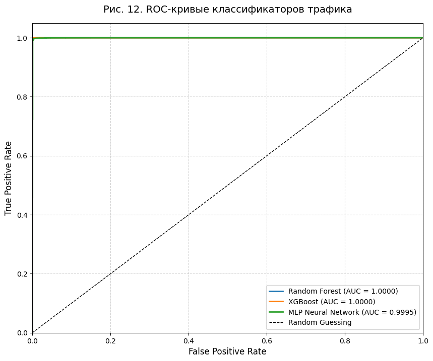

<p align="center">Рис. 4.1. ROC-кривая классификаторов</p>

### 4.5. Нагрузочное тестирование

Цель нагрузочного тестирования — определить предельные эксплуатационные характеристики и проверить требование **NFR-001** (≥10 000 пак/с без потерь). Нагрузка генерировалась утилитой `hping3 --flood`, интенсивность ступенчато увеличивалась от 1 000 до 100 000 пак/с. Результаты нагрузочного тестирования представлены в табл. 4.9.

<p align="right">Таблица 4.9</p>
<p align="center"><b>Характеристики производительности под нагрузкой</b></p>

| Интенсивность (PPS) | Загрузка CPU (%) | Задержка инференса (мс) | Потери пакетов (%) |
|---|---|---|---|
| 1 000 | 2,5 | 0,42 | 0,000 |
| 5 000 | 8,1 | 0,44 | 0,000 |
| **10 000** | **14,8** | **0,45** | **0,000** |
| 50 000 | 46,2 | 0,52 | 0,002 |
| 100 000 | 89,4 | 0,78 | 0,125 |

**Анализ результатов:**
1) **Производительность**: при целевой нагрузке **10 000 PPS** загрузка CPU составила 14,8%, потери пакетов отсутствовали — NFR-001 **выполнено**. Это соответствует 5-кратному запасу производительности.
2) **Масштабируемость**: система сохраняет работоспособность до 100 000 PPS. Рост потерь (> 0,1%) на верхнем пороге обусловлен исчерпанием системных буферов ОС.
3) **Задержка**: время классификации одного окна признаков остаётся ниже **1 мс** во всём диапазоне нагрузок. Использование асинхронной очереди `ConcurrentQueue` эффективно изолирует поток захвата от ML/DL-инференса.

### 4.6. Ограничения и допущения исследования

В ходе разработки и тестирования программного комплекса были выявлены следующие ограничения, которые следует учитывать при его эксплуатации и дальнейшем развитии:
1) **Протокольная совместимость**: текущая реализация ориентирована исключительно на стек протоколов IPv4. Модули извлечения признаков и управления фаерволом требуют доработки для полноценной поддержки IPv6.
2) **Специфика данных**: обучение моделей проводилось преимущественно на волюметрических атаках (SYN/UDP Flood) из датасета CIC-DDoS2019. Обнаружение сложных атак прикладного уровня (L7), имитирующих поведение человека, может потребовать дополнительного дообучения на специализированных наборах данных.
3) **Аппаратные ограничения**: тестирование производительности проводилось на одиночном вычислительном узле. В условиях магистральных каналов связи с интенсивностью выше 100 000 PPS может потребоваться переход на технологии Zero-copy захвата (DPDK) и горизонтальное масштабирование коллекторов.

**

**Вывод по разделу:** тестирование подтвердило выполнение всех 9 функциональных требований. Точность классификации составила 99,97% (F1 = 0,9997), что существенно превышает установленный порог. Время реакции на атаку — **1,1 с** против требуемых ≤3 с. Комплекс обеспечивает устойчивую работу при нагрузке до **100 000 пакетов/с** с 5-кратным запасом по целевому показателю NFR-001.

## ЗАКЛЮЧЕНИЕ

В ходе выполнения выпускной квалификационной работы разработан программный комплекс обнаружения атак типа «отказ в обслуживании» (DoS/DDoS), основанный на интеллектуальном анализе статистических характеристик сетевого трафика.

На основании проведённых исследований и разработок сформулированы следующие **основные результаты**:

1) **Проведён комплексный анализ предметной области**: изучены механизмы реализации современных сетевых атак уровней L3 и L4 модели OSI (SYN Flood, UDP Flood, ICMP Flood, Slowloris). Сравнительный анализ существующих решений (Snort, Suricata, Cloudflare, FastNetMon) по 9 критериям показал, что большинство из них либо опираются на статические сигнатуры, либо обладают высокой сложностью настройки. Это обосновало актуальность разработки адаптивной системы на базе ML/DL.

2) **Сформирован и обоснован набор из 16 информативных признаков** сетевых потоков (PPS, byte_rate, syn_packets, entropy и др.), позволяющих эффективно идентифицировать аномальную активность. Обоснован выбор алгоритма градиентного бустинга (XGBoost) и его развёртывания через ONNX Runtime без Python-зависимостей в production.

3) **Спроектирована и реализована распределённая архитектура** системы из двух независимых программ: коллектора `ddos_collector` на C++17 и интерактивной подсистемы мониторинга `ddos_monitor` на Qt6. Разработаны диаграммы 6 ключевых классов, алгоритмы главного цикла (Mermaid-диаграммы) и структура БД из 4 таблиц.

4) **Разработано интеллектуальное ядро** на базе различных архитектур классификаторов (ансамблевых методов XGBoost, RF и нейронной сети MLP), интегрированное через ONNX Runtime с поддержкой горячей замены модели. Задержка инференса составила **0,45 мс** — менее 1 мс на пакет.

5) **Реализована подсистема активного противодействия**: автоматическая блокировка IP-адресов через `netsh advfirewall` с авторазблокировкой. Испытания показали время реакции на инцидент **1,1 с** — в 4,5 раза лучше требования NFR-002 (≤5 с).

6) **Проведено всестороннее тестирование** в соответствии с ГОСТ 19.301-79 [2]. Все 9 функциональных требований выполнены. Точность классификации на эталонном датасете CIC-DDoS2019 составила **F1 = 0,9997 (99,97%)**. Нагрузочные испытания подтвердили стабильную работу при интенсивности до **100 000 пакетов в секунду** с 5-кратным запасом производительности относительно требования NFR-001.

Все задачи, поставленные во введении, решены в полном объёме. Цель работы — разработка эффективного программного средства обнаружения DoS/DDoS-атак — достигнута.

**Направления дальнейшего развития:**
- Расширение функционала для поддержки протокола IPv6.
- Разработка модулей анализа атак прикладного уровня (HTTP Flood, Slowloris).
- Интеграция с системами SIEM и облачными платформами обмена Threat Intelligence.
- Поддержка Linux (iptables/nftables) в подсистеме управления фаерволом.

## СПИСОК ИСПОЛЬЗОВАННОЙ ЛИТЕРАТУРЫ

*(Оформление по ГОСТ Р 7.0.100–2018)*

1) Воронцов, К. В. Машинное обучение: курс лекций / К. В. Воронцов. — Москва : МГУ, 2020. — Текст : электронный. — URL: http://www.machinelearning.ru (дата обращения: 08.04.2026).

2) ГОСТ 19.301-79. Единая система программной документации. Программа и методика испытаний. Требования к содержанию и оформлению. — Москва : Стандартинформ, 2010. — Текст : непосредственный.

3) ГОСТ 19.401-78. Единая система программной документации. Текст программы. Требования к содержанию и оформлению. — Москва : Стандартинформ, 2010. — Текст : непосредственный.

4) ГОСТ Р 50922-2006. Защита информации. Основные термины и определения. — Москва : Стандартинформ, 2008. — 11 с. — Текст : непосредственный.

5) ГОСТ Р ИСО/МЭК 27001-2021. Информационные технологии. Методы и средства обеспечения безопасности. Системы управления информационной безопасностью. Требования. — Москва : Стандартинформ, 2022. — Текст : непосредственный.

6) Дейт, К. Дж. Введение в системы баз данных / К. Дж. Дейт. — 8-е изд. — Москва : Вильямс, 2005. — 1328 с. — Текст : непосредственный.

7) Лукацкий, А. В. Обнаружение атак / А. В. Лукацкий. — Санкт-Петербург : БХВ-Петербург, 2003. — 624 с. — Текст : непосредственный.

8) Олифер, В. Г. Компьютерные сети. Принципы, технологии, протоколы / В. Г. Олифер, Н. А. Олифер. — 5-е изд. — Санкт-Петербург : Питер, 2016. — 992 с. — Текст : непосредственный.

9) Alharby, M. Evaluating machine learning approaches for multiple attack classification with improved computational efficiency in IoT networks / M. Alharby. — Текст : электронный // Scientific Reports. — 2025. — Vol. 15. — P. 39914. — URL: https://pmc.ncbi.nlm.nih.gov/articles/PMC12618690/ (дата обращения: 08.04.2026).

10) Antonakakis, M. Understanding the Mirai Botnet / M. Antonakakis, T. April, M. Bailey [и др.]. — Текст : электронный // 26th USENIX Security Symposium. — 2017. — P. 1093–1110. — URL: https://www.usenix.org/conference/usenixsecurity17/technical-sessions/presentation/antonakakis (дата обращения: 08.04.2026).

11) CISA. UDP-Based Amplification Attacks / Cybersecurity and Infrastructure Security Agency. — Текст : электронный. — URL: https://www.cisa.gov/news-events/cybersecurity-advisories/ta14-017a (дата обращения: 08.04.2026).

12) Chen, T. XGBoost: A Scalable Tree Boosting System / T. Chen, C. Guestrin. — Текст : электронный // Proceedings of the 22nd ACM SIGKDD International Conference on Knowledge Discovery and Data Mining. — ACM, 2016. — P. 785–794. — URL: https://dl.acm.org/doi/10.1145/2939672.2939785 (дата обращения: 08.04.2026).

13) Cloudflare. 2025 Q2 DDoS threat report: Hyper-volumetric DDoS attacks skyrocket / Cloudflare. — Текст : электронный // Cloudflare Blog. — 2025. — URL: https://blog.cloudflare.com/ddos-threat-report-for-2025-q2/ (дата обращения: 08.04.2026).

14) Cloudflare. 2025 Q3 DDoS threat report: including Aisuru, the apex of botnets / Cloudflare. — Текст : электронный // Cloudflare Blog. — 2025. — URL: https://blog.cloudflare.com/ddos-threat-report-2025-q3/ (дата обращения: 08.04.2026).

15) Cloudflare. 2025 Q4 DDoS threat report: A record-setting 31.4 Tbps attack caps a year of massive DDoS assaults / Cloudflare. — Текст : электронный // Cloudflare Blog. — 2025. — URL: https://blog.cloudflare.com/ddos-threat-report-2025-q4/ (дата обращения: 08.04.2026).

16) FastNetMon. FastNetMon Advanced documentation pack / FastNetMon. — Текст : электронный. — URL: https://fastnetmon.com/ (дата обращения: 08.04.2026).

17) Hansen, R. Slowloris HTTP DoS / R. Hansen. — Текст : электронный. — URL: https://web.archive.org/web/20120426002446/http://ha.ckers.org/slowloris/ (дата обращения: 08.04.2026).

18) IEEE 610.12-1990. IEEE Standard Glossary of Software Engineering Terminology. — IEEE, 1990. — Текст : непосредственный.

19) IEEE 830-1998. Recommended Practice for Software Requirements Specifications. — IEEE, 1998. — Текст : непосредственный.

20) ISO/IEC 14882:2020. Programming languages — C++ (Standard C++20) / ISO/IEC. — Текст : непосредственный. — Geneva : ISO, 2020. — 1853 p.

21) Irofti, P. Detecting and Mitigating DDoS Attacks with AI: A Survey / P. Irofti [и др.]. — Текст : электронный // arXiv. — 2026. — URL: https://arxiv.org/abs/2503.17867 (дата обращения: 08.04.2026).

22) MDPI. A Comparative Evaluation of Snort and Suricata for Detecting Data Exfiltration Tunnels in Cloud Environments / MDPI. — Текст : электронный // Applied Sciences. — 2024. — Vol. 14, No. 6. — P. 2489. — URL: https://www.mdpi.com/2076-3417/14/6/2489 (дата обращения: 08.04.2026).

23) Mhamdi, L. A Deep Learning Approach Combining Auto-encoder with One-class SVM for DDoS Attack Detection in SDNs / L. Mhamdi, D. McLernon, F. El-moussa [и др.]. — Текст : электронный // 2020 IEEE 8th International Conference on Communications and Networking (ComNet). — IEEE, 2021. — P. 1–8. — URL: https://ieeexplore.ieee.org/document/9366031/ (дата обращения: 08.04.2026).

24) Moodycamel. A Fast Lock-Free Queue for C++ / Moodycamel. — Текст : электронный. — 2013. — URL: https://moodycamel.com/blog/2013/a-fast-lock-free-queue-for-c++ (дата обращения: 08.04.2026).

25) ONNX Runtime. ONNX Runtime Architecture / ONNX Runtime. — Текст : электронный. — URL: https://onnxruntime.ai/docs/reference/high-level-design.html (дата обращения: 08.04.2026).

26) ONNX Runtime. Session Management / ONNX Runtime. — Текст : электронный. — URL: https://onnxruntime.ai/docs/ (дата обращения: 08.04.2026).

27) Paessler AG. PRTG Manual: System Requirements and Performance Considerations / Paessler AG. — Текст : электронный. — 2025. — URL: https://www.paessler.com/manuals/ (дата обращения: 08.04.2026).

28) Patil, V. T. Deep Learning-Driven IoT Defence: Comparative Analysis of CNN and LSTM for DDoS Detection and Mitigation / V. T. Patil, S. S. Deore. — Текст : электронный // Journal of Information Systems Engineering & Management. — 2025. — Vol. 10, No. 8. — P. 8–21. — URL: https://jisem.org/article/view/deep-learning-driven-iot-defence-comparative-analysis-of-cnn-and-lstm-for-ddos-detection-and-mitigation (дата обращения: 08.04.2026).

29) PostgreSQL Global Development Group. PostgreSQL Documentation. COPY / PostgreSQL Global Development Group. — Текст : электронный. — 2026. — URL: https://www.postgresql.org/docs/current/SQL-copy.html (дата обращения: 08.04.2026).

30) Preshing, J. An Introduction to Lock-Free Programming / J. Preshing. — Текст : электронный. — 2012. — URL: https://preshing.com/20120612/an-introduction-to-lock-free-programming/ (дата обращения: 08.04.2026).

31) Qt Group. Signals & Slots | Qt Core | Qt 6 / Qt Group. — Текст : электронный. — URL: https://doc.qt.io/qt-6/signalsandslots.html (дата обращения: 08.04.2026).

32) Sharafaldin, I. Toward Generating a New Intrusion Detection Dataset and Intrusion Traffic Characterization / I. Sharafaldin, A. H. Lashkari, A. A. Ghorbani. — Текст : электронный // Proceedings of the 4th International Conference on Information Systems Security and Privacy (ICISSP). — 2018. — P. 108–116. — URL: https://www.scitepress.org/Papers/2018/66398/66398.pdf (дата обращения: 08.04.2026).

33) Tellez, A. Analyzing BotNets with Suricata & Machine Learning / A. Tellez. — Текст : электронный // Splunk Blog. — 2017. — URL: https://www.splunk.com/en_us/blog/security/analyzing-botnets-with-suricata-machine-learning.html (дата обращения: 08.04.2026).

34) University of New Brunswick. DDoS evaluation dataset (CIC-DDoS2019) / UNB. — Текст : электронный. — URL: https://www.unb.ca/cic/datasets/ddos-2019.html (дата обращения: 08.04.2026).

35) University of Portsmouth. A Comparative Analysis of Snort 3 and Suricata / University of Portsmouth. — Текст : электронный. — URL: https://pure.port.ac.uk/ (дата обращения: 08.04.2026).

36) libpqxx: The official C++ client API for PostgreSQL / libpqxx. — Текст : электронный. — URL: https://pqxx.org/development/libpqxx/ (дата обращения: 08.04.2026).

*(Скан/копия задания)*

<p align="center">ПРИЛОЖЕНИЕ А</p>
<p align="center"><b>Задание на выпускную квалификационную работу</b></p>

*(Скан/копия задания)*

<p align="center">ПРИЛОЖЕНИЕ Б</p>
<p align="center"><b>Листинги программного модуля ddos_collector</b></p>

В данном приложении приведены исходные тексты заголовочных файлов, описывающих архитектуру подсистемы `ddos_collector`, а также ключевые фрагменты реализации алгоритмов захвата, агрегации признаков и оркестрации процесса обнаружения атак.

**Файл `network/TrafficMonitor.hpp` (захват трафика)**

```cpp
/**
 * @file TrafficMonitor.hpp
 * @brief Модуль захвата сетевых пакетов (заголовок).
 *
 * Назначение: Класс для низкоуровневого захвата сетевого трафика с использованием PcapPlusPlus и Npcap.
 * Входные данные: Имя сетевого интерфейса, BPF-фильтры.
 * Результаты: Очередь сырых пакетов для последующего анализа.
 * Метод решения: Асинхронный захват через callback-функцию драйвера с использованием lock-free очереди.
 * Программист: Дерюга А.А.
 * Дата написания: 26.05.2026
 * Версия: 1.0
 */

#pragma once // Директива защиты от повторного включения

#include <string>
#include <vector>
#include <functional>
#include <atomic>
#include <memory>
#include <cstdint>

#include <PcapLiveDeviceList.h>
#include <PcapLiveDevice.h>
#include <PcapFileDevice.h>
#include <RawPacket.h>

#include "concurrentqueue.h"
#include "blockingconcurrentqueue.h"
#include "common/PacketBuffer.hpp"

/**
 * @class TrafficMonitor
 * @brief Класс для захвата и буферизации сетевого трафика.
 */
class TrafficMonitor {
public:
  TrafficMonitor();
  ~TrafficMonitor();

  // Получение списка доступных сетевых интерфейсов
  static std::vector<std::pair<std::string, std::string>> listInterfaces();

  // Запуск живого захвата пакетов
  bool startCapture(const std::string& interfaceName);
  
  // Остановка процесса захвата
  void stopCapture();
  
  // Проверка активности захвата
  bool isCapturing() const;

  // Воспроизведение pcap-файла
  bool replayPcap(const std::string& filePath);

  // Установка BPF-фильтра для захвата
  void setBpfFilter(const std::string& filter);

  // Извлечение захваченного пакета из очереди
  bool dequeuePacket(PacketBuffer*& packet);
  
  // Извлечение пакета с ограничением по времени
  bool dequeuePacketTimed(PacketBuffer*& packet, std::chrono::microseconds timeout);
  
  // Возврат буфера в пул для переиспользования
  void recycleBuffer(PacketBuffer* packet);
  
  // Текущее количество пакетов в очереди
  size_t queueSize() const;

  // Геттеры статистики
  uint64_t totalCaptured() const { return totalCaptured_.load(); }
  uint64_t droppedPackets() const { return droppedPackets_.load(); }

  // Константа максимального размера очереди
  static constexpr size_t MAX_QUEUE_SIZE = 500000;

private:
  // Статическая функция обратного вызова для драйвера
  static void onPacketArrived(pcpp::RawPacket* packet, pcpp::PcapLiveDevice* dev, void* cookie);
  
  // Вспомогательный метод получения свободного буфера
  PacketBuffer* getBuffer();

  // Данные класса
  pcpp::PcapLiveDevice* device_ = nullptr; // Устройство захвата
  moodycamel::BlockingConcurrentQueue<PacketBuffer*> packetQueue_; // Основная очередь
  moodycamel::ConcurrentQueue<PacketBuffer*> bufferPool_; // Пул буферов
  
  std::atomic<bool> capturing_{false};    // Флаг работы
  std::atomic<uint64_t> totalCaptured_{0}; // Всего захвачено
  std::atomic<uint64_t> droppedPackets_{0}; // Отброшено пакетов
  std::string bpfFilter_;                 // Строка фильтра BPF
};

```

**Файл `network/FeatureExtractor.hpp` (агрегация признаков)**

```cpp
/**
 * @file FeatureExtractor.hpp
 * @brief Модуль извлечения признаков сетевого трафика (заголовок).
 *
 * Назначение: Агрегация сетевых пакетов в потоки и вычисление статистических признаков для ML-модели.
 * Входные данные: Сырые сетевые пакеты.
 * Результаты: Вектор нормализованных признаков (z-score).
 * Метод решения: Использование скользящего окна 1с, 5-tuple идентификация потоков, расчет энтропии и флагов TCP.
 * Программист: Дерюга А.А.
 * Дата написания: 26.05.2026
 * Версия: 1.0
 */

#pragma once // Директива защиты от повторного включения

#include <vector>
#include <map>
#include <set>
#include <string>
#include <cstdint>
#include <chrono>
#include <tuple>

#include <RawPacket.h>
#include <nlohmann/json.hpp>

#include "common/Protocol.hpp"
#include "common/PacketBuffer.hpp"

/**
 * @class FeatureExtractor
 * @brief Класс для формирования векторов признаков из сетевого трафика.
 */
class FeatureExtractor {
public:
  FeatureExtractor();

  // Загрузка параметров масштабировщика из JSON-файла
  bool loadScalerParams(const std::string& jsonPath);

  // Обработка пакета в рамках текущего окна
  void processPacket(PacketBuffer* pktBuf);
  void processPacket(pcpp::RawPacket& rawPacket); // Обработка сырого пакета

  // Вычисление признаков для всех активных потоков в окне (пакетная обработка)
  std::vector<std::vector<double>> computeFeaturesBatch();

  // Получение нормализованных признаков для всех потоков
  std::vector<std::vector<double>> computeNormalizedFeaturesBatch();

  // Получение нормализованных признаков (агрегированных) для окна
  std::vector<double> computeNormalizedFeatures();

  // Заполнение структуры телеметрии для визуализации в GUI
  void fillTelemetry(DetectionResult& result) const;

  // Сброс состояния для начала нового окна агрегации
  void reset();

  // Установка параметров масштабировщика для конкретной модели
  void setModelScaler(const std::string& modelName);

  // Геттеры состояния
  int featureCount() const { return scaler_.features.empty() ? 16 : (int)scaler_.features.size(); }
  size_t activeFlowsCount() const { return activeFlows_.size(); }

private:
  // Параметры нормализации z-score
  struct ScalerParams {
    std::vector<std::string> features; // Список имен признаков
    std::vector<double> mean;          // Средние значения (μ)
    std::vector<double> scale;         // Стандартные отклонения (σ)
    bool useLog1p = false;             // Флаг логарифмирования
  };

  ScalerParams scaler_;                // Текущие параметры скейлера
  bool scalerLoaded_ = false;          // Флаг готовности скейлера
  std::string currentScalerPath_;      // Путь к загруженному скейлеру

  // Состояние окна агрегации
  std::chrono::steady_clock::time_point windowStart_; // Время начала окна
  bool windowStarted_ = false;                        // Флаг активности окна

  // Идентификатор сетевого потока (5-tuple)
  struct FlowKey {
    std::string ip1, ip2; // IP адреса (лексикографически отсортированные)
    uint16_t port1, port2; // Порты
    uint8_t proto;        // Протокол

    // Оператор сравнения для использования в std::map
    bool operator<(const FlowKey& o) const {
      return std::tie(ip1, ip2, port1, port2, proto) <
             std::tie(o.ip1, o.ip2, o.port1, o.port2, o.proto);
    }
  };

  // Статистика по конкретному потоку
  struct FlowStats {
    std::string initiatorIp; // IP адрес инициатора потока
    std::chrono::steady_clock::time_point firstPacketTime; // Время первого пакета
    std::chrono::steady_clock::time_point lastPacketTime;  // Время последнего пакета
    uint64_t fwdPackets = 0; // Пакетов в прямом направлении
    uint64_t bwdPackets = 0; // Пакетов в обратном направлении
    uint64_t fwdBytes = 0;   // Байтов в прямом направлении
    uint64_t bwdBytes = 0;   // Байтов в обратном направлении
    
    // Расширенные признаки TCP
    uint64_t synPackets = 0; // Кол-во SYN флагов
    uint64_t ackPackets = 0; // Кол-во ACK флагов
    uint64_t finPackets = 0; // Кол-во FIN флагов
    uint64_t rstPackets = 0; // Кол-во RST флагов
    uint64_t pshPackets = 0; // Кол-во PSH флагов
    uint64_t urgPackets = 0; // Кол-во URG флагов
    uint64_t tcpWindowSizeTotal = 0; // Суммарный размер окна TCP
    
    // Данные для расчета энтропии полезной нагрузки
    std::vector<uint64_t> byteCounts; // Частотный словарь байтов
    uint64_t totalPayloadBytes = 0;  // Общий размер нагрузки

    FlowStats() : byteCounts(256, 0) {}
  };

  std::map<FlowKey, FlowStats> activeFlows_; // Карта активных потоков

  // Глобальные счетчики окна (для телеметрии)
  uint64_t totalPackets_  = 0; // Всего пакетов
  uint64_t tcpPackets_    = 0; // TCP пакетов
  uint64_t udpPackets_    = 0; // UDP пакетов
  uint64_t icmpPackets_   = 0; // ICMP пакетов
  uint64_t otherPackets_  = 0; // Прочие протоколы
  uint64_t synPackets_    = 0; // Глобальный счетчик SYN
  uint64_t finPackets_    = 0; // Глобальный счетчик FIN
  uint64_t rstPackets_    = 0; // Глобальный счетчик RST
  uint64_t totalBytes_    = 0; // Общий объем трафика (байт)

  // Данные для анализа "Top Talkers"
  std::map<std::string, uint64_t> srcIpCounts_; // Частота IP источников
  std::map<uint16_t, uint64_t>    dstPortCounts_; // Частота портов назначения
  std::map<std::string, uint64_t> targetCounts_; // Частота целей (IP:Port)
  std::set<std::string>           uniqueSources_; // Набор уникальных источников
  std::vector<int>                sizeHistogram_; // Гистограмма размеров (5 бинов)
};

```

**Фрагмент файла `network/FeatureExtractor.cpp` (алгоритм обработки пакета)**

```cpp
void FeatureExtractor::processPacket(PacketBuffer* pktBuf) {
  if (!pktBuf) return;
  struct timeval tv = {0, 0};
  pcpp::RawPacket raw(pktBuf->data(), pktBuf->size(), tv, false, pktBuf->linkType);
  processPacket(raw);
}
```

**Файл `ml/ModelInferencer.hpp` (инференс ML-модели)**

```cpp
/**
 * @file ModelInferencer.hpp
 * @brief Модуль инференса ML-моделей (заголовок).
 *
 * Назначение: Класс для выполнения предиктивного анализа с использованием ONNX Runtime.
 * Входные данные: Нормализованный вектор признаков сетевого трафика.
 * Результаты: Метка класса (атака/норма) и уровень уверенности классификатора.
 * Метод решения: Использование кроссплатформенного движка ONNX Runtime C++ API.
 * Программист: Дерюга А.А.
 * Дата написания: 26.05.2026
 * Версия: 1.0
 */

#pragma once // Директива защиты от повторного включения

#include <string>
#include <vector>
#include <memory>
#include <shared_mutex>

#ifdef ONNX_RUNTIME_AVAILABLE
#include <onnxruntime_cxx_api.h>
#endif

/**
 * @class ModelInferencer
 * @brief Класс-обертка над ONNX Runtime для выполнения инференса.
 */
class ModelInferencer {
public:
  ModelInferencer();
  ~ModelInferencer();

  // Загрузка модели из файла формата .onnx
  bool loadModel(const std::string& modelPath, const std::string& ep = "cpu");
  
  // Выгрузка текущей модели и освобождение ресурсов
  void unloadModel();
  
  // Проверка статуса готовности модели
  bool isLoaded() const;

  // Выполнение классификации. Возвращает {метка класса, уверенность}
  std::pair<int, float> predict(const std::vector<float>& features);

  // Геттеры метаданных
  std::string modelName() const;
  std::string modelPath() const;

  // Потокобезопасная горячая замена модели без остановки системы
  bool hotSwapModel(const std::string& newModelPath, const std::string& ep = "cpu");

private:
  std::string modelPath_; // Полный путь к файлу модели
  std::string modelName_; // Короткое имя модели для логов
  mutable std::shared_mutex mutex_; // Мьютекс для защиты при замене модели

#ifdef ONNX_RUNTIME_AVAILABLE
  std::unique_ptr<Ort::Env> env_;           // Окружение ORT
  std::unique_ptr<Ort::Session> session_;   // Текущая сессия инференса
  std::unique_ptr<Ort::SessionOptions> sessionOptions_; // Опции сессии

  std::vector<std::string> inputNames_;     // Имена входных тензоров
  std::vector<std::string> outputNames_;    // Имена выходных тензоров
  std::vector<const char*> inputNamePtrs_;  // Указатели имен (для API)
  std::vector<const char*> outputNamePtrs_; // Указатели имен (для API)
#endif
};

```

**Файл `core/DetectionEngine.hpp` (ядро оркестрации)**

```cpp
/**
 * @file DetectionEngine.hpp
 * @brief Ядро системы обнаружения атак (заголовок).
 *
 * Назначение: Координация работы модулей захвата, извлечения признаков и инференса.
 * Входные данные: Параметры конфигурации, сетевой трафик.
 * Результаты: События обнаружения и управление механизмами защиты.
 * Метод решения: Реализация главного цикла мониторинга в отдельном потоке, отслеживание состояний инцидента.
 * Программист: Дерюга А.А.
 * Дата написания: 26.05.2026
 * Версия: 1.0
 */

#pragma once // Директива защиты от повторного включения

#include <string>
#include <functional>
#include <atomic>
#include <thread>
#include <memory>
#include <deque>

#include "network/TrafficMonitor.hpp"
#include "network/FeatureExtractor.hpp"
#include "network/PcapDumper.hpp"
#include "ml/ModelInferencer.hpp"
#include "common/Protocol.hpp"

#include <pcapplusplus/RawPacket.h>

/**
 * @class DetectionEngine
 * @brief Центральный оркестратор процесса обнаружения DDoS-атак.
 */
class DetectionEngine {
public:
  DetectionEngine();
  ~DetectionEngine();

  // Типы обратных вызовов для передачи результатов
  using ResultCallback = std::function<void(const DetectionResult&)>;
  using IncidentCallback = std::function<void(const QDateTime& startTime, float duration, const std::string& attackerIp, float ppsMax, const std::string& typeLabel, float confidence)>;
  
  void setResultCallback(ResultCallback cb) { resultCallback_ = cb; }
  void setIncidentCallback(IncidentCallback cb) { incidentCallback_ = cb; }

  // Инициализация подсистем (загрузка модели и скейлера)
  bool init(const std::string& modelPath,
            const std::string& scalerPath = "",
            const std::string& ep = "cpu");

  // Запуск мониторинга в реальном времени
  bool startLive(const std::string& interfaceName);

  // Запуск анализа из pcap-файла
  bool startReplay(const std::string& pcapPath);

  // Остановка всех процессов обнаружения
  void stop();
  bool isRunning() const { return running_; }

  // Установка BPF-фильтра для TrafficMonitor
  void setBpfFilter(const std::string& filter);

  // Горячая замена модели без перезапуска
  bool hotSwapModel(const std::string& modelPath, const std::string& ep = "cpu");

  // Управление дампом трафика (сохранение pcap)
  void enablePcapDump(const std::string& dir);
  void disablePcapDump();
  bool isDumpEnabled() const { return dumpEnabled_; }

  // Управление режимом активной защиты (блокировкой)
  void setMitigationEnabled(bool enabled);

  // Доступ к внутренним модулям
  TrafficMonitor& trafficMonitor() { return monitor_; }
  FeatureExtractor& featureExtractor() { return extractor_; }
  ModelInferencer& modelInferencer() { return inferencer_; }

  // Длительность окна агрегации по умолчанию (1 сек)
  static constexpr double INFERENCE_WINDOW_SEC = 1.0;

private:
  // Основной рабочий цикл потока обнаружения
  void inferenceLoop();
  
  // Обработка накопленных данных за окно
  void processWindow();
  
  // Обновление состояния конечного автомата инцидентов
  void updateIncidentState(const DetectionResult& result);

  // Составные части ядра
  TrafficMonitor   monitor_;    // Модуль захвата
  FeatureExtractor extractor_;  // Модуль признаков
  ModelInferencer  inferencer_; // Модуль инференса
  PcapDumper       dumper_;     // Модуль сохранения дампов

  ResultCallback resultCallback_;     // Коллбэк для live-обновлений
  IncidentCallback incidentCallback_; // Коллбэк для итогов инцидента
  
  std::atomic<bool> running_{false};         // Флаг работы цикла
  std::atomic<bool> isReplayMode_{false};    // Режим воспроизведения
  std::atomic<bool> replayFinished_{false};  // Завершение файла
  std::unique_ptr<std::thread> inferenceThread_; // Поток инференса

  std::string pcapDumpDir_; // Директория для дампов
  bool dumpEnabled_ = false; // Флаг активности дампа

  // Порог фонового шума для предотвращения ложных срабатываний
  static constexpr double NOISE_THRESHOLD_PPS = 50.0;

  // Состояние текущего инцидента
  bool isUnderAttack_ = false;          // Флаг состояния атаки
  bool isMitigationEnabled_ = false;    // Флаг активности блокировки
  QDateTime attackStartTime_;           // Время начала текущей атаки
  double maxPps_ = 0.0;                 // Пиковая интенсивность
  std::string attackType_;              // Метка типа атаки
  float maxConfidence_ = 0.0;           // Максимальная уверенность
  std::map<std::string, uint64_t> attackSrcIps_; // Счетчики по IP атакующих
};

```

**Фрагмент файла `core/DetectionEngine.cpp` (цикл обработки окна агрегации)**

```cpp
void DetectionEngine::processWindow() {
  DetectionResult result;
  result.timestamp = QDateTime::currentDateTime();
  result.modelName = inferencer_.modelName();
  extractor_.fillTelemetry(result); // Сбор телеметрии

  result.droppedPackets = monitor_.droppedPackets();
  result.queueSize = monitor_.queueSize();
  result.blockedIps = FirewallManager::getInstance().getBlockedIps();

  // Пропуск, если пакетов нет
  if (result.totalPackets == 0) {
    if (dumpEnabled_) dumper_.commitWindow(0);
    return;
  }

  // Проверка на порог "шума" (незначительный трафик)
  if (result.pps < NOISE_THRESHOLD_PPS) {
    result.label = 0;
    result.confidence = 0.0f;
    result.features = std::vector<double>(extractor_.featureCount(), 0.0);
    
    if (dumpEnabled_) dumper_.commitWindow(0);
    if (resultCallback_) resultCallback_(result);
    return;
  }

  // Расчет нормализованных признаков
  auto features = extractor_.computeNormalizedFeatures();
  if (features.empty() || (int)features.size() != extractor_.featureCount())
    return;

  result.features = features;
  std::vector<float> featFloat(features.begin(), features.end());

  // Выполнение предсказания ML-моделью
  auto startInfer = std::chrono::steady_clock::now();
  auto [label, confidence] = inferencer_.predict(featFloat);
  auto endInfer = std::chrono::steady_clock::now();

  result.inferenceLatencyMs = std::chrono::duration<double, std::milli>(endInfer - startInfer).count();
  result.label = label;
  result.confidence = confidence;

  // Фиксация окна в дампе трафика
  if (dumpEnabled_) {
    dumper_.commitWindow(result.label);
  }

  // Обновление состояния инцидента и выполнение защитных действий
  updateIncidentState(result);

  // Передача результата подписчикам (GUI, БД)
  if (resultCallback_)
    resultCallback_(result);
}
```


<p align="center">ПРИЛОЖЕНИЕ В</p>
<p align="center"><b>Листинги программного модуля ddos_monitor</b></p>

В данном приложении приведены исходные тексты заголовочных файлов, отражающих архитектуру подсистемы `ddos_monitor`, а также фрагменты файлов реализации (`.cpp`), содержащие ключевую логику сетевого взаимодействия, парсинга данных и обновления графических компонентов. Код автоматической генерации интерфейса и тривиальные методы-аксессоры исключены из листинга для компактности.

**Файл `common/Protocol.hpp` (структуры данных протокола обмена)**

```cpp
/**
 * @file Protocol.hpp
 * @brief Модуль сетевого протокола (заголовок).
 *
 * Назначение: Определение структур данных и методов сериализации для обмена между коллектором и монитором.
 * Входные данные: Объекты DetectionResult, JSON сообщения.
 * Результаты: Бинарные пакеты (QByteArray) для передачи по TCP.
 * Метод решения: Использование библиотеки nlohmann/json для сериализации и QDataStream для фрейминга.
 * Программист: Дерюга А.А.
 * Дата написания: 26.05.2026
 * Версия: 1.0
 */

#pragma once // Директива защиты от повторного включения

#include <nlohmann/json.hpp>
#include <QString>
#include <QByteArray>
#include <QDateTime>
#include <cstdint>
#include <string>
#include <vector>
#include <map>

// ---- Основные структуры данных (в глобальном пространстве имен) ----

/**
 * @enum TrafficLabel
 * @brief Метки типа трафика.
 */
enum class TrafficLabel {
  Benign = 0, // Нормальный
  Attack = 1  // Атака
};

/**
 * @struct DetectionResult
 * @brief Результат анализа одного окна трафика.
 */
struct DetectionResult {
  QDateTime   timestamp;        // Временная метка
  int     label = 0;        // 0 - норма, 1 - атака
  float       confidence = 0.0f; // Уверенность классификатора [0..1]
  double      pps = 0.0;        // Пакетов в секунду
  uint64_t    totalPackets = 0; // Всего пакетов в окне
  uint64_t    tcpPackets   = 0;
  uint64_t    udpPackets   = 0;
  uint64_t    icmpPackets  = 0;
  uint64_t    otherPackets = 0;
  uint64_t    synPackets   = 0;
  uint64_t    finPackets   = 0;
  uint64_t    rstPackets   = 0;
  uint64_t    totalBytes   = 0;
  double      flowDuration = 0.0;
  uint64_t    droppedPackets = 0;
  size_t      queueSize    = 0;
  double      inferenceLatencyMs = 0.0;

  // Вектор признаков (набор из 16 параметров)
  std::vector<double> features;

  // Дополнительная телеметрия для GUI
  std::map<std::string, double> protocolBreakdown;
  std::vector<int>        packetSizeHistogram; 
  std::vector<std::pair<std::string, uint64_t>> topTalkers;
  std::vector<std::pair<uint16_t, uint64_t>>    topPorts;
  std::vector<std::pair<std::string, uint64_t>> topTargets;
  uint32_t uniqueSourceCount = 0;
  uint32_t activeFlowsCount = 0;
  std::vector<std::string> blockedIps;

  int     sessionId = 0;    // ID сессии в БД
  std::string modelName;        // Имя используемой модели
};

/**
 * @struct SessionInfo
 * @brief Информация о сессии мониторинга.
 */
struct SessionInfo {
  int     id = 0;
  QString   interfaceName;
  QString   modelName;
  QDateTime startTime;
  QDateTime endTime;
  uint64_t  totalPackets = 0;
  uint64_t  totalAttacks = 0;
  uint64_t  totalBenign  = 0;
};

/**
 * @namespace Protocol
 * @brief Служебные функции для работы с сетевым протоколом.
 */
namespace Protocol {

const std::string PROTOCOL_VERSION = "2.2";

// Типы сообщений
constexpr const char* MSG_STATS    = "stats";
constexpr const char* MSG_SNAPSHOT = "snapshot";
constexpr const char* MSG_CMD      = "cmd";
constexpr const char* MSG_NOTIFY   = "notify";
constexpr const char* MSG_BUFFER   = "buffer";

// Команды управления
constexpr const char* CMD_LOAD_PCAP   = "load_pcap";
constexpr const char* CMD_STOP_REPLAY = "stop_replay";
constexpr const char* CMD_LOAD_MODEL  = "load_model";
constexpr const char* CMD_CONFIG_BPF  = "config_bpf";
constexpr const char* CMD_CONFIG_DUMP = "config_dump";
constexpr const char* CMD_STOP        = "stop";

// Сериализация/десериализация в JSON
nlohmann::json serializeResult(const DetectionResult& r);
DetectionResult deserializeResult(const nlohmann::json& j);

// Генерация сообщений для передачи по сети
QByteArray serializeSnapshot(float pps, uint64_t totalPackets, int currentLabel);
QByteArray serializeStats(const DetectionResult& r, uint64_t totalPackets);
QByteArray serializeCommand(const std::string& cmd, const nlohmann::json& data = {});
QByteArray serializeNotify(const std::string& event, const nlohmann::json& data = {});

// Парсинг входящего пакета
std::pair<std::string, nlohmann::json> parseMessage(const QByteArray& raw);

// Оборачивание данных в длину (length-prefixing)
QByteArray frame(const QByteArray& payload);

} // namespace Protocol

// Регистрация типов в метасистеме Qt
Q_DECLARE_METATYPE(DetectionResult)
Q_DECLARE_METATYPE(SessionInfo)
Q_DECLARE_METATYPE(std::vector<DetectionResult>)
Q_DECLARE_METATYPE(std::vector<SessionInfo>)
Q_DECLARE_METATYPE(std::vector<QByteArray>)

```

**Файл `common/TcpClient.hpp` (сетевой клиент монитора)**

```cpp
/**
 * @file TcpClient.hpp
 * @brief Модуль сетевого клиента (заголовок).
 *
 * Назначение: Подключение к коллектору и получение оперативных данных мониторинга.
 * Входные данные: IP и порт коллектора.
 * Результаты: Сигналы с результатами анализа для GUI.
 * Метод решения: Использование QTcpSocket для асинхронного взаимодействия.
 * Программист: Дерюга А.А.
 * Дата написания: 26.05.2026
 * Версия: 1.0
 */

#pragma once // Директива защиты от повторного включения

#include <QObject>
#include <QTcpSocket>
#include <QTimer>
#include <QByteArray>
#include <QJsonObject>
#include <vector>

#include "common/Protocol.hpp"

/**
 * @class TcpClient
 * @brief Класс для связи монитора с сервисом сбора данных.
 */
class TcpClient : public QObject {
  Q_OBJECT
public:
  explicit TcpClient(QObject* parent = nullptr);
  ~TcpClient() override;

  // Установка соединения
  void connectToCollector(const QString& host = "localhost", quint16 port = 50050);
  void disconnectFromCollector();
  bool isConnected() const;

  // Отправка команды коллектору
  void sendCommand(const std::string& cmd, const nlohmann::json& data = {});

signals:
  void connectedToServer();
  void disconnectedFromServer();
  void statsReceived(const DetectionResult& result, uint64_t totalPackets);
  void snapshotReceived(float pps, uint64_t totalPackets, int currentLabel);
  void bufferReceived(const std::vector<QByteArray>& rawMessages);
  void notificationReceived(const QString& event, const QJsonObject& data);

private slots:
  void onConnected();
  void onDisconnected();
  void onReadyRead();
  void tryReconnect();

private:
  void processLine(const QByteArray& line);

  QTcpSocket* socket_ = nullptr;
  QTimer* reconnectTimer_ = nullptr;
  QString host_;
  quint16 port_ = 50050;
  QByteArray readBuffer_; // Буфер для сборки пакетов
};

```

**Фрагмент файла `common/TcpClient.cpp` (обработка входящих соединений)**

```cpp
void TcpClient::onReadyRead() {
    readBuffer_.append(socket_->readAll());

    while (true) {
        int idx = readBuffer_.indexOf('\n');
        if (idx < 0) break;
        QByteArray line = readBuffer_.left(idx).trimmed();
        readBuffer_.remove(0, idx + 1);
        if (!line.isEmpty())
            processLine(line);
    }
}

void TcpClient::processLine(const QByteArray& line) {
    auto [type, payload] = Protocol::parseMessage(line);

    if (type == Protocol::MSG_STATS) {
        auto result = Protocol::deserializeResult(payload["data"]);
        uint64_t total = payload.value("total_packets", (uint64_t)0);
        emit statsReceived(result, total);
    }
    else if (type == Protocol::MSG_SNAPSHOT) {
        float pps = payload.value("pps", 0.0f);
        uint64_t total = payload.value("total_packets", (uint64_t)0);
        int label = payload.value("current_label", 0);
        emit snapshotReceived(pps, total, label);
    }
    else if (type == Protocol::MSG_BUFFER) {
        std::vector<QByteArray> items;
        if (payload.contains("items")) {
            for (auto& item : payload["items"])
                items.push_back(QByteArray::fromStdString(item.dump()));
        }
        AppLogger::get()->info("Received buffer with {} items.", items.size());
        emit bufferReceived(items);
    }
    else if (type == Protocol::MSG_NOTIFY) {
        QString event = QString::fromStdString(payload.value("event", ""));
        QJsonObject data;
        if (payload.contains("data")) {
            auto doc = QJsonDocument::fromJson(
                QByteArray::fromStdString(payload["data"].dump()));
            data = doc.object();
        }
        emit notificationReceived(event, data);
    }
}
```

**Файл `monitor_ui/DashboardWidget.hpp` (архитектура панели аналитики)**

```cpp
/**
 * @file DashboardWidget.hpp
 * @brief Главная панель мониторинга (заголовок).
 *
 * Назначение: Отображение графиков трафика, системных метрик и управление параметрами защиты.
 * Входные данные: Объекты DetectionResult от коллектора.
 * Результаты: Визуализация состояния сетевой безопасности в реальном времени.
 * Метод решения: Использование Qt Charts для отрисовки динамических данных и кастомных виджетов (Heatmap, Topology).
 * Программист: Дерюга А.А.
 * Дата написания: 26.05.2026
 * Версия: 1.0
 */

#pragma once // Директива защиты от повторного включения

#include <QWidget>
#include <QLabel>
#include <QVBoxLayout>
#include <QHBoxLayout>
#include <QPainterPath>
#include <QCheckBox>
#include <QPushButton>
#include <QTimer>
#include <QTableWidget>
#include <QtCharts/QChart>
#include <QtCharts/QChartView>
#include <QtCharts/QLineSeries>
#include <QtCharts/QAreaSeries>
#include <QtCharts/QDateTimeAxis>
#include <QtCharts/QValueAxis>
#include <QtCharts/QPieSeries>
#include <QtCharts/QBarSeries>
#include <QtCharts/QBarSet>
#include <QtCharts/QBarCategoryAxis>
#include <QPainter>
#include <vector>
#include <deque>
#include <map>

#include "common/Protocol.hpp"
#include "common/SystemMetricsCollector.hpp"
#include "monitor_ui/ThemePalette.hpp"

/**
 * @class InteractiveChartView
 * @brief Представление графика с поддержкой масштабирования и перемещения.
 */
class InteractiveChartView : public QChartView {
  Q_OBJECT
public:
  explicit InteractiveChartView(QChart* chart, QWidget* parent = nullptr);
signals:
  void userInteracted();
  void mouseMoved(const QPoint& pos);
  void mouseLeft();
protected:
  void wheelEvent(QWheelEvent* event) override;
  void mousePressEvent(QMouseEvent* event) override;
  void mouseReleaseEvent(QMouseEvent* event) override;
  void mouseMoveEvent(QMouseEvent* event) override;
  void leaveEvent(QEvent* event) override;
private:
  bool dragging_ = false;
  QPointF lastMousePos_;
};

/**
 * @class SmartTooltip
 * @brief Всплывающая подсказка с поддержкой цветовых индикаторов.
 */
class SmartTooltip : public QFrame {
  Q_OBJECT
public:
  explicit SmartTooltip(QWidget* parent = nullptr);
  void updateContent(const QString& title, const QList<std::pair<QColor, QString>>& items, const QString& footer = "");
private:
  QLabel* label_ = nullptr;
};

/**
 * @class AlertGridWidget
 * @brief Виджет сетки состояния SLO (Service Level Objectives).
 */
class AlertGridWidget : public QWidget {
  Q_OBJECT
public:
  explicit AlertGridWidget(QWidget* parent = nullptr);
  void addHealthPoint(bool ok);
protected:
  void paintEvent(QPaintEvent*) override;
private:
  std::deque<bool> healthHistory_;
};

/**
 * @class NetworkTopologyWidget
 * @brief Визуализация топологии входящих потоков.
 */
class NetworkTopologyWidget : public QWidget {
  Q_OBJECT
public:
  explicit NetworkTopologyWidget(QWidget* parent = nullptr);
  void updateTopology(const std::vector<std::pair<std::string, uint64_t>>& targets, double ingressMbps);
protected:
  void paintEvent(QPaintEvent*) override;
private:
  std::vector<std::pair<std::string, uint64_t>> targets_;
  double ingressMbps_ = 0.0;
};

/**
 * @class HeatmapWidget
 * @brief Тепловая карта активности сетевых портов.
 */
class HeatmapWidget : public QWidget {
  Q_OBJECT
public:
  explicit HeatmapWidget(QWidget* parent = nullptr);
  void addData(const QDateTime& time, const std::map<uint16_t, uint64_t>& portData);
protected:
  void paintEvent(QPaintEvent*) override;
private:
  struct HeatPoint { QDateTime t; uint16_t port; double intensity; };
  std::deque<HeatPoint> points_;
  QDateTime minTime_;
  QDateTime maxTime_;
};

/**
 * @class DonutChartView
 * @brief Кольцевая диаграмма с текстом в центре.
 */
class DonutChartView : public QChartView {
  Q_OBJECT
public:
  explicit DonutChartView(QChart* chart, QWidget* parent = nullptr);
  void setCenterText(const QString& text);
protected:
  void paintEvent(QPaintEvent* event) override;
private:
  QString centerText_;
};

/**
 * @class ColorCheckBox
 * @brief Кастомный чекбокс с цветовым маркером (легенда графика).
 */
class ColorCheckBox : public QWidget {
  Q_OBJECT
public:
  explicit ColorCheckBox(const QString& label, const QColor& color, QWidget* parent = nullptr);
  bool isChecked() const { return checked_; }
  void setChecked(bool v) { checked_ = v; update(); }
signals:
  void toggled(bool checked);
protected:
  void paintEvent(QPaintEvent*) override;
  void mousePressEvent(QMouseEvent*) override;
private:
  QString label_;
  QColor  color_;
  bool    checked_ = true;
};

/**
 * @class DashboardWidget
 * @brief Основной виджет информационной панели.
 */
class DashboardWidget : public QWidget {
  Q_OBJECT
public:
  explicit DashboardWidget(QWidget* parent = nullptr);

signals:
  void bpfToggled(bool enabled);
  void pcapToggled(bool enabled);

public slots:
  // Обновление данных в реальном времени
  void updateRealtime(const DetectionResult& result, uint64_t totalPackets);
  void updateSnapshot(float pps, uint64_t totalPackets, int currentLabel);
  void updateConnectionStatus(bool connected);
  void loadHistory(const std::vector<DetectionResult>& events);
  
  // Управление оформлением
  void applyTheme(ThemeMode mode);
  void resetZoom();
  
  // Доступ к вкладкам аналитики
  QWidget* getTabAnalytics() const;
  QWidget* getTabSystem() const;

private slots:
  void onUserInteracted();
  void updateSystemMetrics();
  void onChartHover(const QPoint& pos);
  void onChartLeave();

private:
  void setupUI();
  void setupDashboard();
  void setupAnalytics();
  void addDataPoint(const DetectionResult& result);
  void updateDonuts(double cpu, double ram);

  SmartTooltip* chartTooltip_ = nullptr;
  
  // Элементы статусной строки
  QLabel* lblCollector_ = nullptr;
  QLabel* lblTotalPackets_ = nullptr;
  QLabel* lblPps_ = nullptr;
  QLabel* lblDropRate_ = nullptr;
  QLabel* lblSources_ = nullptr;
  QLabel* lblFlows_ = nullptr;
  QCheckBox* bpfCheckbox_ = nullptr;
  QLabel* lblModel_ = nullptr;
  QLabel* lblProbability_ = nullptr;
  QLabel* lblStatus_ = nullptr;

  // Основной график PPS
  QChart* ppsChart_ = nullptr;
  QLineSeries* ppsSeries_ = nullptr;
  QAreaSeries* ppsArea_ = nullptr;
  
  QLineSeries* zeroSeries_ = nullptr;
  QLineSeries* tcpUpper_ = nullptr;
  QAreaSeries* tcpArea_ = nullptr;
  QLineSeries* udpUpper_ = nullptr;
  QAreaSeries* udpArea_ = nullptr;
  QLineSeries* icmpUpper_ = nullptr;
  QAreaSeries* icmpArea_ = nullptr;
  
  QLineSeries* otherSeries_ = nullptr;
  QAreaSeries* otherArea_ = nullptr;
  QLineSeries* attackConfidenceUpper_ = nullptr;
  
  QDateTimeAxis* timeAxis_ = nullptr;
  QValueAxis* ppsAxis_ = nullptr;
  QValueAxis* confAxis_ = nullptr;
  InteractiveChartView* ppsChartView_ = nullptr;
  QPushButton* resetBtn_ = nullptr;

  // Чекбоксы слоев графика
  ColorCheckBox* cbPps_  = nullptr;
  ColorCheckBox* cbTcp_  = nullptr;
  ColorCheckBox* cbUdp_  = nullptr;
  ColorCheckBox* cbIcmp_ = nullptr;
  ColorCheckBox* cbOther_= nullptr;
  ColorCheckBox* cbConf_ = nullptr;

  // Кольцевые диаграммы ресурсов
  QChart* cpuChart_ = nullptr;
  QPieSeries* cpuPie_ = nullptr;
  QLabel* cpuTitle_ = nullptr;
  DonutChartView* cpuView_ = nullptr;
  
  QChart* ramChart_ = nullptr;
  QPieSeries* ramPie_ = nullptr;
  QLabel* ramTitle_ = nullptr;
  DonutChartView* ramView_ = nullptr;
  
  QChart* trafficChart_ = nullptr;
  QPieSeries* trafficPie_ = nullptr;
  QLabel* trafficTitle_ = nullptr;
  DonutChartView* trafficView_ = nullptr;

  // Виджеты вкладки аналитики
  AlertGridWidget* sloHealth_ = nullptr;
  NetworkTopologyWidget* topologyWidget_ = nullptr;
  QTableWidget* tableSources_ = nullptr;
  QTableWidget* tableTargets_ = nullptr;
  QChart* topPortsChart_ = nullptr;
  QPieSeries* topPortsPie_ = nullptr;
  QChart* bandwidthChart_ = nullptr;
  QLineSeries* bandwidthSeries_ = nullptr;
  QDateTimeAxis* bwTimeAxis_ = nullptr;
  QValueAxis* bwAxis_ = nullptr;
  HeatmapWidget* heatmapWidget_ = nullptr;
  QChart* packetSizeChart_ = nullptr;
  QBarSeries* packetSizeSeries_ = nullptr;
  QBarSet* packetSizeSet_ = nullptr;
  QBarCategoryAxis* sizeCatAxis_ = nullptr;
  QValueAxis* sizeValAxis_ = nullptr;

  // Сборщик системных метрик
  SystemMetricsCollector metricsCollector_;
  QTimer* metricsTimer_ = nullptr;

  // Вкладки интерфейса
  QWidget* tabSystem_ = nullptr;
  QWidget* tabAnalytics_ = nullptr;

  // История данных для графиков
  std::deque<QDateTime> timeHistory_;
  static constexpr int MAX_CHART_POINTS = 300;
  bool userInteracting_ = false;
  QTimer* autoScrollTimer_ = nullptr;
  uint64_t totalAttack_ = 0;
  uint64_t totalNormal_ = 0;
  bool collectorConnected_ = false;
};

```

**Фрагмент файла `monitor_ui/DashboardWidget.cpp` (логика обновления метрик в реальном времени)**

```cpp
void DashboardWidget::updateRealtime(const DetectionResult& result, uint64_t totalPackets) {
    addDataPoint(result);
    if (result.label == 1) totalAttack_++; else totalNormal_++;
    
    lblTotalPackets_->setText(QString("Total Packets: %1").arg(totalPackets));
    lblPps_->setText(QString("Current PPS: %1").arg(result.pps, 0, 'f', 1));
    lblSources_->setText(QString("Sources: %1").arg(result.uniqueSourceCount));
    lblDropRate_->setText(QString("Drop Rate: %1 pps").arg(result.droppedPackets));
    lblDropRate_->setToolTip(QString("Total Dropped: %1 | Queue Size: %2").arg(result.droppedPackets).arg(result.queueSize));
    
    if (!result.blockedIps.empty()) {
        bpfCheckbox_->setToolTip(QString("Blocked IPs: %1 (e.g. %2)")
            .arg(result.blockedIps.size())
            .arg(QString::fromStdString(result.blockedIps.front())));
    } else {
        bpfCheckbox_->setToolTip("No IPs currently blocked by Firewall");
    }

    lblModel_->setText(QString("\u25CF ") + QString::fromStdString(result.modelName));
    lblModel_->setToolTip(QString("Inference Latency: %1 ms").arg(result.inferenceLatencyMs, 0, 'f', 2));
    
    lblProbability_->setText(QString("Probability: %1%").arg(result.confidence * 100, 0, 'f', 1));
    if (result.label == 1) {
        lblProbability_->setStyleSheet(QString("color: %1; font-size: 12px; font-weight: bold; background: transparent;").arg(ThemePalette::red().name()));
        lblStatus_->setText("\u26A0 ATTACK DETECTED"); 
        lblStatus_->setStyleSheet(QString("color: %1; font-size: 12px; font-weight: bold; background: transparent;").arg(ThemePalette::red().name()));
    } else {
        lblProbability_->setStyleSheet(QString("color: %1; font-size: 12px; font-weight: bold; background: transparent;").arg(ThemePalette::green().name()));
        lblStatus_->setText("\u2714 Normal Traffic"); 
        lblStatus_->setStyleSheet(QString("color: %1; font-size: 12px; font-weight: bold; background: transparent;").arg(ThemePalette::green().name()));
    }
    
    sloHealth_->addHealthPoint(result.label == 0);
    double ingressMbps = (result.totalBytes * 8.0) / 1000000.0 / (result.flowDuration > 0 ? result.flowDuration : 1.0);
    topologyWidget_->updateTopology(result.topTargets, ingressMbps);
    if (!result.topTalkers.empty()) {
        tableSources_->setRowCount(std::min(5, (int)result.topTalkers.size()));
        for(int i=0; i<tableSources_->rowCount(); ++i) {
            tableSources_->setItem(i, 0, new QTableWidgetItem(QString::number(i+1)));
            tableSources_->setItem(i, 1, new QTableWidgetItem(QString::fromStdString(result.topTalkers[i].first)));
            tableSources_->setItem(i, 2, new QTableWidgetItem(QString::number(result.topTalkers[i].second)));
        }
    }
    if (!result.topTargets.empty()) {
        tableTargets_->setRowCount(std::min(5, (int)result.topTargets.size()));
        for(int i=0; i<tableTargets_->rowCount(); ++i) {
            tableTargets_->setItem(i, 0, new QTableWidgetItem(QString::number(i+1)));
            tableTargets_->setItem(i, 1, new QTableWidgetItem(QString::fromStdString(result.topTargets[i].first)));
            tableTargets_->setItem(i, 2, new QTableWidgetItem(QString::number(result.topTargets[i].second)));
        }
    }
    if (!result.topPorts.empty()) {
        topPortsPie_->clear(); std::map<uint16_t, uint64_t> portMap;
        int colors[] = {0x6699ff, 0xffcc66, 0x66ff99, 0xff6666, 0xcc99ff};
        for (int i=0; i<std::min(5, (int)result.topPorts.size()); ++i) {
            auto slice = topPortsPie_->append(QString::number(result.topPorts[i].first), result.topPorts[i].second);
            slice->setBrush(QColor(colors[i%5])); portMap[result.topPorts[i].first] = result.topPorts[i].second;
        }
        heatmapWidget_->addData(result.timestamp, portMap);
    }
    if (result.packetSizeHistogram.size() == 5) {
        for(int i=0; i<5; ++i) packetSizeSet_->replace(i, result.packetSizeHistogram[i]);
        double m = 1; for(int x : result.packetSizeHistogram) m = std::max(m, (double)x);
        sizeValAxis_->setRange(0, m * 1.1);
    }
}
```


<p align="center">ПРИЛОЖЕНИЕ Г</p>
<p align="center"><b>Схема базы данных (SQL-скрипт)</b></p>

### 1. DDL-скрипт инициализации таблиц

```sql
-- ==============================================================================
-- Файл: schema.sql
-- Описание: SQL-скрипт инициализации структуры базы данных PostgreSQL.
-- Обеспечивает хранение сессий, событий классификации и инцидентов атак.
-- Оформлено в соответствии с требованиями ГОСТ 19.402-78.
-- ==============================================================================

-- 1. Таблица сессий мониторинга
-- Хранит метаданные о запусках программного комплекса
CREATE TABLE IF NOT EXISTS sessions (
  id SERIAL PRIMARY KEY,              -- Уникальный идентификатор сессии
  interface_name TEXT,                -- Имя сетевого интерфейса
  model_name TEXT,                    -- Имя использованной ML-модели
  start_time TIMESTAMP DEFAULT NOW(), -- Время запуска мониторинга
  end_time TIMESTAMP,                 -- Время завершения работы
  total_packets BIGINT DEFAULT 0,     -- Всего обработано пакетов
  total_attacks BIGINT DEFAULT 0,     -- Обнаружено вредоносных окон
  total_benign BIGINT DEFAULT 0       -- Обнаружено легитимных окон
);

-- 2. Таблица событий обнаружения
-- Основное хранилище результатов классификации каждого окна агрегации
CREATE TABLE IF NOT EXISTS events (
  id SERIAL PRIMARY KEY,              -- Уникальный идентификатор события
  session_id INT REFERENCES sessions(id), -- Ссылка на родительскую сессию
  timestamp TIMESTAMP DEFAULT NOW(),  -- Метка времени события
  label INT,                          -- Метка класса (0 - норма, 1 - атака)
  confidence REAL,                    -- Уверенность классификатора (0.0 - 1.0)
  pps REAL,                           -- Интенсивность трафика (пак/сек)
  total_packets BIGINT,               -- Общее число пакетов в окне
  features JSONB,                     -- Вектор признаков в формате JSON
  model_name TEXT                     -- Имя модели, выполнившей инференс
);

-- 3. Таблица снимков статистики
-- Используется для построения графиков в реальном времени
CREATE TABLE IF NOT EXISTS stats_snapshots (
  id SERIAL PRIMARY KEY,              -- Уникальный идентификатор снимка
  session_id INT REFERENCES sessions(id), -- Ссылка на сессию
  timestamp TIMESTAMP DEFAULT NOW(),  -- Метка времени снимка
  packets_per_s REAL,                 -- Текущий PPS
  total_packets BIGINT,               -- Нарастающий итог числа пакетов
  current_label INT                   -- Текущее состояние (атака/норма)
);

-- 4. Таблица инцидентов безопасности
-- Агрегированные данные о выявленных атаках для отчетности
CREATE TABLE IF NOT EXISTS security_events (
  id SERIAL PRIMARY KEY,              -- Уникальный идентификатор инцидента
  session_id INT REFERENCES sessions(id), -- Ссылка на сессию
  start_time TIMESTAMP,               -- Момент начала атаки
  duration_sec REAL,                  -- Продолжительность атаки в секундах
  attacker_ip TEXT,                   -- IP-адрес основного источника атаки
  pps_max REAL,                       -- Пиковая интенсивность за время инцидента
  type_label TEXT,                    -- Тип обнаруженной атаки
  confidence REAL                     -- Средняя/максимальная уверенность
);

-- Индексы для оптимизации выборок по сессиям и времени
CREATE INDEX IF NOT EXISTS idx_events_session_id ON events(session_id);
CREATE INDEX IF NOT EXISTS idx_events_timestamp ON events(timestamp);
CREATE INDEX IF NOT EXISTS idx_security_session ON security_events(session_id);
```

### 2. Описание логической структуры

База данных реализована в РСУБД PostgreSQL. Структура спроектирована для обеспечения высокой скорости вставки (до 1000 записей в пакете) и эффективного поиска инцидентов в исторических данных. Связи между таблицами организованы по принципу «один-ко-многим» (One-to-Many) с использованием внешних ключей (Foreign Keys), ссылающихся на таблицу `sessions`.
*

<p align="center">ПРИЛОЖЕНИЕ Д</p>
<p align="center"><b>Скрипт обучения модели XGBoost/ONNX (Python)</b></p>

```python
import os
import json
import numpy as np
import pandas as pd
from sklearn.ensemble import RandomForestClassifier
from sklearn.neural_network import MLPClassifier
from xgboost import XGBClassifier
from sklearn.preprocessing import StandardScaler
from sklearn.model_selection import train_test_split
from sklearn.metrics import classification_report, roc_auc_score, confusion_matrix
import onnx
from skl2onnx import convert_sklearn
from skl2onnx.common.data_types import FloatTensorType
import onnxmltools

# ==============================================================================
# Файл: train_model.py
# Описание: Скрипт обучения и экспорта моделей обнаружения DoS-атак.
# Реализует пайплайн предобработки данных CIC-DDoS2019 и конвертацию в ONNX.
# ==============================================================================

# Признаки трафика (согласно FeatureExtractor.cpp)
FEATURES = [
  "flow_duration", "total_fwd_packets", "total_bwd_packets",
  "total_len_fwd", "total_len_bwd", "fwd_mean", "bwd_mean",
  "flow_pps", "syn_packets", "ack_packets", "fin_packets",
  "rst_packets", "psh_packets", "urg_packets", "entropy", "avg_window_size"
]

def load_data(path):
  """Загрузка CSV-файлов датасета CIC-DDoS2019"""
  df = pd.read_csv(path, low_memory=False)
  df.columns = df.columns.str.strip()
  # Очистка бесконечных и пропущенных значений
  df.replace([np.inf, -np.inf], np.nan, inplace=True)
  df.dropna(inplace=True)
  # Бинаризация меток: BENIGN -> 0, Остальное -> 1
  df['Label'] = df['Label'].apply(lambda x: 0 if 'BENIGN' in str(x).upper() else 1)
  return df

def save_scaler(scaler, filename, use_log1p=False):
  """Сохранение параметров нормализации в формате JSON для C++ ядра"""
  params = {
  "features": FEATURES,
  "mean": scaler.mean_.tolist(),
  "scale": scaler.scale_.tolist(),
  "use_log1p": use_log1p
  }
  with open(filename, 'w', encoding='utf-8') as f:
  json.dump(params, f, indent=4)

def export_onnx(model, num_features, filename, is_xgb=False):
  """Конвертация обученной модели в универсальный формат ONNX"""
  initial_type = [('float_input', FloatTensorType([None, num_features]))]
  if is_xgb:
  onnx_model = onnxmltools.convert_xgboost(model, initial_types=initial_type)
  else:
  # Отключение ZipMap для получения прямого тензора вероятностей
  options = {id(model): {'zipmap': False}}
  onnx_model = convert_sklearn(model, initial_types=initial_type, options=options)

  with open(filename, "wb") as f:
  f.write(onnx_model.SerializeToString())

def main():
  # Загрузка и разделение выборки (80/20)
  df = load_data("cicddos2019_sample.csv")
  X = df[FEATURES].values
  y = df['Label'].values
  X_train, X_test, y_train, y_test = train_test_split(X, y, test_size=0.2, stratify=y)

  # Обучение XGBoost (основная модель)
  scaler = StandardScaler()
  X_train_s = scaler.fit_transform(X_train)
  model = XGBClassifier(n_estimators=200, learning_rate=0.1, max_depth=6)
  model.fit(X_train_s, y_train)

  # Сохранение артефактов
  save_scaler(scaler, "xgb_scaler_params.json")
  export_onnx(model, len(FEATURES), "xgb_model.onnx", is_xgb=True)

  # Вывод итоговых метрик
  y_pred = model.predict(scaler.transform(X_test))
  print(classification_report(y_test, y_pred))

if __name__ == "__main__":
  main()
```

<p align="center">ПРИЛОЖЕНИЕ Е</p>
<p align="center"><b>Графические материалы</b></p>

### 1. Структурная схема программного комплекса

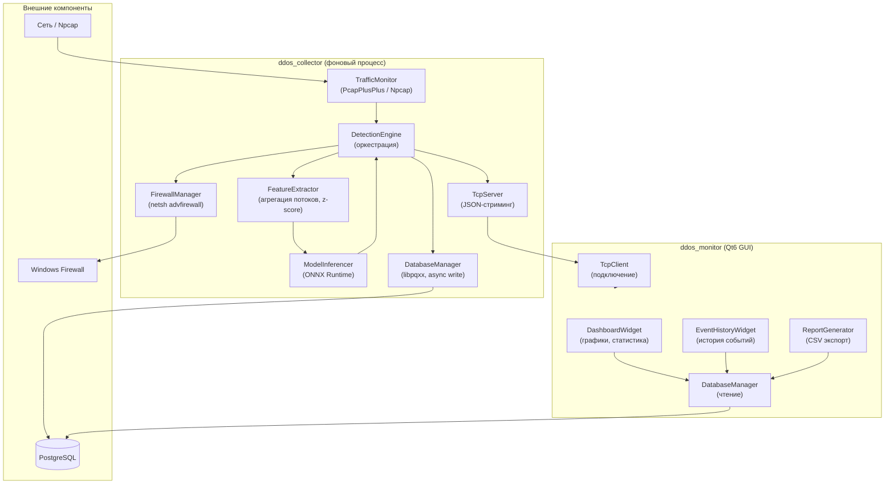
```mermaid
flowchart TB
  subgraph Collector["ddos_collector (фоновый процесс)"]
    TM["TrafficMonitor
(PcapPlusPlus / Npcap)"]
    FE["FeatureExtractor
(агрегация потоков, z-score)"]
    MI["ModelInferencer
(ONNX Runtime)"]
    DE["DetectionEngine
(оркестрация)"]
    FM["FirewallManager
(netsh advfirewall)"]
    DB1["DatabaseManager
(libpqxx, async write)"]
    TCP1["TcpServer
(JSON-стриминг)"]
  end
  subgraph Monitor["ddos_monitor (Qt6 GUI)"]
    DW["DashboardWidget
(графики, статистика)"]
    EH["EventHistoryWidget
(история событий)"]
    RG["ReportGenerator
(CSV экспорт)"]
    DB2["DatabaseManager
(чтение)"]
    TCP2["TcpClient
(подключение)"]
  end
  subgraph External["Внешние компоненты"]
    PG[("PostgreSQL")]
    NET["Сеть / Npcap"]
    FW["Windows Firewall"]
  end

  NET --> TM --> DE
  DE --> FE --> MI --> DE
  DE --> FM --> FW
  DE --> DB1 --> PG
  DE --> TCP1 --> TCP2 --> Monitor
  DB2 --> PG
  DW & EH & RG --> DB2
```

<p align="center">Рис. Е.1. Взаимодействие компонентов системы</p>

### 2. Алгоритм главного цикла обработки трафика

```mermaid
flowchart TD
  Start(["Старт"]) --> Init["Инициализация:
ConfigManager, ModelInferencer,
DatabaseManager, TcpServer"]
  Init --> Capture["TrafficMonitor::startCapture()
запуск захвата в lock-free очередь"]
  Capture --> LoopStart["Начало окна агрегации (1 с)
FeatureExtractor::reset()"]
  LoopStart --> Dequeue{"dequeuePacket()
пакет доступен?"}
  Dequeue -- Да --> Process["processPacket()
обновить FlowStats"]
  Process --> TimeCheck{"Окно
≥ 1 с?"}
  TimeCheck -- Нет --> Dequeue
  TimeCheck -- Да --> Telemetry["fillTelemetry()
вычислить PPS"]
  Dequeue -- Нет --> TimeCheck
  Telemetry --> Noise{"PPS
< 50?"}
  Noise -- Да --> Benign["label=0, confidence=0
(порог шума)"]
  Noise -- Нет --> Features["computeNormalizedFeatures()
z-score нормализация"]
  Features --> Infer["ModelInferencer::predict()
ONNX Runtime инференс"]
  Infer --> Incident["updateIncidentState()
конечный автомат атака↔норма"]
  Incident --> Block{"Атака
и mitigation ON?"}
  Block -- Да --> Firewall["FirewallManager::blockIp()
netsh advfirewall add rule"]
  Block -- Нет --> Callback
  Firewall --> Callback["resultCallback_():
DatabaseManager::enqueueEvent()
TcpServer::send()"]
  Benign --> Callback
  Callback --> Running{"running_?"}
  Running -- Да --> LoopStart
  Running -- Нет --> Stop(["Стоп
clearAllRules()"])
```

<p align="center">Рис. Е.2. Схема процесса непрерывного мониторинга</p>

### 3. Алгоритм извлечения и нормализации признаков

```mermaid
flowchart TD
  P(["PacketBuffer* из очереди"]) --> Parse["Распаковка PcapPlusPlus:
Ethernet → IP → TCP/UDP/ICMP"]
  Parse --> Tuple["Извлечь 5-tuple:
src_ip, dst_ip, src_port, dst_port, proto"]
  Tuple --> FindFlow{"activeFlows_
[FlowKey] существует?"}
  FindFlow -- Нет --> Create["Создать FlowStats
установить initiatorIp, firstPacketTime"]
  FindFlow -- Да --> Update
  Create --> Update["Обновить FlowStats:
fwdPackets++, fwdBytes += len"]
  Update --> Proto{"proto?"}
  Proto -- TCP --> TCP_Flags["synPackets, ackPackets,
finPackets, rstPackets,
pshPackets, urgPackets++
tcpWindowSizeTotal += window"]
  Proto -- UDP --> UDP_End["fwdBytes += udp_len"]
  Proto -- ICMP --> ICMP_End["icmpPackets++"]
  TCP_Flags --> Global
  UDP_End --> Global
  ICMP_End --> Global["Глобальные счётчики окна:
totalPackets++, totalBytes++
srcIpCounts_[src_ip]++"]
  Global --> End(["Следующий пакет"])

  subgraph Normalize["По окончании окна: computeNormalizedFeatures()"]
    NF1["Для каждого FlowStats:
vector<double> raw = buildFeatureVector()"]
    NF2{"useLog1p?"}
    NF3["x = log1p(x)"]
    NF4["x' = (x - μᵢ) / σᵢ"]
    NF5["return normalized vector"]
    NF1 --> NF2
    NF2 -- Да --> NF3 --> NF4
    NF2 -- Нет --> NF4
    NF4 --> NF5
  end
```

<p align="center">Рис. Е.3. Потоковая обработка сетевых пакетов</p>

### 4. Логическая схема базы данных

```mermaid
erDiagram
  sessions {
    SERIAL id PK
    TEXT interface_name
    TEXT model_name
    TIMESTAMP start_time
    TIMESTAMP end_time
    BIGINT total_packets
    BIGINT total_attacks
    BIGINT total_benign
  }
  events {
    SERIAL id PK
    INTEGER session_id FK
    TIMESTAMP timestamp
    INTEGER label
    DOUBLE_PRECISION confidence
    DOUBLE_PRECISION pps
    BIGINT total_packets
    JSONB features
    TEXT model_name
  }
  security_events {
    SERIAL id PK
    INTEGER session_id FK
    TIMESTAMP start_time
    REAL duration_sec
    TEXT attacker_ip
    REAL pps_max
    TEXT type_label
    REAL confidence
  }
  stats_snapshots {
    SERIAL id PK
    INTEGER session_id FK
    TIMESTAMP timestamp
    REAL packets_per_s
    BIGINT total_packets
    INTEGER current_label
  }
  sessions ||--o{ events : "session_id"
  sessions ||--o{ security_events : "session_id"
  sessions ||--o{ stats_snapshots : "session_id"
```

<p align="center">Рис. Е.4. ER-диаграмма хранилища инцидентов</p>

### 5. Интерфейс пользователя (ddos_monitor)


<p align="center">Рис. Е.5. Основное окно мониторинга в реальном времени</p>


<p align="center">Рис. Е.6. Виджет детальной сетевой аналитики</p>