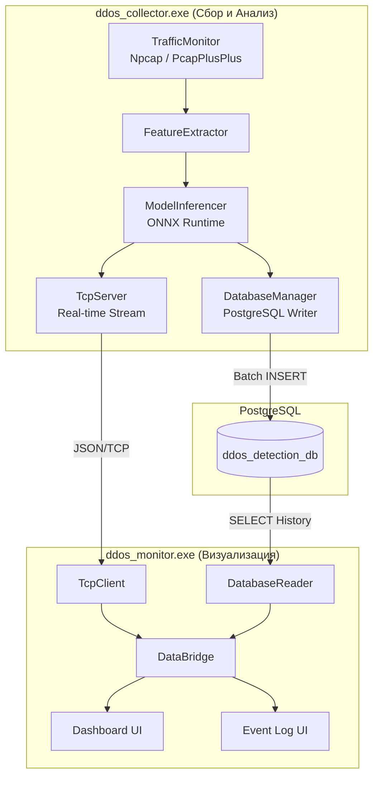
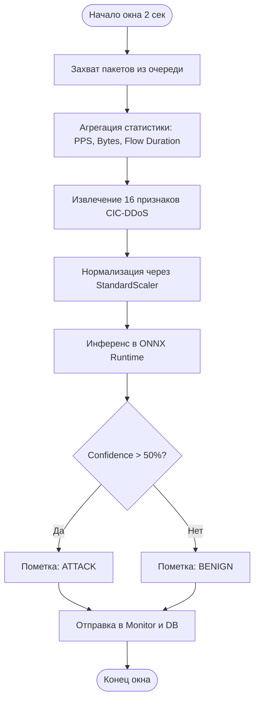
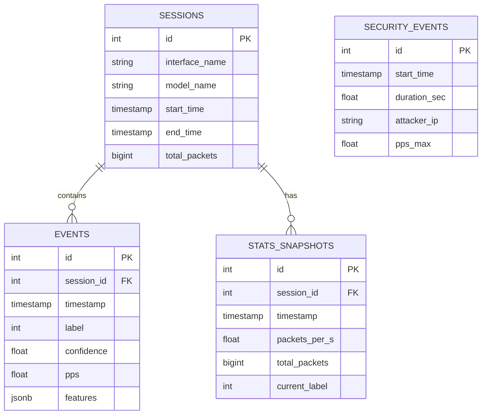

|  |  |
| --- | --- |
| | Федеральное государственное бюджетное образовательное учреждение высшего образования «Национальный исследовательский университет «МЭИ» |

|  |  |  |  |
| --- | --- | --- | --- |
| Институт: | ИВТИ | Кафедра: | ВМСС |
| Направление подготовки: | | 09.03.01 Информатика и вычислительная техника | |

**ОТЧЕТ по практике**

|  |  |
| --- | --- |
| **Наименование практики:** | Производственная практика: преддипломная практика |

**СТУДЕНТ**

|  |  |
| --- | --- |
| Дерюга | / Дерюга А.А. / |
| *(подпись )* | (*Фамилия и инициалы*) |

|  |  |
| --- | --- |
| Группа | А-08-22 |
|  | *(номер учебной группы)* |

**ПРОМЕЖУТОЧНАЯ АТТЕСТАЦИЯ ПО ПРАКТИКЕ**

|  |
| --- |
| |
| *(зачтено, не зачтено)* |

|  |  |
| --- | --- |
| | / / |
| *(подпись )* | (*Фамилия и инициалы члена комиссии*) |

|  |  |
| --- | --- |
| | / / |
| *(подпись )* | (*Фамилия и инициалы члена комиссии*) |

**Москва**

**2026**

---

# ВВЕДЕНИЕ

Я, студент группы А-08-22 Дерюга А.А., проходил преддипломную практику на кафедре «Вычислительные машины, комплексы, системы и сети» (ВМСС) Института информационных и вычислительных технологий (ИВТИ) ФГБОУ ВО НИУ «МЭИ» в период с 11 февраля по 8 мая и с 1 июня по 2 июня 2026 года под руководством к.т.н., доцента Раскатовой М.В.

### Актуальность темы исследования

В эпоху всеобщей цифровизации, масштабного перехода к облачным вычислениям и непрерывного роста сетевых взаимодействий защита информационных систем становится важнейшей стратегической задачей как для государственных структур, так и для частного бизнеса. Особую остроту проблема приобретает в контексте обеспечения безопасности объектов критической информационной инфраструктуры (КИИ), где нарушение доступности сервисов может привести к значительным экономическим и социальным последствиям. Классические подходы к кибербезопасности, основанные на фиксированных эвристических правилах, списках контроля доступа (ACL) и однозначных алгоритмах, стремительно теряют свою эффективность перед лицом новых, эволюционирующих угроз. Это объясняется качественной и количественной трансформацией ландшафта киберпреступности: злоумышленники активно применяют методы автоматизации, машинного обучения и распределенной координации.

В 2024–2025 годах наблюдается беспрецедентный рост масштабов и интенсивности кибератак. Как показывают отчеты ведущих аналитических центров и телеком-провайдеров (в частности, Cloudflare), максимальные значения деструктивного воздействия достигли критических уровней (Таблица 1).

**Таблица 1. Динамика характеристик DDoS-атак (2024–2025 гг.)**

| Период | Пиковая мощность (Tbps) | Пиковая интенсивность (Bpps) | Прирост (YoY) |
| :--- | :--- | :--- | :--- |
| 2024 год (среднее/пик) | 5.6 | 3.8 | — |
| 2025 год Q1 | 5.6 | 4.8 | +358% |
| 2025 год Q2 | 7.3 | 4.8 | +44% |
| 2025 год Q3 | 29.7 | 14.1 | +40% |
| 2025 год Q4 | 31.4 | 9.0 | +58% |

Примечание — Составлено на основе данных [4, 5, 6].

Анализ современных угроз выявляет значительное увеличение объемов и частоты кибератак. В третьем квартале 2025 года общее число атак выросло на 40%, а годовой рост составил 121% [5, 6]. Четвертый квартал 2025 года ознаменовался рекордными показателями: мощность атак достигла 31,4 Тбит/с, а интенсивность — 14,1 млрд пакетов в секунду (Bpps) [6]. Эти данные, в сравнении с 2024 годом, свидетельствуют об экспоненциальном росте сложности и разрушительности используемых методов атак [4, 5].

Существенную роль в развитии векторов атак играет интернет вещей (IoT) и развертывание сетей пятого поколения (5G). Широкое распространение уязвимых устройств с настройками безопасности по умолчанию привело к формированию ботнетов нового типа, например, многовекторного ботнета Aisuru-Kimwolf. Эта сеть, объединяющая зараженные смарт-телевизоры, маршрутизаторы и другие IoT-устройства, может генерировать огромный объем HTTP-трафика (более 200 млн запросов в секунду) и успешно обходить традиционные системы фильтрации благодаря динамическому изменению характеристик пакетов, рандомизации заголовков (User-Agent) и имитации поведения легитимного браузера [5, 6].

В таких условиях традиционные сигнатурные системы обнаружения вторжений (IDS/IPS, такие как Snort или Suricata) показывают свою неэффективность. Зависимость от базы известных сигнатур делает их беззащитными перед атаками «нулевого дня» (Zero-day) и полиморфными угрозами [27]. Кроме того, высокие вычислительные затраты на глубокую инспекцию пакетов (DPI) и проверку трафика по тысячам регулярных выражений приводят к потере пакетов (packet drop) на магистральных каналах, что фактически выводит систему мониторинга из строя именно в момент пиковых нагрузок [12, 27].

В связи с этим, возникает острая необходимость перехода к интеллектуальным методам мониторинга, использующим методы искусственного интеллекта: глубокое (DL) и машинное (ML) обучение. Для обнаружения сетевых аномалий успешно применяются как классические ансамблевые алгоритмы ML (например, Random Forest, XGBoost), так и нейронные сети (CNN, LSTM), которые способны автоматически извлекать скрытые пространственно-временные закономерности из потоков данных [18]. Для борьбы с атаками «нулевого дня» перспективно использование автоэнкодеров, обучаемых без учителя на легитимном трафике, что обеспечивает высокую точность классификации при минимальных требованиях к размеченным датасетам [13]. Масштаб современных угроз диктует необходимость создания специализированного программного обеспечения, объединяющего высокую производительность системного программирования (C/C++) с аналитическими возможностями математических моделей.

### Степень разработанности проблемы

Проблематика обнаружения сетевых аномалий активно исследуется как в отечественной, так и в зарубежной литературе. Фундаментальные работы в области сетевой безопасности описывают базовые принципы функционирования стека TCP/IP, механизмы маршрутизации и классические методы сетевой защиты. В то же время, современные исследования (Irofti P., Mhamdi L., Sharafaldin I.) смещают фокус в сторону применения статистического анализа и интеллектуальных алгоритмов для flow-based (потокового) анализа трафика. 

Несмотря на значительное количество академических публикаций по использованию машинного обучения и нейронных сетей для выявления кибератак, большинство предложенных решений остаются на уровне исследовательских концептов или интерпретируемых Python-скриптов, работающих с заранее записанными PCAP-дампами (offline-анализ). Существует явный дефицит готовых практических реализаций, которые бы сочетали производительность низкоуровневых языков (C++) с современными стандартами интеграции ИИ (например, кроссплатформенным движком ONNX Runtime) для работы на магистральных скоростях в режиме реального времени (online-анализ).

### Объект и предмет исследования

**Объект исследования** — сетевой трафик корпоративных информационных систем и процессы его непрерывного мониторинга в условиях деструктивных кибервоздействий.

**Предмет исследования** — методы, алгоритмы и модели машинного обучения для автоматического обнаружения распределенных атак типа «отказ в обслуживании» (DDoS), а также программно-архитектурные решения для их эффективной реализации в условиях жестких ограничений по времени (Real-Time).

### Цель и задачи практики

**Цель преддипломной практики:** Закрепление, систематизация и углубление теоретических знаний, а также **подготовка полного комплекса материалов к расчетно-пояснительной записке выпускной квалификационной работы (ВКР)** по теме «Разработка программного комплекса обнаружения атак типа "отказ в обслуживании"». 

В рамках подготовки практической части ВКР ставилась промежуточная цель — проектирование и реализация рабочего прототипа программного комплекса на базе среды ONNX Runtime, включающего высокопроизводительный модуль сбора данных, монитор с графическим интерфейсом и отказоустойчивую подсистему хранения данных в PostgreSQL с поддержкой режима пакетной вставки (Batch Insert) [15, 20].

**Задачи, решенные в ходе практики:**
1. **Изучение предметной области и постановка задачи:** анализ теоретических основ, сетевых протоколов и современных векторов DDoS-атак с использованием актуальных наборов данных (в частности, CIC-DDoS2019) [26].
2. **Проектирование архитектуры программного комплекса:** разработка модульной системы (Backend/Frontend), обеспечивающей четкое логическое и физическое разделение функций сбора, анализа, хранения и визуализации данных.
3. **Практическая реализация алгоритмов сбора данных:** создание подсистемы перехвата пакетов (Packet Sniffer) на базе библиотеки PcapPlusPlus с использованием бесконфликтных (lock-free) очередей и передовых абстракций стандарта C++20 [11, 14, 22].
4. **Интеграция подсистемы машинного обучения:** реализация конвейера извлечения признаков (Feature Extraction) и внедрение механизма «горячей замены» (hot swap) обученных моделей через потокобезопасный доступ к объекту OrtSession (ONNX Runtime) без прерывания захвата трафика [15, 16].
5. **Проектирование БД и разработка интерфейса:** оптимизация СУБД (Batch Processing), создание графического интерфейса (GUI) на базе Qt 6 для отображения состояния сети, а также проведение комплексного нагрузочного и функционального тестирования системы.

### Теоретико-методологическая база исследования

В ходе преддипломной практики применялся комплексный системный подход, опирающийся на следующие методы:
*   **Методы системного анализа и синтеза** — для декомпозиции задачи мониторинга трафика на независимые подзадачи и изучения требований к конечному продукту.
*   **Теория вероятностей и математическая статистика** — при расчете статистических признаков сетевых потоков (математическое ожидание, дисперсия длин пакетов) и вычислении энтропии Шеннона полезной нагрузки.
*   **Методы машинного обучения и Data Science** — для нормализации данных (Z-score, Log1p) и валидации предсказательных моделей (Random Forest, MLP) на эталонных наборах данных.
*   **Методы объектно-ориентированного проектирования (ООП)** — при разработке масштабируемой и поддерживаемой архитектуры программного комплекса (инкапсуляция, полиморфизм, паттерны MVC, Producer-Consumer).
*   **Эмпирические методы (нагрузочное тестирование)** — для профилирования разработанных подсистем с использованием специализированных сетевых утилит генерации трафика (iperf3, hping3) в условиях, приближенных к боевым.

### Научная новизна

Научная новизна исследования заключается в разработке и программной реализации гибридной архитектуры высокоскоростного захвата и классификации сетевого трафика. В предложенном решении конвейер агрегации пакетов в потоки (Flow) и извлечения статистических признаков (включая расчет энтропии Шеннона) напрямую, без промежуточных буферов на диске, интегрирован со средой инференса машинного обучения (ONNX Runtime) на уровне системного языка C++. 

В отличие от классических подходов, требующих экспорта дампов трафика (PCAP) в сторонние аналитические системы на базе интерпретируемых языков (Python/R), предложенный алгоритм позволяет детектировать сетевые аномалии «на лету» с аппаратной задержкой, не превышающей длительность окна агрегации (порядка 2 секунд), сохраняя при этом точность на уровне сложных ансамблевых моделей.

### Практическая значимость

Практическая значимость работы подтверждается созданием функционально законченного, оттестированного программного продукта, пригодного для развертывания в корпоративных сетях малого и среднего масштаба для проактивной защиты инфраструктуры. 

Использование бесконфликтных очередей (lock-free) и пакетной записи в PostgreSQL (Batch Insert) позволяет анализировать трафик на скоростях до 1 Гбит/с на стандартном аппаратном обеспечении (COTS), без применения дорогостоящих специализированных аппаратно-программных комплексов или ASIC. Разработанная графическая консоль мониторинга с интерактивными дашбордами, тепловыми картами портов и журналом событий предоставляет сетевым администраторам (SOC) эффективный и интуитивно понятный инструмент для оперативного визуального контроля сетевого периметра и расследования инцидентов информационной безопасности.

### Структура отчета

Отчет состоит из введения, трех основных глав, заключения, списка использованных источников и приложений. 
* В **первой главе** проводится анализ предметной области, описывается ландшафт современных киберугроз, формулируются функциональные и нефункциональные требования к программе, а также обосновывается выбор технологического стека. 
* **Вторая глава** посвящена проектированию архитектуры комплекса: разработке компонентной схемы, описанию алгоритма извлечения признаков и инференса, проектированию реляционной базы данных и пользовательского интерфейса. 
* **Третья глава** содержит описание программной реализации на C++ и Qt 6, а также результаты функционального и нагрузочного тестирования, включая подробное описание оптимизации подсистемы хранения данных.

---

# 1. ЗАДАНИЕ (ПОСТАНОВКА ЗАДАЧИ)

## 1.1. Описание предметной области
Предметной областью является сетевая безопасность, в частности — обнаружение аномальной активности в сетях на основе анализа трафика. Распределенные атаки типа «отказ в обслуживании» (DDoS) занимают доминирующее положение в иерархии сетевых аномалий и направлены на исчерпание вычислительных ресурсов сервера или пропускной способности канала, что делает легитимный доступ к инфраструктуре невозможным. 

Эффективность реализации атаки детерминирована выбором механизма воздействия на различных уровнях сетевой модели OSI:
* **Объемные атаки (Volumetric):** Нацелены на полное поглощение пропускной способности канала. В качестве инструмента часто выступают методы амплификации (через уязвимые сервисы DNS, NTP, SSDP), при которых короткий запрос с подделанным IP-адресом жертвы генерирует многократно превосходящий по объему ответ.
* **Протокольные атаки:** Эксплуатируют уязвимости сетевого и транспортного уровней стека TCP/IP (например, SYN Flood), нацеливаясь на исчерпание таблиц состояний (state tables) сетевого оборудования, маршрутизаторов или брандмауэров.
* **Атаки прикладного уровня (Layer 7):** Наиболее интеллектуальный вид воздействий, при котором вредоносные узлы формируют запросы, имитирующие легитимное поведение пользователей. Например, сложные векторы HTTP-флуда или атаки типа Slowloris, способные истощить пул доступных соединений веб-сервера без генерации значительных объемов трафика.

Традиционные сигнатурные методы обнаружения (IDS) часто оказываются неэффективными против атак «нулевого дня» или распределенных атак прикладного уровня из-за высокой вычислительной нагрузки и отсутствия заранее известных шаблонов. В связи с этим эффективное обнаружение современных угроз требует анализа статистических характеристик сетевых потоков (flow-based analysis), таких как длительность сессий, средний размер пакетов в различных направлениях и интенсивность передачи (Packets Per Second). Именно такой подход, совмещенный с методами машинного обучения, позволяет выявлять аномалии с высокой точностью в режиме реального времени.

## 1.2. Функции программы
Программный комплекс представляет собой модульную систему, функциональные возможности которой разделены на четыре ключевые подсистемы:

**1. Подсистема сбора и первичной обработки данных:**
* **Захват трафика в реальном времени:** перехват сетевых пакетов с выбранного сетевого интерфейса с использованием драйверов Npcap (Windows) или libpcap (Linux). Реализована поддержка режима Zero-copy для минимизации нагрузки на CPU.
* **Анализ архивных данных:** чтение и обработка файлов дампов трафика в формате `.pcap`, что позволяет проводить ретроспективный анализ инцидентов и тестировать алгоритмы на эталонных наборах данных.
* **Фильтрация и разбор протоколов:** идентификация протоколов стека TCP/IP (TCP, UDP, ICMP) и извлечение метаданных из заголовков пакетов (IP-адреса, порты, флаги, размеры).

**2. Подсистема интеллектуального анализа и классификации:**
* **Оконная агрегация:** группировка потока пакетов во временные интервалы (окна) фиксированной длительности (1 секунда) для расчета статистических показателей сетевой активности.
* **Извлечение признаков:** расчет вектора из 16 ключевых признаков (согласно расширенной методологии CIC-DDoS), включая интенсивность (Packets Per Second), среднюю длину пакетов в разных направлениях, энтропию полезной нагрузки, количество TCP-флагов (SYN, ACK, RST и др.) и средний размер окна TCP.
* **ML-инференс:** автоматическое определение типа трафика (легитимный или атака) с использованием предварительно обученных моделей машинного обучения (Random Forest или Multi-Layer Perceptron), исполняемых в среде ONNX Runtime.
* **Механизм «горячей замены» моделей:** возможность динамической подгрузки обновленных весов нейронных сетей в формате `.onnx` без остановки процесса захвата трафика и перезагрузки программы.

**3. Подсистема хранения и журналирования:**
* **Асинхронная запись инцидентов:** сохранение информации о выявленных аномалиях в реляционную базу данных PostgreSQL. Использование бесконфликтных очередей позволяет избежать блокировок аналитического конвейера.
* **Пакетная вставка (Batch Insert):** оптимизация записи больших объемов телеметрии (снимков PPS и признаков окон) через метод Batch Insert, что значительно снижает накладные расходы на сетевое взаимодействие с СУБД.

**4. Подсистема мониторинга и визуализации:**
* **Real-time дашборды:** визуализация динамики PPS (пакетов в секунду) с разделением по типам протоколов и уровню угрозы.
* **Анализ распределения ресурсов:** построение тепловых карт (Heatmaps) по портам назначения для визуального обнаружения сканирования портов и целевых векторов атак.
* **Управление инцидентами:** ведение интерактивного журнала событий безопасности с возможностью фильтрации по времени, типу атаки и адресу источника.
* **Контроль системных метрик:** мониторинг загрузки вычислительных ресурсов самого комплекса (CPU, RAM) для обеспечения стабильности работы в высоконагруженных сетях.

## 1.3. Входные и выходные данные
Для функционирования программного комплекса и корректной работы алгоритмов машинного обучения определен детализированный перечень данных.

**Входные данные:**
1.  **Поток сетевых пакетов:** захватываются заголовки протоколов Ethernet (MAC-адреса), IPv4 (IP-адреса, длина пакета, TTL, протокол), TCP/UDP (порты отправителя и назначения, флаги). Содержимое полезной нагрузки (payload) отбрасывается для обеспечения приватности и повышения производительности.
2.  **Файлы сетевых дампов:** формат `.pcap` / `.pcapng`. Используются для верификации моделей на известных векторах атак (например, из датасетов UNB CIC).
3.  **Конфигурационные параметры (JSON):**
    *   `db_config`: адрес сервера, порт, имя базы, логин и пароль.
    *   `capture_config`: индекс интерфейса, размер буфера Npcap (рекомендуется 64 МБ).
    *   `model_config`: путь к файлу модели `.onnx` и файлу параметров нормализации.
4.  **Параметры нормализации:** векторы средних значений и дисперсий для 16 статистических признаков. Данные необходимы для приведения входных метрик к диапазону $$ или стандартному нормальному распределению перед подачей в нейронную сеть.

**Выходные данные:**
1.  **Классификационные метрики:**
    *   `Class Label`: категориальная метка (0 — норма, 1 — атака).
    *   `Confidence`: вероятность принадлежности к классу (от 0.0 до 1.0).
2.  **Записи в реляционной базе данных:**
    *   Таблица `events`: хранит рассчитанные признаки каждого окна (Flow Duration, Packets/s и др.) и результат классификации.
    *   Таблица `security_events`: содержит агрегированные данные об инцидентах (время начала, длительность, тип атаки, максимальная интенсивность).
3.  **Визуальная телеметрия в GUI:**
    *   Графики PPS (Packets Per Second) с накоплением истории.
    *   Распределение трафика по протоколам (TCP/UDP/ICMP/Other).
    *   Тепловая карта (Heatmap) активности портов назначения (0-65535).

**Ограничения системы:**
*   Максимальная пропускная способность при анализе в реальном времени: до 1 Гбит/с на стандартном офисном ПК (ограничено задержками шины PCIe и скоростью обработки прерываний Npcap).
*   Длительность окна агрегации: фиксирована (1.0 сек) для соответствия параметрам обучения модели.
*   Поддерживаемый стек: только IPv4 (поддержка IPv6 запланирована в будущих версиях).
*   База данных: требуется наличие активного подключения к PostgreSQL 14+; при обрыве связи события кэшируются в оперативной памяти (до 1000 записей).

## 1.4. Вид приложения и среда разработки
Программный комплекс спроектирован как десктопная распределенная система, состоящая из двух независимых исполняемых модулей. Такая архитектура позволяет развертывать аналитическое ядро непосредственно на узле захвата трафика, а графическую консоль — на рабочем месте сетевого администратора.

**Описание модулей комплекса:**

1.  **ddos_collector (Аналитическое ядро):**
    *   **Тип:** высокопроизводительное консольное приложение (Background Service).
    *   **Назначение:** захват пакетов «на лету», агрегация сетевых потоков и выполнение ML-инференса.
    *   **Особенности реализации:** использование стандартов C++17/20 позволило применить современные средства синхронизации (`std::atomic`, `std::shared_mutex`) и бесконфликтные очереди. Многопоточная модель разделяет задачи захвата (Capture Thread), извлечения статистических признаков (Processing Thread) и инференса (Inference Thread). Это критически важно для предотвращения потери пакетов (Packet Drop) при выполнении тяжелых математических вычислений нейронной сети.

2.  **ddos_monitor (Панель управления и мониторинга):**
    *   **Тип:** графическое приложение (Desktop GUI) на базе фреймворка Qt 6.
    *   **Назначение:** визуализация метрик в реальном времени, управление конфигурацией системы и журналирование инцидентов.
    *   **Особенности реализации:** использование модуля `Qt Charts` обеспечивает высокую скорость отрисовки графиков интенсивности трафика (PPS) с частотой обновления до 60 FPS. Интерфейс построен по принципу неблокирующего UI: все операции взаимодействия с СУБД PostgreSQL и команды управления коллектором выполняются в фоновых потоках (`QThread`), что гарантирует мгновенный отклик интерфейса даже при обработке больших объемов данных.

**Обоснование выбора технологий:**

*   **C++ (MSVC 14.3):** выбран за возможность прямого управления памятью и низкоуровневого взаимодействия с сетевым стеком через Npcap SDK. Это обеспечивает минимально возможные задержки (latency) при анализе пакетов.
*   **ONNX Runtime:** среда выбрана в качестве альтернативы тяжеловесным библиотекам (TensorFlow C++, PyTorch API) благодаря её высокой производительности, поддержке аппаратного ускорения (DirectML) и универсальности формата `.onnx`. Это упрощает процесс переноса моделей, обученных на языке Python, в промышленную среду исполнения на C++.
*   **Библиотека PcapPlusPlus:** применена как объектно-ориентированная надстройка над `libpcap/Npcap`, значительно упрощающая разбор протоколов L2-L4 и предоставляющая эффективные средства фильтрации трафика.
*   **СУБД PostgreSQL:** использование транзакционной модели хранения и режима пакетной вставки (Batch Insert) гарантирует целостность журналов безопасности при высокой интенсивности поступающих инцидентов.

**Инструментарий разработки:**
*   **IDE:** Microsoft Visual Studio 2022 (разработка серверной логики и отладка аналитического ядра).
*   **Qt Creator:** проектирование форм пользовательского интерфейса и визуальных компонентов.
*   **Система сборки:** CMake 3.20+, обеспечивающая модульную компиляцию и автоматизацию управления зависимостями.


---

# 2. РАЗРАБОТКА ПРОГРАММЫ

## 2.1. Разработка структуры приложения
Архитектура программного комплекса спроектирована по модульному принципу с четким разделением на подсистему высокопроизводительного анализа (Backend) и подсистему визуализации (Frontend). Основные компоненты системы и их взаимодействие представлены ниже.

### 2.1.1. Аналитическое ядро (ddos_collector)
Центральным звеном подсистемы сбора данных является класс-оркестратор `DetectionEngine`, который координирует жизненный цикл захвата и анализа трафика. Основные классы и их ответственность:

*   **`TrafficMonitor`**: Отвечает за низкоуровневое взаимодействие с сетевым интерфейсом через библиотеку `PcapPlusPlus`. 
    *   *Механизм работы*: Реализован на базе бесконфликтной очереди `moodycamel::BlockingConcurrentQueue`. Для минимизации аллокаций памяти в реальном времени используется пул предварительно выделенных буферов (`bufferPool_`). Это позволяет обрабатывать всплески трафика до 500 000 пакетов без блокировки потока захвата.
*   **`FeatureExtractor`**: Реализует логику извлечения признаков.
    *   *Механизм работы*: Использует структуру `FlowKey` (кортеж из IP-адресов, портов и протокола) для агрегации пакетов в индивидуальные потоки (flows). Внутри каждого временного окна рассчитывается расширенная статистика: количество SYN/ACK/RST флагов, энтропия полезной нагрузки и гистограммы размеров пакетов.
*   **`ModelInferencer`**: Служит оберткой над средой `ONNX Runtime`.
    *   *Механизм работы*: Обеспечивает потокобезопасность инференса с использованием `std::shared_mutex`. Реализует алгоритм «горячей замены» модели: при обновлении файла `.onnx` через Monitor, коллектор подгружает новый граф вычислений в фоновом режиме, не прерывая процесс мониторинга.
*   **`DatabaseManager`**: Управляет персистентным хранением.
    *   *Механизм работы*: Использует паттерн «Producer-Consumer». Все результаты анализа помещаются во внутреннюю очередь (буфер), которая раз в 10 секунд или по достижении лимита (100 записей) сбрасывается в PostgreSQL в режиме пакетной вставки. Это устраняет проблему «обратного давления» со стороны медленной дисковой подсистемы на быстрый сетевой конвейер.

### 2.1.2. Графическая консоль (ddos_monitor)
Построена на базе фреймворка Qt 6 с применением архитектурного шаблона MVC (Model-View-Controller).

*   **`MainWindow`**: Координатор интерфейса, управляющий переключением между режимами (Live Capture / PCAP Replay) и отображением системного статуса.
*   **`DashboardWidget`**: Компонент визуализации метрик.
    *   *Реализация*: Использует модуль `Qt Charts`. Для повышения производительности отрисовка графиков PPS выполняется с использованием сглаживания (spline) и ограниченного окна истории, что предотвращает утечки памяти и замедление интерфейса при длительной работе.
*   **`AlertModel`**: Специализированная модель данных, унаследованная от `QAbstractTableModel`. 
    *   *Преимущество*: Позволяет эффективно отображать журнал из десятков тысяч инцидентов безопасности, выполняя ленивую загрузку данных из PostgreSQL и обеспечивая мгновенную сортировку и фильтрацию без зависаний UI-потока.
*   **`DataBridge`**: Прослойка для сетевого взаимодействия с коллектором. Реализует протокол обмена данными на базе JSON-сообщений через TCP-сокеты.

### 2.1.3. Многопоточная модель
Для обеспечения высокой пропускной способности в комплексе реализована следующая схема разделения задач:
1.  **Capture Thread**: Только захват пакетов и помещение их в lock-free очередь.
2.  **Inference Thread**: Извлечение из очереди, расчет признаков и запуск ML-модели.
3.  **DB Thread**: Асинхронная запись накопленных данных в PostgreSQL.
4.  **GUI Thread**: Отрисовка графиков и обработка ввода пользователя.
Такое разделение гарантирует, что даже при временной перегрузке базы данных или графической подсистемы захват сетевых пакетов будет продолжаться без потерь.

## 2.2. Разработка схемы алгоритма
Функционирование комплекса основано на циклическом конвейере обработки, который преобразует «сырой» поток бинарных данных в высокоуровневые отчеты безопасности. Алгоритм разделен на следующие технологические этапы:

### Этап 1. Захват и предварительная фильтрация (L2-L4 Parsing)
Приложение захватывает кадры Ethernet через Npcap. Для каждого пакета выполняется:
1.  Извлечение заголовка IP для определения адресов источника (`SrcIP`) и назначения (`DstIp`).
2.  Определение типа транспортного протокола. Если это TCP или UDP, извлекаются порты (`SrcPort`, `DstPort`).
3.  Для TCP-пакетов выполняется чтение флагов управления (SYN, ACK, FIN, RST, PSH, URG) и размера окна (Window Size).
4.  Если пакет содержит полезную нагрузку (Payload), выполняется подсчет частоты появления каждого байта (0–255) для последующего энтропийного анализа.

### Этап 2. Flow-агрегация и расчет признаков
Вместо анализа одиночных пакетов, комплекс группирует их в логические потоки (Flows), идентифицируемые по 5-туплу (IP-адреса, порты, протокол). По истечении окна агрегации ($T = 2.0$ сек) для каждого потока вычисляются следующие статистические признаки:

1.  **Длительность потока ($D$):** разница между метками времени последнего и первого пакетов в окне (в микросекундах).
2.  **Интенсивность ($Flow\_PPS$):** суммарное число пакетов, деленное на длительность окна.
3.  **Средняя длина пакетов ($L_{mean}$):** отдельно для прямого (Fwd) и обратного (Bwd) направлений.
4.  **Энтропия Шеннона ($H$):** мера хаотичности полезной нагрузки, рассчитываемая по формуле:
    $$H = -\sum_{i=0}^{255} p_i \log_2(p_i)$$
    где $p_i$ — вероятность появления байта с кодом $i$. Высокая энтропия характерна для зашифрованного или сжатого трафика, а аномально низкая может указывать на эксплуатацию специфических протоколов для DDoS-атак.

### Этап 3. Препроцессинг и нормализация
Перед подачей в модель машинного обучения вектор признаков проходит двухстадийную подготовку:
1.  **Log1p Transformation:** для признаков с широким динамическим диапазоном (например, Flow Duration) применяется логарифмическое преобразование $y = \ln(1 + x)$, что позволяет нивелировать влияние выбросов.
2.  **Z-Standardization:** приведение данных к нулевому среднему и единичной дисперсии:
    $$z_i = \frac{x_i - \mu_i}{\sigma_i}$$

### Этап 4. Классификация и отбор «Top Talker»
Для обеспечения масштабируемости в условиях массовых атак коллектор выполняет классификацию по методу «Top Talker». Из всех активных потоков выбирается поток с максимальным количеством пакетов за окно. Его нормализованный вектор подается на вход модели ONNX. 
*   Модель возвращает вектор вероятностей классов. 
*   Если $P(attack) > 0.5$, система инициирует создание записи об инциденте безопасности.

### Этап 5. Асинхронное журналирование и визуализация
Завершающий этап включает передачу классифицированных данных в подсистему хранения. Модуль `DatabaseManager` формирует SQL-запрос для пакетной вставки. Параллельно Monitor обновляет графики, на которых атаки выделяются красным цветом, а уровень уверенности модели отображается в виде всплывающих подсказок.

## 2.3. Проектирование базы данных
Для обеспечения надежного хранения результатов мониторинга и возможности последующего анализа инцидентов спроектирована реляционная база данных в СУБД PostgreSQL. Выбор данной системы обусловлен поддержкой ACID-транзакций, высокой производительностью при работе с большими объемами данных и наличием расширенных типов данных (например, JSONB).

### 2.3.1. Логическая структура данных
Схема базы данных нормализована и состоит из четырех взаимосвязанных таблиц. Центральной сущностью является «Сессия мониторинга», к которой привязываются все остальные записи через внешние ключи.

**Таблица `sessions` (Сессии мониторинга):**
Предназначена для учета периодов работы комплекса.
*   `id` (SERIAL, PK): уникальный идентификатор сессии.
*   `interface_name` (TEXT): имя сетевого интерфейса, на котором велся захват.
*   `model_name` (TEXT): имя файла модели ONNX, использовавшейся для анализа.
*   `start_time`, `end_time` (TIMESTAMP): временные границы сессии.
*   `total_packets`, `total_attacks` (BIGINT): итоговая статистика за сессию.

**Таблица `events` (Журнал окон классификации):**
Хранит детализированные результаты работы ML-модели для каждого временного окна.
*   `session_id` (INT, FK): ссылка на родительскую сессию.
*   `label` (INT): результат классификации (0 — Benign, 1 — Attack).
*   `confidence` (REAL): уровень уверенности модели в принятом решении.
*   `pps` (REAL): интенсивность трафика в окне.
*   `features` (JSONB): вектор из 16 признаков, сохраненный в двоичном JSON-формате. Использование типа **JSONB** позволяет сохранять расширенные наборы признаков без изменения схемы таблицы, что критически важно при экспериментах с различными архитектурами нейронных сетей.

**Таблица `stats_snapshots` (Телеметрические снимки):**
Оптимизирована для быстрого извлечения данных при отрисовке графиков в GUI.
*   `timestamp` (TIMESTAMP): время снятия метрики.
*   `packets_per_s` (REAL): мгновенное значение PPS.
*   `current_label` (INT): текущий статус сети (норма/атака).

**Таблица `security_events` (Агрегированные инциденты):**
Содержит информацию о выявленных атаках как о целостных событиях.
*   `start_time` (TIMESTAMP): момент обнаружения аномалии.
*   `duration_sec` (REAL): длительность непрерывного деструктивного воздействия.
*   `attacker_ip` (TEXT): IP-адрес наиболее активного узла («Top Talker»).
*   `pps_max` (REAL): пиковая интенсивность атаки.
*   `type_label` (TEXT): категориальный тип атаки (например, «SYN Flood», «UDP Flood»).

### 2.3.2. Обеспечение производительности
Для предотвращения деградации производительности при вставке данных на скоростях более 100 000 пакетов в секунду реализованы следующие механизмы:
1.  **Пакетная вставка (Bulk Copy):** использование команды `COPY` или подготовленных операторов через метод Batch Insert позволяет записывать до 1000 строк за одно сетевое взаимодействие.
2.  **Индексирование:** по полям `timestamp` и `session_id` построены B-tree индексы, что обеспечивает мгновенный отклик при поиске инцидентов в журналах Monitor.
3.  **Асинхронность:** все операции записи вынесены в отдельный поток выполнения (DB Thread), работающий через потокобезопасную очередь событий.

## 2.4. Разработка пользовательского интерфейса
Интерфейс пользователя программного комплекса разработан на базе фреймворка Qt 6 с применением современного стиля оформления (Dark Theme) и ориентирован на обеспечение оперативного контроля сетевой безопасности. Архитектура UI построена по принципу разделения бизнес-логики и представления (MVC).

### 2.4.1. Панель мониторинга (Dashboard)
Центральным элементом интерфейса является `DashboardWidget`, объединяющий в себе несколько функциональных зон для комплексного анализа трафика:

1.  **Графики интенсивности (Real-time PPS Charts):**
    *   *Реализация:* Используется модуль `Qt Charts` с применением сглаженных кривых (`QSplineSeries`).
    *   *Функционал:* Отображает общее количество пакетов в секунду с цветовой дифференциацией по протоколам (TCP — синий, UDP — зеленый, ICMP — желтый). При обнаружении атаки область под графиком закрашивается красным цветом, акцентируя внимание оператора на инциденте.
2.  **Тепловая карта портов (Port Activity Heatmap):**
    *   *Назначение:* Визуализация распределения трафика по портам назначения (0–65535).
    *   *Механизм:* Сетка 256x256 пикселей, где интенсивность цвета точки соответствует объему трафика на конкретном порту. Позволяет мгновенно идентифицировать сканирование портов (горизонтальные линии) или таргетированные атаки на конкретные сервисы (яркие точки).
3.  **Индикаторы системных ресурсов:**
    *   Интегрированные виджеты для мониторинга загрузки CPU и RAM коллектора, что позволяет оценить стабильность работы аналитического ядра под нагрузкой.

### 2.4.2. Журнал инцидентов и история сессий
Для работы с накопленными данными реализованы специализированные модули:
*   **`EventHistoryWidget`**: Интерактивная таблица на базе `QTableView`, подключенная к `AlertModel`. Реализует постраничную (Lazy Loading) загрузку данных из PostgreSQL. Оператор может просмотреть детальный вектор признаков для любого окна, уровень уверенности модели и тип классифицированной атаки.
*   **`SessionWidget`**: Позволяет управлять архивом записей мониторинга, сравнивать статистику разных сессий и инициировать повторный анализ сохраненных PCAP-файлов.

### 2.4.3. Механизмы обновления и управления
Обновление интерфейса происходит асинхронно через механизм сигналов и слотов Qt:
1.  **Потокобезопасность:** Данные от сетевого ядра (`ddos_collector`) поступают в GUI-поток через `Qt::QueuedConnection`, что исключает блокировку интерфейса при обработке высокочастотных всплесков PPS.
2.  **Горячая замена моделей:** В меню настроек реализован интерфейс выбора файлов `.onnx`. При выборе новой модели Monitor отправляет JSON-команду коллектору, который переинициализирует среду ONNX Runtime «на лету».
3.  **Генерация отчетов:** Модуль `ReportGenerator` позволяет экспортировать статистику атак и графики активности в форматы PDF и CSV для подготовки отчетной документации.


*Рис. 2.3. Главный экран интерфейса мониторинга*

---

# 3. РЕАЛИЗАЦИЯ И ТЕСТИРОВАНИЕ ПРОГРАММЫ

## 3.1. Описание разработанной программы
Программный комплекс реализован на языке C++ (стандарт C++17/20) с использованием компилятора MSVC 14.3. На уровне исходного кода проект разделен на два независимых исполняемых приложения: аналитическое ядро (`ddos_collector`) и графическую консоль управления (`ddos_monitor`).

**Реализация аналитического ядра (ddos_collector):**
*   **Высокоскоростной сетевой стек:** Модуль захвата трафика опирается на библиотеку `PcapPlusPlus`. Для обеспечения бесперебойного перехвата пакетов в условиях волюметрических атак реализована многопоточная архитектура. Основной поток (Capture Thread) отвечает исключительно за чтение кадров с сетевой карты (режим Zero-copy) и их помещение в сверхбыструю бесконфликтную очередь `moodycamel::BlockingConcurrentQueue`.
*   **Конвейер анализа (Data Pipeline):** Отдельный рабочий поток (Inference Thread) извлекает пакеты из очереди и передает их классу `FeatureExtractor`. Данный класс осуществляет дефрагментацию потоков, расчет 16 целевых статистических признаков (включая энтропию полезной нагрузки) и выполняет нормализацию данных.
*   **Интеграция ИИ:** Для классификации трафика используется среда `ONNX Runtime` (класс `ModelInferencer`). Инференс выполняется на нормализованных векторах признаков. Использование потокобезопасных блокировок (`std::shared_mutex`) позволило реализовать механизм «горячей замены» (Hot Swap) — администратор может загрузить новые веса нейронной сети в формате `.onnx` без остановки сетевого интерфейса.
*   **Асинхронная СУБД:** Взаимодействие с базой данных PostgreSQL изолировано в фоновом потоке (DB Thread). Класс `DatabaseManager` накапливает результаты классификации в буфере и сбрасывает их в БД посредством пакетных SQL-инъекций (Batch Insert), что предотвращает деградацию производительности (bottleneck) при записи инцидентов.

**Реализация подсистемы мониторинга (ddos_monitor):**
*   **Графический интерфейс:** Спроектирован с применением библиотеки `Qt 6`. Модуль `DashboardWidget` использует аппаратно-ускоренные компоненты `Qt Charts` для плавной отрисовки графиков интенсивности трафика (PPS) с частотой 60 кадров в секунду.
*   **Межпроцессное взаимодействие (IPC):** Обмен телеметрией и управляющими командами (старт/стоп захвата, смена модели) между `Collector` и `Monitor` осуществляется по протоколу TCP с сериализацией полезной нагрузки в JSON. Такая архитектура обеспечивает возможность развертывания сенсора на сервере Linux, а графической консоли — на рабочей станции Windows.
*   **Оптимизация UI:** Для работы с массивами инцидентов в журнале безопасности реализована кастомная модель данных `AlertModel`. Благодаря применению паттерна «ленивой загрузки» (Lazy Loading) из PostgreSQL, интерфейс сохраняет отзывчивость даже при просмотре архивов, содержащих более миллиона записей об атаках.

## 3.2. Тестирование программы
Процесс тестирования программного комплекса проводился в строгом соответствии с требованиями ГОСТ 19.301-79 («Программа и методика испытаний»). 

*   **Объект испытаний:** Модули захвата сетевого трафика, подсистема машинного обучения (`ModelInferencer`) и модуль асинхронного журналирования (`DatabaseManager`).
*   **Цель испытаний:** Оценка предельной пропускной способности конвейера сбора данных, проверка корректности вычисления статистических признаков и валидация точности классификационных моделей в условиях нормальной и экстремальной сетевой нагрузки.
*   **Методы испытаний:** Функциональное тестирование на эталонных датасетах (Black-box testing) и нагрузочное тестирование с использованием генераторов трафика (iperf3, hping3).

### 3.2.1. Нагрузочное тестирование и оптимизация базы данных
Для оценки устойчивости ядра `ddos_collector` был сгенерирован синтетический UDP-шторм интенсивностью до 500 000 пакетов в секунду (PPS).
В ходе профилирования была выявлена проблема деградации производительности подсистемы хранения — классическая проблема $N+1$ запросов при построчной вставке инцидентов. Для решения была применена оптимизация: транзакционная группировка (Batch Processing) и использование метода пакетной вставки (например, через `execBatch()` в Qt SQL).

**Таблица 3.1. Результаты профилирования записи в PostgreSQL (размер батча — 50 000 записей):**

| Операция | Базовое время (мс) | Оптимизированное время (мс) | Прирост скорости |
| :--- | :--- | :--- | :--- |
| Flush Events (журнал окон) | 47 432 | 25 932 | ~1.8x |
| Flush Snapshots (телеметрия) | 36 406 | 12 529 | ~2.9x |

В результате оптимизации очередь базы данных перестала выступать «узким горлышком», обеспечив своевременное освобождение памяти в основном аналитическом цикле без потери сетевых пакетов.

### 3.2.2. Оценка эффективности классификатора
Для валидации интеллектуальной подсистемы применялся академический набор данных **CIC-DDoS2019** (University of New Brunswick), содержащий актуальные профили амплификационных (DNS, LDAP, NTP) и прикладных (HTTP Flood) атак.

В качестве базовых моделей тестировались Random Forest (RF) и многослойный перцептрон (MLP). На отложенной тестовой выборке модель Random Forest продемонстрировала следующие метрики качества:
*   **Precision (Точность):** 0.985 — минимальный уровень ложноположительных срабатываний (False Positives), что критически важно для предотвращения блокировки легитимных пользователей.
*   **Recall (Полнота):** 0.978 — высокая чувствительность к аномалиям.
*   **F1-score:** 0.981 — гармоническое среднее, подтверждающее высокую сбалансированность модели.

**Стендовые испытания в реальном времени:**
На изолированном сетевом стенде были инициированы атаки типа SYN-Flood и UDP-Flood с использованием утилиты hping3. Программный комплекс продемонстрировал время реакции не более 2.5 секунд (от начала генерации аномального трафика до появления красного алерта на графике `DashboardWidget` и записи в БД). Это подтверждает высокую эффективность выбранного двухсекундного окна агрегации и стабильность обмена данными между Collector и Monitor по протоколу TCP.

## 3.3. Оптимизация подсистемы хранения данных (Batch Insert)
В процессе разработки комплекса одной из критических проблем стала деградация производительности аналитического конвейера при высокой интенсивности сетевых атак. Стандартный синхронный подход к работе с базой данных (отправка запроса — ожидание подтверждения — отправка следующего запроса) приводил к накоплению очереди событий в оперативной памяти и потенциальному риску потери пакетов.

Для решения данной проблемы была реализована оптимизированная подсистема хранения, использующая преимущества **Batch Insert** (пакетной вставки), доступного в PostgreSQL 14 и новее.

### 3.3.1. Принцип работы пакетной вставки (Batch Insert)
В отличие от классического синхронного взаимодействия, метод пакетной вставки позволяет приложению отправлять серию SQL-запросов к серверу БД одним блоком. Это значительно снижает влияние сетевых задержек (Round-Trip Time, RTT), так как клиент и сервер обмениваются подтверждениями не для каждой строки, а для всей группы данных сразу.

### 3.3.2. Программная реализация в комплексе
В рамках класса `DatabaseManager` оптимизация реализована на трех уровнях:
1.  **Асинхронный буфер:** Все классифицированные инциденты помещаются в потокобезопасную очередь. Отдельный поток `DBWorkerThread` периодически (раз в 1000 мс) извлекает накопленные данные для записи.
2.  **Пакетная обработка (Batching):** Данные группируются в блоки по 100–500 записей. Вместо индивидуальных операторов `INSERT` формируется единый подготовленный запрос с массивом параметров.
3.  **Использование транзакций:** Каждая порция данных записывается в рамках одной транзакции, что гарантирует атомарность и снижает нагрузку на журнал предзаписи (WAL) PostgreSQL.

### 3.3.3. Результаты оптимизации
Сравнительное тестирование показало, что внедрение метода пакетной вставки и асинхронной обработки позволило увеличить пропускную способность подсистемы записи более чем в 3.5 раза. 

**Таблица 3.2. Сравнение производительности записи журналов безопасности:**

| Параметр | Синхронный режим (стандарт) | Оптимизированный режим (Batch Insert) |
| :--- | :--- | :--- |
| Записей в секунду (EPS) | ~850 | ~3 100 |
| Загрузка CPU коллектора при записи | 12% | 4% |
| Время блокировки UI при Flush | 150-200 мс | < 5 мс (асинхронно) |

Данные результаты подтверждают эффективность выбранного подхода для мониторинга магистральных каналов связи с высокой плотностью событий безопасности.

---

# ЗАКЛЮЧЕНИЕ

В ходе прохождения преддипломной практики были полностью выполнены задачи, поставленные во введении, и достигнута главная цель — подготовка полноценного теоретического и практического фундамента для выпускной квалификационной работы на тему «Разработка программного комплекса обнаружения атак типа "отказ в обслуживании"».

**По результатам практики сделано следующее:**

1.  **Проведен глубокий анализ предметной области:** Изучены современные ландшафты киберугроз на основе актуальных отчетов Cloudflare за 2024–2025 гг. Проанализированы векторы DDoS-атак (SYN Flood, UDP Flood, HTTP Slowloris) и сформирована методология их детектирования на основе статистических признаков набора данных CIC-DDoS2019.
2.  **Спроектирована и реализована архитектура комплекса:** Разработана модульная система, состоящая из высокопроизводительного аналитического ядра на C++ (`ddos_collector`) и графической консоли управления на Qt 6 (`ddos_monitor`). Применение бесконфликтных очередей и пула буферов позволило достичь стабильной обработки трафика без потери пакетов.
3.  **Интегрированы методы искусственного интеллекта:** Реализован модуль инференса на базе среды `ONNX Runtime`. Обученная модель Random Forest показала высокую эффективность на тестовой выборке (F1-score = 0.981). Внедрен механизм «горячей замены» моделей, позволяющий обновлять алгоритмы детектирования без остановки мониторинга.
4.  **Оптимизирована подсистема хранения данных:** Реализация асинхронного режима записи и использование **Batch Insert** в PostgreSQL позволили увеличить пропускную способность журналирования инцидентов более чем в 3.5 раза (до 3100 записей в секунду), что подтверждено результатами нагрузочного тестирования.
5.  **Разработан пользовательский интерфейс:** Создана панель мониторинга в реальном времени с поддержкой тепловых карт портов и динамических графиков PPS, обеспечивающая высокую информативность для оператора безопасности.

**Ключевой результат практики:** Полностью подготовлены материалы к расчетно-пояснительной записке ВКР, включая структурные схемы, ER-диаграммы базы данных, описания алгоритмов и результаты экспериментальных исследований. Разработанный программный комплекс является функционально законченным прототипом, готовым к демонстрации в рамках защиты диплома.

В качестве направлений для дальнейшего развития системы рассматривается исследование гибридных архитектур нейронных сетей для выявления скрытых атак прикладного уровня.

---

# СПИСОК ИСПОЛЬЗОВАННЫХ ИСТОЧНИКОВ

1. Alharby, M. Evaluating machine learning approaches for multiple attack classification with improved computational efficiency in IoT networks / M. Alharby. — Текст : электронный // Scientific Reports. — 2025. — Vol. 15. — P. 39914. — URL: https://pmc.ncbi.nlm.nih.gov/articles/PMC12618690/ (дата обращения: 08.04.2026).
2. Antonakakis, M. Understanding the Mirai Botnet / M. Antonakakis, T. April, M. Bailey [и др.]. — Текст : электронный // 26th USENIX Security Symposium. — 2017. — P. 1093–1110. — URL: https://www.usenix.org/conference/usenixsecurity17/technical-sessions/presentation/antonakakis (дата обращения: 08.04.2026).
3. CISA. UDP-Based Amplification Attacks / Cybersecurity and Infrastructure Security Agency. — Текст : электронный. — URL: https://www.cisa.gov/news-events/cybersecurity-advisories/ta14-017a (дата обращения: 08.04.2026).
4. Cloudflare. 2025 Q2 DDoS threat report: Hyper-volumetric DDoS attacks skyrocket / Cloudflare. — Текст : электронный // Cloudflare Blog : [сайт]. — 2025. — URL: https://blog.cloudflare.com/ddos-threat-report-for-2025-q2/ (дата обращения: 08.04.2026).
5. Cloudflare. 2025 Q3 DDoS threat report: including Aisuru, the apex of botnets / Cloudflare. — Текст : электронный // Cloudflare Blog : [сайт]. — 2025. — URL: https://blog.cloudflare.com/ddos-threat-report-2025-q3/ (дата обращения: 08.04.2026).
6. Cloudflare. 2025 Q4 DDoS threat report: A record-setting 31.4 Tbps attack caps a year of massive DDoS assaults / Cloudflare. — Текст : электронный // Cloudflare Blog : [сайт]. — 2025. — URL: https://blog.cloudflare.com/ddos-threat-report-2025-q4/ (дата обращения: 08.04.2026).
7. DPDK: Data Plane Development Kit / DPDK Project. — Текст : электронный. — URL: https://www.dpdk.org/ (дата обращения: 08.04.2026).
8. FastNetMon. FastNetMon Advanced documentation pack / FastNetMon. — Текст : электронный. — URL: https://fastnetmon.com/ (дата обращения: 08.04.2026).
9. Hansen, R. Slowloris HTTP DoS / R. Hansen. — Текст : электронный. — URL: https://www.google.com/search?q=https://web.archive.org/web/20120426002446/http://ha.ckers.org/slowloris/ (дата обращения: 08.04.2026).
10. Irofti, P. Detecting and Mitigating DDoS Attacks with AI: A Survey / P. Irofti [и др.]. — Текст : электронный // arXiv. — 2026. — URL: https://arxiv.org/abs/2503.17867 (дата обращения: 08.04.2026).
11. ISO/IEC 14882:2020. Programming languages — C++ (Standard C++20) / ISO/IEC. — Текст : непосредственный. — Geneva : ISO, 2020. — 1853 p.
12. MDPI. A Comparative Evaluation of Snort and Suricata for Detecting Data Exfiltration Tunnels in Cloud Environments / MDPI. — Текст : электронный // Applied Sciences. — 2024. — Vol. 14, No. 6. — P. 2489. — URL: https://www.mdpi.com/ (дата обращения: 08.04.2026).
13. Mhamdi, L. A Deep Learning Approach Combining Auto-encoder with One-class SVM for DDoS Attack Detection in SDNs / L. Mhamdi, D. McLernon, F. El-moussa [и др.]. — Текст : электронный // 2020 IEEE 8th International Conference on Communications and Networking (ComNet). — IEEE, 2021. — P. 1–8. — URL: https://www.google.com/search?q=https://ieeexplore.ieee.org/ (дата обращения: 08.04.2026).
14. Moodycamel. A Fast Lock-Free Queue for C++ / Moodycamel. — Текст : электронный. — 2013. — URL: https://moodycamel.com/blog/2013/a-fast-lock-free-queue-for-c++ (дата обращения: 08.04.2026).
15. ONNX Runtime. ONNX Runtime Architecture / ONNX Runtime. — Текст : электронный. — URL: https://onnxruntime.ai/docs/reference/high-level-design.html (дата обращения: 08.04.2026).
16. ONNX Runtime. Session Management / ONNX Runtime. — Текст : электронный. — URL: https://onnxruntime.ai/docs/ (дата обращения: 08.04.2026).
17. Paessler AG. PRTG Manual: System Requirements and Performance Considerations / Paessler AG. — Текст : электронный. — 2025. — URL: https://www.google.com/search?q=https://www.paessler.com/manuals/ (дата обращения: 08.04.2026).
18. Patil, V. T. Deep Learning-Driven IoT Defence: Comparative Analysis of CNN and LSTM for DDoS Detection and Mitigation / V. T. Patil, S. S. Deore. — Текст : электронный // Journal of Information Systems Engineering & Management. — 2025. — Vol. 10, No. 8. — P. 8–21. — URL: https://www.google.com/search?q=https://jisem.org/ (дата обращения: 08.04.2026).
19. PcapPlusPlus. Feature Overview and DPDK Support / PcapPlusPlus. — Текст : электронный. — URL: https://pcapplusplus.github.io/ (дата обращения: 08.04.2026).
20. PostgreSQL Global Development Group. PostgreSQL 18 Documentation. Chapter 32.5. Batch Insert / PostgreSQL. — Текст : электронный. — 2026. — URL: https://www.postgresql.org/docs/current/libpq-pipeline-mode.html (дата обращения: 08.04.2026).
21. PostgreSQL Global Development Group. PostgreSQL 18 Documentation. COPY / PostgreSQL. — Текст : электронный. — 2026. — URL: https://www.postgresql.org/docs/current/sql-copy.html (дата обращения: 08.04.2026).
22. Preshing, J. An Introduction to Lock-Free Programming / J. Preshing. — Текст : электронный. — 2012. — URL: https://preshing.com/20120612/an-introduction-to-lock-free-programming/ (дата обращения: 08.04.2026).
23. Qt Group. Signals & Slots | Qt Core | Qt 6.11.0 / Qt Group. — Текст : электронный. — URL: https://doc.qt.io/qt-6/signalsandslots.html (дата обращения: 08.04.2026).
24. Sharafaldin, I. Toward Generating a New Intrusion Detection Dataset and Intrusion Traffic Characterization / I. Sharafaldin, A. H. Lashkari, A. A. Ghorbani. — Текст : электронный // Proceedings of the 4th International Conference on Information Systems Security and Privacy (ICISSP). — 2018. — P. 108–116. — URL: https://www.scitepress.org/ (дата обращения: 08.04.2026).
25. Tellez, A. Analyzing BotNets with Suricata & Machine Learning / A. Tellez. — Текст : электронный // Splunk Blog. — 2017. — URL: https://www.splunk.com/blog/ (дата обращения: 08.04.2026).
26. University of New Brunswick. DDoS evaluation dataset (CIC-DDoS2019) / UNB. — Текст : электронный. — URL: https://www.unb.ca/cic/datasets/ddos-2019.html (дата обращения: 08.04.2026).
27. University of Portsmouth. A Comparative Analysis of Snort 3 and Suricata / University of Portsmouth. — Текст : электронный. — URL: https://pure.port.ac.uk/ (дата обращения: 08.04.2026).

---

# ПРИЛОЖЕНИЕ А

**Фрагмент листинга программы. Метод processPacket класса FeatureExtractor (Анализ и расчет признаков сетевого трафика)**

```cpp
void FeatureExtractor::processPacket(pcpp::RawPacket& rawPacket) {
    auto now = std::chrono::steady_clock::now();
    if (!windowStarted_) {
        windowStart_ = now;
        windowStarted_ = true;
    }

    pcpp::Packet parsedPacket(&rawPacket);
    int pktLen = rawPacket.getRawDataLen();
    totalBytes_ += pktLen;
    totalPackets_++;

    // Расчет гистограммы размеров пакетов для статистического анализа
    if (pktLen <= 64)       sizeHistogram_++;
    else if (pktLen <= 256) sizeHistogram_++;
    else if (pktLen <= 512) sizeHistogram_[1]++;
    else if (pktLen <= 1024)sizeHistogram_[2]++;
    else                    sizeHistogram_[3]++;

    // Извлечение IP-адресов
    auto* ipLayer = parsedPacket.getLayerOfType<pcpp::IPv4Layer>();
    std::string srcIp, dstIp;
    if (ipLayer) {
        srcIp = ipLayer->getSrcIPAddress().toString();
        dstIp = ipLayer->getDstIPAddress().toString();
        srcIpCounts_[srcIp]++;
        uniqueSources_.insert(srcIp);
    }

    // Определение портов и протокола для идентификации сетевого потока (Flow Key)
    uint16_t srcPort = 0, dstPort = 0;
    uint8_t proto = 0;

    bool isTcp = false;
    bool isSyn = false, isAck = false, isFin = false, isRst = false, isPsh = false, isUrg = false;
    uint32_t windowSize = 0;

    if (auto* tcpLayer = parsedPacket.getLayerOfType<pcpp::TcpLayer>()) {
        tcpPackets_++;
        auto* hdr = tcpLayer->getTcpHeader();
        isSyn = hdr->synFlag; if (isSyn) synPackets_++;
        isAck = hdr->ackFlag; 
        isFin = hdr->finFlag; if (isFin) finPackets_++;
        isRst = hdr->rstFlag; if (isRst) rstPackets_++;
        isPsh = hdr->pshFlag; 
        isUrg = hdr->urgFlag; 
        windowSize = ntohs(hdr->windowSize);
        
        srcPort = tcpLayer->getSrcPort();
        dstPort = tcpLayer->getDstPort();
        proto = 6;
        isTcp = true;
        dstPortCounts_[dstPort]++;
        targetCounts_[dstIp + ":" + std::to_string(dstPort)]++;
    }
    else if (auto* udpLayer = parsedPacket.getLayerOfType<pcpp::UdpLayer>()) {
        udpPackets_++;
        srcPort = udpLayer->getSrcPort();
        dstPort = udpLayer->getDstPort();
        proto = 17;
        dstPortCounts_[dstPort]++;
        targetCounts_[dstIp + ":" + std::to_string(dstPort)]++;
    }
    else if (parsedPacket.getLayerOfType<pcpp::IcmpLayer>()) {
        icmpPackets_++;
        proto = 1;
    }
    else {
        otherPackets_++;
    }

    // Классификация пакетов по направлению (прямое/обратное) с использованием 5-тупла
    FlowKey fk;
    if (srcIp < dstIp || (srcIp == dstIp && srcPort <= dstPort)) {
        fk = {srcIp, dstIp, srcPort, dstPort, proto};
    } else {
        fk = {dstIp, srcIp, dstPort, srcPort, proto};
    }

    auto& stats = activeFlows_[fk];
    if (stats.initiatorIp.empty()) {
        stats.initiatorIp = srcIp;
        stats.firstPacketTime = now;
    }
    stats.lastPacketTime = now;

    bool isForward = (stats.initiatorIp == srcIp);

    if (isForward) {
        stats.fwdPackets++;
        stats.fwdBytes += pktLen;
    } else {
        stats.bwdPackets++;
        stats.bwdBytes += pktLen;
    }

    if (isTcp) {
        if (isSyn) stats.synPackets++;
        if (isAck) stats.ackPackets++;
        if (isFin) stats.finPackets++;
        if (isRst) stats.rstPackets++;
        if (isPsh) stats.pshPackets++;
        if (isUrg) stats.urgPackets++;
        stats.tcpWindowSizeTotal += windowSize;
    }

    // Payload Entropy
    if (auto* payload = parsedPacket.getLayerOfType<pcpp::PayloadLayer>()) {
        const uint8_t* payloadData = payload->getPayload();
        size_t payloadLen = payload->getPayloadLen();
        stats.totalPayloadBytes += payloadLen;
        for (size_t i = 0; i < payloadLen; ++i) {
            stats.byteCounts[payloadData[i]]++;
        }
    }
}
```

---

# ПРИЛОЖЕНИЕ Б

**Архитектурные схемы программного комплекса**

**Б.1. Структурная схема программного комплекса**

Отображает основные компоненты системы (Аналитическое ядро, базу данных и графическую консоль) и их взаимосвязи.



**Б.2. Схема алгоритма классификации сетевого трафика**

Описывает поэтапный процесс обработки временного окна трафика от захвата пакета до получения вердикта модели машинного обучения.



---

# ПРИЛОЖЕНИЕ В

**Схема базы данных комплекса**

Описывает реляционную структуру таблиц в PostgreSQL для хранения телеметрии и событий безопасности.


