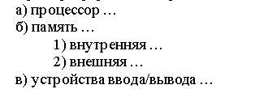
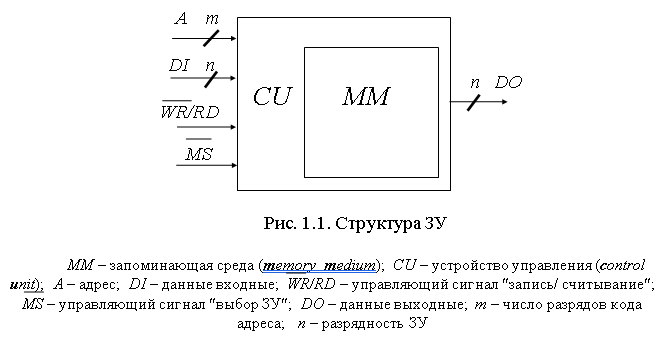
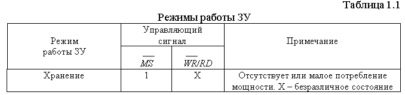

TРЕБОВАНИЯ К ОФОРМЛЕНИЮ – каф. ВМСС

1. Оформление пояснительной записки и графических материалов должно соответствовать настоящим Требованиям.

2. Расположение **структурных элементов** пояснительной записки:

- титульный лист;

- аннотация;

- содержание;

- определения;

- обозначения и сокращения;

- введение;

- основная часть;

- заключение;

- список использованных источников;

- приложения.

3. Требования к оформлению структурных элементов пояснительной записки.

Заголовки **всех** структурных элементов, кроме **основной части,** располагаются по центру строки, пишутся заглавными буквами (или с заглавной буквы) **без номера в начале** и **без точки в конце**.

3.1. **Титульный лист.** См. соответствующий бланк.

3.2. **Аннотация.** Объем – не более 1/2 листа. В КР и КП – может отсутствовать. В ДП желательно также привести аннотацию на одном из иностранных языков (англ., нем., франц.). Для студентов-иностранцев – на родном языке.

3.3. **Содержание** включает – введение, наименования всех разделов и подразделов (если они имеют наименования) основной части (заголовок «Основная часть» не пишется), заключение, список использованных источников, наименования приложений с указанием номеров страниц, с которых начинаются эти структурные элементы записки. (Пункты и подпункты в содержание не включаются.)

3.4. **Определения.** Здесь приводятся определения, необходимые для уточнения терминов, используемых в записке. Перечень определений начинают со слов: «В настоящем проекте применяются следующие термины …». Этот структурный элемент может отсутствовать.

3.5. **Обозначения и сокращения** приводятся с необходимой расшифровкой и пояснениями. Перечень должен располагаться столбцом. Слева в алфавитном порядке приводят сокращения, условные обозначения (в начале русские, затем иностранные), через тире справа – их детальную расшифровку.

Определения, обозначения и сокращения могут быть оформлены как один структурный элемент.

## 3.6. Введение должно отражать актуальность темы, цель исследований, методы решения поставленной задачи, исходные данные для разработки, ожидаемые результаты.

3.7. **Основная часть** отражает сущность задачи, методику её решения, полученные результаты, их экспериментальную проверку и т.п.

3.7.1. Основная часть делится на разделы. Разделы могут содержать подразделы, пункты, подпункты. Например:

**1. НАЗВАНИЕ ПЕРВОГО РАЗДЕЛА**

**2. НАЗВАНИЕ ВТОРОГО РАЗДЕЛА**

**2.1. Название первого подраздела второго раздела и т.д.**

2.1.1. Название первого пункта первого подраздела второго раздела и т.д.

Разделы, подразделы, пункты и подпункты следует нумеровать арабскими цифрами, записывать с абзацного отступа (с выравниванием влево) и отделять от названия точкой. Точки в конце названий разделов и подразделов не ставятся. Названия **разделов** рекомендуется набирать заглавными буквами. Каждый раздел следует начинать с новой страницы, после названия – пустая строка. Перед и после названия подразделов – пустая строка.

Пункты, при необходимости, могут быть разбиты на подпункты, которые должны иметь порядковую нумерацию в пределах каждого пункта, например 4.2.1.1., 4.2.1.2., 4.2.1.3. и т. д.

В тексте могут встречаться перечисления. Перед каждой позицией перечисления следует ставить **дефис,** а запись производить **с абзацного отступа**. При необходимости ссылки в тексте записки на одну из позиций перечисления перед ней следует ставить русскую **строчную букву** (за исключением ё, з, й, о, ч, ь, ы, ъ), после которой ставится скобка. Для дальнейшей детализации перечислений необходимо использовать **арабские цифры**, после которых ставится скобка, а запись производится с **дополнительного абзацного отступа**.

Пример оформления перечислений:

а) процессор …

б) память …

1) внутренняя …

2) внешняя …

в) устройства ввода/вывода …

3.7.2. Если текст документа подразделяется только на пункты (подпункты и т.д.), то они нумеруются порядковыми номерами в пределах всего документа. Пример – настоящие “Требования ...”

3.8. **Заключение** должно содержать краткие выводы по результатам выполнения проекта или отдельных его частей, конкретные оценки полученных результатов. Нумерация основных результатов желательна, но не обязательна.

3.9. **Список использованных источников**. Сведения об источниках приводятся в соответствии с требованиями ГОСТ 7.1. Их следует располагать в порядке появления ссылок на источники в тексте записки, нумеровать арабскими цифрами с точкой после цифры и печатать с абзацного отступа.

Ссылки в тексте обязательно должны быть **на все источники**. Примеры оформления ссылок в тексте: [ 1 ], [ 1 – 5 ], [ 1 – 5, 7, 9 ].

Ссылки на источники, имеющиеся в *Internet* (статьи, обзоры, справочные материалы фирм и т.п.), рекомендуется выполнять следующим образом: сначала даются на русском (или иностранном) языке основные сведения об источнике, например: автор, название статьи, место публикации (город), время публикации (год), объём (число страниц), затем, с новой строки, – полный адрес в *Internet*.

3.10. **Приложения.** В приложения могут быть вынесены: промежуточные математические доказательства; протоколы испытаний; инструкции, разработанные в процессе выполнения проекта; громоздкие схемы; перечни элементов; листинги программ и т.п.

В тексте проекта на все приложения должны быть даны ссылки. Приложения располагают в порядке ссылок на них в тексте. Каждое приложение следует начинать с новой страницы. Приложения обозначают заглавными буквами русского алфавита, начиная с А, за исключением букв Ё, 3, Й, О,
Ч, Ь, Ы, Ъ.

Приложение должно иметь заголовок, который записывают с прописной буквы по центру отдельной строкой.

В *приложении А*, на которое дается ссылка во введении, приводится *«Задание на дипломный проект».*

Если приложением является документ (задание на соответствующий проект, схема, перечень элементов и т.п.), то заголовок приложения (слова, выделенные курсивом в предыдущем абзаце) располагается по центру отдельного листа (с выравниванием по горизонтали и вертикали). Этот лист также нумеруется. Само приложение располагается после этого листа.

4. **Оформление текста пояснительной записки**

4.1. **Текст** должен быть выполнен любым печатным способом на одной стороне листа белой бумаги формата А4 **через полтора интервала**.

**Цвет шрифта** должен быть **черным**, **высота** букв, цифр и других знаков — **не менее 1,8 мм (кегль 14**). Гарнитура (рекомендуется) – **Times New Roman.**

Листы записки должны иметь следующие **размеры полей**: правое — **10 мм**, верхнее, левое и нижнее — **25 мм**. **Абзацный отступ** – **1,25 см (5 знаков).**

Разрешается использовать компьютерные возможности акцентирования внимания на определенных терминах, формулах, теоремах, применяя шрифты разной гарнитуры.

## 4.2. Нумерация страниц записки

Страницы записки следует нумеровать **арабскими цифрами**, соблюдая сквозную нумерацию по всему тексту записки, включая приложения. Номер страницы проставляют **в центре нижней части** листа без точки. Титульный лист и лист с аннотацией включают в общую нумерацию страниц записки. Номер страницы на этих листах не проставляют.

Рисунки и таблицы, расположенные на отдельных листах, включают в общую нумерацию страниц записки. Рисунки и таблицы на листе формата A3 учитывают как одну страницу.

4.3. **Рисунки** (чертежи, графики, схемы, в том числе схемы алгоритмов, компьютерные распечатки, диаграммы, экранные формы, фотоснимки) следует располагать непосредственно после текста, в котором они упоминаются впервые, или на следующей странице. Рисунки должны соответствовать требованиям государственных стандартов Единой системы конструкторской документации (ЕСКД).

Рисунки могут быть в компьютерном исполнении, в том числе и цветные. Рисунки не должны выполняться на темном фоне, затрудняющем качественную распечатку или ксерокопирование. **В частности, недопустимо приводить снимки экрана с фрагментами программного кода, использующие "темную" тему оформления.** Во многих случаях темный рисунок с текстом или графикой достаточно инвертировать средствами графического редактора.

Нумерация рисунков может быть сквозной или по разделам. Рисунки должны иметь наименование и могут иметь пояснительные данные (подрисуночный текст), которые помещают после наименования посередине строки (размер шрифта – 12).

Пример:

Примеры ссылок на рисунок в тексте:

...на рис. 1.1 приведена…или Структура ЗУ (рис 1.1) – это…

Рисунки каждого приложения обозначают аналогично с добавлением перед цифрой обозначения приложения. Например:

# Рис. А.3. Формирователь импульсов записи

**Графики** должны иметь на осях обозначения с размерностью, сетку и несколько цифр, определяющих масштаб.

## 4.4. Таблицы следует располагать непосредственно после текста, в котором они упоминаются впервые, или на следующей странице.

# **Номер** таблицы располагается **справа**, а **название** таблицы – на следующей строке **по центру**. Пример:

На все таблицы должны быть ссылки. При ссылке следует писать слово «табл.» с указанием ее номера. Нумерация может быть сквозной или по разделам, т.е. такой же, как и рисунков. Например: … в табл. 1.1 …

Таблицу с большим количеством строк допускается переносить на другой лист (страницу), на котором справа пишут «Продолжение таблицы …» с указанием её номера, при этом в продолжении таблицы необходимо продублировать заголовки и подзаголовки граф.

Таблицу с большим количеством граф допускается делить на части и помешать одну часть под другой в пределах одной страницы.

**Заголовки** граф и строк таблицы следует писать с **прописной буквы** в **единственном числе**, а подзаголовки граф — со строчной буквы, если они составляют одно предложение с заголовком, или с прописной буквы, если они имеют самостоятельное значение. В конце заголовков и подзаголовков таблиц точки не ставят. Таблицы слева, справа, сверху и снизу, как правило, ограничивают линиями. Размер шрифта в таблице – 12.

Разделять заголовки и подзаголовки боковины (левой графы таблицы) и граф диагональными линиями не допускается.

Горизонтальные и вертикальные линии, разграничивающие строки таблицы, допускается не проводить, если их отсутствие не затрудняет пользование таблицей.

4.5. **Уравнения и формулы** следует выделять из текста в отдельную строку. Выше и ниже каждой формулы или уравнения должно быть оставлено не менее одной свободной строки. Если уравнение не умещается в одну строку, то оно должно быть перенесено после знака равенства (=) или других математических знаков, причем знак в начале следующей строки повторяют.

Пояснение значений символов и числовых коэффициентов следует приводить непосредственно под формулой в той же последовательности, в которой они даны в формуле.

Формулы, на которые будут ссылки в тексте, следует нумеровать порядковой нумерацией в пределах всей записки или по разделам арабскими цифрами в круглых скобках. Номера следует располагать в крайнем правом положении на той же строке.

4.6. Необходимо строго придерживаться **единства обозначений**. Одни и те же узлы или сигналы и в тексте и на рисунках должны быть обозначены одинаково. **Использование синонимов недопустимо**. Не должно быть одинаковых обозначений у разных узлов (сигналов). Все обозначения и сокращения выполняются латинскими прописными буквами и должны быть пояснены (ГОСТ 2.710-81, п.2.1).

5. **Графический материал** (схемы, перечень элементов) может выноситься в приложения. Не допускается пояснять работу устройства (узлов) в тексте записки, ссылаясь на графический материал приложений. Должны быть приведены все необходимые поясняющие рисунки в самом тексте пояснительной записки.

6. **Описание разработки программного обеспечения** производится в тексте записки. При этом приводятся требуемые иллюстрации (классификации решаемых задач, схемы алгоритмов и т.п.). Оформление разделов по программному обеспечению должно соответствовать требованиям Единой системы программной документации (ЕСПД):

- ГОСТ 19.001-77. Общие положения

- ГОСТ 19.701-90. Схемы алгоритмов, программ, данных и систем

- ГОСТ 19.003-80. Схемы алгоритмов и программ. Обозначения условные графические

- ГОСТ 19.402-78. Описание программы

Распечатки программ с необходимыми комментариями выносятся в приложения. При этом названия программных блоков в тексте записки и соответствующих фрагментов программ в приложениях должны быть одинаковыми.

Для оформления распечатки текста программы рекомендуется использовать моноширинный шрифт гарнитуры **Courier** размером 10 или 12 пунктов. Допустимо шрифтовое выделение служебных слов и синтаксических конструкций языка программирования.

Небольшие (одна или несколько строк) фрагменты текста на языке программирования допускается включать в текст записки, не оформляя их как рисунок. Фрагменты текста на языке программирования должны начинаться с новой строки и записываться с абзацного отступа.

**ГОСТы**

Оформление приводимых в пояснительной записке графических материалов должно соответствовать требованиям ЕСКД (Единой системы конструкторской документации):

ГОСТ 2.701-84. Схемы. Виды и типы. Общие требования к выполнению.

ГОСТ 2.702-75. Правила выполнения электрических схем

ГОСТ 2.708-81. Правила выполнения электрических схем цифровой вычислительной техники.

ГОСТ 2.710-81. Обозначение буквенно-цифровые в электрических схемах.

ГОСТ 2.730-73. Обозначения условные графические в схемах. Приборы полупроводниковые

ГОСТ 2.743-91. Обозначения условные графические в схемах. Элементы цифровой техники.

С ГОСТ'ами можно ознакомиться в «Кабинете проектирования»,
корпус Ж, 6-й этаж или на кафедре ВМСиС (у Дерюгина А.А.).