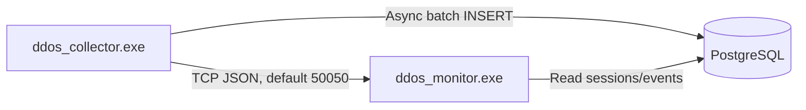

# Графические материалы

  

Дата актуализации: 08.04.2026

  

Этот файл оставлен как быстрый вход в визуальные материалы проекта.

Полный комплект из 5 обязательных диаграмм ВКР находится в docs/diagrams.md.

  

## 1. Быстрый обзор архитектуры

  

  

## 2. Что где смотреть

  

- Структурная схема комплекса: docs/diagrams.md

- Алгоритм классификации: docs/diagrams.md

- ER-диаграмма БД: docs/diagrams.md

- Схема интерфейса: docs/diagrams.md

- Sequence взаимодействия программ: docs/diagrams.md

  

## 3. Экспорт диаграмм

  

- Mermaid Live: https://mermaid.live

- VS Code Mermaid Preview