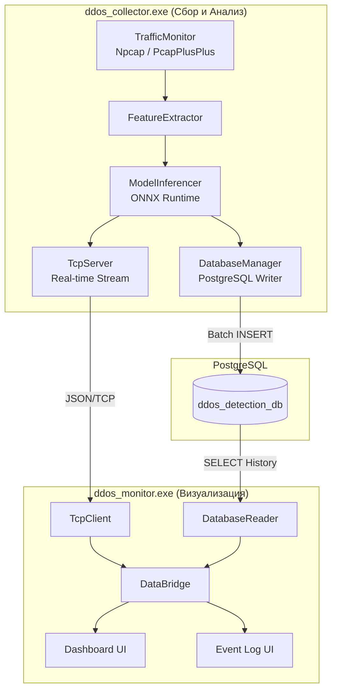
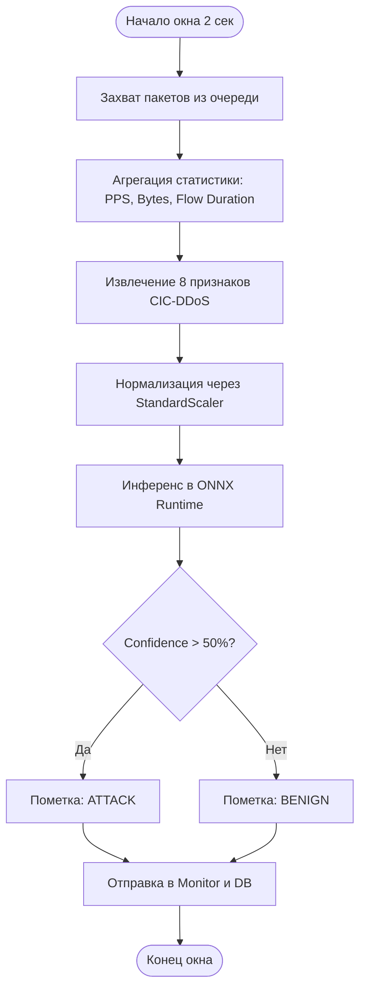
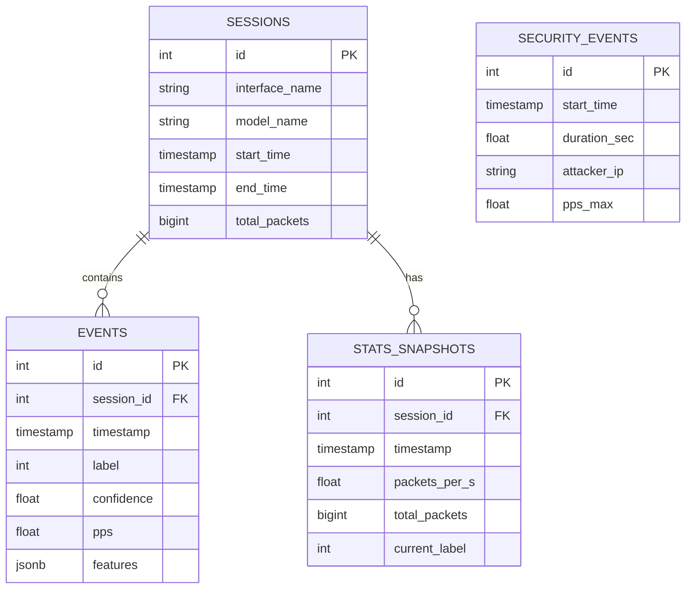
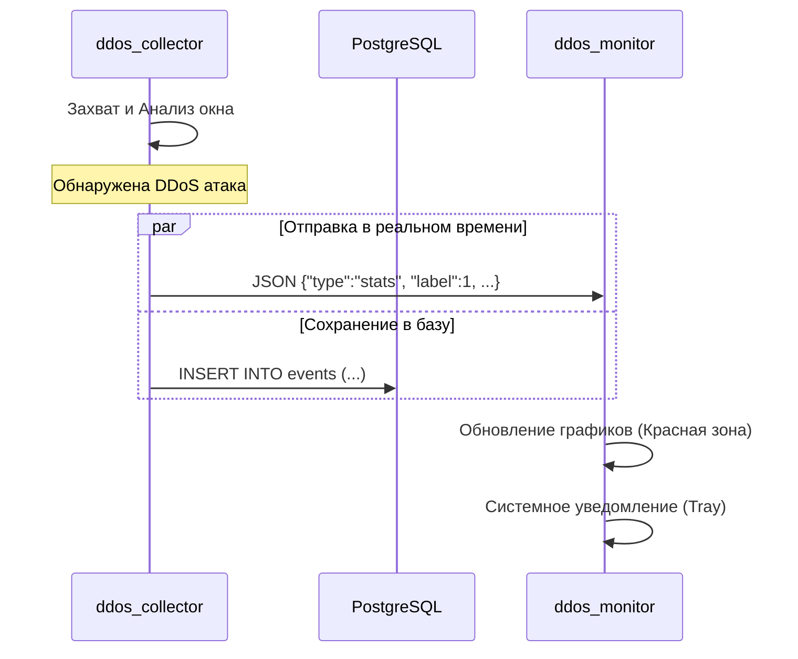
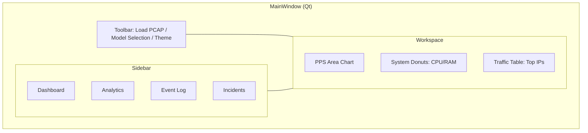

# Графические материалы (Диаграммы ВКР)

Версия: 2.3  
Дата актуализации: 10.05.2026

Этот документ содержит 5 обязательных диаграмм, требуемых заданием на ВКР, представленных в формате Mermaid.

---

## 1. Структурная схема программного комплекса

Отображает основные компоненты системы и их взаимосвязи.

---

## 2. Схема алгоритма классификации сетевого трафика

Описывает процесс от захвата пакета до получения вердикта.

---

## 3. ER-диаграмма (схема) базы данных

Описывает структуру таблиц в PostgreSQL.

---

## 4. Схема взаимодействия программ

Последовательность действий при обнаружении атаки.

---

## 5. Схема интерфейса пользователя (Формы)

Логическая компоновка основных элементов управления.

---

## Инструкция по экспорту
Для использования этих диаграмм в тексте ВКР рекомендуется:
1. Скопировать код Mermaid.
2. Вставить на сайте [Mermaid.live](https://mermaid.live).
3. Скачать в формате PNG (высокое разрешение) или SVG.
