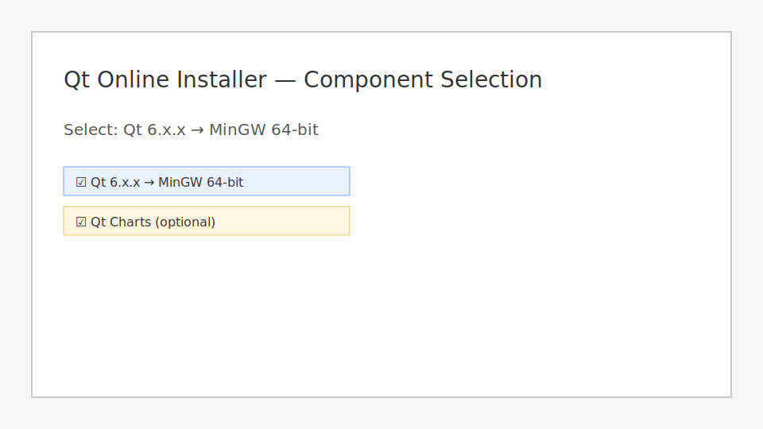
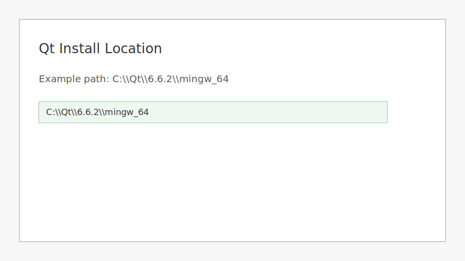
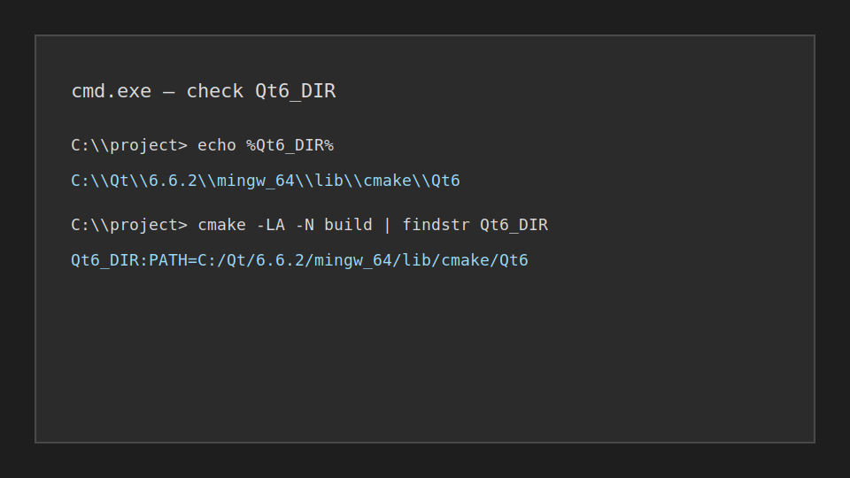
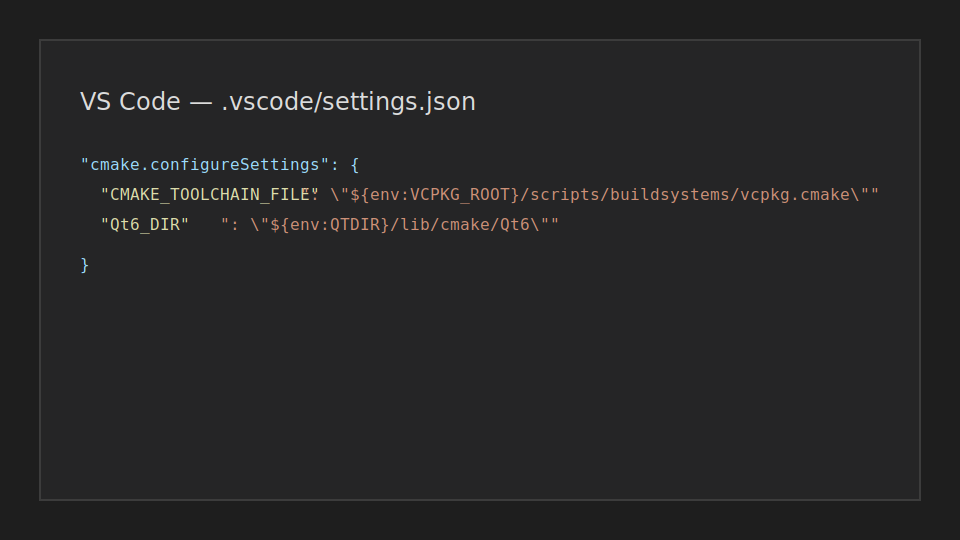

# Windows-only setup guide (Qt 6 + MinGW + vcpkg)

Эта инструкция предназначена для Windows 10/11 и сборки **MinGW x64**. Она включает пути, проверку `Qt6_DIR` и шаблоны для VS Code.

## 1) Предварительные требования

Установите:

- **VS Code** + расширения из `README.md`
- **Git for Windows**
- **CMake 3.24+** (желательно добавить в PATH)
- **MSYS2** (MinGW x64)

## 2) Установка MSYS2 + MinGW x64

1. Скачайте MSYS2: <https://www.msys2.org/>
2. Откройте **MSYS2 MINGW64** и выполните:

```bash
pacman -Syu
pacman -S --needed mingw-w64-x86_64-toolchain mingw-w64-x86_64-cmake
```

3. Проверьте, что `C:/msys64/mingw64/bin` добавлен в PATH.

## 3) Установка vcpkg

1. Клонируйте vcpkg, например в `C:/vcpkg`:

```cmd
git clone https://github.com/microsoft/vcpkg C:\vcpkg
C:\vcpkg\bootstrap-vcpkg.bat
```

2. Добавьте переменную среды:

```cmd
setx VCPKG_ROOT C:\vcpkg
```

## 4) Установка Qt 6 (MinGW 64-bit)

1. Скачайте **Qt Online Installer**: <https://www.qt.io/download>
2. В установщике выберите:
   - **Qt 6.x.x → MinGW 64-bit**
   - (опционально) **Qt Charts**
3. Пример пути установки:
   - `C:\Qt\6.6.2\mingw_64`




## 5) Переменные окружения для Qt

Рекомендуемые переменные окружения:

```cmd
setx QTDIR C:\Qt\6.6.2\mingw_64
setx Qt6_DIR C:\Qt\6.6.2\mingw_64\lib\cmake\Qt6
```

Также убедитесь, что `C:\Qt\6.6.2\mingw_64\bin` в PATH (для запуска `.exe`).



## 6) Установка зависимостей через vcpkg

```cmd
%VCPKG_ROOT%\vcpkg install pcapplusplus:x64-mingw-static
%VCPKG_ROOT%\vcpkg install onnxruntime:x64-mingw-static
```

## 7) Конфигурация CMake (CLI)

```cmd
cmake -S . -B build -G "MinGW Makefiles" ^
  -DCMAKE_TOOLCHAIN_FILE=%VCPKG_ROOT%\scripts\buildsystems\vcpkg.cmake ^
  -DCMAKE_PREFIX_PATH=%QTDIR% ^
  -DQt6_DIR=%QTDIR%\lib\cmake\Qt6
```

### Проверка `Qt6_DIR`

После конфигурации:

```cmd
cmake -LA -N build | findstr Qt6_DIR
```

Ожидаемый результат (пример):

```
Qt6_DIR:PATH=C:/Qt/6.6.2/mingw_64/lib/cmake/Qt6
```

## 8) Конфигурация VS Code (CMake Tools)

В репозитории есть `.vscode/settings.json` с шаблонными путями. Обновите их под вашу установку Qt и vcpkg, если путь отличается.



## 9) Частые проблемы

- **Qt не находится:** проверьте `Qt6_DIR` и `CMAKE_PREFIX_PATH`.
- **PcapPlusPlus не находится:** убедитесь, что vcpkg установлен и `CMAKE_TOOLCHAIN_FILE` указывает на vcpkg.
- **MinGW dll не найдены:** добавьте `C:/msys64/mingw64/bin` в PATH.
